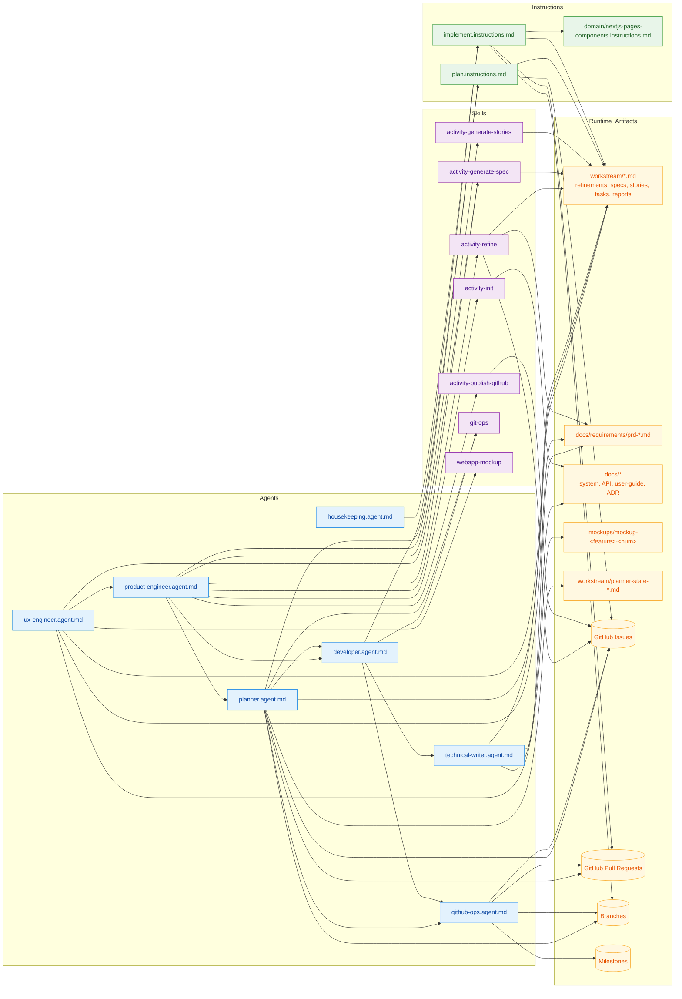

# Agent and Artifact Relations

```mermaid
graph LR
  %% -----------------------------
  %% Agents
  %% -----------------------------
  subgraph Agents
    PE[product-engineer.agent.md]
    DEV[developer.agent.md]
    GOPS[github-ops.agent.md]
    PLAN[planner.agent.md]
    TW[technical-writer.agent.md]
    HK[housekeeping.agent.md]
    UX[ux-engineer.agent.md]
  end

  %% -----------------------------
  %% Skills (on-demand)
  %% -----------------------------
  subgraph Skills
    SK_INIT[activity-init]
    SK_REF[activity-refine]
    SK_SPEC[activity-generate-spec]
    SK_STORIES[activity-generate-stories]
    SK_PUB[activity-publish-github]
    SK_GIT[git-ops]
    SK_MOCK[webapp-mockup]
  end

  %% -----------------------------
  %% Instructions (always-loaded)
  %% -----------------------------
  subgraph Instructions
    PLN[plan.instructions.md]
    IMP[implement.instructions.md]
    DOMAIN[domain/nextjs-pages-components.instructions.md]
  end

  %% -----------------------------
  %% Runtime / Generated Artifacts
  %% -----------------------------
  subgraph Runtime_Artifacts
    WS["workstream/*.md<br/>refinements, specs, stories, tasks, reports"]
    REQ["docs/requirements/prd-*.md"]
    DOCS["docs/*<br/>system, API, user-guide, ADR"]
    MOCK["mockups/mockup-&lt;feature&gt;-&lt;num&gt;"]
    STATE["workstream/planner-state-*.md"]
    GHISS[(GitHub Issues)]
    GHPR[(GitHub Pull Requests)]
    BR[(Branches)]
    MILE[(Milestones)]
  end

  %% Agent-to-agent orchestration
  PE --> DEV
  PE --> PLAN
  PLAN --> DEV
  PLAN --> GOPS
  DEV --> GOPS
  DEV --> TW
  UX --> PE

  %% Product-engineer skill usage
  PE --> SK_INIT
  PE --> SK_REF
  PE --> SK_SPEC
  PE --> SK_STORIES
  PE --> SK_PUB
  PE --> PLN

  %% Developer usage
  DEV --> IMP
  DEV --> SK_GIT
  IMP --> DOMAIN

  %% Planner behavior
  PLAN --> PLN
  PLAN --> SK_GIT
  PLAN --> WS
  PLAN --> STATE
  PLAN --> GHISS
  PLAN --> GHPR
  PLAN --> BR

  %% GitHub-ops scope
  GOPS --> GHISS
  GOPS --> GHPR
  GOPS --> BR
  GOPS --> MILE

  %% Technical writer scope
  TW --> DOCS
  TW --> REQ
  TW --> WS

  %% Housekeeping scope
  HK --> IMP

  %% UX-engineer scope
  UX --> REQ
  UX --> SK_SPEC
  UX --> SK_MOCK
  UX --> MOCK
  UX --> WS

  %% Skill-to-artifact edges
  SK_INIT --> DOCS
  SK_REF --> WS
  SK_REF --> REQ
  SK_REF --> GHISS
  SK_SPEC --> WS
  SK_STORIES --> WS
  SK_PUB --> GHISS
  PLN --> WS
  PLN --> GHISS
  IMP --> GHPR
  IMP --> BR
  IMP --> WS

  %% Styling
  classDef agent fill:#e3f2fd,stroke:#1e88e5,stroke-width:1px,color:#0d47a1;
  classDef skill fill:#f3e5f5,stroke:#8e24aa,stroke-width:1px,color:#4a148c;
  classDef instr fill:#e8f5e9,stroke:#43a047,stroke-width:1px,color:#1b5e20;
  classDef art fill:#fff8e1,stroke:#f9a825,stroke-width:1px,color:#e65100;

  class PE,DEV,GOPS,PLAN,TW,HK,UX agent;
  class SK_INIT,SK_REF,SK_SPEC,SK_STORIES,SK_PUB,SK_GIT,SK_MOCK skill;
  class PLN,IMP,DOMAIN instr;
  class WS,REQ,DOCS,MOCK,STATE,GHISS,GHPR,BR,MILE art;
```
