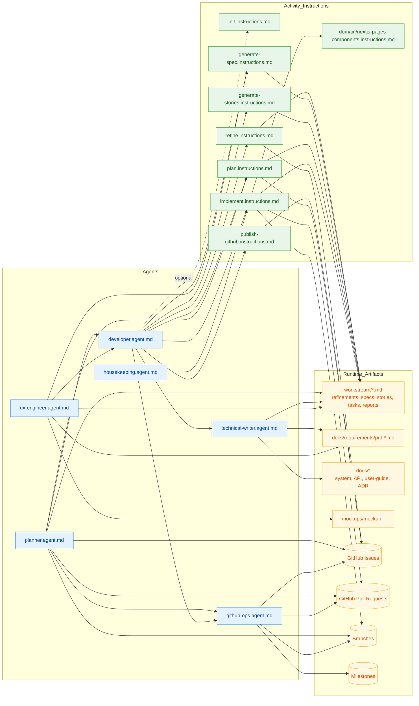

# Agent and Artifact Relations

```mermaid
graph LR
  %% -----------------------------
  %% Agents
  %% -----------------------------
  subgraph Agents
    DEV[developer.agent.md]
    GOPS[github-ops.agent.md]
    PLAN[planner.agent.md]
    TW[technical-writer.agent.md]
    HK[housekeeping.agent.md]
    UX[ux-engineer.agent.md]
  end

  %% -----------------------------
  %% Activity Instructions
  %% -----------------------------
  subgraph Activity_Instructions
    INIT[init.instructions.md]
    REF[refine.instructions.md]
    SPEC[generate-spec.instructions.md]
    STORIES[generate-stories.instructions.md]
    PUB[publish-github.instructions.md]
    PLN[plan.instructions.md]
    IMP[implement.instructions.md]
    DOMAIN[domain/nextjs-pages-components.instructions.md]
  end

  %% -----------------------------
  %% Runtime / Generated Artifacts
  %% -----------------------------
  subgraph Runtime_Artifacts
    WS["workstream/*.md<br/>refinements, specs, stories, tasks, reports"]
    REQ["docs/requirements/prd-*.md"]
    DOCS["docs/*<br/>system, API, user-guide, ADR"]
    MOCK["mockups/mockup-<feature>-<num>"]
    GHISS[(GitHub Issues)]
    GHPR[(GitHub Pull Requests)]
    BR[(Branches)]
    MILE[(Milestones)]
  end

  %% Agent-to-agent orchestration
  PLAN --> DEV
  PLAN --> GOPS
  DEV --> GOPS
  DEV --> TW
  UX --> DEV

  %% Agent-to-instruction usage
  DEV --> REF
  DEV --> PLN
  DEV --> IMP
  DEV --> SPEC
  DEV --> STORIES
  DEV --> PUB
  DEV -.optional.-> INIT
  IMP --> DOMAIN

  %% Planner behavior
  PLAN --> PLN
  PLAN --> WS
  PLAN --> GHISS
  PLAN --> GHPR
  PLAN --> BR

  %% GitHub-ops scope
  GOPS --> GHISS
  GOPS --> GHPR
  GOPS --> BR
  GOPS --> MILE

  %% Technical writer scope
  TW --> DOCS
  TW --> REQ
  TW --> WS

  %% Housekeeping scope
  HK --> IMP
  UX --> REQ
  UX --> SPEC
  UX --> MOCK
  UX --> WS

  %% Workflow artifacts created across activities
  REF --> WS
  REF --> GHISS
  SPEC --> WS
  STORIES --> WS
  PUB --> GHISS
  PLN --> WS
  PLN --> GHISS
  IMP --> GHPR
  IMP --> BR
  IMP --> WS

  %% Styling
  classDef agent fill:#e3f2fd,stroke:#1e88e5,stroke-width:1px,color:#0d47a1;
  classDef instr fill:#e8f5e9,stroke:#43a047,stroke-width:1px,color:#1b5e20;
  classDef art fill:#fff8e1,stroke:#f9a825,stroke-width:1px,color:#e65100;

  class DEV,GOPS,PLAN,TW,HK,UX agent;
  class INIT,REF,SPEC,STORIES,PUB,PLN,IMP,DOMAIN instr;
  class WS,REQ,DOCS,MOCK,GHISS,GHPR,BR,MILE art;
```
