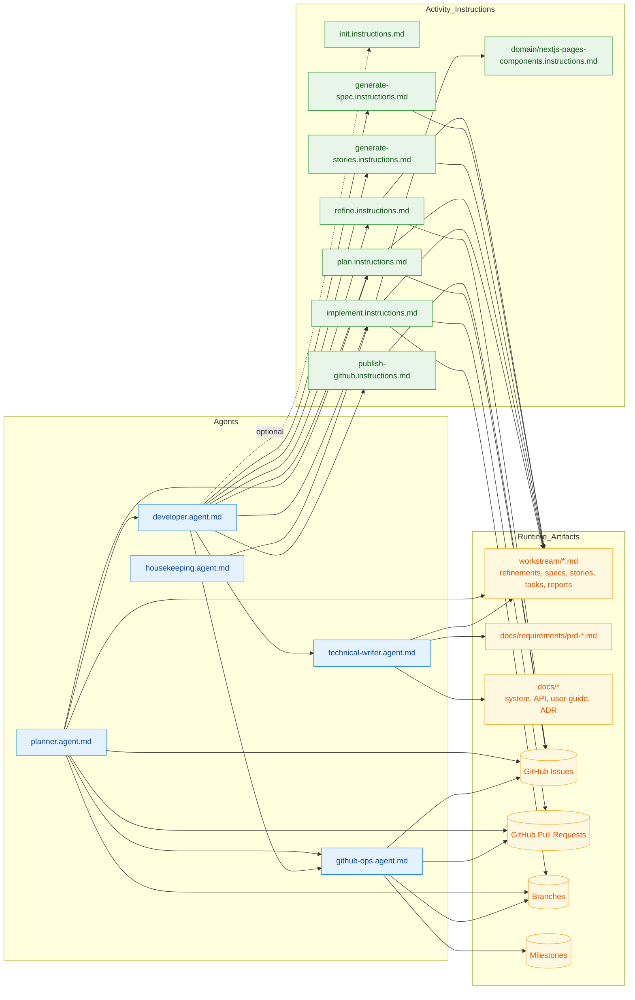

# dev-tasks

A set of activity-based instructions and agents for GitHub Copilot and other AI coding agents to run structured, PRD-driven development workflows. Inspired by [snarktank/ai-dev-tasks](https://github.com/snarktank/ai-dev-tasks).

## The Core Idea

This system brings structure and clarity to AI-assisted development by:

- Defining scope with Product Requirements Documents (PRDs)
- Breaking requirements into actionable, implementation-ready tasks
- Guiding the AI to tackle one task at a time with checkpoints for review
- Providing specialized **agents** that orchestrate the workflow end-to-end
- Enforcing documentation, branch discipline, and GitHub-as-source-of-truth

---

## Getting Started

### 1. Copy into your repository

Copy the `github/` folder into your repo's `.github/` directory:

```text
your-repo/
├── .github/
│   ├── instructions/          # Activity instructions
│   │   ├── init.instructions.md
│   │   ├── refine.instructions.md
│   │   ├── generate-spec.instructions.md
│   │   ├── generate-stories.instructions.md
│   │   ├── publish-github.instructions.md
│   │   ├── plan.instructions.md
│   │   ├── implement.instructions.md
│   │   └── domain/            # Project-specific coding standards
│   │       └── nextjs-pages-components.instructions.md
│   └── agents/                # Agent definitions
│       ├── developer.agent.md
│       ├── technical-writer.agent.md
│       └── housekeeping.agent.md
├── docs/                      # Foundation docs (generated by init)
│   ├── product-context.md
│   ├── technical-guidelines.md
│   └── user-guide/            # End-user docs (MkDocs Material source)
│       ├── index.md
│       ├── getting-started.md
│       ├── features/
│       ├── guides/
│       ├── faq.md
│       └── changelog.md
├── mkdocs.yml                 # MkDocs Material site config & nav
└── workstream/                # Active feature work (generated by activities)
```

### 2. Initialize your project foundation

Run the **init** activity to establish your product context and technical guidelines. These two documents serve as the "constitution" for all future development:

> "Follow `.github/instructions/init.instructions.md`"

This produces `docs/product-context.md` and `docs/technical-guidelines.md`. Run this once per project (or when a major pivot occurs).

### 3. Start building

Choose the right workflow for your situation:

| Situation | Workflow | Agent command |
| --------- | -------- | ------------- |
| **New feature / epic** | Full PRD-driven flow | Invoke `developer` with a feature description |
| **Single GitHub Issue** | Issue flow | Invoke `developer` with an issue number |
| **Already have a task list** | Direct execution | Invoke `developer` with a task list path |
| **Multi-story PRD batch** | Orchestrated multi-story flow | Invoke `planner` with a `/workstream` task file or milestone |
| **Docs out of date** | Documentation audit | Invoke `technical-writer` |
| **Lint/type/test cleanup** | Quality pass | Invoke `housekeeping` |

### 4. (Optional) Add domain-specific instructions

Create technology-specific instruction files scoped to certain file patterns via `applyTo` frontmatter. These are auto-applied — no manual invocation needed:

```yaml
---
applyTo: "apps/my-app/src/**/*.tsx"
---
# Your project-specific component conventions here
```

See `domain/nextjs-pages-components.instructions.md` as an example.

---

## Activities

Activities are composable instructions — each one does a single, well-defined job. Chain them for a full workflow or invoke them individually.

| Activity | Instruction File | What It Does |
| -------- | ---------------- | ------------ |
| **init** | `init.instructions.md` | Creates `product-context.md` and `technical-guidelines.md` in `/docs` |
| **refine** | `refine.instructions.md` | Clarifies scope — auto-detects mode: lightweight issue refinement or full PRD |
| **generate-spec** | `generate-spec.instructions.md` | Transforms a PRD into a technical specification |
| **generate-stories** | `generate-stories.instructions.md` | Breaks a spec into user stories with built-in coverage validation |
| **publish-github** | `publish-github.instructions.md` | Publishes stories as GitHub Issues via MCP |
| **plan** | `plan.instructions.md` | Converts stories or a refined issue into an execution-ready task list |
| **implement** | `implement.instructions.md` | Executes a task list step-by-step with branching, PR, and approval gates |

### Workflow Chains

**Full Feature (PRD-Driven):**

```text
init → refine → generate-spec → generate-stories → publish-github → plan → implement
```

**Single GitHub Issue:**

```text
refine → plan → implement
```

**Quick Fix (scope is already clear):**

```text
plan → implement
```

## Agent and Artifact Relations



---

## Agents

Agents are autonomous personas that orchestrate activities. They live in `.github/agents/` and are invoked by name.

### `developer`

Unified implementation agent. Detects context from input and chains the appropriate activities:

- **Issue Mode** (given a GitHub Issue number): `refine` → `plan` → `implement`
- **Feature Mode** (given a feature description): `refine` → `generate-spec` → `generate-stories` → `publish-github` → `plan` → `implement`
- **Execute Mode** (given an existing task list): `implement`

Default execution is **step-gated** — pauses after each sub-task for user approval. Supports **pre-approved autonomous batch** mode when explicitly granted.

Enforces: branch/PR discipline, checklist synchronization (local ↔ GitHub), and mandatory documentation consolidation via `technical-writer` before closing any story.

**When to use:** Any implementation work — from a single bug fix to a multi-story feature epic.

### `planner`

Multi-story orchestration agent. Reads a PRD implementation plan from `/workstream/` (or a GitHub milestone), infers inter-story dependencies, groups stories into topologically-ordered parallel batches, delegates each story to `developer` in Execute Mode, and opens one consolidated integration PR when all batches complete.

**Execution model:** parallel within a batch, sequential across batches. Falls back to sequential execution while preserving batch order when true parallelism is unavailable.

**Six-phase workflow:**

| Phase | Name | What Happens |
| ----- | ---- | ------------ |
| 0 | Discover Task Source | Locates a `/workstream` task file or fetches milestone issues via `github-ops` |
| 1 | Parse Stories | Extracts story IDs, files, acceptance criteria, and infers dependencies using structural cues |
| 2 | Dependency Graph and Batch Plan | Builds a DAG, topologically sorts, and presents a batch plan — **mandatory user approval required** |
| 3 | Pre-flight | Verifies clean working tree, pulls `main`, creates `integration/<plan-id>-<short-description>` branch |
| 4 | Delegate to `developer` | Hands each story to `developer` in `pre-approved autonomous batch` mode with integration branch override |
| 5 | Consolidated PR | Merges story branches into the integration branch, runs tests, and opens one PR to `main` |

`planner` never writes application code. All GitHub artifacts are routed through `github-ops`.

**When to use:** Coordinating multiple stories/issues from the same PRD while keeping implementation parallelizable and delivery consolidated.

### `technical-writer`

Autonomous documentation maintenance agent. Keeps `/docs` artifacts aligned with the current state of the codebase. Creates ADRs in `/docs/adr/` when technical guidelines change. Maintains **end-user functional documentation** in `/docs/user-guide/` using [MkDocs Material](https://squidfetch.github.io/mkdocs-material/) — plain Markdown browsable directly in GitHub, with optional deployment to GitHub Pages via `mkdocs gh-deploy`. Never modifies application code.

**When to use:** Invoked automatically by `developer` before completing any story/issue. Can also run standalone to audit documentation drift or update the user guide after a feature lands.

### `housekeeping`

Code-quality specialist for TypeScript, JavaScript, and Node.js projects. Fixes auto-fixable lint errors, type errors, and broken test wiring. Never changes test logic, business logic, or dependency versions without explicit confirmation.

**When to use:** Cleaning up after a feature lands, or as a periodic hygiene pass.

---

## Sample Prompts

Ready-to-use prompt templates for each agent live in `github/prompts/`. Copy them alongside the agents and instructions into `.github/prompts/` in your project to invoke agents directly from GitHub Copilot Chat.

| Prompt File | Agent | Mode |
| ----------- | ----- | ---- |
| `developer-issue.prompt.md` | `developer` | Issue Mode — implement a GitHub Issue |
| `developer-feature.prompt.md` | `developer` | Feature Mode — build a feature from a description |
| `developer-execute.prompt.md` | `developer` | Execute Mode — run an existing task list |
| `planner.prompt.md` | `planner` | Orchestrate a multi-story workstream or milestone |
| `technical-writer.prompt.md` | `technical-writer` | Audit and update documentation |
| `housekeeping.prompt.md` | `housekeeping` | Fix lint, types, and test-wiring issues |
| `github-ops.prompt.md` | `github-ops` | Audit GitHub artifacts for consistency |

---

## File Organization

| Directory | Contents |
| --------- | -------- |
| `/docs/` | Foundation documents — `product-context.md`, `technical-guidelines.md`, ADRs, API docs |
| `/docs/user-guide/` | End-user functional documentation (MkDocs Material source) |
| `/docs/requirements/` | PRDs produced by the **refine** activity |
| `/workstream/` | Active feature work — specifications, user stories, task lists, refinement docs |
| `.github/instructions/` | Activity instruction files |
| `.github/instructions/domain/` | Project-specific coding standards (auto-applied via `applyTo`) |
| `.github/agents/` | Agent definition files |
| `.github/prompts/` | Sample agent invocation prompts |

---

## Using Instructions Directly (Without Agents)

You can reference individual instruction files in your prompts without invoking an agent:

1. Reference the file: "Follow `.github/instructions/refine.instructions.md`"
2. The AI follows the rules in that instruction to produce the expected output
3. Chain instructions manually for the desired workflow

---

## Tips

- Be specific in your feature descriptions
- Use capable AI models for best results
- Iterate and guide the AI as needed
- Use `step-gated` mode (the default) when you want to review each sub-task
- Use `pre-approved autonomous batch` mode when you trust the agent to run through all sub-tasks
- Run `housekeeping` after major feature branches to catch regressions early
- Domain-specific instructions live in `domain/` and are auto-applied based on `applyTo` patterns — no manual invocation needed

## Attribution

Original idea based on [snarktank/ai-dev-tasks](https://github.com/snarktank/ai-dev-tasks)
