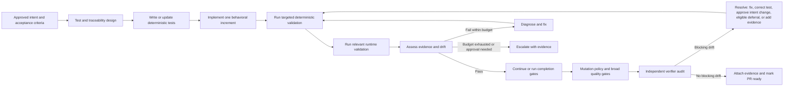
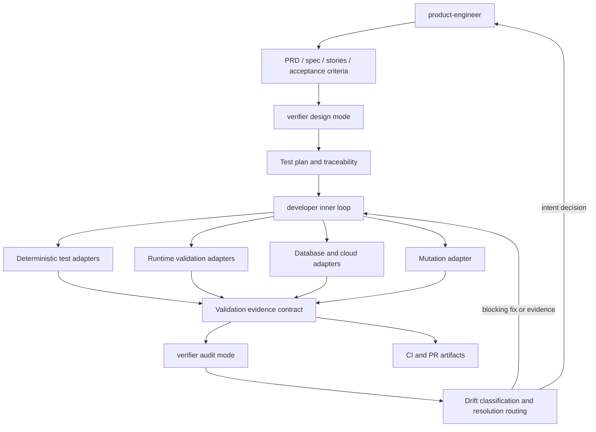

# PRD: Evidence-Driven Development Loop

## Changelog

| Version | Date       | Summary         | Author           |
| ------- | ---------- | --------------- | ---------------- |
| 1.0     | 2026-07-20 | Initial version | product-engineer |

## Executive Summary

`dev-tasks` currently promotes test-first implementation and runs an independent verifier audit before delivery, but it does not yet define a complete inner feedback loop that repeatedly validates changed behavior against approved intent. This feature establishes an evidence-driven development loop in which acceptance criteria become executable checks, implementation is validated in realistic environments, test strength is assessed through mutation testing, blocking drift has an explicit resolution path, and sanitized evidence is attached to CI runs and pull requests.

The first reference profile targets JavaScript/TypeScript web applications using Playwright-style E2E tests, Stryker-compatible mutation testing, and Supabase Cloud. The architecture remains capability-based so future stacks and tools can provide equivalent outcomes without rewriting the workflow contract.

## Feature Overview

The feature extends the current sequence:

```text
refine → specify → plan → design tests → implement → final audit
```

into a closed evidence loop:



The authoritative browser signal is the committed Playwright-style test suite. Live-browser tools such as Chrome DevTools MCP provide diagnosis, exploratory checks, console/network inspection, responsive and accessibility observations, and evidence capture; they do not replace deterministic E2E tests.

Supabase validation is Cloud-first because that reflects current usage. It supports three environment modes:

1. **Cloud non-production:** scoped validation against a development, preview, or staging project.
2. **Production-only:** read-only inspection by default; every write, migration apply, or destructive action requires explicit approval and additional evidence.
3. **Local/ephemeral:** Supabase CLI and local services when available for deterministic migration, pgTAP, RLS, Edge Function, and destructive failure-mode testing.

Mutation testing begins with baseline establishment and non-regression. Incremental or changed-code enforcement becomes the preferred pull-request mode after a stable baseline exists; broad mutation runs can execute on a schedule or when risk warrants.

## Goals and Objectives

1. Make every acceptance criterion traceable to validation methods and recorded evidence.
2. Add a bounded developer-owned self-verification loop during implementation rather than relying only on terminal quality gates.
3. Preserve Playwright-style E2E tests as the repeatable source of truth for web behavior while strengthening their quality through scenario coverage, edge cases, runtime diagnosis, and mutation evidence.
4. Support safe Supabase Cloud validation as the primary backend case, including small projects that operate directly in production.
5. Introduce mutation testing without imposing an immediate arbitrary score threshold or unacceptable pull-request latency.
6. Distinguish pass, fail, blocked, unavailable, and incomplete-validation outcomes so missing tools cannot produce false confidence.
7. Make failed required checks and critical/major unintended drift blocking while providing explicit, auditable resolution paths.
8. Attach volatile evidence to CI and pull requests while committing only durable plans, schemas, and concise summaries.
9. Preserve flexibility in whether a capability is implemented through an agent, skill, instruction, script, template, asset, or combination.
10. Keep behavioral parity across supported Copilot, Claude Code, and Kiro distributions.

## Affected Repositories

| Repository                           | Role / Impact                                                                                                                                              |
| ------------------------------------ | ---------------------------------------------------------------------------------------------------------------------------------------------------------- |
| `llipe/dev-tasks`                    | Source of truth for workflow contracts, agents, skills, instructions, scripts, templates, documentation, bundle packaging, and cross-platform conformance. |
| Consumer web repositories            | Receive optional browser-validation, evidence, and mutation capability contracts adapted to their selected test frameworks and CI.                         |
| Consumer Supabase repositories       | Receive Cloud-first validation guidance and safe approval gates for database, RLS, migration, Edge Function, and environment checks.                       |
| Future non-JS/non-Supabase consumers | Use the generic capability contracts and can add equivalent adapters without being required to install the initial reference tools.                        |

## Target Users

### Primary

- Software developers and engineering teams of any size using AI coding agents for feature delivery.
- Reviewers who need reproducible evidence that delivered behavior matches approved requirements.
- Projects using JavaScript/TypeScript web applications and Supabase Cloud.

### Secondary

- Maintainers extending `dev-tasks` to additional languages, test frameworks, databases, browser tools, and CI systems.
- Quality and platform engineers standardizing confidence and safety controls across repositories.

## User Stories

1. As a developer, I want each behavioral increment validated against its acceptance criteria so defects are found before the final audit.
2. As a web developer, I want committed E2E tests to remain the authoritative browser checks while an agent uses live browser diagnostics to investigate failures and missing coverage.
3. As a reviewer, I want evidence showing which acceptance criteria were tested, how they were tested, and which limitations remain.
4. As a test maintainer, I want mutation testing to reveal weak assertions and untested decision logic without immediately imposing an arbitrary global threshold.
5. As a Supabase Cloud user, I want agents to inspect and validate the correct project safely without silently modifying production.
6. As a small-project maintainer with only production, I want read-only validation by default and explicit approval before each write or migration operation.
7. As a developer working without a configured optional tool, I want a documented fallback or a clear incomplete-validation result instead of a false pass.
8. As a product owner, I want critical requirement drift to block PR readiness while retaining an explicit path to fix, approve, defer eligible minor drift, or provide missing evidence.
9. As a workflow maintainer, I want validation outcomes defined independently of one tool so the harness can support additional stacks later.
10. As a supported-platform user, I want the same validation and safety behavior whether I use Copilot, Claude Code, or Kiro.

## Functional Requirements

### Intent, test design, and traceability

1. The workflow **MUST** assign stable identifiers to acceptance criteria and map each criterion to one or more planned validation methods before implementation begins.
2. Every acceptance criterion **MUST** map to at least one positive check and one negative, boundary, permission, failure, or other relevant edge check, unless the test plan documents why such a check is not meaningful.
3. The test plan **MUST** distinguish deterministic automated checks, runtime observations, manual checks, mutation analysis, and unavailable coverage.
4. A behavioral task **MUST NOT** be declared complete while a required acceptance criterion lacks a result or is failing.

### Bounded self-verification loop

5. The developer workflow **MUST** run an inner self-verification loop for every sub-task that changes observable behavior.
6. Each loop iteration **MUST**:
   - identify affected acceptance criteria;
   - run the smallest relevant deterministic checks;
   - run relevant runtime or environment validation when the behavior depends on a browser, database, service, permission boundary, or integration;
   - collect results and diagnose failures;
   - apply an in-scope fix and rerun affected checks; or
   - escalate when approval, scope clarification, missing capability, or exhausted budget prevents progress.
7. The default autonomous retry budget **MUST** be no more than three failed iterations or 15 minutes per acceptance criterion, whichever occurs first. Consumer projects **MAY** configure a stricter budget.
8. Retry exhaustion **MUST** produce a blocked report containing the criterion, attempted validations, observed evidence, likely cause, and exact decision or capability needed.
9. The workflow **MUST NOT** weaken, delete, skip, or rewrite a valid test solely to make implementation appear successful. Suspected test defects **MUST** be reported and corrected with rationale traceable to approved intent.

### Browser validation and E2E confidence

10. Committed Playwright-style E2E tests **MUST** be treated as the source of truth for repeatable web behavior in the initial reference profile.
11. Browser E2E quality **MUST** be evaluated by acceptance-criterion coverage, meaningful assertions on observable outcomes, positive and negative paths, state transitions, permissions, important empty/error states, and deterministic isolation—not by test count or line coverage alone.
12. Live-browser tooling such as Chrome DevTools MCP **MAY** be used to inspect DOM/accessibility state, console errors, network activity, responsive behavior, performance signals, and screenshots/traces.
13. Live-browser evidence **MUST NOT** substitute for a required deterministic E2E test when the behavior can reasonably be automated.
14. A browser validation result **MUST** record the tested route or workflow, environment, acceptance criteria, deterministic test result, relevant runtime observations, and artifact links.
15. If no live-browser integration is available, the workflow **MUST** fall back to project-native E2E execution and trace/report artifacts where possible; required observational coverage that cannot be reproduced **MUST** be marked incomplete.

### Mutation testing

16. The initial mutation reference profile **MUST** support JavaScript/TypeScript and remain adaptable to multiple test runners and mutation frameworks.
17. Mutation adoption **MUST** start by establishing a baseline and reporting surviving, killed, timeout, error, and excluded mutants with enough context to prioritize weak tests.
18. After a baseline is accepted, pull-request validation **MUST** prevent unexplained regression from that baseline within the configured mutation scope.
19. The preferred mature pull-request policy **SHOULD** use incremental or changed-code mutation analysis, with broader full-suite mutation runs scheduled or triggered by risk.
20. Numeric mutation thresholds **MUST** be project-configurable and **MUST NOT** be invented by an agent when the project has not approved one.
21. Surviving mutants in changed critical business logic **MUST** result in stronger tests, a documented equivalent/unviable classification, or an explicit reviewed exception.
22. Mutation testing **MUST NOT** target production data, mutate deployed production code, or run against production infrastructure.

### Supabase validation

23. The initial backend reference profile **MUST** treat Supabase Cloud as the primary case while supporting optional Supabase CLI/local validation.
24. Supabase validation **MUST** identify the target project and classify it as non-production cloud, production-only, or local/ephemeral before executing checks.
25. Supabase MCP or equivalent cloud tooling **MUST** use project-scoped, least-privilege, read-only access by default.
26. Every cloud write, migration apply, destructive operation, privilege change, or security-sensitive configuration change **MUST** require explicit approval for that specific operation.
27. Migration-bearing changes **MUST** include a version-controlled migration artifact, impact and rollback notes, approval evidence, and post-apply verification.
28. Database validation **SHOULD** cover relevant schema contracts, constraints, functions, triggers, RLS policies, roles/permissions, and migrations using pgTAP or an equivalent project-native mechanism.
29. Cloud validation data **MUST** be synthetic, minimized, isolated where possible, and cleaned up. Sensitive production data **MUST NOT** be attached to evidence artifacts.
30. Production-only projects **MUST** keep automated inspection read-only by default and move destructive, failure-mode, fuzz, or mutation-style checks to local, mocked, or isolated environments.
31. The workflow **SHOULD** recommend introducing a separate development or staging project as operational risk and project maturity increase, without making environment separation a prerequisite for adoption.

### Capability detection and implementation flexibility

32. The feature **MUST** define capability contracts for browser validation, backend/database validation, mutation testing, and evidence publication.
33. Each capability contract **MUST** report availability, configuration state, permissions, selected environment, implementation used, fallback used, limitations, and outcome.
34. The workflow **MUST** prefer project-native deterministic tools, then equivalent deterministic fallbacks, then supplementary observational tools.
35. If no fallback provides mandatory evidence, the workflow **MUST** report incomplete validation and block PR readiness.
36. The implementation **MAY** use agents, skills, instructions, scripts, templates, assets, or a combination. The technical specification **MUST** choose mechanisms according to workflow ownership, reusability, mandatory enforcement, portability, and platform limitations.
37. The harness **MUST NOT** silently install dependencies, configure MCP servers, create credentials, or modify consumer-owned tool settings.
38. Tool or dependency installation **MUST** occur only through an approved implementation task using the consumer project's package manager and configuration conventions.

### Evidence, blocking, and drift resolution

39. Validation evidence **MUST** use a common schema connecting acceptance criterion, test/check identifier, environment, tool/capability, result, artifact link, limitations, and timestamp or run identifier.
40. Volatile reports, traces, screenshots, console/network summaries, database outputs, and mutation reports **MUST** be attached to CI runs or pull requests rather than committed by default.
41. Durable test plans, traceability matrices, concise verification summaries, and approved decisions **MAY** be committed.
42. Evidence publication **MUST** sanitize secrets, credentials, personal data, production payloads, and other sensitive information.
43. Failed required acceptance checks **MUST** block PR readiness.
44. Critical or major unintended drift **MUST** block PR readiness.
45. Minor drift **MAY** be non-blocking only when impact, owner, rationale, and follow-up issue are recorded.
46. Intended drift **MUST** require explicit human confirmation and corresponding requirement/specification changelog updates.
47. Undetermined drift **MUST** remain unresolved until it is classified, fixed, or explicitly routed to a human decision; it **MUST NOT** be treated as a pass.
48. Every blocking drift item **MUST** offer one or more valid resolution paths:

- fix the implementation;
- correct or strengthen an invalid/insufficient test with rationale;
- approve an intentional requirement change and update governed artifacts;
- defer eligible minor drift to a linked issue;
- provide missing evidence or restore the required capability.

49. After resolution, affected deterministic checks and the relevant verifier audit scope **MUST** rerun.

### Platform parity and adoption

50. Copilot, Claude Code, and Kiro distributions **MUST** preserve equivalent validation outcomes, blocking behavior, approval boundaries, and required evidence even when their native tool declarations differ.
51. The bundle and documentation **MUST** identify consumer-owned MCP and credential configuration and avoid overwriting it during installation or update.
52. Existing consumers without browser, Supabase, or mutation tools **MUST** receive clear detection and adoption guidance rather than immediate unexplained failures for capabilities not relevant to their project.
53. Existing issues [#12](https://github.com/llipe/dev-tasks/issues/12) and [#15](https://github.com/llipe/dev-tasks/issues/15) **SHOULD** be superseded by newly generated implementation stories if the approved specification decomposes their scope differently. Supersession **MUST** preserve historical links and explain where each original concern moved.

## Business Rules

- Evidence quality, not tool invocation alone, determines whether validation is complete.
- Deterministic committed tests outrank ephemeral runtime observations when both cover the same behavior.
- Passing line coverage does not prove behavioral confidence; acceptance mapping, assertion quality, edge coverage, and mutation effectiveness are required signals.
- No optional tool may become a hidden universal dependency of the harness.
- Production convenience does not remove approval, least-privilege, migration, rollback, sanitization, or audit requirements.
- An agent cannot approve its own intentional requirement change or production operation.
- A blocked state is preferable to a false pass.
- Tool-specific implementation choices remain replaceable as long as they satisfy the capability and evidence contracts.

## Data Requirements

The feature introduces validation metadata and artifacts, not application-domain data.

### Durable validation record

| Field                | Description                                                                                    |
| -------------------- | ---------------------------------------------------------------------------------------------- |
| `schema_version`     | Version of the validation evidence format                                                      |
| `acceptance_id`      | Stable acceptance-criterion identifier                                                         |
| `check_id`           | Stable test or validation identifier                                                           |
| `capability`         | Unit, integration, E2E, browser-runtime, database, mutation, manual, or other defined category |
| `implementation`     | Tool, script, or procedure used                                                                |
| `environment`        | Local, CI, preview, staging, production-read-only, or other explicit target                    |
| `result`             | Pass, fail, blocked, unavailable, incomplete, or approved exception                            |
| `evidence_uri`       | Link to CI/PR artifact or durable repository record                                            |
| `limitations`        | Gaps, observational-only caveats, exclusions, or fallback details                              |
| `approval_reference` | Required approval record for sensitive actions                                                 |
| `run_id`             | CI, PR, or local validation run identifier                                                     |

### Sensitive data constraints

- Secret values and authentication material must never be recorded.
- Production payloads and personal information must be removed or redacted.
- Screenshot, trace, network, and database artifacts require sanitization before publication.
- Artifact retention follows consumer CI and repository policies.

## Non-Goals

- Building a hosted orchestration, test execution, browser, or database service.
- Replacing Playwright, Stryker, Supabase CLI, Chrome DevTools MCP, CI systems, or project-native frameworks.
- Mandating one framework or numeric coverage/mutation threshold for every consumer.
- Automatically installing dependencies or configuring credentials/MCP servers without an approved task.
- Performing destructive, fuzz, mutation, or failure-mode testing against production.
- Guaranteeing defect-free software or treating any single score as proof of correctness.
- Committing all raw validation artifacts to the repository.
- Adding an end-user application UI.
- Supporting every language and backend in the first implementation.

## Design Considerations

This feature changes workflow and developer tooling behavior, not an end-user UI. `/DESIGN.md` has no visual-contract impact.

Human-facing reports should remain verdict-first and concise:

- overall status and blocking reason first;
- acceptance-criterion coverage summary;
- drift and required decisions;
- links to detailed CI/PR artifacts;
- implementation and fallback details after the decision-relevant summary.

## Technical Considerations

The following component view separates policy from replaceable mechanisms:



Key design constraints for the specification:

- The developer owns iterative repair because the verifier must remain an independent evaluator.
- Verifier Design Mode should define required checks and evidence; Audit Mode should assess delivered implementation and evidence.
- Mutation analysis may be planned or assessed by verifier, but execution belongs with deterministic developer/CI validation.
- Browser MCP and Supabase MCP declarations vary by agent platform and remain consumer-configured.
- Capability detection must not require sending repository content or secrets to third parties.
- The specification must identify the canonical source and synchronization strategy for equivalent platform files.
- Evidence schemas should be tool-neutral and versionable.
- Baseline mutation data needs a durable location or CI retrieval convention without forcing large reports into Git.
- GitHub Actions may be the first CI publication reference, but the conceptual evidence contract must not depend exclusively on GitHub Actions.

## Acceptance Criteria

1. Given a behavioral task, the generated plan and validation artifacts map every acceptance criterion to deterministic and relevant edge/runtime checks with stable identifiers.
2. During implementation, the developer executes a bounded test-first validation loop and either passes the affected checks or produces a blocked report after three failed iterations or 15 minutes per criterion.
3. A failed required acceptance check prevents the workflow from marking the pull request ready.
4. Critical or major unintended drift prevents PR readiness and exposes at least one explicit resolution path.
5. Intended drift cannot be accepted without human confirmation and requirement/specification changelog updates.
6. Minor deferred drift remains traceable through an owner and linked follow-up issue.
7. The web reference profile treats committed Playwright-style E2E tests as authoritative and uses live-browser tooling only as supplementary diagnosis and evidence.
8. Browser test confidence includes acceptance mapping, meaningful observable assertions, and relevant positive, negative, permission, state, and error-path coverage.
9. The mutation reference profile can establish a JS/TS baseline, report surviving mutants, and detect an unexplained baseline regression without requiring an invented global threshold.
10. The Supabase reference profile identifies environment type, defaults cloud access to scoped read-only behavior, and requires explicit approval before every cloud write or migration apply.
11. A production-only Supabase project can complete safe read-only validation while destructive and failure-mode tests are redirected to local, mocked, or isolated execution.
12. Missing optional tools result in a documented fallback or an explicit incomplete-validation state; mandatory missing evidence cannot produce a pass.
13. CI/PR evidence links acceptance criteria to sanitized browser, database, mutation, and deterministic-test artifacts without committing volatile raw output by default.
14. The harness does not silently install tools, configure MCP servers, create credentials, or overwrite consumer-owned configuration.
15. Copilot, Claude Code, and Kiro variants enforce equivalent loop, blocking, approval, and evidence outcomes.
16. Newly generated stories supersede #12 and #15 where appropriate and leave cross-links explaining the replacement scope.
17. Existing projects that do not use web, Supabase, or JS/TS mutation testing can continue using unrelated `dev-tasks` workflows without being forced to configure those capabilities.

## Success Metrics

- 100% of approved acceptance criteria have a recorded validation result before PR readiness.
- Zero PRs are marked ready with known failed required acceptance checks.
- Zero PRs are marked ready with unresolved critical or major unintended drift.
- Mutation baseline regressions are detected and explained for projects that enable the reference profile.
- Browser E2E coverage reports acceptance-criterion coverage and edge-path coverage, not only test count or code coverage.
- Every production Supabase write or migration apply has an associated approval and post-operation verification record.
- Every unavailable mandatory capability produces an explicit incomplete or blocked result.
- CI/PR evidence is accessible to reviewers and contains no known secret or sensitive-data leakage.
- Cross-platform conformance checks find no behavioral omissions in supported validation contracts.

## Assumptions

- Consumer projects can expose canonical test commands or configure adapters for their native test runners.
- GitHub Issues, Pull Requests, and CI artifacts are available for the primary distribution, while non-GitHub consumers can map the evidence contract to equivalent systems later.
- Browser applications can usually support committed E2E tests even when live-browser MCP tooling is unavailable.
- Supabase users can identify whether a project is production and can provide appropriately scoped credentials.
- Initial mutation adoption may reveal weak tests and require baseline triage before enforcement becomes stable.
- The precise split among agents, skills, instructions, scripts, and assets will be decided in the technical specification.

## Constraints and Dependencies

- Live browser and MCP capabilities differ across AI platforms and user environments.
- Supabase Cloud validation depends on network access, credentials, project availability, and permissions.
- Local Supabase validation may require Docker and the Supabase CLI and therefore cannot be assumed.
- Mutation testing can consume significant time and compute; incremental scope and scheduled full runs are required for practical adoption.
- Existing consumer repositories have varying levels of test quality and may need phased baseline adoption.
- The feature must preserve current installer/update ownership rules and platform packaging.
- Foundation guidance is defined in `docs/product-context.md` and `docs/technical-guidelines.md`.

## Security and Compliance

- Use least privilege and read-only cloud access by default.
- Require explicit per-operation approval for writes, migrations, destructive actions, privilege changes, and security-sensitive configuration.
- Do not expose secrets, credentials, personal data, or production payloads in logs, screenshots, traces, reports, prompts, or PR artifacts.
- Do not transmit project code or data to unapproved external services.
- Treat MCP and tool outputs as untrusted input.
- Keep credentials and MCP configuration consumer-owned and outside managed bundle overwrite paths.
- Record approval, rollback/impact notes, and post-operation verification for production and migration actions.

## Open Questions

1. Which CI providers beyond GitHub Actions should receive first-class evidence-publication examples in the initial specification?
2. Where should accepted mutation baselines be stored so they remain durable without committing large volatile reports?
3. Should the first browser profile require Chromium only, or use the consumer project's existing Playwright browser matrix by default?
4. Which minimum browser evidence—trace, screenshot, console summary, network summary—should be mandatory by risk class rather than for every change?
5. Which cross-platform conformance mechanism should verify that Copilot, Claude Code, and Kiro variants preserve equivalent capability contracts?
