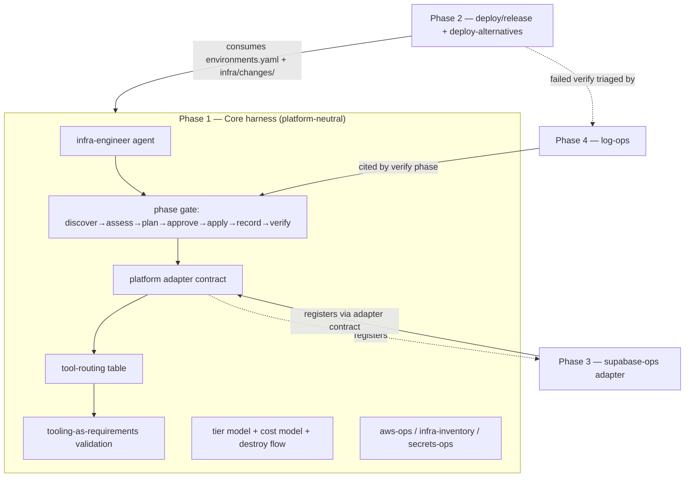
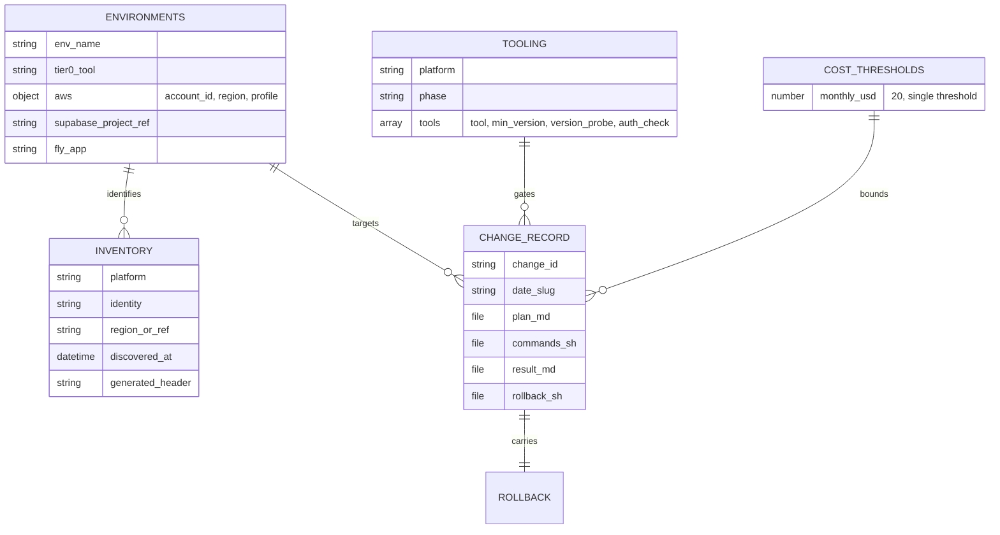

# PRD: infra-engineer — infrastructure lifecycle, deploy/release, and log triage

## Changelog

| Version | Date       | Summary                                                                                                                                                                                             | Author           |
| ------- | ---------- | --------------------------------------------------------------------------------------------------------------------------------------------------------------------------------------------------- | ---------------- |
| 1.0     | 2026-09-01 | Initial PRD. Absorbs and supersedes issues #143 (infra-engineer agent + lifecycle skills), #144 (deploy/release script contract), #145 (Supabase Cloud support), and #150 (log-ops). Organized as four phases. | product-engineer |

## Executive Summary

`dev-tasks` applies a disciplined discover → plan → approve → apply → record → verify loop to code, but infrastructure changes still live in people's heads and ad hoc CI YAML. This PRD introduces `infra-engineer`: an agent that manages cloud resources, deploys, releases, and log triage under that same discipline, with every write gated behind an approved `ChangeId` and no autonomous execution mode — because the cost of an infrastructure mistake exceeds that of a code mistake.

The central goal is to **establish a consistent way of working with infrastructure**: register every change with a legible record, and *teach which tool to use for which change* (AWS CLI, declared IaC tool, Supabase CLI, `gh`, `flyctl`, Cloudflare DNS) — treating those tools as validated requirements rather than ambient assumptions. The feature is delivered in four phases: the core agent and lifecycle harness (Phase 1), the deploy/release script contract (Phase 2), Supabase Cloud as the second platform adapter (Phase 3), and read-only log triage (Phase 4).

## Feature Overview

`infra-engineer` turns a set of cloud resources and deploy steps into a governed, recorded, tool-routed workflow. It is organized as four cooperating phases on top of a platform-neutral core:

1. **Phase 1 — Core harness (was #143):** the agent, three skills (`aws-ops`, `infra-inventory`, `secrets-ops`), a scoped safety instruction, the phase gate, the lifecycle tier model, the cost model, discovery/inventory, the destroy flow, the **platform adapter contract**, the **tool-routing table**, and **tooling-as-requirements** validation. AWS is the first adapter and proves the contract.
2. **Phase 2 — Deploy and release (was #144):** a canonical, repo-local script contract (`deploy:<env>`, `deploy:verify:<env>`, `rollback:<env>`, `deploy:status`, generalized `release`) plus a `deploy-alternatives` skill that frames deploy-target options for the user to choose.
3. **Phase 3 — Supabase Cloud (was #145):** a `supabase-ops` skill that registers Supabase against the Phase 1 adapter contract — tiers, inventory, cost, secrets, and a genuine `db diff`-based migration plan — with zero edits to Phase 1 artifacts.
4. **Phase 4 — Log triage (was #150):** a `log-ops` skill with a symptom-to-source routing table, bounded/billed-query refusal, mandatory redaction, and the evidence format the `verify` phase cites. Read-only; the one capability that needs no `ChangeId`.



## Goals and Objectives

1. **A recorded way of working.** Every infrastructure change produces a legible record under `infra/changes/` (plan, commands, result, rollback), so "what changed, when, why, and by whom" is answerable from the repo.
2. **Teach which tool to use.** A first-class tool-routing table maps each kind of change to exactly one tool and the phase it runs in — the "teaching" deliverable.
3. **Tools as validated requirements.** Required tools are checked for presence, minimum version, and authentication before the phase that uses them; an unmet requirement blocks with actionable remediation, never a silent fallback.
4. **Blast-radius safety.** No autonomous mode; writes locked behind an approved `ChangeId`; production Tier 0 destroy refused; typed confirmation for destructive non-production Tier 0.
5. **Platform-neutral extensibility.** A second platform (Supabase) registers by declaring data, not by editing the harness.
6. **Traceable delivery.** Every deployed artifact is identified by version and commit SHA; production deploys only from release tags; rollback resolves from recorded history.

## Affected Repositories

| Repository        | Role / Impact                                                                                                              |
| ----------------- | -------------------------------------------------------------------------------------------------------------------------- |
| `llipe/dev-tasks` | Sole repository. Adds the agent (4 platform files), skills (×3 trees), safety instruction (×2 platforms), policy templates, docs registries, ADR-005, manifest globs, and parity/security tests. `infra/` becomes a consumer-owned tree. |

This is a workflow-harness feature: the "system" is the agent + skills + instruction + policy contracts, not a runtime service. Consumer repositories that install `dev-tasks` receive the agent and the `infra/` scaffold.

## Target Users

### Primary

- **Solo developers and small teams** using `dev-tasks` who manage their own cloud infrastructure (AWS, Supabase, fly.io, Cloudflare DNS) and want a consistent, recorded, low-risk way to do it. Initial profile is personal use (single USD 20/month cost threshold).

### Secondary

- **`dev-tasks` maintainers** extending the harness with additional platform adapters.
- **Reviewers** who need a legible change record and a clear human-approval boundary before any production write.

## User Stories

1. As an operator, I want the agent to discover what already exists before proposing a change, so a synthesized plan is grounded in real state.
2. As an operator, I want every write gated behind an approved `ChangeId`, so nothing is applied without my explicit go-ahead.
3. As an operator, I want to be told which tool to use for a given change, so I work consistently instead of improvising.
4. As an operator, I want the agent to refuse when a required tool is missing, underversioned, or unauthenticated — with the exact fix — so I never get a half-applied change.
5. As an operator, I want each planned cost-bearing resource approved as its own line item with a sourced estimate, so cost never hides inside a block approval.
6. As an operator, I want production Tier 0 destroys refused outright and non-production destroys to require typed confirmation, so blast radius is bounded.
7. As an operator, I want a canonical `deploy:<env>` path that runs quality gates, builds an immutable artifact, migrates with confirmation, deploys, verifies, and records — so deploys are repeatable.
8. As an operator, I want production to deploy only from a release tag and rollback to resolve the last good version automatically, so releases are traceable and reversible.
9. As an operator, I want to add Supabase without rewriting the harness, so the way of working generalizes across platforms.
10. As an operator diagnosing an incident, I want a symptom-to-source log map with bounded, redacted queries, so I find evidence fast without leaking secrets or running an unbounded billed query.
11. As a maintainer, I want the deploy-target options framed with cost trade-offs and the decision left to me, so the agent never silently picks where my workload runs.

## Functional Requirements

### Phase 1 — Core harness (was #143)

1. **Agent packaging.** `infra-engineer` ships as `.github/agents/infra-engineer.agent.md`, `.kiro/agents/infra-engineer.md`, `.claude/commands/infra-engineer.md` (main-thread command — every write pauses for approval, so it cannot be a subagent), and `.github/prompts/infra-engineer.prompt.md`. Kiro frontmatter declares `description`/`tools` and contains **no** `permissions` block. No `.claude/agents/` entry.
2. **Skills.** `aws-ops` (AWS CLI command sets per phase/service, tier classification, cost estimation), `infra-inventory` (discovery, inventory generation, change recording, adapter registration, and the platform-neutral tool-routing + tooling-validation logic), and `secrets-ops` (Secrets Manager + `fly secrets`) ship as `<tree>/skills/<name>/SKILL.md` across `.github/`, `.claude/`, `.kiro/`.
3. **Safety instruction.** Ships as `.github/instructions/infra-safety.instructions.md` (`applyTo: "infra/**"`) and `.kiro/steering/infra-safety.md` (`fileMatchPattern: "infra/**"`), and is restated verbatim in the agent body on all three platforms so Phase 0 discovery is covered before the first write.
4. **Phase gate.** `discover → assess → plan → approve → apply → record → verify`. No phase skippable, no write command emitted or executed without an approved `ChangeId`, and no autonomous/batch mode exists.
5. **Lifecycle tiers.** Tier 0 foundation (IaC-managed, discovery mandatory, destroy blocked in prod), Tier 1 application (CLI-managed), Tier 2 ephemeral (`ExpiresAt` required, swept). Every resource type the agent can create carries an explicit tier.
6. **Tier 0 handling (route, not write).** The declared `tier0_tool` (`cdk | terraform | cloudformation | none`) in `environments.yaml` owns Tier 0. The agent is read-only for Tier 0: it discovers state and **routes** a foundation change to that tool, recording the handoff. It does not author or apply IaC. `tier0_tool: none` with a Tier 0 change present is reported, not silently proceeded past.
7. **Cost model.** Every planned resource is `RELEVANT` or `MARGINAL`; each `RELEVANT` item carries a sourced monthly estimate with a retrieval date and its own approval line item. Threshold read from `infra/policy/cost-thresholds.yaml` (resolved: **USD 20/month, single threshold, prod = non-prod**). A missing policy file blocks. Cost sweep (read-only) reports eight AWS orphan categories plus log groups with no retention policy.
8. **Discovery and inventory.** Inventory lands at `infra/inventory/<platform>/…`, carries a "generated, do not hand-edit" header, records platform/identity/region/timestamp, and `infra/inventory/_index.md` includes a dependency graph.
9. **Destroy flow.** Reverse dependency check → blast-radius report → tier check → typed environment confirmation → ordered teardown (Tier 2 → 1 → 0); refuses when any step is unsatisfied.
10. **Platform adapter contract.** `environments.yaml` declares per-platform identity with no platform structurally privileged. An adapter registers by declaring: identity key, identity assertion, tier assignments, inventory path, cost entries, plan source, and log-row ownership. Adding a platform requires **no edit** to the agent body, the safety instruction, or the tier-model prose.
11. **Tool-routing table.** A first-class map in the agent body: each change kind → one tool → the phase it runs in (`aws`, declared IaC tool, `supabase`, `gh` via `github-ops`, `fly`, Cloudflare DNS, `release-ops`, `log-ops`). Extended by adapters, not by prose edits.
12. **Tooling as requirements.** Before a phase runs, each required tool for that platform+phase is validated for **presence**, **minimum version** (from `infra/policy/tooling.yaml`), and **authentication/scope**. An unmet check produces a **blocked** state with the exact install/upgrade/authenticate remediation — no fallback to a different tool, no skipped phase, no auto-install/upgrade/authenticate. Requirement sets are per platform and per phase.
13. **Identity assertion.** Every plan states the target environment's resolved platform identity from `environments.yaml` (AWS account ID + region for AWS) and refuses to proceed when active credentials resolve to a different identity than the plan declares. Defined once, generically, so Phases 2 and 3 consume it.
14. **Secrets.** No secret value appears in any generated artifact. AWS workloads reference Secrets Manager by ARN; fly-only workloads use `fly secrets` and create no AWS secret.
15. **Tagging.** `Environment`, `Owner`, `ManagedBy`, `ChangeId`, `Tier` on every created resource; `ExpiresAt` additionally on Tier 2. Untagged resources reported as orphans, never modified without explicit instruction.

### Phase 2 — Deploy and release (was #144)

16. **Script contract.** Shell-first scripts under `templates/scripts/` are the implementation; `package.json` wrappers exist only for JS/TS repos. Contract: `release` (human-only), `release:dry-run`, `deploy:<env>`, `deploy:verify:<env>`, `rollback:<env>`, `deploy:status`. Environment names derive from `environments.yaml`, never hardcoded.
17. **Ordered deploy steps.** `deploy:<env>` performs preflight (clean tree, identity assertion) → quality gate (`validate`; never bypassable for prod) → build (immutable artifact by version+SHA) → publish artifact → migrate (confirmation-gated for shared/prod) → deploy → verify → record. No step skippable without an explicit documented flag; no flag skips the prod quality gate.
18. **Tagging and semver.** Annotated `v<major>.<minor>.<patch>` tags; the tag is the only release trigger; no mutable `latest` deploy target; production deploys only from an existing release tag; non-prod may deploy from a branch with a prerelease identifier including the SHA. Bump type derived from Conventional Commits, human-confirmed.
19. **Rollback.** `rollback:<env>` resolves the previous good version from recorded history under `infra/changes/` with no manual lookup. A failing `deploy:verify:<env>` prints the exact rollback command instead of reporting success.
20. **Deploy-target framing.** A `deploy-alternatives` skill frames options (AWS on existing foundation / AWS with new foundation / fly.io / Supabase Edge Functions) with cost trade-offs; **the user always decides**. Cloudflare Workers excluded as a deploy target. Decision inputs gathered first: VPC-private connectivity, compliance constraint, existing Tier 0, statefulness, prod vs non-prod.
21. **Authority boundary.** `release` and `deploy:prod` are human-invoked only and refuse to run in a non-interactive agent context; non-prod deploys require an approved `ChangeId`.

### Phase 3 — Supabase Cloud adapter (was #145)

22. **`supabase-ops` skill** ships across the three skill trees and declares all seven adapter fields from the Phase 1 contract; registration requires **no edit** to Phase 1 artifacts. If it would, that is a Phase 1 contract defect, fixed there.
23. **Tiers.** Supabase project = Tier 0 (destroy blocked in prod); org/plan/compute/replicas/PITR = Tier 0; schema/migrations/RLS/roles = Tier 1; storage/auth/functions = Tier 1; preview branches = Tier 2 (`ExpiresAt` required).
24. **Discovery order.** Supabase MCP (read-only) → CLI → Management API, recording which path was used; no write ever executes through an MCP path.
25. **Migration flow.** `supabase db diff` is the plan (a genuine diff, not synthesized); destructive statements itemized; explicit confirmation before `supabase db push` to shared/prod; `supabase migration list` recorded as post-apply verification. A non-empty `db diff` with no pending local migration is reported as **drift**, never silently pushed.
26. **Inventory and secrets.** `infra/inventory/supabase/<project-ref>.json` with documented fields and **no key material** (masked or otherwise). Legacy-only `anon`/`service_role` keys reported as a security finding (they cannot be rotated); new `sb_publishable_*`/`sb_secret_*` preferred; publishable vs secret distinguished at every reference point; no AWS Secrets Manager entry for a Supabase-only workload; Edge Function secrets via `supabase secrets set`.
27. **Cost and config-as-code.** Cost classification covers plan, compute, replicas, PITR, branches, egress; sweep reports six Supabase waste categories. `config.toml` is treated as committed config-as-code: divergence from remote settings is reported as drift.
28. **RLS boundary.** RLS state is reported in discovery (disabled, or enabled with zero policies); the skill explicitly disclaims authoring RLS tests, deferring to `qa-engineer`.

### Phase 4 — Log triage (was #150)

29. **`log-ops` skill** ships across the three skill trees with a symptom-to-source routing table (AWS: CloudWatch, ECS `stoppedReason`, ALB access logs, Logs Insights, VPC Flow Logs, CloudTrail; GitHub Actions; fly; Supabase Cloud: Postgres, API/PostgREST, Auth, Storage, Realtime, Edge Functions), each row with a concrete read command.
30. **Bounded queries.** Every query is time-bounded and anchored to a `ChangeId`, deploy timestamp, or explicit incident window, reported in UTC. An unbounded-window Insights or `filter-log-events` query is refused with the reason; the window and expected scan scope are stated before any billed query runs.
31. **Redaction.** Read-only, no `ChangeId` required (stated explicitly), but redaction is unconditional: raw log output never committed; the change record holds a redacted excerpt plus the reproducing query; no secret, token, credential, or PII reaches a transcript, issue, PR, or file under `infra/`.
32. **Verify-phase evidence.** Each verify step names source, window, and the observed line or metric; any conclusion not substantiated by a log source is labelled **inference**, not observation.
33. **Append-only extension.** The routing table is documented as an append-only extension point per the Phase 1 adapter contract; adding a platform's rows requires no edit to the skill's prose. Supabase log coverage is **cloud only**; self-hosted and local-CLI surfaces are out of scope.

## Business Rules

- No agent pushes or merges into `main`; `release` and `deploy:prod` are human-invoked only.
- No write without an approved `ChangeId`; log reading is the sole exception (read-only).
- No autonomous or batch mode anywhere in the workflow.
- Production Tier 0 destroy is always refused; non-production destructive Tier 0 requires typed environment confirmation.
- No auto-install, auto-upgrade, or auto-authentication of any tool.
- No secret material in any generated artifact, in any form, on any platform.
- Missing policy files (`cost-thresholds.yaml`, `tooling.yaml`) block; they never default silently.
- A tool requirement failure blocks with remediation; it never falls back to a different tool.

## Data Requirements

The "data model" of this feature is a set of file contracts under the consumer-owned `infra/` tree.



Repository layout:

```
infra/
  inventory/                      # Generated by discovery, never hand-edited
    aws/<account>/<region>/<service>.json
    cloudflare/<zone>.json
    fly/<app>.json
    supabase/<project-ref>.json   # Phase 3, via adapter contract
    _index.md                     # Summary + dependency graph
  changes/<date>-<slug>/
    plan.md
    commands.sh                   # For a Tier 0 route: the commands the human runs
    result.md                     # status: applied | routed-to-<tool>, awaiting-human-apply
    rollback.sh
  policy/
    environments.yaml             # per-platform identity + tier0_tool per env
    cost-thresholds.yaml          # USD 20/month, single threshold
    tooling.yaml                  # required tools + min versions per platform/phase
```

### Sensitivity constraints

- No key material, token, credential, or PII is ever written to inventory, change records, log excerpts, or transcripts — on any platform, masked or otherwise.
- Policy files are consumer-owned and ship as unfilled templates following the `/TESTING.md` sentinel pattern.

## Non-Goals (Out of Scope)

- No application code; `infra-engineer` writes only under `infra/` and follows branch/PR discipline via `github-ops`.
- Does not author or apply Tier 0 IaC — routes to the declared tool (Option A). Assisted IaC authoring (Option B) is a deferred future decision.
- Does not auto-install, auto-upgrade, or auto-authenticate tools.
- Cloudflare Workers is not a deploy target; Cloudflare stays scoped to DNS/zone management.
- Does not take ownership of consumer CI; scripts are the interface, workflow YAML stays consumer-owned.
- Not a cost-optimization engine — the sweep reports, it does not remediate.
- Does not author RLS policies or pgTAP tests (that stays with `qa-engineer`); does not manage self-hosted Supabase.
- Log coverage is Supabase Cloud only; not a log-aggregation or alerting product.
- No new npm dependency, no new `dt` subcommand, no MCP server.

## Design Considerations

This feature has no UI. The "interface" is the agent's phase gate, the tool-routing table, and the `infra/` file contracts. Cross-platform behavioral parity (GitHub Copilot, Claude Code, Kiro) is required per `docs/technical-guidelines.md`; parity is behavioral, not byte-for-byte, and is enforced by parity tests.

## Technical Considerations

- **AWS has no native plan/preview**, so Tier 1 plans are *synthesized* (discovery + delta + exact commands). Supabase *does* have a real plan (`db diff`), which the adapter contract accommodates via the per-adapter "plan source" field.
- **Cross-cutting rules load timing:** scoping the safety instruction to `infra/**` plus restating it in the agent body avoids an always-loaded `applyTo: "**"` instruction while still covering Phase 0 discovery.
- **Claude packaging:** the agent is a main-thread command because step-gated approval cannot run as a subagent.
- **`bundle-manifest.json`:** existing globs must be confirmed to cover the new agent/skill/instruction/prompt/steering files; `infra/` is added to `consumer_owned_paths`. Because every current entry is a specific file or narrow config dir and `infra/` is the first broad consumer tree, directory-prefix semantics must be **verified** against the installer/updater, not assumed.
- **`/TESTING.md` is an unfilled placeholder**, so every security-negative test in this feature is specified with explicit fixtures inline rather than deferred to the testing contract.
- **ADR-005** records the architecturally significant decisions: phase-gate + `ChangeId`, Tier 0 route-not-write (Option A), and tooling-as-requirements.

## Acceptance Criteria

Phase-level acceptance; per-story acceptance criteria are derived in the stories step.

- [ ] **Phase 1** — Agent + 3 skills + safety instruction ship cross-platform with the phase gate, tier model, cost model (USD 20/month policy), discovery/inventory, destroy flow, platform adapter contract, tool-routing table, and tooling-as-requirements validation all enforced and documented; AWS proves the adapter contract; ADR-005 added; registries and manifest updated; parity and security-negative tests pass.
- [ ] **Phase 2** — The deploy/release script contract and `deploy-alternatives` skill ship; `deploy:<env>` runs all eight steps; production deploys only from a release tag; rollback resolves from recorded history; authority boundary enforced; identity assertion consumed from Phase 1.
- [ ] **Phase 3** — `supabase-ops` registers via the adapter contract with zero Phase 1 edits; `db diff` migration flow with confirmation and drift reporting; no key material in any artifact (fixture-backed security-negative test); RLS state reported without authoring RLS tests.
- [ ] **Phase 4** — `log-ops` ships with the full routing table (AWS + GitHub + fly + Supabase Cloud), bounded/billed-query refusal, unconditional redaction (fixture-backed security-negative test), and the verify-phase evidence format; append-only extension documented.
- [ ] **Global** — `pnpm run validate` and `pnpm run audit` pass; every new test is reachable from the aggregate `pnpm run test`; no agent path pushes or merges to `main`.

## Success Metrics

- Every infrastructure change in a consuming repo produces a complete `infra/changes/` record (plan + commands + result + rollback).
- Zero secrets detected in generated artifacts across all phases (security-negative tests green).
- No write path executes without an approved `ChangeId`; no production Tier 0 destroy succeeds.
- A new platform adapter can be added with no edit to the Phase 1 agent body, safety instruction, or tier-model prose (proven by Phase 3 and an adapter-contract test).
- Every required tool gap is reported as a blocked state with remediation rather than a silent fallback.

## Assumptions

- Single-repo `dev-tasks`; consumer repos install the harness and own their `infra/` tree, credentials, and tool binaries.
- Personal-use cost profile: one USD 20/month threshold for both prod and non-prod.
- AWS CLI v2, Supabase CLI v2, `gh`, `flyctl`, and Cloudflare access are consumer-provided; exact version floors are pinned during implementation because command surfaces move between majors.
- GitHub Issues/PRs remain the execution and review record; `github-ops` owns issue/PR/branch operations.

## Constraints and Dependencies

- **Phase ordering is producer-before-consumer:** Phase 1 defines `environments.yaml`, the `infra/changes/` format, the `ChangeId` concept, the identity assertion, and the adapter contract. Phases 2, 3, and 4 all consume them and cannot complete before Phase 1.
- Phase 4 (`log-ops`) is consumed by Phase 2's `deploy:verify:<env>` and by Phase 3's Supabase incident triage; it should land before or alongside Phases 2–3.
- #142 (clean `AGENTS.md`) and #139 (research agent) are **closed**; `ADR-004` is taken, so this feature uses **ADR-005**.
- Registry files (`AGENTS.md`, `CLAUDE.md`, `README.md`, `docs/system-overview.md`, `docs/workflow-chains.md`, `docs/technical-guidelines.md`) are edited by multiple phases — sequence, do not parallelize those edits.

## Security and Compliance

- Least privilege and read-only-by-default; write phases assert the resolved identity matches the plan.
- Per-operation human approval for production writes, migration applies, and destructive operations; approval for one operation is never standing approval for the next.
- No secret material persisted anywhere, on any platform, in any form.
- All log output redacted before it reaches any artifact or transcript; billed queries refused when unbounded.
- Untrusted-input discipline: tool output, log content, and remote state are data, never executable instructions.

## Open Questions

Non-blocking; carried into spec/implementation with proposed defaults.

1. Does `infra-engineer` commit and open a draft PR for its `infra/` records, or leave them uncommitted? Proposal: commit + draft PR via `github-ops`, never merge.
2. Tooling minimum-version floors — pin now or during implementation? Proposal: during implementation, after verifying current command surfaces.
3. Claude packaging — command-only, or add a read-only `infra-inspect` subagent later for discovery/cost-sweep/log-triage? Proposal: command-only for v1; revisit after Phase 4.
4. Multi-account AWS access — named profiles vs assume-role vs ambient env vars? Proposal: named profiles declared in `environments.yaml`, resolved at plan time.
5. Monorepo versioning for `release` — single fixed version vs per-package? Proposal: single fixed version unless `component.json` declares multiple publishable components.
6. Supabase Cloud log retrieval endpoint and per-plan retention — confirm exact Management API path during implementation (a `researcher` pass is recommended before the Phase 4 spec).
7. One Supabase project per environment vs one project with preview branches as non-prod? Proposal: separate projects for prod/staging, branches for ephemeral Tier 2 only.
8. Should Supabase Edge Functions be a first-class fourth deploy target in `deploy-alternatives`? Proposal: yes.
