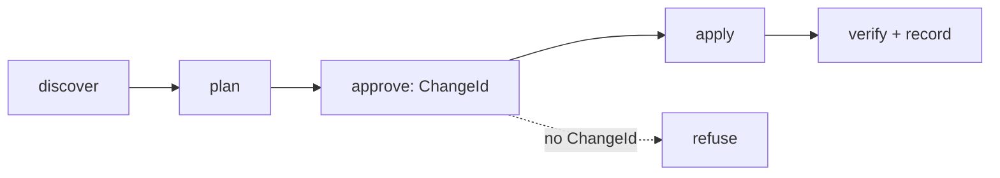

# PRD: infra-engineer — infrastructure lifecycle, deploy/release, and log triage

## Changelog

| Version | Date       | Summary                                                                                                                                                                                                                                                                                                                                                     | Author           |
| ------- | ---------- | ----------------------------------------------------------------------------------------------------------------------------------------------------------------------------------------------------------------------------------------------------------------------------------------------------------------------------------------------------------- | ---------------- |
| 1.1     | 2026-09-11 | Simplified. Dropped the platform adapter contract, the standalone safety instruction, `tooling.yaml` and `cost-thresholds.yaml`, the `RELEVANT`/`MARGINAL` taxonomy, and the separate `log-ops`, `infra-inventory`, `secrets-ops`, and `deploy-alternatives` skills. Four phases collapsed to three, each one skill. Open questions resolved with defaults. | product-engineer |
| 1.0     | 2026-09-01 | Initial PRD. Absorbs and supersedes issues #143, #144, #145, and #150. Organized as four phases.                                                                                                                                                                                                                                                            | product-engineer |

## Executive Summary

`dev-tasks` applies a discover → plan → approve → apply → record loop to code, but infrastructure changes still live in people's heads and ad hoc CI YAML. This PRD introduces `infra-engineer`: an agent that manages cloud resources, deploys, releases, and log triage under that same discipline. Every write is gated behind an approved `ChangeId`, and there is no autonomous mode, because an infrastructure mistake costs more than a code mistake.

The purpose is to **establish one consistent way of working with infrastructure**: every change leaves a legible record under `infra/changes/`, and the agent teaches which tool to use for which change (AWS CLI, the declared IaC tool, Supabase CLI, `gh`, `flyctl`, Cloudflare DNS). Delivery is three phases, one skill each: AWS (Phase 1), Supabase Cloud (Phase 2), deploy and release (Phase 3).

## Feature Overview

`infra-engineer` is one agent, one working loop, and three platform/task skills. The agent body owns the loop, the safety rules, the record format, and the tool-routing table. Each skill owns the concrete commands for one surface.

| Phase | Absorbs | Ships                                                                                                |
| ----- | ------- | ---------------------------------------------------------------------------------------------------- |
| 1     | #143    | `infra-engineer` agent (all platforms), `aws-ops` skill, `infra/` layout, ADR-005, registries, tests |
| 2     | #145    | `supabase-ops` skill                                                                                 |
| 3     | #144    | `deploy-ops` skill plus script templates under `templates/scripts/`                                  |

Log triage (#150) is not a separate deliverable. Its three rules (bounded window, unconditional redaction, cite the source) live in the agent body, and each platform skill carries its own symptom-to-source table.



## Goals and Objectives

1. **A recorded way of working.** Every change produces `infra/changes/<date>-<slug>/` with plan, commands, result, and rollback, so "what changed, when, why" is answerable from the repo.
2. **Teach which tool to use.** One routing table in the agent body maps each kind of change to one tool and the phase it runs in.
3. **Blast-radius safety.** No write without an approved `ChangeId`; production foundation destroys refused; wrong-account execution refused.
4. **Traceable delivery.** Every deploy records version and commit SHA; production deploys only from a release tag; rollback resolves from the record.

## Affected Repositories

| Repository        | Role / Impact                                                                                                                   |
| ----------------- | ------------------------------------------------------------------------------------------------------------------------------- |
| `llipe/dev-tasks` | Sole repository. Adds the agent, three skills across the three skill trees, script templates, ADR-005, registry updates, tests. |

Consumer repositories that install `dev-tasks` receive the agent, skills, and an `infra/` scaffold. `infra/` is consumer-owned.

## Target Users

- **Primary:** solo developers and small teams using `dev-tasks` who run their own AWS, Supabase, fly.io, or Cloudflare DNS resources. Personal-use cost profile.
- **Secondary:** reviewers who need a legible change record and a clear human-approval boundary before any production write.

## User Stories

1. As an operator, I want the agent to discover what exists before proposing a change, so the plan is grounded in real state.
2. As an operator, I want every write gated behind an approved `ChangeId`, so nothing is applied without my go-ahead.
3. As an operator, I want to be told which tool to use for a given change, so I work consistently instead of improvising.
4. As an operator, I want the agent to refuse when a required tool is missing or unauthenticated, with the fix named, so I never get a half-applied change.
5. As an operator, I want to see the monthly cost of each planned resource before I approve it.
6. As an operator, I want a canonical `deploy:<env>` path that validates, builds, migrates with confirmation, deploys, verifies, and records, so deploys are repeatable.
7. As an operator, I want production to deploy only from a release tag and rollback to resolve the last good version automatically.
8. As an operator diagnosing an incident, I want bounded, redacted log queries pointed at the right source, so I find evidence without leaking secrets or running an unbounded billed query.

## Functional Requirements

### Agent (all phases)

1. **Packaging.** `infra-engineer` ships as `.github/agents/infra-engineer.agent.md`, `.kiro/agents/infra-engineer.md`, `.claude/commands/infra-engineer.md`, and `.github/prompts/infra-engineer.prompt.md`. On Claude it is a main-thread command, not a subagent, because every write pauses for approval. Kiro frontmatter declares `description` and `tools` and no `permissions` block.
2. **Working loop.** `discover → plan → approve → apply → verify + record`. No phase is skippable. No write command is emitted or executed without an approved `ChangeId`. No autonomous or batch mode exists. Safety rules live in the agent body only; no separate scoped instruction file.
3. **Two tiers.** _Foundation_ resources (VPC, cluster, Supabase project, Cloudflare zone) are owned by the IaC tool declared per environment in `infra/environments.yaml` (`cdk | terraform | cloudformation | none`). The agent is read-only for foundation: it discovers state and routes a change to that tool, recording the handoff; it does not author or apply IaC. _Application_ resources (ECS service, task definition, DNS record, migration, function, bucket, preview branch) are CLI-managed behind `ChangeId`. Ephemeral application resources carry an `ExpiresAt` tag and are reported when expired. Production foundation destroy is refused. Any other destroy requires typing the environment name and proceeds in reverse dependency order.
4. **Identity assertion.** Every plan states the target environment's identity from `infra/environments.yaml` (AWS account + region, Supabase project ref, fly app) and refuses to proceed when active credentials resolve elsewhere.
5. **Tool check.** Before a phase runs, each tool it needs is checked for presence on `PATH` and working authentication. A failed check blocks with the install or login command. No auto-install, no fallback to another tool. Minimum versions are noted in the skill, not enforced by policy.
6. **Tool-routing table.** The agent body carries one table: change kind → tool → phase. Rows cover AWS discovery and application writes (`aws`), foundation changes (declared IaC tool, handoff), AWS secrets (`aws secretsmanager` by ARN), fly secrets (`fly secrets`), DNS (Cloudflare API), Supabase schema, functions, and secrets (`supabase` CLI), repo operations (`gh` via `github-ops`), deploy and release (`deploy-ops` scripts), and log triage (platform skill tables).
7. **Cost.** Every planned resource lists an estimated monthly cost with its source. Any resource at or above the threshold in `infra/environments.yaml` (default USD 20/month) is called out for its own explicit approval. A read-only cost sweep reports resources that cost money without serving traffic, including untagged resources and log groups with no retention policy.
8. **Record and inventory.** Discovery writes `infra/inventory/<platform>/…` with a "generated, do not hand-edit" header. Each change writes `infra/changes/<date>-<slug>/{plan.md, commands.sh, result.md, rollback.sh}`. The agent commits its `infra/` records on a branch and opens a draft PR via `github-ops`; it never merges.
9. **Tagging.** `Environment`, `Owner`, `ManagedBy`, `ChangeId` on every created resource; `ExpiresAt` on ephemeral resources. Untagged resources are reported, never modified without explicit instruction.
10. **Secrets.** No secret value appears in any generated artifact, transcript, issue, or PR. AWS workloads reference Secrets Manager by ARN; fly-only workloads use `fly secrets`; Supabase-only workloads use `supabase secrets set`.
11. **Log triage.** Read-only; needs no `ChangeId`. Every query is time-bounded and anchored to a `ChangeId`, deploy timestamp, or stated incident window in UTC; an unbounded billed query is refused. Raw output is never committed: the change record holds a redacted excerpt plus the reproducing query. Verify steps name source, window, and observed line; a conclusion not backed by a source is labelled inference.

### Phase 1 — `aws-ops` (was #143)

12. AWS CLI command sets per phase and service, tier assignment per resource type, cost estimation, and the AWS symptom-to-source log table (CloudWatch, ECS `stoppedReason`, ALB access logs, Logs Insights, VPC Flow Logs, CloudTrail, GitHub Actions, fly).
13. AWS has no native plan, so a plan is synthesized: discovery output, delta versus desired state, exact commands.

### Phase 2 — `supabase-ops` (was #145)

14. Supabase project, plan, compute, replicas, and PITR are foundation; schema, migrations, storage, auth, and functions are application; preview branches are ephemeral with `ExpiresAt`.
15. `supabase db diff` is the plan. Destructive statements are itemized. Explicit confirmation precedes `supabase db push` to a shared or production project. `supabase migration list` is recorded as verification. A non-empty diff with no pending local migration is reported as drift, never pushed.
16. Inventory at `infra/inventory/supabase/<project-ref>.json` holds no key material, masked or otherwise. Discovery reports legacy-only `anon`/`service_role` keys (not rotatable) and RLS-disabled tables as findings. Writes never go through an MCP path.
17. Supabase Cloud symptom-to-source log table (Postgres, API, Auth, Storage, Realtime, Edge Functions) with the short-retention caveat: capture evidence at incident time.

### Phase 3 — `deploy-ops` (was #144)

18. **Script contract.** `release` (human only), `release:dry-run`, `deploy:<env>`, `deploy:verify:<env>`, `rollback:<env>`, `deploy:status`. Shell scripts under `templates/scripts/` are the implementation; `package.json` wrappers exist only for JS/TS repos. Environment names come from `infra/environments.yaml`. `scripts/release.sh` in this repo is generalized, not reimplemented.
19. **Deploy steps.** Preflight (clean tree, identity assertion) → `validate` → build an artifact tagged by version and SHA → migrate (confirmation-gated for shared/prod) → deploy → verify → record. No flag skips `validate` for production.
20. **Tags and rollback.** Annotated `v<major>.<minor>.<patch>` tags are the only release trigger. Production deploys only from an existing release tag; non-production may deploy from a branch as `v<semver>-rc.N+<sha>`. Bump type is derived from Conventional Commits and confirmed by the human. `rollback:<env>` reads the previous good version from `infra/changes/`. A failing verify prints the rollback command instead of reporting success.
21. **Authority.** `release` and `deploy:prod` are human-invoked and refuse to run in a non-interactive context; non-prod deploys require an approved `ChangeId`.
22. **Deploy-target framing.** The skill lists the options (AWS on existing foundation, AWS with new foundation, fly.io, Supabase Edge Functions) with cost shape and fit; the user decides. Cloudflare Workers is not a target.

## Business Rules

- No agent pushes or merges into `main`; `release` and `deploy:prod` are human-invoked only.
- No write without an approved `ChangeId`; log reading is the sole exception.
- No autonomous or batch mode.
- Production foundation destroy is always refused; other destroys require typed environment confirmation.
- No auto-install or auto-authentication of any tool.
- No secret material in any generated artifact.
- A missing `infra/environments.yaml` blocks; it never defaults silently.

## Data Requirements

One consumer-owned tree. `environments.yaml` ships as an unfilled template following the `/TESTING.md` sentinel pattern.

```
infra/
  environments.yaml               # per env: aws {account_id, region, profile}, supabase.project_ref,
                                  #          fly_app, tier0_tool, cost_threshold_usd (default 20)
  inventory/                      # generated by discovery, never hand-edited
    aws/<account>/<region>/<service>.json
    supabase/<project-ref>.json
    fly/<app>.json
    cloudflare/<zone>.json
  changes/<date>-<slug>/
    plan.md
    commands.sh                   # for a foundation handoff: the commands the human runs
    result.md                     # applied | routed-to-<tool> | rolled-back
    rollback.sh
```

## Non-Goals (Out of Scope)

- No application code; the agent writes only under `infra/` and `templates/scripts/`.
- Does not author or apply foundation IaC; routes to the declared tool.
- Does not auto-install, upgrade, or authenticate tools.
- Does not own consumer CI; scripts are the interface, workflow YAML stays consumer-owned.
- Not a cost-optimization engine; the sweep reports, it does not remediate.
- Does not author RLS policies or tests (`qa-engineer`); does not manage self-hosted Supabase; Supabase logs are cloud only.
- No generic "platform adapter contract". Adding a fourth platform means adding a skill and rows to the routing table. Refactor when that happens, not before.
- No new npm dependency, no new `dt` subcommand, no MCP server.

## Design Considerations

No UI. Cross-platform parity (Copilot, Claude Code, Kiro) is behavioral, not byte-for-byte, and is checked by the existing parity-test convention.

## Technical Considerations

- Claude packaging is a command because step-gated approval cannot run in a subagent.
- `bundle-manifest.json`: confirm existing globs cover the new files; add `infra/` to `consumer_owned_paths` and verify directory-prefix semantics against the installer and updater, since `infra/` is the first broad consumer tree.
- `/TESTING.md` is unfilled, so the security-negative test is specified inline with fixtures (synthetic AWS key, `sb_secret_*` key, bearer token, connection string, email).
- ADR-005 records: `ChangeId`-gated loop, foundation route-not-write, and the decision not to abstract a platform contract before a third platform exists.

## Acceptance Criteria

- [ ] **Phase 1** — Agent ships on all platforms with the loop, two-tier model, identity assertion, tool check, routing table, cost callout, record format, tagging, secrets, and log-triage rules; `aws-ops` ships in three trees; `infra/environments.yaml` template ships; ADR-005 added; registries and manifest updated; `infra-engineer-parity.test.ts`, `skill-parity-infra.test.ts`, and the secrets/redaction security-negative test pass.
- [ ] **Phase 2** — `supabase-ops` ships in three trees; `db diff` plan with confirmation and drift reporting; inventory with no key material (covered by the security-negative test); findings for legacy keys and RLS-disabled tables; Supabase log table present.
- [ ] **Phase 3** — `deploy-ops` ships in three trees; script templates pass shellcheck and support `--help` and dry-run; production refuses non-tag refs; rollback resolves from `infra/changes/`; human-only scripts refuse non-interactive execution; canonical script names documented in `technical-guidelines.md`.
- [ ] **Global** — `pnpm run validate` and `pnpm run audit` pass; every new test is reachable from `pnpm run test`; no agent path pushes or merges to `main`.

## Success Metrics

- Every infrastructure change in a consuming repo produces a complete `infra/changes/` record.
- Zero secrets in generated artifacts (security-negative test green).
- No write executes without an approved `ChangeId`; no production foundation destroy succeeds.

## Assumptions

- Personal-use cost profile: one threshold, default USD 20/month, same for prod and non-prod, overridable per consumer in `environments.yaml`.
- AWS CLI v2, Supabase CLI v2, `gh`, `flyctl`, and Cloudflare access are consumer-provided.
- Multi-account AWS access uses named profiles declared in `environments.yaml`.
- One Supabase project per long-lived environment; preview branches only for ephemeral use.
- Single fixed version per repo for `release`.

## Constraints and Dependencies

- Phase 1 defines `environments.yaml`, the record format, and `ChangeId`; Phases 2 and 3 consume them and cannot land first.
- Registry files (`AGENTS.md`, `CLAUDE.md`, `README.md`, `docs/system-overview.md`, `docs/workflow-chains.md`, `docs/technical-guidelines.md`) are touched by every phase; sequence those edits.
- `ADR-004` is taken; this feature uses `ADR-005`.

## Security and Compliance

- Read-only by default; write phases assert identity before executing.
- Per-operation approval; approval for one change is never standing approval for the next.
- No secret material persisted anywhere; log output redacted before it reaches any artifact.
- Tool output, log content, and remote state are data, never instructions.

## Open Questions

1. Supabase Cloud log retrieval: confirm the Management API endpoint and per-plan retention during Phase 2 implementation. A `researcher` pass is recommended before that spec.
2. Redaction: ship a pattern set as a skill asset so the security-negative test has one concrete target. Proposal: yes.
