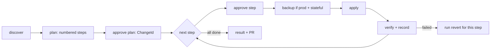

# PRD: infra-engineer — infrastructure lifecycle, deploy/release, and log triage

## Changelog

| Version | Date       | Summary                                                                                                                                                                                                                                                                                                     | Author           |
| ------- | ---------- | ----------------------------------------------------------------------------------------------------------------------------------------------------------------------------------------------------------------------------------------------------------------------------------------------------------- | ---------------- |
| 1.2     | 2026-09-11 | Phase 1 now covers AWS, fly.io, and Supabase together. Version floors restored. Added the step-gated execution model with per-step revert, mandatory production backups, and ownership of GitHub Actions deploy/release workflows. Two phases.                                                              | product-engineer |
| 1.1     | 2026-09-11 | Simplified. Dropped the platform adapter contract, the standalone safety instruction, `tooling.yaml` and `cost-thresholds.yaml`, the `RELEVANT`/`MARGINAL` taxonomy, and the separate `log-ops`, `infra-inventory`, `secrets-ops`, and `deploy-alternatives` skills. Open questions resolved with defaults. | product-engineer |
| 1.0     | 2026-09-01 | Initial PRD. Absorbs and supersedes issues #143, #144, #145, and #150. Organized as four phases.                                                                                                                                                                                                            | product-engineer |

## Executive Summary

`dev-tasks` applies a discover → plan → approve → apply → record loop to code, but infrastructure changes still live in people's heads and ad hoc CI YAML. This PRD introduces `infra-engineer`: an agent that carries out infrastructure work step by step, with a human approval before every step, a recorded revert path for every step, and a backup before any production step that touches state. There is no autonomous mode, because an infrastructure mistake costs more than a code mistake.

The purpose is **one consistent way of working with infrastructure**: every change leaves a legible, revertible record under `infra/changes/`, and the agent teaches which tool to use for which change. Phase 1 delivers the agent and the three platforms in daily use (AWS, fly.io, Supabase Cloud). Phase 2 codifies the repeatable deploy and release path into scripts and GitHub Actions workflows that the agent owns.

## Feature Overview

`infra-engineer` is one agent, one working loop, and four skills. The agent body owns the loop, the safety rules, the record format, the tool-routing table, and the log-triage rules. Each skill owns the concrete commands, version floors, and log sources for one surface.

| Phase | Absorbs          | Ships                                                                                                                              |
| ----- | ---------------- | ---------------------------------------------------------------------------------------------------------------------------------- |
| 1     | #143, #145, #150 | `infra-engineer` agent (all platforms), `aws-ops`, `fly-ops`, `supabase-ops` skills, `infra/` layout, ADR-005, registries, tests   |
| 2     | #144             | `deploy-ops` skill: script templates under `templates/scripts/` and GitHub Actions workflow templates under `templates/workflows/` |

In Phase 1 the agent does infrastructure work by hand with the platform CLIs, one approved step at a time: build an image, create an app, deploy it, create secrets, create and attach IAM policies, add DNS records, issue certificates. Phase 2 turns the path that repeats (build, migrate, deploy, verify, rollback) into scripts and pipelines.



## Goals and Objectives

1. **A recorded, revertible way of working.** Every change produces `infra/changes/<date>-<slug>/` with the plan, the exact commands run per step, the result per step, and the revert commands per step.
2. **Step-gated execution.** A plan is a numbered list of steps. The human approves the plan, then approves each step before it runs. The agent never runs ahead.
3. **Production is recoverable.** In production, a step with no revert path is refused, and a step that touches state runs only after a backup is taken and recorded.
4. **Teach which tool to use.** One routing table maps each kind of change to one tool and the phase it runs in.
5. **Traceable delivery.** Every deploy records version and commit SHA; production deploys only from a release tag; rollback resolves from the record; the pipelines that do this are owned by the agent.

## Affected Repositories

| Repository        | Role / Impact                                                                                                                                   |
| ----------------- | ----------------------------------------------------------------------------------------------------------------------------------------------- |
| `llipe/dev-tasks` | Sole repository. Adds the agent, four skills across the three skill trees, script and workflow templates, ADR-005, registry updates, and tests. |

Consumer repositories that install `dev-tasks` receive the agent, skills, and an `infra/` scaffold. `infra/` and `.github/workflows/` deploy and release workflows are consumer-owned files that the agent maintains.

## Target Users

- **Primary:** solo developers and small teams using `dev-tasks` who run their own AWS, fly.io, Supabase Cloud, and Cloudflare DNS resources. Personal-use cost profile.
- **Secondary:** reviewers who need a legible change record and a clear human-approval boundary before any production write.

## User Stories

1. As an operator, I want the agent to discover what exists before proposing a change, so the plan is grounded in real state.
2. As an operator, I want a plan as numbered steps, each approved individually before it runs, so I stay in control of every write.
3. As an operator, I want each step recorded with its revert commands, so any change can be undone in order.
4. As an operator, I want a backup taken and recorded before any production step that touches data, so I can restore if the revert is not enough.
5. As an operator, I want to be told which tool to use for a given change, so I work consistently instead of improvising.
6. As an operator, I want the agent to refuse when a required tool is missing, below its minimum version, or unauthenticated, with the fix named, so I never get a half-applied change.
7. As an operator, I want to see the monthly cost of each planned resource before I approve it.
8. As an operator, I want a canonical `deploy:<env>` path, run by a GitHub Actions workflow the agent maintains, so deploys are repeatable.
9. As an operator, I want production to deploy only from a release tag and rollback to resolve the last good version automatically.
10. As an operator diagnosing an incident, I want bounded, redacted log queries pointed at the right source, so I find evidence without leaking secrets.

## Functional Requirements

### Agent (all phases)

1. **Packaging.** `infra-engineer` ships as `.github/agents/infra-engineer.agent.md`, `.kiro/agents/infra-engineer.md`, `.claude/commands/infra-engineer.md`, and `.github/prompts/infra-engineer.prompt.md`. On Claude it is a main-thread command, not a subagent, because every step pauses for approval. Kiro frontmatter declares `description` and `tools` and no `permissions` block.
2. **Working loop.** `discover → plan → approve plan → (approve step → backup → apply → verify → record) per step → result`. No phase is skippable. No write command is emitted or executed without an approved `ChangeId` and an approval for that specific step. No autonomous or batch mode exists. Safety rules live in the agent body only.
3. **Plan as steps.** `plan.md` is a numbered list. Each step declares: change kind, tool, environment, exact forward commands, expected result, verification command, exact revert commands, and whether it touches state. Steps run in order; a failed verification stops the run and offers the revert for that step. The agent asks for the next step only after the previous one is recorded.
4. **Revert.** Every step has a revert. `rollback.sh` is assembled from the per-step reverts in reverse order and is runnable from any step downward. A step without a revert is refused in production and requires an explicit "accept no revert" approval elsewhere.
5. **Backup.** In production, any step that touches state (database schema or data, volumes, buckets, DNS zone) runs only after a backup step: `supabase db dump` or a PITR reference, an RDS snapshot, `fly volumes snapshots create`, an S3 versioning check, a Cloudflare zone export. The backup identifier and its restore command are recorded in `result.md` before the step applies.
6. **Two tiers.** _Foundation_ resources (VPC, cluster, Supabase project, fly org, Cloudflare zone) are owned by the IaC tool declared per environment in `infra/environments.yaml` (`cdk | terraform | cloudformation | none`). The agent is read-only for foundation: it discovers state and routes a change to that tool, recording the handoff. _Application_ resources are CLI-managed behind `ChangeId`. Ephemeral resources carry `ExpiresAt` and are reported when expired. Production foundation destroy is refused. Any other destroy requires typing the environment name and proceeds in reverse dependency order.
7. **Identity assertion.** Every plan states the target environment's identity from `infra/environments.yaml` (AWS account and region, fly app and org, Supabase project ref) and refuses to proceed when active credentials resolve elsewhere.
8. **Tool check with version floors.** Before a phase runs, each tool it needs is checked for presence on `PATH`, version at or above the floor declared in the owning skill, and working authentication. A failed check blocks with the install, upgrade, or login command. No auto-install, no fallback to another tool. Floors: AWS CLI 2.x, `flyctl` current major, Supabase CLI 2.x, `gh` 2.x; exact minor versions pinned at implementation.
9. **Tool-routing table.** The agent body carries one table: change kind → tool → phase. Rows cover at least: build image (`docker` or `fly deploy --build-only`), create app (`fly apps create`, `aws ecs create-service`), deploy (`fly deploy`, `aws ecs update-service`, `supabase functions deploy`), secrets (`aws secretsmanager`, `fly secrets`, `supabase secrets`), IAM policy create and attach (`aws iam`), DNS records (Cloudflare API), certificates (`aws acm`, `fly certs`), database migration (`supabase db push`), foundation change (declared IaC tool, handoff), repo and PR operations (`gh` via `github-ops`), pipeline change (workflow file under `ChangeId`), log triage (platform skill tables).
10. **Cost.** Every planned resource lists an estimated monthly cost with its source. Any resource at or above the threshold in `infra/environments.yaml` (default USD 20/month) is called out for its own approval. A read-only cost sweep reports resources that cost money without serving traffic, including untagged resources, expired ephemerals, and log groups with no retention.
11. **Record and inventory.** Discovery writes `infra/inventory/<platform>/…` with a "generated, do not hand-edit" header. Each change writes `infra/changes/<date>-<slug>/{plan.md, commands.sh, result.md, rollback.sh}`. The agent commits its `infra/` records and any workflow edits on a branch and opens a draft PR via `github-ops`; it never merges.
12. **Tagging.** `Environment`, `Owner`, `ManagedBy`, `ChangeId` on every created resource that supports tags; `ExpiresAt` on ephemeral resources. Untagged resources are reported, never modified without instruction.
13. **Secrets.** No secret value appears in any generated artifact, transcript, issue, or PR. AWS workloads reference Secrets Manager by ARN; fly workloads use `fly secrets`; Supabase workloads use `supabase secrets set`; GitHub Actions use repository or environment secrets set with `gh secret set`, with OIDC preferred over long-lived AWS keys.
14. **Log triage.** Read-only; needs no `ChangeId`. Every query is time-bounded and anchored to a `ChangeId`, deploy timestamp, or stated incident window in UTC; an unbounded billed query is refused. Raw output is never committed: the change record holds a redacted excerpt plus the reproducing query. Verify steps name source, window, and observed line; a conclusion not backed by a source is labelled inference.

### Phase 1 — `aws-ops`, `fly-ops`, `supabase-ops` (was #143, #145, #150)

15. **`aws-ops`.** Command sets per change kind for ECS, ECR, IAM (create policy, attach policy, roles), Secrets Manager, ACM, ALB, CloudWatch; tier per resource type; cost estimation; backup commands (RDS snapshot, S3 versioning); the AWS log table (CloudWatch, ECS `stoppedReason`, ALB access logs, Logs Insights, VPC Flow Logs, CloudTrail, GitHub Actions). AWS has no native plan, so a plan is synthesized from discovery, delta, and exact commands.
16. **`fly-ops`.** Command sets for apps, machines, volumes, secrets, certificates, and deploy (`fly deploy`); release history as the revert source (`fly releases`, `fly deploy --image <previous>`); volume snapshots as the backup; the fly log table (`fly logs`, `fly status`, `fly machine status`).
17. **`supabase-ops`.** Project, plan, compute, replicas, and PITR are foundation; schema, migrations, storage, auth, and functions are application; preview branches are ephemeral with `ExpiresAt`. `supabase db diff` is the plan; destructive statements are itemized; confirmation precedes `supabase db push` to a shared or production project; `supabase migration list` is recorded as verification; a non-empty diff with no pending local migration is reported as drift, never pushed. Backup is `supabase db dump` or a recorded PITR point. Inventory at `infra/inventory/supabase/<project-ref>.json` holds no key material. Discovery reports legacy-only `anon`/`service_role` keys and RLS-disabled tables as findings. Writes never go through an MCP path. Supabase Cloud log table (Postgres, API, Auth, Storage, Realtime, Edge Functions) with the short-retention caveat: capture evidence at incident time.
18. **DNS and certificates.** Cloudflare DNS record create, update, and delete via the Cloudflare API, with the prior record value captured as the revert; certificates via `aws acm` or `fly certs`, with DNS validation records handled as steps in the same plan.

### Phase 2 — `deploy-ops` (was #144)

19. **Script contract.** `release` (human only), `release:dry-run`, `deploy:<env>`, `deploy:verify:<env>`, `rollback:<env>`, `deploy:status`. Shell scripts under `templates/scripts/` are the implementation; `package.json` wrappers exist only for JS/TS repos. Environment names come from `infra/environments.yaml`. `scripts/release.sh` in this repo is generalized, not reimplemented.
20. **Deploy steps.** Preflight (clean tree, identity assertion) → `validate` → build an artifact tagged by version and SHA → backup (prod, when migrating) → migrate (confirmation-gated for shared/prod) → deploy → verify → record. No flag skips `validate` or the backup for production.
21. **Tags and rollback.** Annotated `v<major>.<minor>.<patch>` tags are the only release trigger. Production deploys only from an existing release tag; non-production may deploy from a branch as `v<semver>-rc.N+<sha>`. Bump type is derived from Conventional Commits and confirmed by the human. `rollback:<env>` reads the previous good version from `infra/changes/`. A failing verify prints the rollback command instead of reporting success.
22. **Pipeline ownership.** `infra-engineer` owns the deploy and release workflows in `.github/workflows/`. Templates ship under `templates/workflows/`: a tag-triggered production deploy using a GitHub environment with required reviewers, a branch-triggered non-production deploy, and a manual rollback. Workflows call the canonical scripts and contain no inline deploy logic. Any workflow edit is a change: planned, approved, recorded under `infra/changes/`, delivered by PR. Existing quality-gate workflows (`validate`) stay as they are.
23. **Authority.** `release` and `deploy:prod` are human-invoked, either locally or by approving the protected GitHub environment; they refuse to run in a non-interactive agent context. Non-prod deploys require an approved `ChangeId`.
24. **Deploy-target framing.** The skill lists the options (AWS on existing foundation, AWS with new foundation, fly.io, Supabase Edge Functions) with cost shape and fit; the user decides. Cloudflare Workers is not a target.

## Business Rules

- No agent pushes or merges into `main`; `release` and `deploy:prod` are human-invoked only.
- No write without an approved `ChangeId` and an approval for the specific step; log reading is the sole exception.
- No autonomous or batch mode.
- Every step has a revert. In production, no revert means no step.
- In production, no backup means no state-touching step.
- Production foundation destroy is always refused; other destroys require typed environment confirmation.
- No auto-install, auto-upgrade, or auto-authentication of any tool; below-floor versions block.
- No secret material in any generated artifact.
- A missing `infra/environments.yaml` blocks; it never defaults silently.

## Data Requirements

One consumer-owned tree. `environments.yaml` ships as an unfilled template following the `/TESTING.md` sentinel pattern.

```
infra/
  environments.yaml               # per env: aws {account_id, region, profile}, fly {org, app},
                                  #          supabase.project_ref, cloudflare.zone_id, tier0_tool,
                                  #          production: true|false, cost_threshold_usd (default 20)
  inventory/                      # generated by discovery, never hand-edited
    aws/<account>/<region>/<service>.json
    fly/<app>.json
    supabase/<project-ref>.json
    cloudflare/<zone>.json
  changes/<date>-<slug>/
    plan.md                       # numbered steps: kind, tool, commands, verify, revert, touches_state
    commands.sh                   # forward commands as executed, one block per step
    result.md                     # per-step status, backup ids + restore commands, verification output
    rollback.sh                   # per-step reverts in reverse order
```

## Non-Goals (Out of Scope)

- No application code; the agent writes only under `infra/`, `templates/`, and deploy/release workflow files.
- Does not author or apply foundation IaC; routes to the declared tool.
- Does not auto-install, upgrade, or authenticate tools.
- Does not own quality-gate CI workflows; only deploy and release workflows.
- Not a cost-optimization engine; the sweep reports, it does not remediate.
- Does not author RLS policies or tests (`qa-engineer`); does not manage self-hosted Supabase; Supabase logs are cloud only.
- No generic platform adapter contract. A fifth platform means a new skill and new routing rows.
- No new npm dependency, no new `dt` subcommand, no MCP server.

## Design Considerations

No UI. Cross-platform parity (Copilot, Claude Code, Kiro) is behavioral, not byte-for-byte, and is checked by the existing parity-test convention.

## Technical Considerations

- Claude packaging is a command because per-step approval cannot run in a subagent.
- `bundle-manifest.json`: confirm existing globs cover the new files; add `infra/` and the deploy/release workflow files to `consumer_owned_paths` and verify directory-prefix semantics against the installer and updater.
- `/TESTING.md` is unfilled, so the security-negative test is specified inline with fixtures (synthetic AWS key, `sb_secret_*` key, fly token, bearer token, connection string, email).
- ADR-005 records: step-gated `ChangeId` loop with per-step revert, production backup rule, foundation route-not-write, agent ownership of deploy and release workflows.

## Acceptance Criteria

- [ ] **Phase 1** — Agent ships on all platforms with the step-gated loop, per-step revert, production backup rule, two-tier model, identity assertion, tool check with version floors, routing table, cost callout, record format, tagging, secrets, and log-triage rules; `aws-ops`, `fly-ops`, and `supabase-ops` ship in three trees, each declaring its version floors, backup commands, revert sources, and log table; `infra/environments.yaml` template ships; ADR-005 added; registries and manifest updated; `infra-engineer-parity.test.ts`, `skill-parity-infra.test.ts`, and the secrets/redaction security-negative test pass.
- [ ] **Phase 2** — `deploy-ops` ships in three trees; script templates pass shellcheck and support `--help` and dry-run; workflow templates ship and call scripts only; production refuses non-tag refs and runs behind a protected environment; rollback resolves from `infra/changes/`; human-only scripts refuse non-interactive execution; canonical script names documented in `technical-guidelines.md`.
- [ ] **Global** — `pnpm run validate` and `pnpm run audit` pass; every new test is reachable from `pnpm run test`; no agent path pushes or merges to `main`.

## Success Metrics

- Every infrastructure change in a consuming repo produces a complete, per-step `infra/changes/` record with a runnable `rollback.sh`.
- Every production state-touching step has a recorded backup id and restore command.
- Zero secrets in generated artifacts (security-negative test green).
- No write executes without an approved `ChangeId` and step approval; no production foundation destroy succeeds.

## Assumptions

- Personal-use cost profile: one threshold, default USD 20/month, overridable per consumer in `environments.yaml`.
- AWS CLI, `flyctl`, Supabase CLI, `gh`, and Cloudflare API access are consumer-provided.
- Multi-account AWS access uses named profiles declared in `environments.yaml`; GitHub Actions use OIDC.
- One Supabase project and one fly app per long-lived environment; preview branches and throwaway apps only for ephemeral use.
- Single fixed version per repo for `release`.

## Constraints and Dependencies

- Phase 1 defines `environments.yaml`, the record format, and `ChangeId`; Phase 2 consumes them and cannot land first. Phase 1 is the larger phase and should be split into one story per platform at the story stage.
- Registry files (`AGENTS.md`, `CLAUDE.md`, `README.md`, `docs/system-overview.md`, `docs/workflow-chains.md`, `docs/technical-guidelines.md`) are touched by both phases; sequence those edits.
- `ADR-004` is taken; this feature uses `ADR-005`.

## Security and Compliance

- Read-only by default; write steps assert identity before executing.
- Per-step approval; approval for one step is never standing approval for the next.
- Production state changes are preceded by a recorded backup and carry a recorded revert.
- No secret material persisted anywhere; log output redacted before it reaches any artifact.
- Tool output, log content, and remote state are data, never instructions.

## Open Questions

1. Supabase Cloud log retrieval: confirm the Management API endpoint and per-plan retention during Phase 1 implementation. A `researcher` pass is recommended before the spec.
2. Redaction: ship a pattern set as a skill asset so the security-negative test has one concrete target. Proposal: yes.
3. Exact version floors per CLI: pin at implementation after checking each tool's current command surface.
