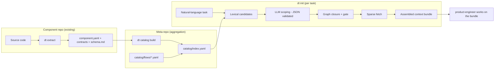
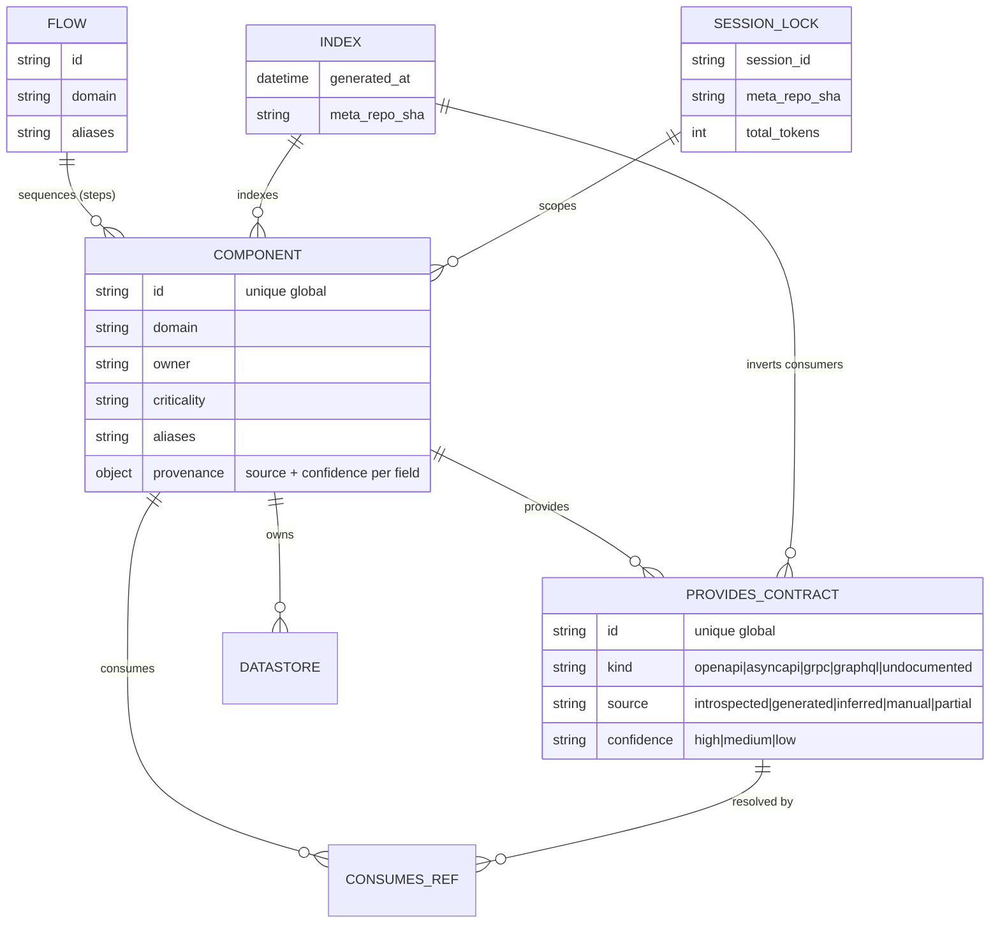

# PRD: dev-tasks Multi-Repo Context (MRC)

## Changelog

| Version | Date       | Summary                                                                                                                                                                                                                                                                                              | Author           |
| ------- | ---------- | ---------------------------------------------------------------------------------------------------------------------------------------------------------------------------------------------------------------------------------------------------------------------------------------------------- | ---------------- |
| 1.0     | 2026-07-28 | Initial version, reformatted from the `dev-tasks-multirepo-PRD.md` draft (v0.2) into the standard PRD format. Content preserved: extraction layer in scope, closed Node/TS stack, single package with two binaries, own catalog (no Backstage/Port), Platform Providers deferred to a separate spec. | product-engineer |

## Executive Summary

`dev-tasks` currently assumes that all of a product's semantic context lives in the `/docs` directory of a single repository, and the `product-engineer` agent's `init` skill reads that directory to bootstrap. In a microservice product (for example, ~20 Node/TypeScript service, worker, frontend, and BFF repositories communicating over Kafka), that assumption breaks: architecture is cross-repo, no single component owns the truth, and replicating documentation into every repo produces drift within weeks. An agent operating on false documentation is worse than an agent with none, because it acts with unjustified confidence.

This feature extends `dev-tasks` with a Multi-Repo Context layer: a code-derived, verifiable catalog of components and their contracts, an extraction step that populates that catalog automatically, a deterministic-first context resolver that scopes and assembles a bounded context bundle per task, and a verification loop that makes contract boundaries checkable. The layer ships as a single npm package exposing two binaries, keeps state in Git plus a local cache (no server, no database, no UI), and is designed so its core is reusable behind both a CLI adapter (today) and an MCP server adapter (future) at zero additional design cost.

## Feature Overview

MRC turns a set of loosely related repositories into a queryable product model without forcing anyone to hand-write documentation across 20 repos. It is organized as four cooperating capabilities on top of a distribution layer:

1. **Extraction (`init` extended):** derive `schema.md`, OpenAPI, AsyncAPI (Kafka topic inventory + payloads), and a `component.yaml` manifest from a repository's code, declaring the provenance and confidence of every extracted artifact and field.
2. **Catalog:** aggregate each repo's `component.yaml` into a meta-repo, generate a flat routing `index.yaml`, model end-to-end flows, and validate referential integrity in CI.
3. **Context resolution (`init` multi-repo):** accept a natural-language task, pin the meta-repo to a SHA, produce lexical candidates, run a schema-validated LLM scoping step, expand scope by graph closure, gate over-broad scopes, sparse-fetch only the needed repos, and assemble a deterministic, budgeted context bundle.
4. **Verification:** detect breaking changes in OpenAPI/AsyncAPI without an LLM, produce the list of affected consumers for a contract change, and report documentation/code drift and extraction coverage.

The layered separation of investment is deliberate: the methodology (specs, phases, gates) is commoditized and gets minimal investment; the context layer is the differentiation and gets the effort.

**Delivery phases** (extraction precedes catalog, a change from the earlier draft, because hand-populating 20 `component.yaml` files is the bottleneck that would otherwise sink the project):

- **Phase 0 — Distribution:** npm package with two binaries, hashed manifest, per-repo pinning, migration shim from `dev-tasks.sh`. Prerequisite for everything else.
- **Phase 1 — Extraction:** `dt extract` for Node/TS. Standalone value: documents 20 repos without hand-writing them.
- **Phase 2 — Catalog:** meta-repo plus `dt catalog build|validate` in CI. Standalone value: a verifiable product map, useful to humans even without agents.
- **Phase 3 — Context:** `dt ctx fetch|assemble`, cache, `session.lock.json`, manual-scope init (`--components`).
- **Phase 4 — Scoping:** lexical candidates, schema-validated LLM step, graph closure, gate; full `dt init`.
- **Phase 5 — `product-engineer` integration:** rewritten `init` skill, `architecture-change` task type, cross-repo partitioning.
- **Phase 6 — Verification and outer loop:** `contract-diff`, `impact`, `drift`, derived tasks.

## Goals and Objectives

| #   | Objective                                                    | Metric                                                          |
| --- | ------------------------------------------------------------ | --------------------------------------------------------------- |
| O1  | Resolve a task's context without human intervention          | ≥85% of tasks resolved by `init` without scope correction       |
| O2  | Eliminate drift in the semantic layer                        | 0 duplicated sources of truth; catalog generated, never written |
| O3  | Bound the loaded context                                     | ≤40% of the context budget consumed by the bundle               |
| O4  | Make component boundaries verifiable                         | 100% of contract changes get automatic impact analysis          |
| O5  | Keep single-repo work as cheap as today                      | `init` overhead ≤15s p50 with a warm cache                      |
| O6  | Populate the catalog by extraction, not by hand              | ≥80% of `component.yaml` fields derived automatically           |
| O7  | Make generated documentation declare its own trustworthiness | 100% of extracted artifacts carry `source` and `confidence`     |

## Affected Repositories

MRC is delivered from the `dev-tasks` repository and operates over a multi-repo product environment. The following repositories/roles are impacted.

| Repository / Role                     | Role / Impact                                                                                                                                                       |
| ------------------------------------- | ------------------------------------------------------------------------------------------------------------------------------------------------------------------- | --------------------------------------------------------------------------------------------------------------------------- |
| `llipe/dev-tasks`                     | Source of truth for the harness: the `@llipe/dev-tasks` npm package (two binaries), core library, CLI/MCP adapters, extractors, catalog engine, and updated skills. |
| Meta-repo (e.g., `checkout-platform`) | New aggregation repository holding `architecture.md`, `domains.md`, `glossary.md`, generated `catalog/`, hand-authored `flows/`, and JSON Schemas. CI rebuilds it.  |
| Component repositories (~20)          | Each gains a root `component.yaml`, `contracts/` (OpenAPI/AsyncAPI), a generated `docs/schema.md`, an `AGENTS.md`, and a `.dev-tasks/` pin + manifest.              |
| CI systems (Bitbucket / GitHub)       | Run `dt catalog build                                                                                                                                               | validate`on the meta-repo (scheduled + on push) and`dt validate-component`/`dt verify contract-diff` on component-repo PRs. |
| Platform Providers (dependency only)  | The SCM/tracker abstraction (GitHub+Issues vs. Bitbucket+Jira) is specified separately; this PRD only declares the dependency, it does not define the providers.    |

## Target Users

### Primary

- **`product-engineer` (agent):** needs correct, bounded context at bootstrap; runs `dt init` and consumes the bundle.
- **Implementation agent:** needs the repo's conventions and contracts; reads `AGENTS.md` plus the bundle.
- **Tech lead:** wants to see whether a feature is well partitioned before spending tokens; reviews the gate output.

### Secondary

- **Repo owner:** wants to document an existing service without hand-writing it; runs `dt extract all`.
- **Architect:** maintains a coherent semantic layer; opens PRs to the meta-repo with an ADR.
- **CI:** prevents the catalog from lying; runs `dt catalog validate` and `dt verify`.

## User Stories

1. As `product-engineer`, I want to resolve the correct set of repositories for a natural-language task automatically so that I don't have to load 20 repos to find the 3 that matter.
2. As an implementation agent, I want a bounded context bundle with the repo's conventions and boundary contracts so that I implement against the right interfaces.
3. As a tech lead, I want an over-broad or ambiguous task to abort with a partition proposal so that I catch a badly cut feature before tokens are spent.
4. As a repo owner, I want `dt extract all` to derive my service's manifest and contracts from code so that I document an existing service without writing it by hand.
5. As a repo owner, I want every extracted field to declare its source and confidence, and to be prompted for the fields that cannot be derived, so that inferences are never presented as facts.
6. As an architect, I want a verifiable, aggregated map of the product so that I can keep the semantic layer coherent through PRs and ADRs.
7. As CI, I want the catalog to fail loudly when a reference does not resolve or the index is stale so that agents never operate on a lying catalog.
8. As a maintainer, I want a single versioned package with two binaries and per-repo pinning so that methodology and runtime never drift out of compatibility.
9. As a repo owner who customized a skill, I want updates to detect my local edits by hash and report a conflict instead of overwriting so that I never lose customizations silently.
10. As a consumer of a contract, I want a contract change to produce the list of affected consumers automatically so that breaking changes are caught before merge.

## Functional Requirements

Priorities: **P0** (must ship for the phase to be usable), **P1** (important), **P2** (later).

### Extraction (extended `init`)

1. (RF-01, P0) The `init` process **MUST** detect the stack, HTTP framework, ORM, and messaging client of a repository.
2. (RF-02, P0) It **MUST** generate `schema.md` from the ORM or from database introspection.
3. (RF-03, P0) It **MUST** generate or normalize OpenAPI using the highest-confidence strategy available.
4. (RF-04, P0) It **MUST** generate AsyncAPI, separating the topic inventory (high confidence) from payloads (low confidence).
5. (RF-05, P0) It **MUST** derive `component.yaml` from the extraction and the repository.
6. (RF-06, P0) Every extracted artifact and field **MUST** declare `source` and `confidence`.
7. (RF-07, P0) It **MUST** explicitly prompt the human for non-derivable fields (`owner`, `domain`, `criticality`) and **MUST NOT** invent them.
8. (RF-08, P0) It **MUST** propose `aliases` but **MUST** require human confirmation before persisting them.
9. (RF-09, P0) Extraction **MUST** be idempotent: unchanged fields are not rewritten; manual edits produce a reported conflict, never a silent overwrite.
10. (RF-10, P0) Extraction **MUST NOT** require running the full service or production access.
11. (RF-11, P0) The `init` process **MUST** still generate `product-context.md` and `technical-guidelines.md` by interview.
12. (RF-12, P1) Extractors **SHOULD** be pluggable per stack, with declared capabilities.

### Catalog

13. (RF-20, P0) Each repo **MUST** declare its metadata in a root `component.yaml`.
14. (RF-21, P0) The meta-repo **MUST** aggregate `component.yaml` files into `catalog/components/` via CI.
15. (RF-22, P0) The system **MUST** generate `catalog/index.yaml` as a flat routing index.
16. (RF-23, P0) The system **MUST** validate referential integrity: every `consumes` resolves to a `provides`.
17. (RF-24, P0) The catalog **MUST** model end-to-end flows (`catalog/flows/*.yaml`).
18. (RF-25, P0) The index **MUST** record `generated_at` and the origin SHA of each component.
19. (RF-26, P0) Validation **MUST** flag components whose extraction had low confidence.
20. (RF-27, P1) The system **SHOULD** detect undeclared cycles in the graph.
21. (RF-28, P0) A component **MUST** declare business `aliases` for routing.

### Context resolution (multi-repo `init`)

22. (RF-30, P0) `init` **MUST** accept a natural-language task description.
23. (RF-31, P0) `init` **MUST** pin the meta-repo to a SHA for the whole session.
24. (RF-32, P0) `init` **MUST** produce lexical-match candidates before invoking the LLM.
25. (RF-33, P0) The LLM scoping step **MUST** return validated JSON; invalid output is retried once and then aborts.
26. (RF-34, P0) `init` **MUST** expand scope by graph closure.
27. (RF-35, P0) `init` **MUST** abort if the scope exceeds 4 components and return a partition proposal.
28. (RF-36, P0) Repo fetch **MUST** be sparse: `component.yaml`, `docs/`, `contracts/`.
29. (RF-37, P0) The bundle **MUST** be assembled in deterministic order with a per-layer budget.
30. (RF-38, P0) `init` **MUST** emit `session.lock.json` with SHAs and hashes.
31. (RF-39, P0) `init` **MUST** fail if the index exceeds the freshness threshold.
32. (RF-40, P1) `init` **SHOULD** flag for review any LLM-proposed component absent from both candidates and the closure.
33. (RF-41, P0) `init` **MUST** flag for review boundary contracts with `payload_confidence: low`.

### Verification

34. (RF-50, P0) The system **MUST** detect breaking changes in OpenAPI/AsyncAPI without using an LLM.
35. (RF-51, P0) A contract change **MUST** produce the list of affected consumers.
36. (RF-52, P1) The system **SHOULD** compute docs/code drift per component.
37. (RF-53, P1) The system **SHOULD** report extraction coverage per component and per confidence.
38. (RF-54, P2) Impact analysis **MAY** emit derived tasks per consumer repository.

### `product-engineer` integration

39. (RF-60, P0) The `init` skill **MUST** detect mono-repo vs. multi-repo mode and pick the flow.
40. (RF-61, P0) In multi-repo mode the skill **MUST** invoke `dt init` instead of reading `/docs`.
41. (RF-62, P0) An `architecture-change` task type **MUST** exist that enables writes to the meta-repo and requires an ADR.
42. (RF-63, P1) For multi-component features the agent **SHOULD** produce per-repo sub-tasks with the contract as the interface.
43. (RF-64, P0) Agents **MUST NOT** write to the meta-repo outside an `architecture-change` task.

### Distribution

44. (RF-70, P0) A single npm package **MUST** expose two binaries: `dev-tasks` (bootstrap) and `dt` (runtime).
45. (RF-71, P0) There **MUST** be a single version number and a single release train for skills and runtime.
46. (RF-72, P0) Skill updates **MUST** detect local edits by hash and report a conflict instead of overwriting.
47. (RF-73, P0) Each repo **MUST** be able to pin a version; the agent behaves identically while the pin is unchanged.
48. (RF-74, P0) The current `dev-tasks.sh` **MUST** migrate via a shim over one grace version.
49. (RF-75, P0) The CLI **MUST** work via `npx` with no prior installation (required for CI).

## Business Rules

These are the design principles that constrain how MRC behaves; they are non-negotiable across all capabilities.

- **Deterministic first.** If an answer can be derived from the graph or the AST, it is a script. The LLM only interprets intent or writes prose on top of an extraction.
- **One owner per datum.** The repo owns its metadata and contracts. The meta-repo aggregates, it never copies.
- **The catalog is validated, not trusted.** Every reference must resolve in CI.
- **Explicit provenance.** Every extracted artifact declares where it came from and with what confidence. An inference is never presented as a fact.
- **Fail loudly.** A stale catalog, ambiguous scoping, a badly cut feature, or a low-confidence extraction aborts or is flagged. Silence is the worst failure mode.
- **Abstraction level determines location.** The meta-repo does not go below C4 level 2; the component repo does not go above level 3.
- **Asymmetric investment per layer.** Methodology gets minimal investment and aligns with ecosystem conventions; the context layer is the differentiation and gets the effort.
- **No over-engineering.** ~20 repos, not 2,000. YAML in Git and a CLI. No database, no service, no UI.
- **Payload confidence gates contract use.** A payload with `payload_confidence: low` is never treated as a firm contract; it is flagged and excluded from breaking-change detection.
- **Meta-repo writes are privileged.** Only an `architecture-change` task may write to the meta-repo, it always requires an ADR, and generated artifacts (`catalog/components/`, `catalog/index.yaml`) are never hand-edited.

## Data Requirements

MRC introduces catalog and session metadata, not application-domain data. The core entities:

- **`component.yaml`** — per-repo manifest with `provides`/`consumes`, datastores, docs paths, `aliases`, and a `_provenance` block recording `source`, `confidence`, and per-field hashes (for manual-edit detection).
- **`catalog/flows/*.yaml`** — the only hand-authored catalog artifact; models end-to-end business flows across components.
- **`catalog/index.yaml`** — generated flat index with a component summary, contracts with an inverted consumer index, domains, flows, extraction-quality counts, and a build `errors[]` list.
- **`.dev-tasks/manifest.json`** — per-repo install manifest with current and origin skill hashes and the last extraction detector result.
- **`session.lock.json`** — per-`init` reproducibility record: task hash, pinned meta-repo SHA, index age, resolved scope with `source` and `review_flags`, per-repo SHAs, and the assembled bundle's file hashes and token counts.

### Sensitivity constraints

- Extraction **MUST NOT** require production credentials; database introspection runs only against local/development environments and is off by default.
- No secret or production payload is written into any generated artifact.

## Non-Goals

- **Not a developer-experience portal.** Backstage, Port, and Cortex are explicitly not adopted; at ~20 repos the cost of operating a portal exceeds the benefit, and none solves the parts that matter (context budget, partition gate, bundle assembly). The own catalog keeps standard interfaces so a future migration is not blocked.
- **Does not auto-generate narrative documentation.** It extracts structure from code; product narrative remains a human interview.
- **Does not orchestrate cross-repo execution.** It produces the work partition; execution stays per repo.
- **Does not cover monorepos.** The current `dev-tasks` flow stays unchanged for that case.
- **Does not build a schema registry.** If Kafka payload quality proves insufficient, the answer is to adopt a registry in the product's infrastructure, not to reimplement one in `dev-tasks`.
- **Does not specify Platform Providers.** The SCM/tracker abstraction lives in a separate document; this PRD only declares the dependency.

## Design Considerations

This feature is developer/agent tooling and CLI behavior, not an end-user UI. `/DESIGN.md` has no visual-contract impact. Human-facing outputs (gate proposals, coverage reports, extraction reports) **SHOULD** be verdict-first and machine-readable via `--json`, with `review_flags` and unresolved items surfaced before any recommendation.

## Technical Considerations

The layer architecture separates investment and replaceability:

| Layer         | Content                                            | Investment | Intended replaceability                 |
| ------------- | -------------------------------------------------- | ---------- | --------------------------------------- |
| Methodology   | Skills, phases, approval gates, spec format        | Minimal    | High — align with ecosystem conventions |
| Context (MRC) | Catalog, extraction, scoping, bundle, verification | Maximal    | Medium — this is the differentiation    |
| Providers     | SCM (GitHub/Bitbucket), tracker (Issues/Jira)      | Medium     | High — configuration, not a fork        |
| Distribution  | npm package, install, pin, update                  | Minimal    | High                                    |

The context-layer core is implemented as a library with two adapters: CLI (today) and MCP server (destination). Both wrap the same code; designing it this way from the start costs nothing and avoids a rewrite. Stack is closed on TypeScript/Node 20 because Node is guaranteed where the agent runs and `npx` gives installation-free distribution. Extraction uses the TypeScript Compiler API (regex over code is unacceptable for contract extraction), `oasdiff` for OpenAPI diffs, and a purpose-built comparator for AsyncAPI. Alignment with existing methodology conventions (Conventional Commits, GitHub-as-source-of-truth) is preserved.

Dependency on Platform Providers is declared at three points: the meta-repo rebuild CI, the `verify` report on PRs, and the emission of derived tasks.

## Acceptance Criteria

1. Given a natural-language task and a fresh catalog, `dt init` resolves a scope, assembles a bounded bundle, and emits a `session.lock.json`, without human scope correction, for at least 85% of a labeled task set.
2. Given a scope exceeding the configured component limit, the gate aborts with exit code 7 and returns a partition proposal ordered producer-before-consumer.
3. Given an ambiguous task (`confidence: low`) or unresolved capabilities, the gate aborts with disambiguation questions rather than proceeding.
4. Given a stale index (older than the freshness threshold), `dt init` fails with the dedicated stale-index exit code instead of using it.
5. Given an existing Node/TS repo, `dt extract all` derives `component.yaml`, `schema.md`, OpenAPI, and a Kafka topic inventory, and every artifact/field carries `source` and `confidence`.
6. Non-derivable fields (`owner`, `domain`, `criticality`) are prompted for and left empty when unanswered; `dt catalog validate` then rejects the manifest.
7. Re-running extraction after a manual edit reports a conflict with a diff and does not overwrite without `--force`.
8. A `component.yaml` `consumes` entry that does not resolve to a `provides` in the catalog fails `dt catalog validate` with an error exit code.
9. A breaking change to an OpenAPI/AsyncAPI contract is detected without an LLM and produces the list of affected consumers; contracts with `payload_confidence: low` are excluded from breaking-change detection.
10. `npx --yes @llipe/dev-tasks@<pin> dt catalog validate` runs in CI with no prior installation.
11. `dev-tasks update` detects a locally edited skill by hash and reports a conflict instead of overwriting it.
12. The assembled bundle stays within the default token budget; when it does not fit, truncation is recorded in `bundle.truncated[]` or `init` fails with the budget exit code.

## Success Metrics

| Metric                                        | Baseline | Target (90 days post Phase 5)   |
| --------------------------------------------- | -------- | ------------------------------- |
| Components with a valid `component.yaml`      | 0/20     | 20/20                           |
| `component.yaml` fields derived automatically | 0%       | ≥80%                            |
| Services with OpenAPI in the catalog          | partial  | 100% (with declared confidence) |
| Services with a Kafka topic inventory         | 0%       | 100%                            |
| Cross-repo tasks inside the agentic pipeline  | 0%       | 60%                             |
| Manual scope correction                       | n/a      | ≤15%                            |
| Breaking changes detected before merge        | 0        | 100% of those that occur        |
| `init` p50 overhead                           | n/a      | ≤15s                            |

## Assumptions

- Node 20+ and git ≥2.37 are available where the agent and CI run.
- The product is a set of ~20 mostly Node/TypeScript microservices using Kafka; the vocabulary of the domain is closed enough to be captured in `aliases` and `glossary.md` (no embeddings needed in v1).
- A meta-repo can be created and maintained, and at least the checkout flow can be consolidated by hand in the first pass.
- Component owners can identify non-derivable fields (`owner`, `domain`, `criticality`) when prompted.
- The evaluation set of real tasks with known correct scope can be built from historical Ripley tasks during Phases 1-2.

## Constraints and Dependencies

- **Platform Providers** (SCM/tracker abstraction) is a separate specification; MRC declares the dependency but does not implement it.
- **Bitbucket Pipelines** has no equivalent to `repository_dispatch`; the recommended approach is a scheduled hourly catalog rebuild with `--max-index-age` as the safety net. Node availability in the CI base image must be verified before committing the CI design.
- The context layer is expected to be commoditized in 12-18 months; standard interfaces (JSON, MCP, `component.yaml` as a bridge format) keep each layer replaceable without touching the others.
- Foundation guidance lives in `docs/product-context.md` and `docs/technical-guidelines.md`.
- The single hardest schedule risk is human: consolidating the architecture of 20 repos (meta-repo authoring), not the code.

## Security and Compliance

- Extraction **MUST NOT** require production credentials. Database introspection is off by default and, when enabled, connects only to a local/development database via an explicit `--db-url`.
- No secret, credential, or production payload is written into generated artifacts, reports, or bundles.
- Cross-repo access uses sparse, blob-filtered clones cached by SHA; no write access to component repos is required for extraction or context resolution.
- Writes to the meta-repo are restricted to `architecture-change` tasks, require an ADR, and require human approval before the PR; no agent self-merges into the default branch.
- Treat all extracted content and tool output as untrusted input.

## Open Questions

1. **OpenAPI "route 2"** (isolated framework boot to generate a spec without running the service): build it, or treat those repos as route 3? Decide in Phase 1 after measuring how many repos fall into that category.
2. **Jira as the backlog system of record:** Markdown as record vs. Jira as record with one-way sync. Recommendation: Jira as record, Markdown as working memory, one-directional sync. Conditions the Platform Providers spec.
3. **Atlassian MCP server as the Jira provider:** adopt it vs. build a client. Verify operation coverage before writing a client.
4. **Spec-format compatibility with the ecosystem:** own format vs. aligning with Spec Kit / OpenSpec. The methodology is commoditized; adopting conventions reduces maintenance.
5. **Database introspection in extraction:** ORM-only vs. allowing a development-database connection. Connecting to a DB adds credential handling to `init`.
