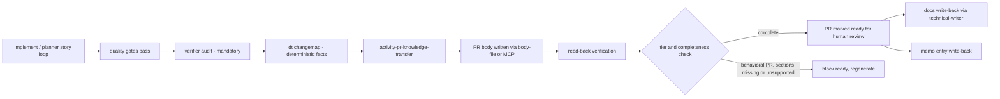
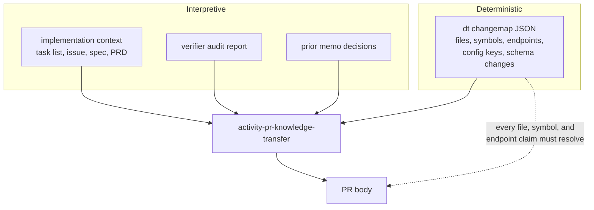
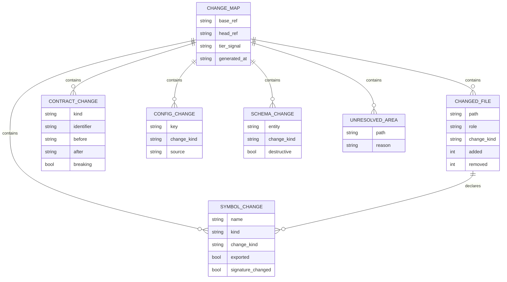

# PRD: PR Knowledge Transfer

## Changelog

| Version | Date       | Summary         | Author           |
| ------- | ---------- | --------------- | ---------------- |
| 1.0     | 2026-08-01 | Initial version | product-engineer |

## Executive Summary

Pull requests in `dev-tasks`-driven repositories today carry a minimal What / Why / How / Testing / Checklist body. That is enough for a reviewer to decide whether to approve a diff, but not enough for a human — or a future agent — to understand the product. Reviewers reconstruct business intent from code, and the reasoning that produced the change evaporates once the branch is merged.

This feature redefines the pull request as the primary knowledge-transfer surface of the workflow. Every behavioral PR body will carry a human-readable explanation of **how** the change works and **why** it exists: the business logic it encodes, the files that hold the meaningful behavior, the key methods and variables, the endpoints and contracts that changed and how they now behave, the invariants and failure modes, and where a reviewer should look first. Factual claims are grounded in a deterministic change map extracted from the diff by the `dt` CLI, so the narrative cannot invent files, symbols, or endpoints. Durable understanding that outlives the PR is written back to repository documentation and the shared memo knowledge base.

## Feature Overview

The feature has four parts:

1. **An expanded PR body contract** owned by `github-ops`, extending the current template with knowledge-transfer sections and a tiered depth policy.
2. **A new skill, `activity-pr-knowledge-transfer`**, that produces the PR body from implementation context plus deterministic facts. It is invoked by `developer` (single-story PRs), `planner` (consolidated integration PRs), and available to `verifier` when auditing a PR body for completeness.
3. **A deterministic change-map extractor** in the `dt` CLI that reports what the diff actually touched — files by role, changed exported symbols, endpoints, config and environment keys, schema and migration changes — as JSON the skill narrates from.
4. **Knowledge write-back**, so confirmed explanations update repository documentation (via `technical-writer`) and the memo knowledge base (via the existing `memo-cli-usage` contract) instead of living only in GitHub history.

The PR body itself is the only new delivery artifact. This feature does not introduce a committed per-PR knowledge document under `/workstream/`; durability is achieved through repository docs and memo entries.

### Where it fits in the existing chain

The verifier audit runs before body generation so its findings — including non-blocking drift — can be reflected in the explanation rather than discovered after the fact.

### Grounding: narrative constrained by facts

## Goals and Objectives

1. Make every behavioral PR explain its own mechanism and business intent well enough that a reviewer unfamiliar with the branch can orient without reading the full diff first.
2. Ground all factual claims about files, symbols, endpoints, and configuration in deterministic extraction so PR bodies do not contain plausible-sounding but false references.
3. Preserve reasoning that is normally lost: chosen approach, rejected alternatives, invariants, and known failure modes.
4. Give reviewers an explicit entry point — what to look at first and which areas carry risk.
5. Keep effort proportional to the change: chore, docs, and dependency PRs must not pay a large-narrative tax.
6. Make insufficient knowledge transfer a blocking condition for behavioral PRs, without turning it into a subjective style debate.
7. Route durable understanding into repository documentation and the memo knowledge base so product comprehension compounds across PRs.
8. Preserve behavioral parity across the Copilot, Claude Code, and Kiro distributions.
9. Keep the contract usable when `dt` or memo is unavailable, degrading to an explicit reduced-confidence state rather than a silent gap.

## Affected Repositories

| Repository            | Role / Impact                                                                                                                                                                                                                                                                                                                               |
| --------------------- | ------------------------------------------------------------------------------------------------------------------------------------------------------------------------------------------------------------------------------------------------------------------------------------------------------------------------------------------- |
| `llipe/dev-tasks`     | Sole primary component. Adds the `activity-pr-knowledge-transfer` skill in all three distribution trees, the `dt changemap` command and its schema, an expanded PR body contract in `github-ops`, invocation wiring in `developer`/`planner`/`verifier` and the `implement` instruction, bundle manifest entries, tests, and documentation. |
| Consumer repositories | Receive the expanded PR body contract and skill on install/update. No consumer code changes required; language-specific extraction fidelity varies by stack.                                                                                                                                                                                |

Scope contains exactly one `primary` component, so no cross-repo partitioning applies (`AGENTS.md` § Cross-Repo Partitioning). No meta-repo files are in scope, so the `architecture-change` task type is not required.

## Target Users

### Primary

- **Human reviewers** who must understand intent and mechanism before approving, and who currently reverse-engineer both from the diff.
- **Developers returning to unfamiliar code**, using merged PRs as the explanation of record for why a behavior exists.
- **Agents** picking up later work in the same area, reading prior PRs as context.

### Secondary

- **New team members** onboarding by reading recent PR history.
- **Product owners** confirming that delivered behavior matches the business rule they asked for.
- **Maintainers** extending the harness to additional languages and stacks.

## User Stories

1. As a reviewer, I want the PR body to explain the mechanism of the change in prose so I can form a mental model before opening the diff.
2. As a reviewer, I want the business rule or product intent behind the change stated explicitly, not implied by the code.
3. As a reviewer, I want a list of the files that actually carry the behavior — separated from incidental churn — so I know where to spend attention.
4. As a reviewer, I want the key methods, functions, and variables that drive the new behavior named and explained.
5. As an API consumer or integrator, I want changed endpoints, events, and interfaces described with their before/after behavior, including status codes and error paths.
6. As a reviewer, I want to know the invariants the change relies on and the failure modes it can produce, so I can probe the risky parts.
7. As a reviewer, I want the alternatives that were considered and rejected, so I do not re-litigate a settled decision in review comments.
8. As a reviewer of a large PR, I want an explicit "start here" pointer and a risk callout rather than a flat file list.
9. As a maintainer merging a dependency bump or docs fix, I want a short-form body so trivial changes stay cheap.
10. As a reviewer, I want to trust that every file, symbol, and endpoint mentioned in the body genuinely exists in the diff.
11. As a product owner, I want new or changed domain terms surfaced so the shared vocabulary stays consistent.
12. As a maintainer, I want the durable parts of the explanation to land in repository docs and the memo knowledge base, so understanding is not buried in merged PR history.
13. As a user on a repository where `dt` extraction cannot resolve a stack, I want an explicit reduced-confidence marker instead of an unverified narrative presented as fact.
14. As a supported-platform user, I want identical PR knowledge behavior on Copilot, Claude Code, and Kiro.

## Functional Requirements

### PR body contract

1. `github-ops` **MUST** own the expanded PR body contract, and it **MUST** remain the single source of truth mirrored identically across `.github/`, `.claude/`, and `.kiro/` trees.
2. The full-tier PR body **MUST** contain the following sections in this order:

   | Section                              | Content                                                                                                                                                                  |
   | ------------------------------------ | ------------------------------------------------------------------------------------------------------------------------------------------------------------------------ |
   | `## What`                            | Summary of the change in reviewer-facing terms.                                                                                                                          |
   | `## Why`                             | Business or product intent, the problem it solves, and the tracker reference (`Closes #<n>` / `Refs #<n>` / `Refs <sha>`).                                               |
   | `## How It Works`                    | Prose walkthrough of the mechanism: entry point, data and control flow, where decisions are made, what state changes.                                                    |
   | `## Business Logic`                  | The rules and policies encoded by the change, stated as rules rather than code paraphrase, including the conditions under which each applies.                            |
   | `## Change Map`                      | Files grouped by role (behavior, contract, config, test, generated/incidental), each with a one-line purpose; key methods, functions, and variables named and explained. |
   | `## Behavior & Contracts`            | Endpoints, events, CLI commands, exit codes, and public interfaces changed, with before → after behavior, inputs, outputs, and error paths.                              |
   | `## Invariants & Failure Modes`      | Assumptions the change depends on, and what breaks (and how it surfaces) when they do not hold.                                                                          |
   | `## Design Decisions & Alternatives` | Chosen approach with rationale, and alternatives considered with reasons for rejection.                                                                                  |
   | `## Reviewer Guide`                  | Ordered "start here" pointers, the highest-risk areas, and what deserves the most scrutiny.                                                                              |
   | `## Domain Terms`                    | New or changed vocabulary, with definitions. Omitted only when no term changed.                                                                                          |
   | `## Testing`                         | How the change was validated, including acceptance-criterion outcomes where available.                                                                                   |
   | `## Docs & Knowledge Impact`         | Documentation updated or required, and memo entries written or proposed.                                                                                                 |
   | `## Checklist`                       | Existing checklist items.                                                                                                                                                |
   | `## Attribution`                     | Existing `Assisted-by:` line.                                                                                                                                            |

3. Every section **MUST** be written for a human reader in plain prose or short lists. Restating the diff, pasting code blocks in place of explanation, or emitting section headings with placeholder text **MUST NOT** be accepted as a completed section.
4. Sections **MUST NOT** contain secret values. Environment variables, credentials, and tokens **MUST** be referenced by key name only.
5. The body **MUST** be written using the existing `github-ops` multi-line body rules (MCP native parameter, or `--body-file`), and the existing mandatory read-back verification **MUST** be applied to the expanded body.
6. A PR body that exceeds GitHub's body size limit **MUST** be truncated by moving the lowest-priority sections (`Domain Terms`, `Design Decisions & Alternatives`, then `Business Logic` detail) into a follow-up PR comment, with an explicit pointer from the body.

### Depth tiers

7. Every PR **MUST** be classified into exactly one tier before body generation:

   | Tier         | Applies to                                                                                                                         | Required sections                                                                         |
   | ------------ | ---------------------------------------------------------------------------------------------------------------------------------- | ----------------------------------------------------------------------------------------- |
   | **Full**     | Behavioral changes touching contracts, endpoints, data model, auth/permissions, or migrations; or any multi-story consolidated PR. | All sections in FR-2.                                                                     |
   | **Standard** | Behavioral changes confined to a module with no contract, schema, or permission impact.                                            | All except `Domain Terms` and `Invariants & Failure Modes`, which become **RECOMMENDED**. |
   | **Short**    | Docs-only, formatting, dependency bumps, CI config, and other non-behavioral changes.                                              | `What`, `Why`, `Change Map` (file list only), `Testing`, `Checklist`, `Attribution`.      |

8. Tier classification **MUST** be derived from the change map (contract/schema/permission/migration signals, file roles, and change breadth), **MUST** be stated explicitly in the PR body or PR metadata, and the rationale **MUST** be recorded.
9. A human **MAY** override the tier upward or downward; an override **MUST** be recorded with its reason. An agent **MUST NOT** downgrade a tier to avoid producing required sections.

### Deterministic change map

10. `dt` **MUST** provide a command that emits a machine-readable change map for a given base and head revision, defaulting to the PR's merge base and branch head.
11. The change map **MUST** report, at minimum: changed files with a role classification; added, removed, and signature-changed exported symbols; endpoints, events, and channels affected; configuration and environment keys added, removed, or renamed; schema, model, and migration changes; and generated-file exclusions.
12. The change map **MUST** reuse the existing extraction providers (OpenAPI, AsyncAPI, ORM) rather than introducing a parallel implementation.
13. The change map **MUST** mark any area it could not analyze with an explicit unresolved indicator, and **MUST NOT** report absence of change where analysis failed.
14. Every file path, symbol name, endpoint, and configuration key asserted in the PR body **MUST** resolve to an entry in the change map. Claims that do not resolve **MUST** be removed or restated as explicitly unverified.
15. When `dt` is unavailable or cannot analyze the stack, the skill **MUST** still produce the narrative sections, **MUST** mark the body with a reduced-confidence indicator, and **MUST** state which grounding was unavailable.
16. The command **MUST** support `--json`, **MUST** use the existing `ExitCode` contract, and **MUST NOT** write to the repository working tree.

### Skill and invocation

17. A new skill, `activity-pr-knowledge-transfer`, **MUST** exist in all three distribution trees with identical content, and **MUST** be registered in `AGENTS.md`, `AGENTS.md.template`, and `bundle-manifest.json`.
18. `developer` **MUST** invoke the skill when opening or updating a PR, after the mandatory `verifier` audit and before marking the PR ready.
19. `planner` **MUST** invoke the skill for its consolidated integration PR, and the resulting body **MUST** explain the feature as a whole rather than concatenating per-story summaries.
20. `verifier` **MUST** be able to evaluate an existing PR body against this contract during Audit Mode and report gaps as findings.
21. The skill **MUST** consume, when available: the task list, the linked issue and its refined scope, the spec and PRD, the `verifier` audit report, prior memo decisions, and the change map.
22. The skill **MUST NOT** merge, push to the default branch, or alter the human-approval gate.

### Enforcement

23. For **Full** and **Standard** tiers, a missing required section, a placeholder section, or an unresolvable factual claim **MUST** block marking the PR ready for review.
24. For the **Short** tier, knowledge-transfer completeness **MUST** be advisory only.
25. The blocking check **MUST** be evaluated against the body actually present on the PR after read-back, not against the draft the agent intended to post.
26. Enforcement **MUST** be expressible in the `implement` instruction and the `verifier` audit; where a platform's hook model cannot hard-block, human PR review **MUST** remain the backstop, consistent with the repository's existing guard posture.
27. Blocking on knowledge-transfer completeness **MUST NOT** be conflated with drift findings, which remain non-blocking and route to `product-engineer`'s `activity-drift-reconciliation`.

### Knowledge write-back

28. After a PR body is accepted, the workflow **MUST** identify explanation content that is durable rather than change-specific — architectural decisions, business rules, contract behavior, domain vocabulary — and **MUST** propose a corresponding repository documentation update.
29. Documentation updates **MUST** be delegated to `technical-writer` and **MUST** target existing docs (`docs/`, `README.md`, `AGENTS.md`, contract docs) rather than creating per-PR knowledge files.
30. When `memo-cli` is available and configured, a memo entry capturing the decision and outcome **MUST** be written per the existing `memo-cli-usage` contract; when unavailable, this step **MUST** be skipped silently.
31. Write-back **MUST** be non-blocking for PR readiness. An unfinished documentation update **MUST** surface as a follow-up issue via `github-ops` rather than holding the PR.
32. `Domain Terms` entries **MUST** be checked against existing project vocabulary, and conflicts **MUST** be reported rather than silently redefined.

## Business Rules

1. Human reviewers retain merge authority. This feature adds explanation, never approval capability.
2. Deterministic facts outrank narrative. Where the change map and the narrative disagree, the change map wins and the narrative is corrected.
3. Absence of evidence is not evidence of absence: unanalyzed areas are reported as unresolved, never as unchanged.
4. Proportionality is a rule, not a preference. Trivial changes get short bodies.
5. Tier downgrade is a human decision. Agents may only classify, and only upward when uncertain.
6. Secret values never enter a PR body, regardless of tier.
7. Generated artifacts (`catalog/components/*.json`, `catalog/index.yaml`, lockfiles, build output) are reported as incidental and excluded from behavioral analysis.
8. The PR is the delivery surface; repository docs are the durable surface. Neither substitutes for the other.

## Data Requirements

The change map is the only new structured entity. It is transient — produced on demand, consumed by the skill, not committed.

Sensitivity: the change map records configuration and environment **key names** only. Values, secrets, and tokens **MUST NOT** be captured or emitted. The schema **MUST** be published under `schemas/` and versioned alongside existing dt schemas.

## Non-Goals (Out of Scope)

1. A committed per-PR knowledge document under `/workstream/`. Explicitly rejected — durability goes to repository docs.
2. Validation evidence, mutation results, and runtime observations attached to PRs. Owned by `prd-evidence-driven-development-loop`. This feature consumes evidence for its `Testing` section but does not define it.
3. Automated code review, defect detection, or approval recommendation.
4. Rewriting bodies of already-merged PRs.
5. A hosted or web-based knowledge browser over PR history.
6. Language-complete symbol analysis for every ecosystem. The first reference profile is TypeScript/JavaScript, with graceful degradation elsewhere.
7. Changes to branch, commit, merge-authority, or drift-reconciliation policy.
8. Non-GitHub forge support.

## Design Considerations

There is no UI surface in this feature: outputs are markdown PR bodies and JSON CLI output, so `/DESIGN.md` tokens and components do not apply and no DESIGN.md update is required.

Presentation guidance for the PR body:

- Lead with the answer. `What` and `Why` must be understandable without scrolling.
- Prose for reasoning, tables and lists for enumerations (files, endpoints, config keys).
- Section order follows reviewer need: intent → mechanism → map → contracts → risk → decisions → where to start.
- Collapsible `
` blocks **MAY** be used for long enumerations, but never for `What`, `Why`, `How It Works`, or `Reviewer Guide`.
- Accessibility: heading hierarchy stays flat (`##` only), tables carry header rows, and no meaning is conveyed by emoji or color alone.

## Technical Considerations

- **Distribution parity.** The skill must land in `.github/skills/`, `.claude/skills/`, and `.kiro/skills/`, with the `github-ops` contract mirrored across `.github/agents/`, `.claude/agents/`, `.kiro/agents/`. `bundle-manifest.json` must declare every new managed path so `install/update/check/list` handle them.
- **CLI placement.** The change-map command joins the existing `dt` command set (`extract`, `catalog`, `ctx`, `scope`, `init`, `verify`, `validate-component`). Command naming is an open question; it must reuse `adapters/cli/parse-args`, the `ExitCode` contract, and existing extraction providers under `core/extract/`.
- **Cost and latency.** Body generation runs once per PR at readiness time, not per commit. The change map must be diff-scoped, not whole-repository, to keep it fast.
- **Degradation.** Missing `dt`, missing `gh`/MCP, missing memo, and unanalyzable stacks each need a defined fallback that produces an explicit reduced-confidence state.
- **Interaction with the verifier audit.** Ordering is fixed: audit first, then body generation, so audit findings inform the explanation.
- **Testing.** Vitest coverage for change-map extraction and tier classification; contract tests asserting three-tree content parity and manifest completeness; fixture-based tests for redaction and unresolved-area reporting.
- **Quality gates.** `test`, `lint`, `format:check`, `typecheck`, `audit` per `AGENTS.md`.

## Acceptance Criteria

1. Given a behavioral PR with contract changes, when the workflow marks it ready, then the body contains every Full-tier section populated with non-placeholder content, and the tier and its rationale are recorded.
2. Given a docs-only PR, when the workflow marks it ready, then the body uses the Short tier and knowledge-transfer completeness is advisory only.
3. Given a PR body asserting a file, symbol, endpoint, or config key absent from the change map, when the completeness check runs, then the PR is blocked from ready with the unresolved claim identified.
4. Given a diff that changes an HTTP endpoint's response contract, when the change map is generated, then the endpoint appears as a contract change with before/after and a breaking-change indicator, and the body describes the new behavior including error paths.
5. Given a diff touching a file the extractor cannot analyze, when the change map is generated, then that path appears as an unresolved area with a reason, and it is not reported as unchanged.
6. Given a diff that adds an environment variable, when the change map and body are produced, then the key name appears and no value is emitted anywhere in either output.
7. Given `dt` is unavailable, when the body is generated, then all narrative sections are still produced, the body carries an explicit reduced-confidence marker naming the missing grounding, and readiness is not silently granted on unverified claims.
8. Given a `planner` multi-story run, when the consolidated integration PR is opened, then the body explains the feature as a whole with a Full-tier body, not a concatenation of per-story summaries.
9. Given a PR body written via MCP or `--body-file`, when read-back verification runs, then every `##` heading starts its own line and checklists render as their own lines; a flattened body is re-edited before proceeding.
10. Given an accepted body containing durable architectural or business-rule content, when write-back runs, then a `technical-writer` documentation update is proposed against existing docs, a memo entry is written when memo is configured, and neither step blocks PR readiness.
11. Given a `Domain Terms` entry conflicting with existing project vocabulary, when write-back runs, then the conflict is reported rather than the term silently redefined.
12. Given the same PR scenario on Copilot, Claude Code, and Kiro, when the workflow runs, then the required sections, tier decision, and blocking behavior are equivalent.
13. Given the skill and CLI command are installed via `dev-tasks.sh install`/`update`, when `check`/`list` run, then all new managed paths are declared in `bundle-manifest.json` and reported correctly.
14. Given an existing PR body that predates this contract, when `verifier` audits it, then gaps are reported as findings without the agent rewriting merged history.

## Success Metrics

- Share of behavioral PRs whose bodies contain all required sections at ready time, trending to 100%.
- Zero unresolvable file, symbol, or endpoint claims in bodies produced under this contract.
- Zero secret values emitted in PR bodies or change maps.
- Reduction in reviewer clarification comments asking "why was this done" or "where does this happen" on PRs authored under the contract.
- Share of Full-tier PRs producing at least one durable docs update or memo entry.
- No measurable increase in PR-ready latency attributable to body generation beyond a single generation pass.
- Short-tier PRs remain short: no growth in body length for docs and dependency changes.

## Assumptions

- GitHub remains the forge; Issues and PRs remain the execution and review record.
- The `verifier` audit already runs before every PR is marked ready and can supply findings as input.
- Agents authoring PRs have access to their own implementation context (task list, issue, spec) at PR time.
- Reviewers will read a well-structured body; the failure today is absent explanation, not reviewer unwillingness.
- TypeScript/JavaScript is an acceptable first reference profile for symbol-level extraction, consistent with existing extraction providers.
- `technical-writer` and `memo-cli-usage` contracts are sufficient for write-back without modification.
- Consumer repositories accept a longer PR body on behavioral changes.

## Constraints & Dependencies

- **Depends on** the existing `github-ops` PR contract, `implement` instruction, `verifier` audit wiring, `technical-writer`, `memo-cli-usage`, and `core/extract/` providers.
- **Adjacent to** `prd-evidence-driven-development-loop`; the `Testing` section must consume its evidence contract rather than redefine it. Section ownership must not overlap.
- Kiro's declarative hook model cannot hard-block reliably; human PR review is the enforcement backstop.
- GitHub PR body size limits constrain Full-tier output and require the documented truncation path.
- Three distribution trees plus `AGENTS.md`, `AGENTS.md.template`, and `bundle-manifest.json` must stay in sync — the dominant maintenance cost of this feature.
- No new runtime dependency should be introduced for diff analysis if `git` plus existing providers suffice.

## Security & Compliance

1. Environment keys, credentials, and tokens are referenced by name only; values **MUST NOT** appear in the change map or PR body.
2. The change-map command **MUST** be read-only against the working tree and **MUST NOT** perform network calls beyond what existing extraction providers already do.
3. Security-relevant changes (auth, permissions, RLS, input validation) touched by a diff **MUST** force the Full tier and **MUST** be called out in `Invariants & Failure Modes` and `Reviewer Guide`.
4. PR bodies are public in public repositories; the contract **MUST NOT** require disclosure of internal infrastructure detail beyond what the diff already reveals.
5. No change to merge authority, branch protection, or the human-approval gate for PRs targeting `main`.
6. Meta-repo files remain out of scope; generated catalog artifacts are never modified by this feature.

## Open Questions

1. **Command naming.** `dt changemap`, `dt explain`, or a subcommand under `dt ctx`? Existing commands are single nouns/verbs, which argues for a top-level `changemap`.
2. **Tier signal authority.** Should tier classification live in the CLI (deterministic, testable) or in the skill (context-aware)? A hybrid — CLI emits signals, skill decides — is the current assumption.
3. **Enforcement mechanism.** Is instruction-level enforcement plus verifier findings sufficient, or should a `dt` subcommand validate a fetched PR body so CI can gate it?
4. **Symbol extraction depth.** Exported-symbol signatures only, or call-graph-adjacent context for "key methods and variables"? Depth drives cost.
5. **Section overlap with the evidence loop.** Does `Testing` stay in this contract, or defer wholly to the evidence PRD's evidence block?
6. **Consumer opt-out.** Should consumer repositories be able to configure a lighter contract, and if so, where does that configuration live?
7. **Retroactive value.** Is there appetite for a one-off pass that generates knowledge docs from recent merged PRs, or is forward-only sufficient?
