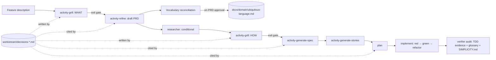
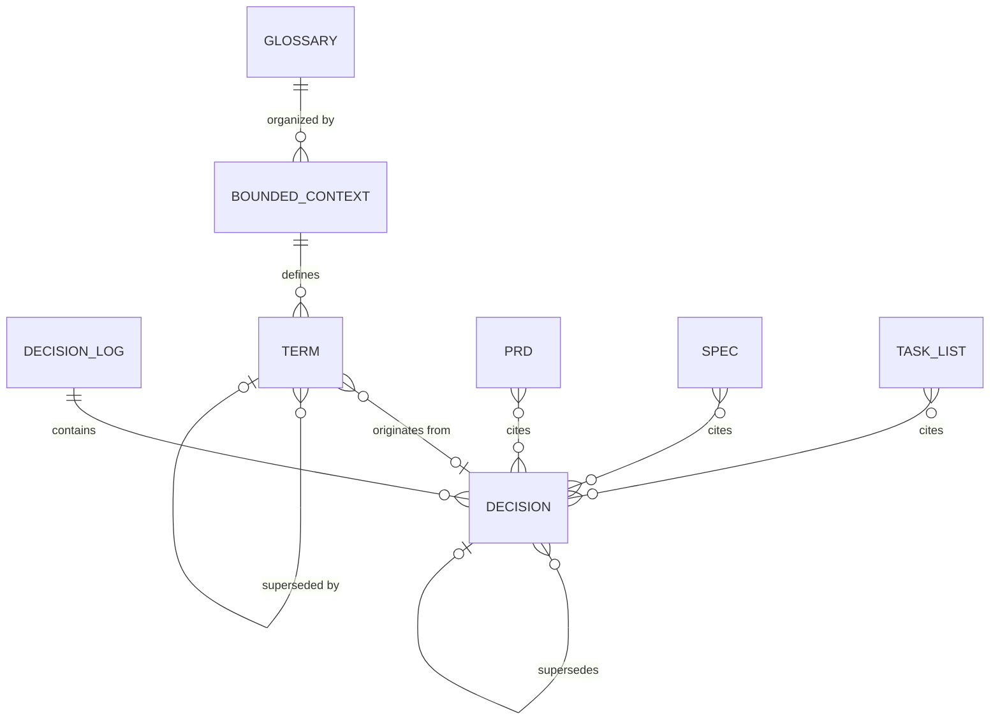

# PRD: Shared-Understanding Refinement, Ubiquitous Language, and TDD Enforcement

## Changelog

| Version | Date       | Summary                                                                                                                                                                                                                                                                                                                                                                                                                                                                                                                                                                 | Author                               |
| ------- | ---------- | ----------------------------------------------------------------------------------------------------------------------------------------------------------------------------------------------------------------------------------------------------------------------------------------------------------------------------------------------------------------------------------------------------------------------------------------------------------------------------------------------------------------------------------------------------------------------- | ------------------------------------ |
| 1.0     | 2026-09-18 | Initial base version                                                                                                                                                                                                                                                                                                                                                                                                                                                                                                                                                    | @llipe / claude                      |
| 1.1     | 2026-09-18 | Analysis and format pass against the repository: aligned drift wording with the verifier and technical-guidelines blocking policy; reconciled `SIMPLICITY.md` delivery semantics with `ROOT_FILES` and ADR-006; added meta-repo `glossary.md` precedence; qualified decision IDs for cross-feature citation; defined "implementation commit"; targeted the PR completion report at the `github-ops` PR Description Template; expanded affected surfaces; added delivery phases; added OQ-06 to OQ-10.                                                                   | product-engineer                     |
| 1.2     | 2026-09-18 | Added simplicity tooling scope: new skill `activity-simplicity-tooling` that makes the `SIMPLICITY.md` thresholds executable under the single `validate` entry point (function length, file length, cyclomatic and cognitive complexity, code smells, duplication, dead code), baseline-and-ratchet adoption, and a CI wiring contract for `infra-engineer` via `deploy-ops` optimized for wall time. FR-35 to FR-44, AC-17 to AC-21, OQ-11 to OQ-13.                                                                                                                   | @llipe / product-engineer            |
| 1.3     | 2026-09-18 | Resolved OQ-10 (one PRD, four milestones) as D-07. Added the `SIMPLICITY.md` structure to Data Requirements (frontmatter, sections A to D) and FR-31a on how agents load it, mirroring the `TESTING.md` mechanism.                                                                                                                                                                                                                                                                                                                                                      | @llipe / product-engineer            |
| 1.4     | 2026-09-18 | Resolved baseline policy as D-08: brownfield keeps a baseline and every PR must leave touched code compliant at function granularity; greenfield enforces from the first commit with no baseline. Rewrote FR-39, added FR-39a and FR-39b, updated AC-18.                                                                                                                                                                                                                                                                                                                | @llipe / product-engineer            |
| 1.5     | 2026-09-18 | `SIMPLICITY.md` content reviewed, fixed, and committed at the repository root (resolves OQ-06 and OQ-11 as D-09; owner `housekeeping`, confirmed at init via FR-31b). Thresholds aligned to 40/400, cognitive complexity added, duplication gate dropped, coverage deferred to `TESTING.md`. New Phase 0 scope: foundation docs renamed to `docs/product.md` and `docs/tech.md`, runbooks under `docs/runbooks/`, `housekeeping` runbook hygiene (FR-44 to FR-51, AC-22 to AC-26, D-10 supersedes D-07).                                                                | @llipe / product-engineer            |
| 1.6     | 2026-09-18 | Retire `dt` and the multi-repo context layer as Phase 0 (D-14, supersedes D-10; phases renumbered 0 to 5). Monorepo awareness added to Phase 1 (D-16). Runbooks redefined around multi-step setup, configuration, and migration work with a trigger rule and examples; `technical-writer` owns `/docs` organization including runbooks (D-15, corrects FR-50/51). Resolved OQ-04 (D-11), OQ-08 (D-12), OQ-09 (D-13); OQ-07 dissolved. Checks move from `core/verify` to `core/checks`.                                                                                  | @llipe / product-engineer            |
| 1.7     | 2026-09-18 | Resolved the remaining open questions: OQ-05 (D-20, ADR-008), OQ-12 (D-17, two-minute CI budget, report-only), OQ-13 (D-18, Python is the second stack profile), OQ-14 (D-21, 90-day staleness window), OQ-15 (D-19, transition proposed on detection through a named `dev-tasks migrate` step, fallback one release cycle). One specification per phase (D-22). Added FR-65 stack profiles and Python monorepo signals. No open questions remain.                                                                                                                      | @llipe / product-engineer            |
| 1.8     | 2026-09-18 | Added Phase 6, Teaching moments (D-23, supersedes D-14's milestone count): `activity-explain-change` producing an illustrated, grounded explainer with a three-question self-check for every behavioral PR; a structured debug-trace contract, a `dev-tasks trace render` view, and a step-gated `/walkthrough` command that narrates one scenario hop by hop; `docs/walkthroughs/` under `technical-writer`. Absorbs the PR knowledge-transfer PRD's Phase 1 MVP (issue #141) and re-grounds its Phase 2 without `dt`. FR-66 to FR-80, AC-33 to AC-40, OQ-16 to OQ-18. | @llipe / product-engineer            |
| 1.9     | 2026-09-18 | Resolved OQ-16 to OQ-18 (D-24 to D-26). No open questions remain. PRD approved for specification; decisions migrated to `workstream/decisions-shared-understanding.md` as the WHAT-phase log required by FR-4.                                                                                                                                                                                                                                                                                                                                                          | @llipe / product-engineer            |
| 1.10    | 2026-09-18 | Deleted the former `prd-pr-knowledge-transfer.md` and the issue #141 refinement, test plan, and traceability matrix (D-27). Their surviving rules are inlined: PR template teaching sections (FR-71), depth tiers (FR-72), knowledge write-back (FR-79). Issue #141 closed as superseded.                                                                                                                                                                                                                                                                               | @llipe / product-engineer            |
| 1.11    | 2026-09-18 | `SIMPLICITY.md` advanced to v1.1: rules A11 (prefer synchronous until latency demands otherwise), A12 (build for the load you have plus one order of magnitude), A13 (security is never speculative), and B6 (make it runnable before you make it complete), folded in from closed issue #148. Extends D-09's content snapshot; recorded as D-39. Section structure A to D is unchanged, so FR-31 stands.                                                                                                                                                               | @llipe / product-engineer            |
| 1.12    | 2026-09-19 | AC-27 reworded. It required `pnpm validate` to pass, but `validate` runs `test`, and the Phase 0 specification records pre-existing environment failures that survive the phase — the PRD contradicted itself. AC-27 now gates `lint`, `typecheck`, and `format:check` clean, and `test` against the named baseline. Found by the verifier in Design Mode.                                                                                                                                                                                                              | verifier / product-engineer          |
| 1.13    | 2026-09-19 | FR-45 corrected: the existing `migrate` command performs detect-and-**apply**, not detect-and-propose — `runMigration()` takes no options and writes the manifest unconditionally. The original wording misdescribed shipped Phase 0 behavior and would have led S-002 to claim a precedent that does not exist. `migrate docs` is the first sub-verb to propose by default; the legacy path is left unchanged deliberately (`shared-understanding#D-52`).                                                                                                              | verifier / @llipe / product-engineer |
| 1.14    | 2026-09-21 | AC-07 and FR-23 reworded to their testable forms after Phase 3 Design Mode (A-1, A-2): AC-07 is a structural `## Vocabulary` check, terms identified in grilling not by prose scanning (D-65); FR-23 reports forbidden-synonym matches only, unmatched identifiers are not findings (D-64), report-only in the first release (D-63, resolves OQ-03). Recorded as `shared-understanding#D-70` with an explicit human confirmation.                                                                                                                                       | verifier / @llipe / product-engineer |

## Executive Summary

`dev-tasks` produces PRDs and specifications through a short list of clarifying questions, then hands the result to planning and implementation. In practice, the agent and the human frequently proceed with different mental models of _what_ is being built and _how_, and the gap surfaces only during verification, when it is expensive. Vocabulary drifts between documents and code, and test-first implementation is stated as a preference (`docs/technical-guidelines.md` § Test-first execution) but is not verifiable after the fact.

This feature closes the gap in four connected moves. First, refinement and specification become a **relentless, one-question-at-a-time interview** (`activity-grill`) that ends only on explicit shared understanding, with every resolved decision recorded and cited downstream. Second, the project gains a **permanent ubiquitous language** (`docs/domain/ubiquitous-language.md`) organized by bounded context; PRDs, specs, and code MUST use its terms. Third, **test-driven development becomes verifiable** through commit-order evidence rather than prose. Fourth, the code simplicity rules become a **root canonical contract** (`SIMPLICITY.md`) alongside `DESIGN.md` and `TESTING.md`, referenced by spec, plan, implement, and verify, and made **executable** by validation tooling (function length, file length, complexity, code smells) that runs under the one `validate` command locally and in CI.

Issue Mode stays lightweight: it builds on existing vocabulary and existing decisions, so it grills with a small cap and consults the glossary without extending it. Feature Mode runs the full process.

Two preparatory moves come first. Phase 0 retires the `dt` binary and the multi-repo context layer, which is unused and accounts for about ninety percent of the code (D-14). Phase 1 simplifies the documentation foundation every later phase names: `product-context.md` becomes `docs/product.md`, `technical-guidelines.md` becomes `docs/tech.md`, multi-step procedures gain a home in `docs/runbooks/`, `technical-writer` keeps `/docs` organized on every run, and agents learn the shape of the repository they are in, single-package or monorepo, since monorepos are the shape in actual use.

A closing move (Phase 6) turns the workflow into a teacher. Every behavioral pull request ships an illustrated explainer that shows a worked example, explains the mechanism in prose and why it was built that way, and ends with three simple questions the reader can test themselves on. A structured debug trace and a step-gated walkthrough let the reader open the hood on a running scenario: what happened, when, in which file, hop by hop across the packages of a monorepo.

## Feature Overview

Current Feature Mode sequence (`product-engineer`):

```text
refine → [researcher] → generate-spec → generate-stories → publish-github → plan → implement → verify
```

Extended sequence (Feature Mode). The diagram shows where the two grilling phases sit, where the decision log is written and cited, and where the glossary is extended:



Issue Mode:

```text
[researcher] → activity-refine (activity-grill: cap 8, glossary read-only, reuse prior decisions) → plan → implement → verify
```

Three artifacts are new: the decision log per feature, the ubiquitous language document, and the simplicity contract. Two skills are new: `activity-grill` and `activity-simplicity-tooling`. The surfaces that change are listed in Affected Repositories.

### Delivery phases

The four moves are separable and have different dependencies. Stories **SHOULD** be grouped into milestones in this order:

| Phase | Scope                                                                                                                                                                                                                                                                               | Depends on                                                                                                                                                          |
| ----- | ----------------------------------------------------------------------------------------------------------------------------------------------------------------------------------------------------------------------------------------------------------------------------------- | ------------------------------------------------------------------------------------------------------------------------------------------------------------------- |
| 0     | Retire `dt`: binary, `core/{catalog,context,extract,scope,verify,providers}`, `adapters/cli`, schemas, meta-repo templates, 21 prompt branches, `AGENTS.md` meta-repo rules, `dt` docs; ADR and CHANGELOG; restore path is the last release tag                                     | Nothing. Runs first so the docs rename in Phase 1 never touches files scheduled for deletion.                                                                       |
| 1     | Docs foundation and repository shape: rename `product-context.md` → `docs/product.md` and `technical-guidelines.md` → `docs/tech.md` with a one-release fallback; `docs/runbooks/`; `technical-writer` docs hygiene under `lint`; monorepo detection and package map in `tech.md`   | Phase 0. Every new skill in Phases 2 to 5 names these documents.                                                                                                    |
| 2     | `activity-grill`, decision log, refine/spec/plan integration                                                                                                                                                                                                                        | `researcher` (ADR-004). No other dependency.                                                                                                                        |
| 3     | Ubiquitous language file, install-if-absent delivery, glossary lint                                                                                                                                                                                                                 | Phase 2 (terms enter through grilling). Bounded contexts map to the Phase 1 package map.                                                                            |
| 4     | `SIMPLICITY.md` contract, spec/plan/implement/verifier references, `activity-simplicity-tooling` (thresholds under `validate`, baseline-and-ratchet, CI wiring via `infra-engineer`, affected-package scoping in monorepos)                                                         | `SIMPLICITY.md` committed (D-09). Delivery semantics (D-12). CI budget (OQ-12).                                                                                     |
| 5     | TDD commit-order evidence, refactor invariance, PR completion report                                                                                                                                                                                                                | Evidence-driven loop blocking policy (`docs/technical-guidelines.md` § Blocking policy, `docs/tech.md` after Phase 1).                                              |
| 6     | Teaching moments: `activity-explain-change` (illustrated explainer, worked example, mechanism prose, three-question self-check, grounded in a `git`-derived change map), debug-trace contract and `dev-tasks trace render`, step-gated `/walkthrough` command, `docs/walkthroughs/` | Phase 0 (change map without `dt`), Phase 1 (package map, docs hygiene), Phase 2 (decision log supplies the "why"). Supersedes the former PR knowledge-transfer PRD. |

Phase 0 is a deletion with an ADR. Phase 1 runs before the feature phases so the new skills are written once against the new names and the repository-shape model. Phase 2 delivers most of the feature value on its own. Each phase gets its own technical specification, story set, and milestone (D-22); the next artifact after this PRD is `workstream/specification-shared-understanding-phase-0.md`.

## Goals and Objectives

1. Eliminate the class of verification failures caused by divergent understanding of intent between human and agent.
2. Make every design decision that shaped a PRD or spec traceable to a question, an answer, and an author.
3. Guarantee that documents and code share one vocabulary per bounded context, and that the vocabulary is durable across features.
4. Make test-first implementation a verifiable fact in the commit history, not a stated intention.
5. Install code simplicity as a contract enforced at spec, plan, implement, and verify, with the burden of proof on adding.
6. Give the documentation foundation short, stable names and a home for operational procedures, and keep that home organized without human attention.
7. Remove the unused multi-repo context layer so the repository is the product actually in use: an installer plus prompts, contracts, and small deterministic checks.
8. Make agents competent in monorepos, the repository shape in actual use, instead of the multi-repo shape they were built for.
9. Make the measurable simplicity rules machine-checked by one command, `validate`, that runs identically on a developer machine and in CI, with CI wall time treated as a design constraint.
10. Make every merged change and every running scenario a lesson: an explainer the reader can test themselves on, and a trace the reader can walk through hop by hop.

## Affected Repositories

| Repository        | Role / Impact                                                                                                                                                                                                                                                                                                                                                                                                                                                                                                                                                                                                                                                                                                                                                                                                                                                                                                                                                                                                                                                                                                                                                                                                                                                                                                               |
| ----------------- | --------------------------------------------------------------------------------------------------------------------------------------------------------------------------------------------------------------------------------------------------------------------------------------------------------------------------------------------------------------------------------------------------------------------------------------------------------------------------------------------------------------------------------------------------------------------------------------------------------------------------------------------------------------------------------------------------------------------------------------------------------------------------------------------------------------------------------------------------------------------------------------------------------------------------------------------------------------------------------------------------------------------------------------------------------------------------------------------------------------------------------------------------------------------------------------------------------------------------------------------------------------------------------------------------------------------------- |
| `llipe/dev-tasks` | Source. New skills `activity-grill` and `activity-simplicity-tooling` (three platform trees). New CI workflow template `templates/workflows/validate.yml` documented in `deploy-ops`. Rename of the two foundation docs across every tree that names them (69 files today, including `activity-init`, all agents, commands, steering, tests, and ADRs). New `docs/runbooks/` with index, template, and a structure check; `housekeeping` and `technical-writer` agent changes for runbook ownership. Changes to `activity-refine`, `activity-generate-spec`, `plan`, `implement` (skill, Copilot instruction, Kiro steering), and the `product-engineer`, `developer`, `verifier`, and `github-ops` agents in all platform trees. Removal of `bin/dt.ts`, `adapters/cli` (except `parse-args.ts`), `core/{catalog,context,extract,scope,verify,providers}`, `schemas/`, `templates/meta-repo/`, `dt` fixtures and tests, `dt` docs, and 21 prompt branches. New `core/checks` module (commit-order pairing, glossary conformance, docs structure). `core/distribution` registry and `bundle-manifest.json` changes for two new consumer-owned files. New root contract `SIMPLICITY.md`. Docs: `AGENTS.md` Contracts table, `README.md` install section, `docs/workflow-chains.md`, `docs/artifact-formats.md`, `docs/adr/`. |
| Consumer repos    | Target. Receive `SIMPLICITY.md`, the `docs/domain/ubiquitous-language.md` scaffold, and updated skills, agents, and instructions on `install` and `update`. Through an approved task, receive lint policy configuration, a violation baseline, and a `validate.yml` CI workflow delivered by `infra-engineer` as a draft PR. Receive the debug-trace logger contract, `docs/walkthroughs/`, and explainers on their pull requests.                                                                                                                                                                                                                                                                                                                                                                                                                                                                                                                                                                                                                                                                                                                                                                                                                                                                                          |

The draft's "four existing skills change" undercounts the surface. Because `implement` is executed by `developer`, `verifier` runs the checks, `github-ops` owns the PR body, and `product-engineer` is the invoker, all four agents change in `.github/agents/`, `.claude/agents/` or `.claude/commands/`, and `.kiro/agents/`.

## Target Users

### Primary

- The developer running `product-engineer` in Feature or Issue Mode, who needs confidence that the agent understood the request before anything is built.

### Secondary

- Implementing and verifying agents (`developer`, `planner`, `verifier`), which consume the decision log, glossary, and simplicity contract as authoritative inputs.
- Future readers of PRDs and specs, who need to know why a decision was made without re-deriving it.

## User Stories

1. As a developer, I want the agent to interview me one question at a time with a recommended answer, so that I can resolve each branch of the design before the next one opens.
2. As a developer, I want the interview to explore the codebase instead of asking me things the code already answers, so that my turns are spent on genuine decisions.
3. As a developer, I want every answer recorded with an ID, so that the spec, plan, and PR can cite `D-07` instead of restating or reinterpreting it.
4. As a developer, I want a permanent glossary per bounded context, so that "order", "shipment", and "fulfillment" mean one thing across documents and code.
5. As a developer, I want new terms proposed in a PRD to be resolved during grilling and appended to the glossary, so that vocabulary grows deliberately.
6. As a verifier agent, I want commit-order evidence that a failing test preceded each implementation increment, so that TDD compliance is a check, not a claim.
7. As a verifier agent, I want the simplicity contract as an explicit input, so that I can reject over-built changes on stated grounds.
8. As a developer working a single issue, I want a short interview capped at a few questions, so that small changes stay small.
9. As a planner orchestrating several stories, I want the decision log passed to each `developer` delegation, so that no story re-derives a decision another story already settled.
10. As a developer, I want one command, `validate`, to check function length, file length, complexity, and code smells against the thresholds in `SIMPLICITY.md`, so that the simplicity contract is a test I can run, not a review opinion.
11. As an infra engineer, I want the same `validate` command wired into CI with caching and change scoping, so that the policy gate adds seconds, not minutes, to every pull request.
12. As a maintainer adopting the tooling on an existing codebase, I want existing violations captured in a baseline that only ratchets down, so that adoption does not require a rewrite before the first green run.
13. As a developer, I want the foundation docs called `product.md` and `tech.md`, so that every agent, prompt, and human refers to the same two short names.
14. As an operator, I want every script and workflow to have a runbook I can find from one index, so that a release, rollback, or hook failure at 2 a.m. has a written procedure.
15. As a maintainer, I want `technical-writer` to flag a runbook that is orphaned, malformed, or stale on every run, so that the runbook set does not rot between incidents.
16. As a developer working in a monorepo, I want init to record which packages exist and what each is for, so that research, tasks, commits, and glossary contexts are scoped to a package instead of the whole tree.
17. As the maintainer of `dev-tasks`, I want the unused `dt` layer gone with a written restore path, so that the code I maintain is the code I use.
18. As a developer reviewing a pull request, I want an explainer that shows me a worked example and tells me why the code works the way it does, not a list of files, so that I understand the change instead of skimming the diff.
19. As a developer, I want three simple questions at the end of every explainer, so that I can check whether I actually understood the change before I approve it.
20. As a developer learning a codebase, I want to run one scenario with the hood open and see what happened, when, and in which file, hop by hop across packages, so that the system becomes a place I can navigate rather than a pile of files.
21. As a developer, I want the walkthrough to pause at every hop and let me ask, so that I learn at my pace the way `infra-engineer` applies changes one step at a time.

## Functional Requirements

### Grilling (`activity-grill`)

1. The skill **MUST** ask exactly one question per turn and **MUST** attach a recommended answer to each question.
2. The skill **MUST** walk the design tree depth-first: a branch is resolved before another branch is opened, and dependencies between decisions are stated explicitly.
3. Before asking a question, the skill **MUST** determine whether the codebase, existing documents, prior decision logs, or the glossary can answer it. If so, it **MUST** read directly (single-file lookups) or delegate to `researcher` (multi-slice questions, at most once per phase, per ADR-004's bounded-artifact rule) and **MUST NOT** ask the user.
4. Every resolved question **MUST** be appended to `workstream/decisions-<feature>.md` as one row carrying: ID (`D-NN`, unique within the file), phase, branch, question, recommended answer, answer, whether the recommendation was accepted, author, date, and the ID it supersedes (if any).
5. A decision cited outside its own log (another feature's PRD, an Issue Mode refinement, a glossary origin) **MUST** use the qualified form `<feature>#D-NN` so the reference stays unambiguous when every log restarts at `D-01`.
6. The skill **MUST** maintain an open-questions list and **MUST** present the decision-tree summary every 10 questions, on reaching the cap, and at the exit gate.
7. When invoked from Feature Mode the skill **MUST** run in two phases: **WHAT** (before drafting the PRD) and **HOW** (before drafting the spec). Each phase has its own exit gate.
8. The exit gate for a phase is satisfied only when the open-questions list is empty **and** the user states shared understanding explicitly. The skill **MUST NOT** infer agreement from silence or from a positive tone.
9. A question cap **MUST** exist and **MUST** be configurable. Defaults: 25 per phase in Feature Mode (WHAT and HOW each), 8 total in Issue Mode. On reaching the cap, the skill **MUST** present the open list and ask whether to continue or stop.
10. In Issue Mode the skill **MUST** treat the glossary as read-only and **MUST** scope questions to what the issue changes relative to existing behavior.
11. The skill **SHOULD** remind the user, at least once per phase, that accepting every recommendation reproduces the agent's assumptions instead of testing them.

### Refinement, specification, and planning integration

12. `activity-refine` in PRD Creation mode **MUST** invoke `activity-grill` (WHAT phase) before drafting and **MUST NOT** draft until the phase's exit gate is satisfied.
13. `activity-generate-spec` **MUST** invoke `activity-grill` (HOW phase) before drafting and **MUST NOT** draft until the phase's exit gate is satisfied. The conditional `researcher` step (ADR-004) runs before the HOW phase so that its artifact is available to answer HOW questions.
14. PRDs and specs **MUST** cite decision IDs inline where a decision shaped a requirement or a design choice, and **MUST** include a "Decisions" section listing the IDs consumed.
15. `activity-refine` in Issue Refinement mode **MUST** invoke `activity-grill` with the Issue Mode cap and **MUST** reuse existing decisions from prior `decisions-*.md` files when the issue touches the same area, citing them in qualified form.
16. `plan` **MUST** cite the decision IDs a task derives from, and `implement` **MUST** read the feature's decision log before starting work. `planner` **MUST** pass the decision log path to each `developer` delegation.

### Ubiquitous language

17. A permanent file `docs/domain/ubiquitous-language.md` **MUST** exist in every repository where `dev-tasks` is installed. `install` and `update` **MUST** scaffold it if absent and **MUST NOT** overwrite it once present, on every profile (install-if-absent, platform-agnostic; see Technical Considerations).
18. The file **MUST** be organized by bounded context. Each term entry **MUST** contain: term, definition, bounded context, forbidden synonyms, invariants, origin (the document or qualified decision ID where it was introduced), and status.
19. The file **MUST** carry a changelog and **MUST** be append-only for terms: a term is never deleted; a superseded term is marked with its replacement and the decision ID.
20. PRDs and specs **MUST** use only glossary terms for domain concepts, or **MUST** propose additions in a "Vocabulary" section. Proposed additions **MUST** be resolved during grilling (WHAT phase) and **MUST** be appended to the glossary when the PRD is approved, not when it is drafted.
21. When a proposed term conflicts with an existing term or with a forbidden synonym, the grilling **MUST** surface the conflict as a question and **MUST NOT** resolve it silently.
22. Retired in v1.6 (D-14): the meta-repo `glossary.md` no longer exists once `dt` is removed. One glossary per repository at `docs/domain/ubiquitous-language.md`; in a monorepo its bounded contexts map to the package map (FR-63).
23. The verifier **MUST** extract new exported identifiers from a pull request's diff (types, classes, modules, public functions), split them into words, and **MUST** report any identifier — whole or by word — that matches a forbidden synonym of a glossary term. An identifier that matches no glossary term is not a finding: most exports are not domain concepts (`shared-understanding#D-64`). The check is report-only in the first release (`shared-understanding#D-63`, resolves OQ-03). An earlier revision required identifiers to "match glossary terms", which is untestable as written; corrected per `shared-understanding#D-70`.

### TDD enforcement

24. `implement` **MUST** execute each behavioral increment as red → green → refactor: a failing test committed first (`test:` type), the minimal implementation that makes it pass committed second, and any structural cleanup committed third with a `refactor:` type.
25. The failing-test commit **MUST** be verifiable as failing: the commit body **MUST** record the test command and a one-line failing summary, and the PR body **MUST** aggregate them per increment.
26. An **implementation commit** is a commit of type `feat`, `fix`, or `perf` that touches non-test source paths. Commits of type `docs`, `chore`, `ci`, `build`, `test`, and `refactor` are not implementation commits and require no preceding test commit.
27. The verifier **MUST** validate commit-order evidence on the feature branch: for each implementation commit, a test commit touching the same behavior (path overlap and story ID) **MUST** precede it. A missing pairing **MUST** be recorded as drift with impact `Major` and intent `Unintended`; whether it blocks PR readiness follows the drift blocking policy in `docs/technical-guidelines.md` (`docs/tech.md` after Phase 1), not a rule local to this feature.
28. A `refactor:` commit **MUST NOT** change behavior; the verifier **MUST** confirm that the changed-package test result (pass/fail set) is identical immediately before and after the commit, and report a difference as drift with impact `Major`.
29. Acceptance criteria in the PRD **MUST** map to at least one test written before its implementation. The traceability matrix (`verifier` Design Mode) **MUST** record the test commit hash per criterion once implementation exists.

### Simplicity contract

30. `SIMPLICITY.md` **MUST** be a root canonical contract delivered on every profile (unconditionally with respect to platform and UI scope), registered in `AGENTS.md` § Contracts and in `bundle-manifest.json` `consumer_owned_paths`, with the same ownership as `DESIGN.md` and `TESTING.md`. Its install-time overwrite semantics are decided in OQ-08.
31. The content of `SIMPLICITY.md` is committed at the repository root as of v1.5 of this PRD (D-09); Phase 4 wires its delivery to consumers. It **MUST** carry the same frontmatter as `TESTING.md` (`version`, `name`, `description`, `status`, `owner`) and **MUST** contain at minimum: (A) decision rules for adding code, abstractions, and dependencies, with the burden of proof on adding; (B) prohibitions; (C) the PR completion report format; (D) measurable thresholds and the CI budget. See Data Requirements for the structure.
    31a. Agents discover `SIMPLICITY.md` the way they discover `TESTING.md`: it is listed in `AGENTS.md` § Contracts (always-on context on Claude through the `CLAUDE.md` import, on Copilot through the agent files, on Kiro through steering), and every consuming skill or agent names it explicitly as a required input in its own body. A `status: unfilled` placeholder **MUST** be treated as "no simplicity standard established", never as permission, mirroring the `TESTING.md` rule.
    31b. `activity-init` **MUST** confirm `SIMPLICITY.md` with the user at init: owner (default `housekeeping`), status, and the section D thresholds, which the consumer **MAY** tighten and **MUST NOT** loosen. Init **MUST NOT** rewrite sections A to C; those are the global rules. The confirmation is recorded in the init output.
32. `activity-generate-spec`, `plan`, `implement`, and `verifier` **MUST** reference `SIMPLICITY.md` as an input and **MUST** apply its decision rules.
33. The `github-ops` PR Description Template **MUST** gain a `## Completion Report` section carrying the report defined in `SIMPLICITY.md` section C ("what I did not add", "what I noticed and did not touch", justifications, unverified rules). `implement` **MUST** fill it when the PR is opened and update it before the PR is marked ready.
34. The verifier **MUST** treat an empty "what I did not add" section on a non-trivial change (an implementation commit is present) as a finding requiring explanation.

### Simplicity tooling and CI (`activity-simplicity-tooling`)

35. A skill `activity-simplicity-tooling` **MUST** exist. It sets up, and later re-validates, the tooling that enforces the measurable rules in `SIMPLICITY.md`. Its consumers are `housekeeping` (setup and maintenance) and `infra-engineer` (CI wiring through `deploy-ops`). It **MAY** be recommended by `activity-init` and **MUST** be recommended when Phase 4 is adopted in a repository.
36. The skill **MUST** cover every row of `SIMPLICITY.md` section D: function length, file length, cyclomatic complexity, cognitive complexity, parameter count, nesting depth, dead code (unused exports, unused dependencies), forbidden imports (core → infra), commented-out code, and formatting. Duplication is deliberately not a category (A1 allows two copies). Coverage thresholds belong to `TESTING.md` and are out of this skill's scope. A category with no available checker for the detected stack **MUST** be reported as `unavailable`, never silently dropped.
37. The single entry point **MUST** be the existing canonical `validate` script for JS/TS repositories (`pnpm validate`) and `make validate` for other stacks. The policy checks **MUST** run inside the existing `lint` step so that `validate` picks them up unchanged; the skill **MUST NOT** introduce a second top-level entry point or a parallel command that developers could run instead of `validate`.
38. Thresholds **MUST** come from `SIMPLICITY.md`, which ships defaults (OQ-11). A consumer **MAY** tighten a threshold in its own copy and **MUST NOT** loosen one below the shipped default; the tooling configuration **MUST** be derivable from the contract, and the skill **MUST** report a mismatch between the contract and the configuration as a defect.
39. Adoption on an existing codebase (brownfield) **MUST** follow baseline-and-ratchet: on first run the skill records existing violations in a committed baseline file, and the baseline **MUST** only shrink. The rest of the codebase may stay non-compliant; the gate judges the change, not the repository.
    39a. On a pull request the gate **MUST** require that the change improves what it touches: every function the PR modifies or adds **MUST** be under every threshold after the PR, whether or not it was in the baseline, and no new violation may appear anywhere in the diff. Functions the PR does not touch stay in the baseline and are not judged. File-length violations are the exception: a touched file over the file-length threshold **MUST NOT** grow, and its entry stays in the baseline until the file shrinks under the threshold. A PR that grows the baseline **MUST** fail `validate`; a PR that brings a touched function under threshold **MUST** remove its baseline entry in the same PR.
    39b. On a new codebase (greenfield, detected at setup as zero violations) the skill **MUST NOT** create a baseline file; every threshold is enforced from the first commit and every violation fails `validate`.
40. The skill **MUST NOT** install or upgrade dependencies itself. It produces the configuration, the baseline, and an implementation task; dependency installation runs through an approved task with the consumer's package manager, consistent with `housekeeping`'s dependency rule and the evidence-driven loop's FR-38.
41. `infra-engineer`, via `deploy-ops`, **MUST** wire `validate` into CI as a recorded change delivered by draft PR, using a new `templates/workflows/validate.yml` template. The workflow **MUST** call the same `validate` command a developer runs locally; no policy logic lives in the workflow.
42. The CI wiring **MUST** be optimized for wall time: dependency-store caching, linter and type-checker caches persisted between runs, changed-file scoping for lint, duplication, and dead-code checks on pull requests with a full run on the default branch, independent checks run in parallel, static checks ordered before the test job, and fail-fast enabled. The template **MUST** document each optimization and the condition under which it is safe.
43. The skill **MUST** record the measured `validate` wall time locally and in CI at setup and on each re-validation, and **MUST** report a regression beyond the consumer's budget (OQ-12) as a finding. The `verifier` **MUST** read the `validate` result as an existing quality gate; a policy violation is a failed gate, not a new drift category.

### Docs foundation and runbooks (Phase 1)

44. The foundation documents **MUST** be renamed: `docs/product-context.md` becomes `docs/product.md` and `docs/technical-guidelines.md` becomes `docs/tech.md`. `activity-init` **MUST** create the new names, and every agent, command, skill, instruction, steering file, test, and document in `dev-tasks` **MUST** reference the new names only.
45. Consumer repositories are external consumers of these names (`SIMPLICITY.md` A10). The transition is proposed, not assumed: when `doctor`, `update`, or an agent at session start detects the old names, it **MUST** propose the named migration step `dev-tasks migrate docs`, which renames both files with content unchanged and lists the consumer-owned references (`CLAUDE.md`, `AGENTS.md`, custom prompts) that still point at the old names. This extends the existing `migrate` command (`core/distribution/migrate.ts`), which today performs detect-and-**apply** for legacy installs: `runMigration()` takes no options and writes the manifest unconditionally once a legacy install is detected. An earlier revision of this requirement described it as detect-and-propose, which was wrong (corrected per `shared-understanding#D-52`). `migrate docs` is therefore the first sub-verb to propose by default, and the legacy path is deliberately left as-is — adding a dry-run to it would change a shipped command's default behavior. Agents **MUST** resolve the old names as a fallback for one release cycle; after the window the fallback is deleted and the proposal is the only path. `update` **MUST NOT** rename consumer-owned files on its own.
46. The rename **MUST** land as a behavior-preserving `refactor:` commit with the content unchanged (`SIMPLICITY.md` B1). Simplifying the content of either document is a separate change: the `activity-init` templates for both **SHOULD** be trimmed to the sections agents consume, and this repository's own copies **MAY** follow in a later commit.
47. `docs/runbooks/` **MUST** exist in this repository and in every consumer where `dev-tasks` is installed. A runbook captures a multi-step procedure that is worth repeating: setup, configuration, migration, release, rollback, recovery, troubleshooting. One file per procedure named `runbook-<verb>-<object>.md`, plus `docs/runbooks/README.md` as the index. `install` scaffolds the directory, the index, and a template with install-if-absent semantics. The initial set for this repository: `runbook-install-dev-tasks`, `runbook-configure-branch-protection`, `runbook-setup-simplicity-tooling`, `runbook-migrate-foundation-docs`, `runbook-release-npm`, `runbook-rollback-deploy`, `runbook-troubleshoot-hooks`, `runbook-setup-supabase-local`, `runbook-retire-dt`.
48. Every runbook **MUST** carry frontmatter: `name`, `trigger` (when to run it), `owner`, `last_verified` (date), and `related` (the scripts, workflows, or commands it covers). The body **MUST** follow a fixed shape: preconditions, steps, verification, rollback, escalation.
49. Two triggers create or update a runbook. (a) Coverage: every script under `templates/scripts/`, every workflow under `templates/workflows/` and `.github/workflows/`, and every `infra-engineer` change kind **MUST** have one, delivered in the same draft PR as the script or workflow. (b) Procedure: any agent that completes a multi-step procedure (three or more steps touching configuration, environment, tooling, credentials, or data) that is plausibly repeated **MUST** leave or update a runbook in the same PR: `infra-engineer` for platform changes, `developer` for setup and migration tasks, `qa-engineer` for test-harness setup, `housekeeping` for tooling setup through `activity-simplicity-tooling`. The verifier **MUST** report a finding when a PR whose task list contains setup, configuration, or migration steps adds or updates no runbook.
50. `technical-writer` **MUST** keep `/docs` consistent and organized on every run, runbooks included: `docs/README.md` and `docs/runbooks/README.md` in sync with the files on disk, frontmatter present and valid, naming conventions respected, no `related` entry pointing at a script or workflow that no longer exists, and `last_verified` older than the staleness window (default 90 days, OQ-14) reported as stale. A deterministic structure check in `core/checks` **MUST** fail on the first four conditions and **MUST** run under `lint`, so `validate` covers it.
51. Ownership: `technical-writer` owns both structure and content of `/docs`, runbooks included. `housekeeping` keeps its current scope (lint, types, test wiring) and does not organize documentation. A docs-structure failure in `validate` routes to `technical-writer`.

### Platform parity

52. `activity-grill`, `activity-simplicity-tooling`, the changed skills, the changed agents, and the two new consumer-owned files **MUST** ship with equivalent behavior in the Copilot (`.github/`), Claude Code (`.claude/`), and Kiro (`.kiro/`) trees. Kiro **MUST** receive a steering pointer to `SIMPLICITY.md` in the same shape as `git-guard-notice.md`.

### Retire `dt` (Phase 0)

53. The `dt` binary and the multi-repo context layer **MUST** be removed: `bin/dt.ts`, every file under `adapters/cli/` except `parse-args.ts`, `core/catalog`, `core/context`, `core/extract`, `core/scope`, `core/verify`, `core/providers`, `schemas/`, `templates/meta-repo/`, the `dt`-only tests and fixtures (`test/fixtures/{catalog,context,extract,schemas,verify}`), the `dt` entry in `package.json` `bin`, and the `pg` peer dependency. `ajv` and `yaml` are removed when no remaining module imports them.
54. Every `dt` branch **MUST** be removed from the prompt trees: `activity-init` multi-repo mode and `component.json` detection (RF-60), `dt context` in `activity-codebase-research` and `researcher`, `dt init --task` and `dt scope gate` in `product-engineer`, `dt verify` in `qa-engineer`, and the `activity-contract-validation` skill in full. The `AGENTS.md` blocks that exist only for the meta-repo **MUST** go: Task Types / `architecture-change` (RF-62, RF-64) and Cross-Repo Partitioning (RF-63).
55. Documentation **MUST** follow: delete `docs/dt-user-manual.md`, `docs/data-model.md`, and `docs/artifact-formats.md`; strip the `dt` sections from `README.md`, `docs/system-overview.md`, and `docs/workflow-chains.md`; rewrite Current State and Roadmap in the product context to describe the product in use; remove the Contract-validation layer from `TESTING.md`. ADR-001 and ADR-002 stay as history and are marked Superseded by the retirement ADR.
56. The retirement **MUST** be recorded as ADR-007 with Context, Decision, Alternatives considered (keep, freeze, split to its own repository, remove), Consequences, and the restore path (the last release tag that ships `dt`), and in `CHANGELOG.md` as a minor pre-1.0 release naming every removed command.
57. The deterministic checks this PRD adds (commit-order pairing, refactor invariance, glossary conformance, docs structure) **MUST** live in a new `core/checks` module invoked by the verifier and by `lint`; `core/verify` is not reused.
58. Phase 0 **MUST** land before Phase 1, so the foundation-docs rename never edits a file scheduled for deletion.

### Repository shape: single-package and monorepo (Phase 1)

59. Terminology: a **single-package repository** has one buildable unit at the root; a **monorepo** has several packages under one workspace. "Multi-repo" is retired with `dt`. Detection signals: `pnpm-workspace.yaml`, `workspaces` in `package.json`, `turbo.json`, `nx.json`, `lerna.json`; for Python, `[tool.uv.workspace]` in `pyproject.toml`. Other ecosystems are added with their stack profile (FR-65).
60. `activity-init` **MUST** detect the shape and record a package map in `docs/tech.md`: package name, path, purpose, owner, canonical scripts present, and the bounded context it belongs to. `doctor` **MUST** warn when the package map and the workspace disagree.
61. In a monorepo the canonical scripts at the root **MUST** fan out to every package, and `validate` at the root stays the single entry point (FR-37). The CI template (FR-41, FR-42) **MUST** scope lint, typecheck, and tests to affected packages on pull requests and run everything on the default branch.
62. `TESTING.md` **MUST** declare per-package runners where they differ, and `activity-test-standards` **MUST** verify every package is reachable from the root `test` command.
63. `researcher`, `plan`, and `implement` **MUST** name the package for each finding, task, and commit (the Conventional Commits scope, e.g. `feat(api): …`). The glossary is one file at the root; its bounded contexts **MUST** map to packages or to explicit domains listed in the package map. No per-package glossaries.
64. The simplicity baseline is one root file keyed by path; per-package ratchets need no additional mechanism.

### Stack profiles

65. `activity-simplicity-tooling` ships two checker profiles. JS/TS first (Data Requirements table). Python second (D-18): `ruff` for cyclomatic complexity (`C901`), parameter count (`PLR0913`), nesting (`PLR1702`), and formatting; `pylint` `too-many-lines` or an equivalent for file length; `radon` or `flake8-cognitive-complexity` for cognitive complexity; `vulture` for dead code; `import-linter` for forbidden imports; `eradicate` for commented-out code. Function length has no native rule in `ruff` and **MUST** be covered by a documented substitute or reported `unavailable`. The exact rule-to-threshold mapping is decided in the Phase 4 specification. Any other stack gets the `make validate` entry point and an `unavailable` report per category.

### Teaching moments (Phase 6)

66. A skill `activity-explain-change` **MUST** exist in all three trees. `developer` **MUST** invoke it when a behavioral PR is opened or updated, after the `verifier` audit and before the PR is marked ready; `planner` **MUST** invoke it once for its consolidated PR so the explainer covers the feature, not a concatenation of stories; any user **MAY** invoke it on demand for a PR, a commit range, or a merged change.
67. The explainer **MUST** be written to teach, in this order: (1) **Orientation**: where the change lives in the system and a diagram of the flow before and after; (2) **Worked example**: one concrete input and its output, before and after, a command with its output, or a request with its response; (3) **Mechanism**: prose that explains how the code works and why it was built this way, citing the decision IDs from `workstream/decisions-<feature>.md` that shaped it and the alternative that was rejected; (4) **What would break**: the invariants the change relies on and how a violation surfaces; (5) **Self-check**: three questions.
68. The explainer **MUST NOT** be a file list or a diff restatement. Files are named only where the reader has to go there. Code appears only as a worked example, never as a substitute for explanation.
69. The self-check **MUST** be three simple multiple-choice questions, each with three alternatives and one correct answer, one per dimension: what the change does (behavior), why it was done this way (design), and what would break if an invariant did not hold (failure mode). Answers **MUST** be hidden behind a collapsible block so the reader answers first. The questions **MUST** be answerable from the explainer alone.
70. Grounding: every file, symbol, endpoint, and configuration key the explainer names **MUST** resolve to an entry in a change map derived from `git diff` between the merge base and the head (files with a role classification, added, removed, and signature-changed exported symbols, configuration keys) produced by `core/checks`. A claim that does not resolve **MUST** be removed or marked unverified. The change map **MUST** mark what it could not analyze and **MUST NOT** report absence of change where analysis failed. It **MUST NOT** depend on the retired `dt` extraction providers.
71. Format: the explainer is Markdown with Mermaid diagrams at `workstream/explain-<issue-or-pr>.md`, linked from the PR body and archived with the workstream (D-24). The `github-ops` PR Description Template **MUST** gain three teaching sections, added to the existing What / Why / How / Testing / Checklist / Attribution structure, never replacing it: **Context / How it works** (a short primer on the affected area with a pointer to the relevant files or docs), **What changed & why it matters** (framed for learning, not a diff restatement), and **Examples** (a before/after snippet, a command with its output, or a usage example). The three are SHOULD level, with one exception: Examples is REQUIRED when the PR changes user-visible or API/contract behavior. Trivial PRs (typo, dependency bump, formatting) may omit all three, and the template text states this rule. The change is mirrored identically across the three trees, the `developer` agent's template reference is updated in every tree, and a parity test guards it. The explainer fills the three sections.
72. Depth is proportional. Every behavioral PR is classified into one tier before the explainer is written, from the FR-70 change map signals (contract, schema, permission, and migration changes, file roles, change breadth): **Full** for changes touching contracts, endpoints, data model, auth or permissions, or migrations, and for any multi-story consolidated PR; **Standard** for behavioral changes confined to a module with no contract, schema, or permission impact; **Short** for docs, formatting, dependency bumps, CI config, and other non-behavioral changes. The tier and its rationale are stated in the PR body. A human **MAY** override the tier with a recorded reason; an agent **MUST NOT** downgrade a tier to avoid the explainer. A Short-tier PR gets no explainer. Enforcement is advisory in the first release: the verifier **MUST** report a missing or placeholder explainer on a Full or Standard PR as a finding; it **MUST NOT** block.
73. A **debug-trace contract** **MUST** exist for consumer code: a structured log line with the fields `ts`, `level`, `package`, `file`, `function`, `event`, `correlation_id`, `step`, and `data` (sanitized, no secrets or personal data), emitted only when a documented environment variable enables it, through the project's existing logging library wrapped once at the boundary (`SIMPLICITY.md` A8, B5), never a second logger. `activity-init` **MUST** record the variable and the wrapper location in `docs/tech.md`.
74. A skill `activity-trace-setup` **MUST** install the contract in a consumer: detect the existing logger, add the wrapper and the enabling variable, instrument the entry points of one named scenario, and leave a runbook (FR-49b). It **MUST NOT** install a new logging dependency when one exists.
75. `dev-tasks trace render <log> [--correlation <id>] [--package <name>]` **MUST** render a trace deterministically as Markdown: a Mermaid sequence diagram whose participants are the packages from the Phase 1 package map and whose messages are the events in order, labeled `file:function`, plus a timeline table (`step`, `ts`, `package`, `file`, `function`, `event`). Filters narrow by correlation id and package. It reads a file and writes to stdout; it **MUST NOT** touch the working tree (OQ-17).
76. A command `/walkthrough <scenario>` **MUST** exist as a main-thread command (like `/infra-engineer`, because it pauses): it enables the trace, runs the scenario or asks the user to, renders the trace, then walks it hop by hop. At each hop it shows the file and function, explains what it does and why, and pauses for `continue`, `ask`, or `skip`. It ends with the same three-question self-check (FR-69) over the scenario.
77. The walkthrough output **MUST** be saved as `docs/walkthroughs/walkthrough-<scenario>.md` with frontmatter (`name`, `scenario`, `packages`, `last_verified`, `related`) and the rendered diagram, so the set of walkthroughs becomes a navigable picture of how the system runs. `technical-writer` **MUST** keep `docs/walkthroughs/` organized under the same rules as runbooks (FR-50), including a `README.md` index and the staleness window.
78. In a monorepo, the `package` field **MUST** be the workspace package name from the package map, so the sequence diagram shows the hop between packages and the timeline can be filtered per package (FR-63).
79. Durable understanding **MUST** be written back. When an explainer or walkthrough states an architectural decision, a business rule, a contract behavior, or a domain term that is not yet in `docs/`, the glossary, or the decision log, the skill **MUST** propose the write-back: documentation updates go to `technical-writer` and target existing docs (`docs/`, `README.md`, `AGENTS.md`, contract docs), never per-PR knowledge files; domain terms go through a Vocabulary proposal (FR-20); a `memo` entry is written when `memo-cli` is available and skipped silently when it is not. Write-back is non-blocking for PR readiness; an unfinished documentation update surfaces as a follow-up issue through `github-ops` rather than holding the PR.
80. Platform parity: `activity-explain-change` and `activity-trace-setup` ship in all three trees; `/walkthrough` ships as a Claude command, a Copilot prompt, and a Kiro agent, mirroring how `/infra-engineer` is distributed.

## Business Rules

- Shared understanding is declared by the human, never inferred by the agent.
- A decision recorded in `decisions-<feature>.md` is authoritative for that feature; a later document that contradicts it **MUST** supersede it with a new decision ID, not silently diverge.
- The glossary outranks any single document. When a document and the glossary disagree, the document is wrong until a decision changes the glossary.
- Grilling questions answerable from the codebase are a defect in the skill, not a cost to the user.
- Issue Mode never extends the glossary. If an issue requires a new term, it is escalated to Feature Mode.
- Simplicity rules may be tightened per repository, never loosened.
- One command, two places: `validate` is the same command locally and in CI. Speed comes from caches and change scoping inside the tools, never from a lighter command that skips checks.
- The baseline only shrinks. A threshold may be tightened per repository, never loosened; a baseline may lose entries, never gain them.
- A runbook that nobody can find does not exist. The index is the contract; a runbook outside it is a structural failure.
- Judge the change, not the repository. Brownfield code may stay a mess; what a PR touches must be clean when the PR lands. Greenfield has no baseline and no grace period.
- Drift is classified, not invented: TDD-evidence and glossary findings use the existing impact and intent classes (`Critical`/`Major`/`Minor`, `Intended`/`Unintended`/`Undetermined`) and the existing blocking policy.

## Data Requirements

### Decision log (`workstream/decisions-<feature>.md`)

One file per feature, kept in `/workstream/` and archived with the workstream. IDs are unique within the file; cross-file references use `<feature>#D-NN`.

```markdown
# Decisions: <feature>

| ID   | Phase | Branch         | Question | Recommended | Answer | Accepted rec. | Supersedes | Author | Date       |
| ---- | ----- | -------------- | -------- | ----------- | ------ | ------------- | ---------- | ------ | ---------- |
| D-01 | WHAT  | scope/boundary | …        | …           | …      | yes           | —          | @user  | YYYY-MM-DD |
```

Superseded decisions are not deleted; the superseding row names the superseded ID in `Supersedes`.

### Ubiquitous language (`docs/domain/ubiquitous-language.md`)

```markdown
## Bounded Context: <name>

### <Term>

- Definition:
- Forbidden synonyms:
- Invariants:
- Origin: <prd-file or feature#D-NN>
- Status: active | superseded by <Term> (<feature#D-NN>)
```

The relationship between the three artifacts and their consumers:



### `SIMPLICITY.md` structure

Root canonical contract, sibling of `DESIGN.md` and `TESTING.md`. Shipped filled with the defaults below; a consumer edits its copy to tighten.

```markdown
---
version: 1.0
name: Simplicity Standard
description: Canonical code-simplicity contract — decision rules, prohibitions, PR completion report, and measurable thresholds.
status: filled | unfilled
owner: housekeeping
---

## A. Decision rules

Burden of proof is on adding. Before adding a function, abstraction, dependency, configuration option, or file, the change must answer: what breaks without it, which acceptance criterion needs it, and why the existing code cannot carry it.

## B. Prohibitions

Speculative generality, abstractions with one caller, feature flags without a second consumer, wrapper layers over a library used once, dead code kept "for later", new dependencies for one function.

## C. Completion report (copied into the PR body)

- What I did not add, and why.
- What I noticed and did not touch.
- Justification for every new abstraction, dependency, or file.
- Rules I could not verify.

## D. Thresholds and budget

The threshold table below, plus the CI static-stage budget (OQ-12).
```

Section A and B are prose rules the agents apply at spec, plan, and implement time and the verifier audits. Section C is the template `implement` fills. Section D is what `activity-simplicity-tooling` turns into checker configuration.

### Simplicity thresholds (`SIMPLICITY.md` section D, shipped defaults)

`SIMPLICITY.md` at the repository root is the source. Summary of section D as committed (D-09); a consumer tightens in its own copy.

| Policy                           | Default   | Reference checker (JS/TS profile)              |
| -------------------------------- | --------- | ---------------------------------------------- |
| Function length                  | 40 lines  | ESLint `max-lines-per-function`                |
| File length                      | 400 lines | ESLint `max-lines`                             |
| Cyclomatic complexity            | 10        | ESLint `complexity`                            |
| Cognitive complexity             | 15        | `eslint-plugin-sonarjs` `cognitive-complexity` |
| Parameters                       | 4         | ESLint `max-params`                            |
| Nesting depth                    | 3         | ESLint `max-depth`                             |
| Dead code                        | 0 new     | `knip` (unused exports and dependencies)       |
| Forbidden imports (core → infra) | 0         | `dependency-cruiser`                           |
| Commented-out code               | 0         | `eslint-plugin-sonarjs` `no-commented-code`    |
| Formatting                       | no diff   | `prettier`                                     |

### Violation baseline (`.simplicity-baseline.json` or the checker's native baseline format)

A committed record of pre-existing violations per file and rule, produced once at adoption and rewritten only to remove entries. The format is decided in the specification; the invariant (shrink-only) is the requirement.

### Runbook (`docs/runbooks/runbook-<verb>-<object>.md`)

One multi-step procedure per file. Example, using the branch-protection step the README already describes in prose:

```markdown
---
name: Configure branch protection
trigger: After installing dev-tasks in a repository, and whenever the default branch changes.
owner: infra-engineer
last_verified: 2026-09-18
related:
  - README.md#3-configure-branch-protection
  - .claude/hooks/git-guard.sh
---

## Preconditions

- Admin rights on the repository.
- `gh` authenticated (`gh auth status`).

## Steps

1. Require a pull request before merging, with at least one approving review.
2. Require status checks to pass: `validate`.
3. Disable force-push and branch deletion on the default branch.
4. Apply with the `gh api` call below, or through Settings → Branches.

## Verification

- `gh api repos/{owner}/{repo}/branches/main/protection` returns the rules above.
- A direct push to `main` is rejected.

## Rollback

- Delete the rule with `gh api -X DELETE …/protection`. Hooks remain as advisory checks.

## Escalation

- No admin rights: ask the repository owner; do not weaken the hooks as a substitute.
```

Other procedures in the initial set follow the same shape: installing or updating `dev-tasks` in a consumer, adopting the simplicity tooling and its baseline, migrating the foundation docs to their new names, releasing to npm, rolling back a deploy, diagnosing a blocked hook, setting up Supabase locally, and retiring `dt` from a consumer on an older version.

### Explainer (`workstream/explain-<issue-or-pr>.md`)

```markdown
# Explainer: <change title> (#<pr>)

## Orientation

<Where this lives; one Mermaid diagram of the flow, before and after.>

## Worked example

<One input and its output, before → after.>

## Mechanism

<Prose. How it works, why this way, which decision (feature#D-NN) shaped it, what was rejected.>

## What would break

<Invariants and how a violation surfaces.>

## Self-check

1. <Behavior question> (a) … (b) … (c) …
2. <Design question> (a) … (b) … (c) …
3. <Failure-mode question> (a) … (b) … (c) …

<details><summary>Answers</summary>1 (b), 2 (a), 3 (c), with one line each on why.</details>
```

### Debug-trace line (one JSON object per line, enabled by an environment variable)

```json
{
  "ts": "2026-09-18T10:12:03.412Z",
  "level": "debug",
  "package": "api",
  "file": "src/orders/create.ts",
  "function": "createOrder",
  "event": "order.validated",
  "correlation_id": "c-8f2a",
  "step": 3,
  "data": { "orderId": "o-1001", "items": 2 }
}
```

`dev-tasks trace render` turns a file of these lines into a sequence diagram (participants = packages, messages = events, labels = `file:function`) and a timeline table. `data` is sanitized at the wrapper; secrets and personal data never enter the line.

### Walkthrough (`docs/walkthroughs/walkthrough-<scenario>.md`)

Frontmatter (`name`, `scenario`, `packages`, `last_verified`, `related`), the rendered trace diagram, one section per hop (file, function, what it does, why), and the three-question self-check. Indexed in `docs/walkthroughs/README.md` under `technical-writer`.

### Sensitivity constraints

Decision logs and the glossary are committed to the repository and **MUST NOT** contain secrets, credentials, or personal data.

## Non-Goals

- Tactical DDD patterns (aggregates, repositories, domain events, value objects) as mandatory structure. They conflict with the simplicity contract in most `dev-tasks` consumers.
- Automatic generation of glossary terms from code. Terms enter through grilling only.
- Replacing the existing test design activities (`activity-contract-test-design`, `activity-e2e-test-design`). TDD enforcement applies at the implementation increment, inside the loop those activities feed.
- Mutation testing or coverage thresholds. Covered by the evidence-driven loop PRD.
- Replacing `memo-cli`. The decision log is the in-repo record for one feature; `memo` remains the cross-session knowledge base written by `developer` and `technical-writer`.
- Rebuilding multi-repo context. `dt` is retired with a restore path; a cross-repository context layer returns only against a real second consumer, as its own PRD.
- A UI for the interview. It runs in the agent's conversational surface.
- Replacing `housekeeping`. The tooling skill sets policy up; `housekeeping` keeps lint and type wiring healthy as today.
- A second validation command. `validate` is the entry point; there is no `validate:fast` that skips checks.
- Rewriting consumer copies of the foundation docs. The rename applies to new installs and to `dev-tasks` itself; consumers rename on their own schedule with `doctor` guidance.
- Migrating existing prose in `docs/` into runbooks. The initial set covers scripts, workflows, and `infra-engineer` change kinds; other procedures are added as they are needed.
- Stack profiles beyond JS/TS and Python. Other stacks get the `make validate` entry point and an `unavailable` report per category until a profile exists.
- A hosted or interactive viewer for traces and explainers. Markdown with Mermaid renders on GitHub and in every editor; HTML pages need hosting and do not render in a PR (OQ-16).
- Instrumenting a consumer's runtime from `dev-tasks`. The consumer emits the trace through its own logger; `dev-tasks` renders and narrates.
- Blocking a PR on explainer completeness in the first release. Advisory findings only; blocking enforcement is deferred.
- Grading or storing the reader's self-check answers. The questions are for the reader.

## Design Considerations

- The interview discipline follows the public `grill-me` skill: one question, one recommended answer, explore before asking, depth-first, explicit shared understanding. This PRD adds what that skill leaves implicit: a persistent decision log, phase separation (WHAT/HOW), exit gates, caps, and glossary integration. License and attribution for the borrowed discipline are confirmed in OQ-09.
- Recommended answers are a default, not a shortcut (FR-11).
- Decision IDs are the integration seam. Everything downstream cites IDs; nothing downstream re-asks.
- No UI scope. `/DESIGN.md` is unaffected.

## Technical Considerations

- `activity-grill` is a skill, not an agent; it is invoked by `product-engineer` through `activity-refine` and `activity-generate-spec`. This avoids a new agent registration in `AGENTS.md`. It is a Claude skill under `.claude/skills/`, a Copilot skill under `.github/skills/`, and a Kiro skill under `.kiro/skills/`.
- **Delivery of the two consumer-owned files.** `core/distribution/profiles.ts` has two categories today: `ROOT_FILES` (`DESIGN.md`, `TESTING.md`: overwritten on every `install`, protected only on `update` via `consumer_owned_paths`) and `INSTALL_IF_ABSENT_FILES` (ADR-006: delivered once, never touched, but every entry is tagged with a single platform). `docs/domain/ubiquitous-language.md` needs install-if-absent semantics on every profile, which neither category provides. The spec **MUST** extend the install-if-absent registry with a platform-agnostic entry (mirroring `ROOT_PROFILE_TAG`) or add a third category, and `doctor` **SHOULD** report the file's absence. Whether `SIMPLICITY.md` uses the same mechanism is OQ-08.
- **Commit-order verification** belongs in a new `core/checks` module (`core/verify` is retired with `dt`), following the "deterministic first" principle: a script walks `git log` on the feature branch, pairs `test:` commits (or commits touching `test/**`) with subsequent implementation commits by path overlap and story ID, and emits unresolved cases; the verifier narrates only those. Evidence is evaluated on the branch before merge, so squash merges on the base branch do not erase it.
- **Refactor invariance (FR-28)** requires running the changed-package test command at two commits. The script **SHOULD** use a temporary worktree and the canonical `test:unit` script, and **MUST** skip with an explicit `SKIPPED(<reason>)` result when the package has no runnable test command, never a silent pass.
- **Glossary conformance** in the verifier: extract new exported identifiers from the diff, normalize (case, plural), and match against glossary terms and forbidden synonyms. Deterministic; false positives are reported, not blocked, in the first release (OQ-03). The same lint **SHOULD** back AC-07 so `activity-refine` and `verifier` share one implementation.
- **Failing-test commits and CI.** Intermediate commits on a feature branch will be red by design. CI gates run on the PR head, and `git-guard` accepts the `test:` type, so no hook or workflow change is required. Consumers that gate every commit will need to scope the gate to the PR head.
- **Platform parity:** the skill and templates ship for Claude, Copilot, and Kiro profiles. Kiro's steering equivalent of `SIMPLICITY.md` is a pointer, not a copy (FR-35, OQ-04).
- **Simplicity tooling reference profile (JS/TS).** ESLint flat config (this repository already uses `eslint.config.js`) carries `complexity`, `max-lines`, `max-lines-per-function`, `max-params`, and `max-depth`; `eslint-plugin-sonarjs` adds cognitive complexity and commented-out-code detection; `knip` covers unused exports and dependencies; `dependency-cruiser` enforces the core → infra import direction. All four run under `lint`, so `validate` needs no script change. `knip` and `dependency-cruiser` are the slow ones on large repositories: scope both to changed files on pull requests (FR-42) and run them fully on the default branch. This repository has no complexity rules configured today and no CI workflow that runs `validate` (only `publish-npm.yml` and `release-bundle.yml`), so `dev-tasks` itself is the first consumer of the skill.
- **CI wall-time techniques for `validate.yml`.** pnpm store cache keyed on the lockfile; `eslint --cache` with the cache file persisted through the Actions cache; `tsc --incremental` with `tsbuildinfo` persisted; a matrix or parallel jobs for `lint`, `typecheck`, and `format:check` ahead of `test`; `fail-fast: true`; changed-file lists derived from the PR base for the scoped checks; concurrency groups that cancel superseded runs on the same branch. `deploy-ops` documents these the way it documents the deploy workflows: as a recorded change, never applied silently.
- **Baseline-and-ratchet.** Prefer the checker's native mechanism where one exists; otherwise a small script in `core/` compares the current violation set with the committed baseline and fails on growth. Deterministic, no agent narration.
- **ADR.** The exit-gate semantics change when downstream activities may start, and the new delivery category changes installer behavior; both are ADR-worthy (OQ-05). The `dt` retirement takes ADR-007 (FR-56); the exit-gate and delivery-category decision is ADR-008.
- **Retiring `dt` is a deletion, not a surgery.** `core/distribution` imports nothing from the `dt` modules; the `dev-tasks` binary shares only `parse-args.ts` and `exit-codes.ts`. The `pg` peer dependency, `ajv`, and `yaml` are imported only by `dt` code today and go with it unless `core/checks` needs one. Eleven of the twelve files over the 400-line threshold are `dt` files, so the Phase 4 baseline shrinks to one file.
- **Monorepo detection signals.** `pnpm-workspace.yaml`, `workspaces` in `package.json`, `turbo.json`, `nx.json`, `lerna.json`. No prompt or skill mentions any of these today. Affected-package scoping uses `pnpm --filter "...[<base>]"` by default and the workspace tool's `affected` command when one is configured.
- **Python reference profile.** `ruff` covers most rows and formatting in one tool; the gaps are function length (no native rule) and cognitive complexity (`radon` or a flake8 plugin). Baseline-and-ratchet follows the same root file keyed by path. Entry point stays `make validate` unless the project already exposes a task runner with a `validate` target.
- **Explainer grounding without `dt`.** The former PR knowledge-transfer PRD (deleted, D-27) grounded its narrative in `dt changemap`, which reused the OpenAPI, AsyncAPI, and ORM extraction providers. Those go with Phase 0. The replacement in `core/checks` is a `git diff`-based change map: file roles by path convention, exported-symbol changes by a TypeScript-aware diff of `export` declarations, configuration keys by diffing known config files. Endpoints and events are not extracted; the explainer names them from the code it reads and the change map marks them unverified. This is a deliberate reduction: the narrative sections carry the value, the deterministic map keeps them honest.
- **Trace rendering is mechanical.** A log line to a sequence-diagram message is a fixed mapping, so the renderer is deterministic and small, and the walkthrough narrates on top of it. A first release could let the skill draw the diagram from the raw log instead, but a scenario trace runs to hundreds of lines and an LLM-drawn diagram of it is not trustworthy; the renderer is the deterministic-first choice (OQ-17). It lives under the `dev-tasks` binary, not a new one.
- **Why logs and not a debugger.** Node's inspector and an IDE debugger show the same hops, but an agent cannot drive them, and a trace file is a durable artifact the walkthrough can cite and the docs can keep. The debugger remains the human's tool; the trace is the shared one.

## Acceptance Criteria

- [ ] AC-01: In Feature Mode, `activity-refine` does not produce a PRD draft until the user has explicitly stated shared understanding and the open-questions list is empty.
- [ ] AC-02: In Feature Mode, `activity-generate-spec` does not produce a spec draft until the HOW phase exit gate is satisfied.
- [ ] AC-03: Every grilling session produces or appends `workstream/decisions-<feature>.md` with one row per resolved question, each carrying an ID unique within the file, and every cross-file citation uses the `<feature>#D-NN` form.
- [ ] AC-04: Given a question whose answer exists in the codebase, the skill reads directly or delegates to `researcher` and does not ask the user.
- [ ] AC-05: The generated PRD, spec, and task list cite decision IDs inline and list them in a "Decisions" section.
- [ ] AC-06: `install` and `update` scaffold `docs/domain/ubiquitous-language.md` when absent on every profile and leave it byte-identical when present.
- [ ] AC-07: A PRD whose `## Vocabulary` section is missing, or lists a term that is neither an existing glossary term nor a complete proposal, fails refinement with a named finding (`vocabulary-missing` / `vocabulary-incomplete`). Terms are identified during WHAT-phase grilling, never by scanning prose (`shared-understanding#D-65`; corrected per `#D-70` — the earlier wording "uses a domain term absent from the glossary" required prose detection and was untestable as written).
- [ ] AC-08: A proposed term that conflicts with an existing term, a forbidden synonym surfaces as a grilling question.
- [ ] AC-09: In Issue Mode, grilling stops at 8 questions by default, does not modify the glossary, and reuses matching prior decisions.
- [ ] AC-10: `implement` produces, per behavioral increment, a `test:` commit whose body records the failing command and summary, followed by an implementation commit.
- [ ] AC-11: The verifier reports `Major`/`Unintended` drift when an implementation commit (per FR-26) has no preceding test commit for the same behavior, and reports nothing for `docs`, `chore`, `ci`, `build`, and `test` commits.
- [ ] AC-12: The verifier reports `Major` drift when a `refactor:` commit changes the changed-package test result, and `SKIPPED(<reason>)` when no test command exists.
- [ ] AC-13: `SIMPLICITY.md` is delivered on every profile, listed in `AGENTS.md` § Contracts and `consumer_owned_paths`, and referenced by `activity-generate-spec`, `plan`, `implement`, and `verifier` in all three platform trees.
- [ ] AC-14: The `github-ops` PR Description Template includes `## Completion Report`; the verifier flags an empty "what I did not add" section on a PR that contains an implementation commit.
- [ ] AC-15: New exported identifiers matching a forbidden synonym are reported by the verifier.
- [ ] AC-16: `planner` passes the decision log path to every `developer` delegation, and the delegated task list cites decision IDs.
- [ ] AC-17: On a JS/TS repository, running `activity-simplicity-tooling` then `pnpm validate` fails on a file that exceeds any shipped threshold and passes once the file is brought under the threshold, with no new script added to `package.json`.
- [ ] AC-18: On a repository with pre-existing violations, the first `validate` run after setup passes with a committed baseline; a pull request that adds a new violation anywhere in its diff fails; a pull request that edits a baselined function and leaves it over threshold fails; a pull request that edits a baselined function and brings it under threshold passes only with that baseline entry removed; a pull request that edits one function in an over-length file passes if the file did not grow. On a greenfield repository no baseline file is created and the first violating commit fails `validate`.
- [ ] AC-19: A consumer that loosens a threshold below the shipped default receives a named finding from the skill's re-validation.
- [ ] AC-20: `infra-engineer` delivers `validate.yml` as a draft PR that calls `pnpm validate` (or `make validate`) and nothing else, with caching, changed-file scoping on pull requests, and a full run on the default branch, and the PR body records the measured wall time before and after.
- [ ] AC-21: For a stack with no checker profile, the skill installs the `make validate` entry point and reports every uncovered policy category as `unavailable`.
- [ ] AC-22: After Phase 1, no file in `.claude/`, `.github/`, `.kiro/`, `core/`, `adapters/`, `bin/`, `test/`, `docs/`, or the root references `product-context.md` or `technical-guidelines.md`, and a parity test asserts it.
- [ ] AC-23: A consumer repository that still carries the old names runs every agent unchanged, and `doctor` prints a warning naming both files and the new names.
- [ ] AC-24: `validate` fails on a runbook missing from the index, an index entry with no file, a runbook without valid frontmatter, a misnamed runbook, or a `related` entry pointing at a deleted script; it reports, without failing, a runbook whose `last_verified` exceeds the staleness window.
- [ ] AC-25: Every file under `templates/scripts/`, `templates/workflows/`, and `.github/workflows/` appears in the `related` field of at least one runbook.
- [ ] AC-26: `activity-init` on a fresh repository creates `docs/product.md`, `docs/tech.md`, `docs/runbooks/README.md`, and confirms the `SIMPLICITY.md` owner and thresholds with the user.
- [ ] AC-27: After Phase 0 there is no `dt` binary, no `dt` module, no `dt` reference in any prompt tree, `AGENTS.md`, or shipped template, and no `pg` peer dependency; a parity test asserts the absence. `lint`, `typecheck`, and `format:check` pass clean. `test` fails only on the pre-existing environment cases named in the phase specification, since `validate` runs `test` and those failures predate the phase.
- [ ] AC-28: ADR-007 exists with the four alternatives and the restore tag, and `CHANGELOG.md` names every removed command in the release that removes them.
- [ ] AC-29: `activity-init` on a monorepo records a package map in `docs/tech.md` with one row per workspace package, and `doctor` warns when a package is added without a map entry.
- [ ] AC-30: In a monorepo, `pnpm validate` at the root runs every package's checks, and the delivered `validate.yml` runs only affected packages on a pull request and all packages on the default branch.
- [ ] AC-31: A pull request whose task list contains setup, configuration, or migration steps and that adds or updates no runbook receives a verifier finding.
- [ ] AC-32: `validate` fails when `docs/README.md` or `docs/runbooks/README.md` lists a file that does not exist or omits one that does.
- [ ] AC-33: A behavioral PR opened by `developer` carries a link to `workstream/explain-<id>.md` containing the five sections in order, at least one Mermaid diagram, a worked example, and a three-question multiple-choice self-check with hidden answers.
- [ ] AC-34: Every file, symbol, and configuration key named in an explainer resolves to the `core/checks` change map, or is marked unverified; a seeded unresolvable claim is reported by the verifier.
- [ ] AC-35: A Short-tier PR gets no explainer and no finding; a behavioral PR without one gets an advisory verifier finding and is not blocked.
- [ ] AC-36: The `github-ops` PR Description Template carries the three teaching sections (FR-71) identically in all three trees, and the parity test fails when one tree diverges.
- [ ] AC-37: After `activity-trace-setup`, running the named scenario with the enabling variable set produces one JSON line per hop with all nine fields, `data` sanitized, and no line when the variable is unset; no second logging dependency was added.
- [ ] AC-38: `dev-tasks trace render` on a sample trace prints a Mermaid sequence diagram with one participant per package and one message per event in order, plus the timeline table; `--package` and `--correlation` narrow the output; the working tree is untouched.
- [ ] AC-39: `/walkthrough <scenario>` pauses at every hop, accepts `continue`, `ask`, and `skip`, ends with the self-check, and writes `docs/walkthroughs/walkthrough-<scenario>.md` with valid frontmatter listed in the index.
- [ ] AC-40: An explainer that states a business rule absent from `docs/` produces a write-back proposal to `technical-writer` without blocking the PR.

## Success Metrics

- Verification findings attributable to misunderstood intent: reduced to near zero on features that went through grilling, measured over the next ten features.
- Decisions cited downstream: 100% of spec design choices reference a decision ID or state explicitly that no decision applied.
- TDD evidence: 100% of implementation commits (FR-26) on feature branches have a preceding test commit.
- Glossary health: zero forbidden synonyms in new code across two release cycles.
- Interview cost: median questions per Feature Mode phase stays under the cap; Issue Mode median under 5.
- Policy gate cost: the static-check stage of `validate.yml` finishes inside the consumer's budget (OQ-12) on pull requests, measured over the first ten runs after wiring.
- Baseline health: the violation baseline of every adopting repository is smaller after two release cycles than at adoption.
- Runbook health: zero structural runbook failures on the default branch, and no runbook older than the staleness window at any release.

## Assumptions

- Users are willing to spend more turns in refinement in exchange for fewer turns in verification and rework.
- Consumer repositories use Git with a linear or rebase-friendly feature-branch history that makes commit-order evidence readable before merge.
- `researcher` exists and can answer codebase questions in all supported runtimes, or a documented fallback applies.
- "Simplify" the foundation docs means rename now and trim the init templates; it does not mean rewriting this repository's existing content in the same change.
- The evidence-driven loop's blocking policy (technical-guidelines § Blocking policy and drift resolution) is the policy in force for the verifier by the time Phase 5 ships.

## Constraints and Dependencies

- Depends on `researcher` (ADR-004) for explore-before-ask.
- Depends on the evidence-driven development loop PRD for the verifier's drift model and blocking policy. The currently installed `verifier` agent and `implement` skill still state that drift is non-blocking; Phase 5 of this PRD inherits whatever policy is in force and adds three drift categories (missing TDD evidence, glossary violation, empty completion report). It does not define its own blocking rule.
- Depends on `SIMPLICITY.md` content (FR-31, OQ-06), which does not exist in the repository yet.
- Supersedes the former `docs/requirements/prd-pr-knowledge-transfer.md` and the issue #141 refinement, test plan, and traceability matrix, all deleted in v1.10 (D-27). Their surviving rules live here as FR-71, FR-72, and FR-79; the rest (fourteen-section tiered contract, `dt changemap`, blocking enforcement) is not carried forward. Issue #141 is closed as superseded by this PRD.
- Must maintain install-if-absent semantics defined in ADR-006 for consumer-owned files, extended to platform-agnostic entries.
- Infra scope: wiring `validate.yml` is a CI workflow change. Per the `product-engineer` infra rule, this PRD recommends an `infra-engineer` pass for that story, so the workflow lands through the approval, revert, and backup gates via `deploy-ops` rather than through `developer`.
- Scope note: this PRD bundles four features and exceeds the "1-3 iterations" guidance in `activity-refine`. The delivery phases table is the mitigation; splitting into separate PRDs remains an option (OQ-10).

## Security and Compliance

- No new external services. Decision logs and glossary are plain files in the repository.
- The verifier's commit-order and glossary checks read local Git history and the diff only.
- The refactor-invariance check runs the consumer's own test command in a temporary worktree; it introduces no new credentials or network access.

## Open Questions

- OQ-01: Should the decision log be one file per feature (`decisions-<feature>.md`) or one file per repository with feature sections? Recommended: per feature, archived with the workstream; a repository-level index can be derived.
- OQ-02: How does the verifier pair test commits with implementation commits when a story spans multiple behaviors in one commit? Recommended: require one behavior per increment and treat multi-behavior commits as a `Minor` finding.
- OQ-03: Resolved as `shared-understanding#D-63`. Report only in the first release; promotion to blocking is a later decision after two release cycles of data.
- OQ-04: Resolved as D-11. Root file on every profile plus a Kiro steering pointer mirroring `git-guard-notice.md`.
- OQ-05: Resolved as D-20. ADR-008 records the `activity-grill` exit-gate semantics and the platform-agnostic install-if-absent category; ADR-007 is the `dt` retirement.
- OQ-06: Resolved as D-09. Content authored by @llipe, reviewed, and committed at the repository root; owner `housekeeping`; confirmed at init (FR-31b).
- OQ-07: Dissolved by D-14. The question was: in a consumer that had a meta-repo, which glossary wins when a term belongs to more than one component repository, and who may write it. With `dt` retired there is no meta-repo. In a monorepo one root glossary applies and bounded contexts map to packages (FR-63).
- OQ-08: Resolved as D-12. Install-if-absent on every profile: `dev-tasks install` writes `SIMPLICITY.md` when missing and never overwrites an existing copy. Template updates reach existing consumers through a runbook step, which is acceptable because the contract changes rarely.
- OQ-09: Resolved as D-13. Confirm the `grill-me` license permits derivative use and credit it in the skill header.
- OQ-10: Resolved as D-07. One PRD, four milestones as in the delivery phases table.
- OQ-11: Resolved as D-09. Function 40, file 400, cyclomatic 10, cognitive 15, params 4, depth 3, dead code 0 new, forbidden imports 0, commented-out code 0. No duplication gate. Coverage lives in `TESTING.md`.
- OQ-12: Resolved as D-17. Static-check stage budget of two minutes on pull requests, recorded in `SIMPLICITY.md` section D, overridable per consumer; report-only in the first release.
- OQ-13: Resolved as D-18. Python is the second stack profile (FR-65).
- OQ-14: Resolved as D-21. Runbook staleness window of 90 days, reported not failed, overridable in the runbook index frontmatter.
- OQ-15: Resolved as D-19. No silent window: detection proposes the transition through `dev-tasks migrate docs` (FR-45); agents keep a one-release fallback, then the proposal is the only path.

- OQ-16: Resolved as D-24. Markdown with Mermaid at `workstream/explain-<id>.md`; HTML export deferred.
- OQ-17: Resolved as D-25. `dev-tasks trace render` ships in the first release as the deterministic renderer.
- OQ-18: Resolved as D-26. Wrap the project's existing logger once at the boundary; no OpenTelemetry in the first release.

No open questions remain as of v1.9. The full decision log with question, recommendation, answer, and author per decision is `workstream/decisions-shared-understanding.md`.

## Decisions

Decisions that shaped this PRD, recorded from the pre-PRD interview on 2026-09-18. These predate the decision-log format this PRD defines and are listed in the short form.

| ID   | Decision                                                                                                                                                                                                                                                                                                                                                                                 |
| ---- | ---------------------------------------------------------------------------------------------------------------------------------------------------------------------------------------------------------------------------------------------------------------------------------------------------------------------------------------------------------------------------------------- |
| D-01 | Grilling lives in a separate skill `activity-grill`, invoked by refine and generate-spec.                                                                                                                                                                                                                                                                                                |
| D-02 | Exit gate is hard: empty open list and explicit user statement of shared understanding.                                                                                                                                                                                                                                                                                                  |
| D-03 | DDD scope is strategic only: ubiquitous language and bounded contexts; no tactical patterns.                                                                                                                                                                                                                                                                                             |
| D-04 | TDD is enforced through commit-order evidence checked by the verifier.                                                                                                                                                                                                                                                                                                                   |
| D-05 | Simplicity rules ship as a root canonical contract `SIMPLICITY.md`.                                                                                                                                                                                                                                                                                                                      |
| D-06 | Issue Mode is lighter: cap 8, glossary read-only, reuses existing decisions.                                                                                                                                                                                                                                                                                                             |
| D-07 | One PRD delivered as four milestones in the delivery-phases order; no split into separate PRDs (resolves OQ-10). Superseded by D-10.                                                                                                                                                                                                                                                     |
| D-08 | Brownfield: baseline existing violations, improve over time, and every PR must leave the functions it touches compliant even if the rest of the repository is not (file length: touched files must not grow). Greenfield: no baseline, validate from the first commit.                                                                                                                   |
| D-09 | `SIMPLICITY.md` content accepted with the thirteen review fixes and committed at the repository root. Owner `housekeeping`, confirmed at init. Thresholds 40/400, cognitive complexity added, no duplication gate, coverage stays in `TESTING.md` (resolves OQ-06, OQ-11).                                                                                                               |
| D-10 | Supersedes D-07. One PRD delivered as five milestones: Phase 0 (docs foundation: `product.md`, `tech.md`, runbooks, housekeeping hygiene) runs first, then Phases 1 to 4 in the delivery-phases order. Superseded by D-14.                                                                                                                                                               |
| D-11 | `SIMPLICITY.md` on Kiro: root file plus a steering pointer (resolves OQ-04).                                                                                                                                                                                                                                                                                                             |
| D-12 | `SIMPLICITY.md` delivery: install-if-absent on every profile; never overwritten by `install` or `update` (resolves OQ-08).                                                                                                                                                                                                                                                               |
| D-13 | Credit the `grill-me` skill in the `activity-grill` header after confirming its license (resolves OQ-09).                                                                                                                                                                                                                                                                                |
| D-14 | Supersedes D-10. Retire `dt` and the multi-repo context layer as Phase 0, recorded in ADR-007 with the last shipping release tag as the restore path. Six milestones: 0 retire `dt`, 1 docs foundation and repository shape, 2 grilling, 3 glossary, 4 simplicity, 5 TDD.                                                                                                                |
| D-15 | `technical-writer` owns `/docs` organization and content, runbooks included; `housekeeping` keeps lint, types, and test wiring only. Corrects the v1.5 split.                                                                                                                                                                                                                            |
| D-16 | Monorepo is the repository shape in use. Agents get shape detection, a package map in `tech.md`, package-scoped research, tasks, and commits, affected-package CI scoping, and one root glossary with package-mapped bounded contexts. "Multi-repo" is retired with `dt`.                                                                                                                |
| D-17 | CI static-stage budget: two minutes on pull requests, report-only in the first release, overridable per consumer (resolves OQ-12).                                                                                                                                                                                                                                                       |
| D-18 | Python is the second stack profile for the simplicity tooling; other stacks report `unavailable` (resolves OQ-13).                                                                                                                                                                                                                                                                       |
| D-19 | Foundation-doc rename transition is proposed on detection through a named `dev-tasks migrate docs` step; agents keep a one-release fallback, then the proposal is the only path (resolves OQ-15).                                                                                                                                                                                        |
| D-20 | ADR-008 records the `activity-grill` exit gate and the platform-agnostic install-if-absent category; ADR-007 is the `dt` retirement (resolves OQ-05).                                                                                                                                                                                                                                    |
| D-21 | Runbook staleness window: 90 days, reported not failed (resolves OQ-14).                                                                                                                                                                                                                                                                                                                 |
| D-22 | One technical specification, story set, and milestone per phase. The PRD is the program; each phase is delivered as its own feature.                                                                                                                                                                                                                                                     |
| D-23 | Supersedes D-14's milestone count. Seven milestones: Phase 6, Teaching moments, added after TDD: `activity-explain-change` with a three-question self-check on every behavioral PR, a debug-trace contract with `dev-tasks trace render`, a step-gated `/walkthrough` command, and `docs/walkthroughs/`. Absorbs PR-KT PRD Phase 1 (issue #141) and re-grounds its Phase 2 without `dt`. |
| D-24 | Explainers are Markdown with Mermaid in `workstream/`, not HTML (resolves OQ-16).                                                                                                                                                                                                                                                                                                        |
| D-25 | The trace renderer ships as `dev-tasks trace render` in the first release (resolves OQ-17).                                                                                                                                                                                                                                                                                              |
| D-26 | The debug-trace contract wraps the project's existing logger; no OpenTelemetry in the first release (resolves OQ-18).                                                                                                                                                                                                                                                                    |
| D-27 | Delete the former PR knowledge-transfer PRD and the issue #141 artifacts rather than keep them as history; their surviving rules are inlined in FR-71, FR-72, FR-79, and issue #141 is closed as superseded.                                                                                                                                                                             |
