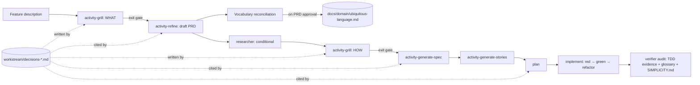
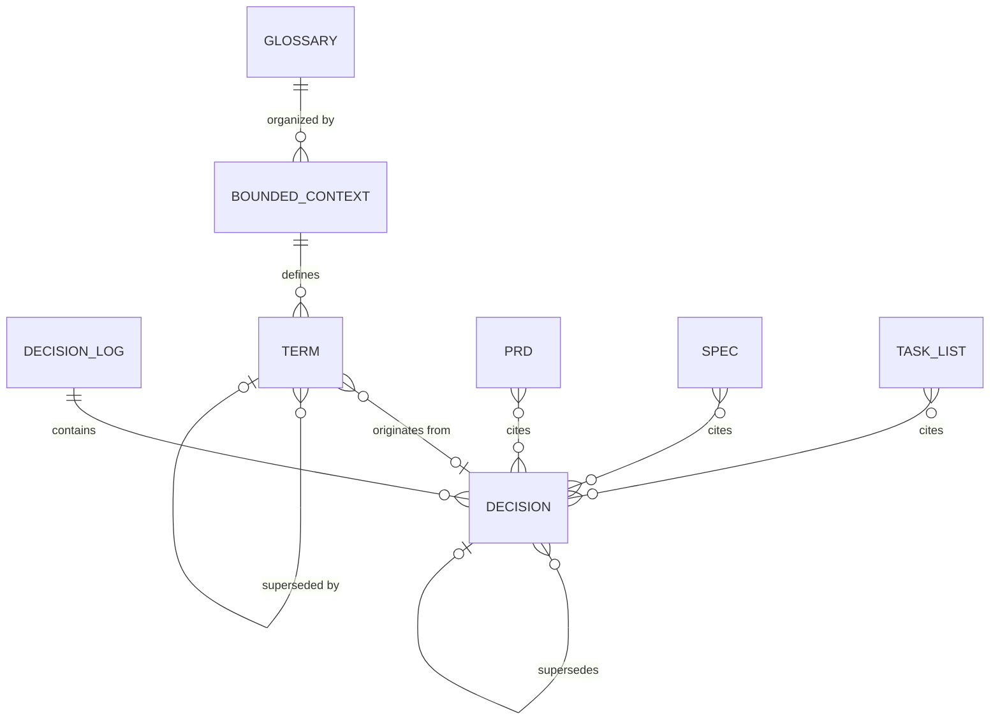

# PRD: Shared-Understanding Refinement, Ubiquitous Language, and TDD Enforcement

## Changelog

| Version | Date       | Summary                                                                                                                                                                                                                                                                                                                                                                                                                                                                                               | Author                    |
| ------- | ---------- | ----------------------------------------------------------------------------------------------------------------------------------------------------------------------------------------------------------------------------------------------------------------------------------------------------------------------------------------------------------------------------------------------------------------------------------------------------------------------------------------------------- | ------------------------- |
| 1.0     | 2026-09-18 | Initial base version                                                                                                                                                                                                                                                                                                                                                                                                                                                                                  | @llipe / claude           |
| 1.1     | 2026-09-18 | Analysis and format pass against the repository: aligned drift wording with the verifier and technical-guidelines blocking policy; reconciled `SIMPLICITY.md` delivery semantics with `ROOT_FILES` and ADR-006; added meta-repo `glossary.md` precedence; qualified decision IDs for cross-feature citation; defined "implementation commit"; targeted the PR completion report at the `github-ops` PR Description Template; expanded affected surfaces; added delivery phases; added OQ-06 to OQ-10. | product-engineer          |
| 1.2     | 2026-09-18 | Added simplicity tooling scope: new skill `activity-simplicity-tooling` that makes the `SIMPLICITY.md` thresholds executable under the single `validate` entry point (function length, file length, cyclomatic and cognitive complexity, code smells, duplication, dead code), baseline-and-ratchet adoption, and a CI wiring contract for `infra-engineer` via `deploy-ops` optimized for wall time. FR-35 to FR-44, AC-17 to AC-21, OQ-11 to OQ-13.                                                 | @llipe / product-engineer |

## Executive Summary

`dev-tasks` produces PRDs and specifications through a short list of clarifying questions, then hands the result to planning and implementation. In practice, the agent and the human frequently proceed with different mental models of _what_ is being built and _how_, and the gap surfaces only during verification, when it is expensive. Vocabulary drifts between documents and code, and test-first implementation is stated as a preference (`docs/technical-guidelines.md` § Test-first execution) but is not verifiable after the fact.

This feature closes the gap in four connected moves. First, refinement and specification become a **relentless, one-question-at-a-time interview** (`activity-grill`) that ends only on explicit shared understanding, with every resolved decision recorded and cited downstream. Second, the project gains a **permanent ubiquitous language** (`docs/domain/ubiquitous-language.md`) organized by bounded context; PRDs, specs, and code MUST use its terms. Third, **test-driven development becomes verifiable** through commit-order evidence rather than prose. Fourth, the code simplicity rules become a **root canonical contract** (`SIMPLICITY.md`) alongside `DESIGN.md` and `TESTING.md`, referenced by spec, plan, implement, and verify, and made **executable** by validation tooling (function length, file length, complexity, code smells) that runs under the one `validate` command locally and in CI.

Issue Mode stays lightweight: it builds on existing vocabulary and existing decisions, so it grills with a small cap and consults the glossary without extending it. Feature Mode runs the full process.

## Feature Overview

Current Feature Mode sequence (`product-engineer`):

```text
refine → [researcher] → generate-spec → generate-stories → publish-github → plan → implement → verify
```

Extended sequence (Feature Mode). The diagram shows where the two grilling phases sit, where the decision log is written and cited, and where the glossary is extended:



Issue Mode:

```text
[researcher] → activity-refine (activity-grill: cap 8, glossary read-only, reuse prior decisions) → plan → implement → verify
```

Three artifacts are new: the decision log per feature, the ubiquitous language document, and the simplicity contract. Two skills are new: `activity-grill` and `activity-simplicity-tooling`. The surfaces that change are listed in Affected Repositories.

### Delivery phases

The four moves are separable and have different dependencies. Stories **SHOULD** be grouped into milestones in this order:

| Phase | Scope                                                                                                                                                                                | Depends on                                                                                        |
| ----- | ------------------------------------------------------------------------------------------------------------------------------------------------------------------------------------ | ------------------------------------------------------------------------------------------------- |
| 1     | `activity-grill`, decision log, refine/spec/plan integration                                                                                                                         | `researcher` (ADR-004). No other dependency.                                                      |
| 2     | Ubiquitous language file, install-if-absent delivery, glossary lint                                                                                                                  | Phase 1 (terms enter through grilling). Meta-repo `glossary.md` precedence (OQ-07).               |
| 3     | `SIMPLICITY.md` contract, spec/plan/implement/verifier references, `activity-simplicity-tooling` (thresholds under `validate`, baseline-and-ratchet, CI wiring via `infra-engineer`) | `SIMPLICITY.md` content (OQ-06). Delivery semantics decision (OQ-08). Threshold defaults (OQ-11). |
| 4     | TDD commit-order evidence, refactor invariance, PR completion report                                                                                                                 | Evidence-driven loop blocking policy (`docs/technical-guidelines.md` § Blocking policy).          |

Phase 1 delivers most of the value on its own and is the recommended first milestone.

## Goals and Objectives

1. Eliminate the class of verification failures caused by divergent understanding of intent between human and agent.
2. Make every design decision that shaped a PRD or spec traceable to a question, an answer, and an author.
3. Guarantee that documents and code share one vocabulary per bounded context, and that the vocabulary is durable across features.
4. Make test-first implementation a verifiable fact in the commit history, not a stated intention.
5. Install code simplicity as a contract enforced at spec, plan, implement, and verify, with the burden of proof on adding.
6. Make the measurable simplicity rules machine-checked by one command, `validate`, that runs identically on a developer machine and in CI, with CI wall time treated as a design constraint.

## Affected Repositories

| Repository        | Role / Impact                                                                                                                                                                                                                                                                                                                                                                                                                                                                                                                                                                                                                                                                                                                                                       |
| ----------------- | ------------------------------------------------------------------------------------------------------------------------------------------------------------------------------------------------------------------------------------------------------------------------------------------------------------------------------------------------------------------------------------------------------------------------------------------------------------------------------------------------------------------------------------------------------------------------------------------------------------------------------------------------------------------------------------------------------------------------------------------------------------------- |
| `llipe/dev-tasks` | Source. New skills `activity-grill` and `activity-simplicity-tooling` (three platform trees). New CI workflow template `templates/workflows/validate.yml` documented in `deploy-ops`. Changes to `activity-refine`, `activity-generate-spec`, `plan`, `implement` (skill, Copilot instruction, Kiro steering), and the `product-engineer`, `developer`, `verifier`, and `github-ops` agents in all platform trees. New `core/verify` modules (commit-order pairing, glossary conformance). `core/distribution` registry and `bundle-manifest.json` changes for two new consumer-owned files. New root contract `SIMPLICITY.md`. Docs: `AGENTS.md` Contracts table, `README.md` install section, `docs/workflow-chains.md`, `docs/artifact-formats.md`, `docs/adr/`. |
| Consumer repos    | Target. Receive `SIMPLICITY.md`, the `docs/domain/ubiquitous-language.md` scaffold, and updated skills, agents, and instructions on `install` and `update`. Through an approved task, receive lint policy configuration, a violation baseline, and a `validate.yml` CI workflow delivered by `infra-engineer` as a draft PR.                                                                                                                                                                                                                                                                                                                                                                                                                                        |

The draft's "four existing skills change" undercounts the surface. Because `implement` is executed by `developer`, `verifier` runs the checks, `github-ops` owns the PR body, and `product-engineer` is the invoker, all four agents change in `.github/agents/`, `.claude/agents/` or `.claude/commands/`, and `.kiro/agents/`.

## Target Users

### Primary

- The developer running `product-engineer` in Feature or Issue Mode, who needs confidence that the agent understood the request before anything is built.

### Secondary

- Implementing and verifying agents (`developer`, `planner`, `verifier`), which consume the decision log, glossary, and simplicity contract as authoritative inputs.
- Future readers of PRDs and specs, who need to know why a decision was made without re-deriving it.

## User Stories

1. As a developer, I want the agent to interview me one question at a time with a recommended answer, so that I can resolve each branch of the design before the next one opens.
2. As a developer, I want the interview to explore the codebase instead of asking me things the code already answers, so that my turns are spent on genuine decisions.
3. As a developer, I want every answer recorded with an ID, so that the spec, plan, and PR can cite `D-07` instead of restating or reinterpreting it.
4. As a developer, I want a permanent glossary per bounded context, so that "order", "shipment", and "fulfillment" mean one thing across documents and code.
5. As a developer, I want new terms proposed in a PRD to be resolved during grilling and appended to the glossary, so that vocabulary grows deliberately.
6. As a verifier agent, I want commit-order evidence that a failing test preceded each implementation increment, so that TDD compliance is a check, not a claim.
7. As a verifier agent, I want the simplicity contract as an explicit input, so that I can reject over-built changes on stated grounds.
8. As a developer working a single issue, I want a short interview capped at a few questions, so that small changes stay small.
9. As a planner orchestrating several stories, I want the decision log passed to each `developer` delegation, so that no story re-derives a decision another story already settled.
10. As a developer, I want one command, `validate`, to check function length, file length, complexity, and code smells against the thresholds in `SIMPLICITY.md`, so that the simplicity contract is a test I can run, not a review opinion.
11. As an infra engineer, I want the same `validate` command wired into CI with caching and change scoping, so that the policy gate adds seconds, not minutes, to every pull request.
12. As a maintainer adopting the tooling on an existing codebase, I want existing violations captured in a baseline that only ratchets down, so that adoption does not require a rewrite before the first green run.

## Functional Requirements

### Grilling (`activity-grill`)

1. The skill **MUST** ask exactly one question per turn and **MUST** attach a recommended answer to each question.
2. The skill **MUST** walk the design tree depth-first: a branch is resolved before another branch is opened, and dependencies between decisions are stated explicitly.
3. Before asking a question, the skill **MUST** determine whether the codebase, existing documents, prior decision logs, or the glossary can answer it. If so, it **MUST** read directly (single-file lookups) or delegate to `researcher` (multi-slice questions, at most once per phase, per ADR-004's bounded-artifact rule) and **MUST NOT** ask the user.
4. Every resolved question **MUST** be appended to `workstream/decisions-<feature>.md` as one row carrying: ID (`D-NN`, unique within the file), phase, branch, question, recommended answer, answer, whether the recommendation was accepted, author, date, and the ID it supersedes (if any).
5. A decision cited outside its own log (another feature's PRD, an Issue Mode refinement, a glossary origin) **MUST** use the qualified form `<feature>#D-NN` so the reference stays unambiguous when every log restarts at `D-01`.
6. The skill **MUST** maintain an open-questions list and **MUST** present the decision-tree summary every 10 questions, on reaching the cap, and at the exit gate.
7. When invoked from Feature Mode the skill **MUST** run in two phases: **WHAT** (before drafting the PRD) and **HOW** (before drafting the spec). Each phase has its own exit gate.
8. The exit gate for a phase is satisfied only when the open-questions list is empty **and** the user states shared understanding explicitly. The skill **MUST NOT** infer agreement from silence or from a positive tone.
9. A question cap **MUST** exist and **MUST** be configurable. Defaults: 25 per phase in Feature Mode (WHAT and HOW each), 8 total in Issue Mode. On reaching the cap, the skill **MUST** present the open list and ask whether to continue or stop.
10. In Issue Mode the skill **MUST** treat the glossary as read-only and **MUST** scope questions to what the issue changes relative to existing behavior.
11. The skill **SHOULD** remind the user, at least once per phase, that accepting every recommendation reproduces the agent's assumptions instead of testing them.

### Refinement, specification, and planning integration

12. `activity-refine` in PRD Creation mode **MUST** invoke `activity-grill` (WHAT phase) before drafting and **MUST NOT** draft until the phase's exit gate is satisfied.
13. `activity-generate-spec` **MUST** invoke `activity-grill` (HOW phase) before drafting and **MUST NOT** draft until the phase's exit gate is satisfied. The conditional `researcher` step (ADR-004) runs before the HOW phase so that its artifact is available to answer HOW questions.
14. PRDs and specs **MUST** cite decision IDs inline where a decision shaped a requirement or a design choice, and **MUST** include a "Decisions" section listing the IDs consumed.
15. `activity-refine` in Issue Refinement mode **MUST** invoke `activity-grill` with the Issue Mode cap and **MUST** reuse existing decisions from prior `decisions-*.md` files when the issue touches the same area, citing them in qualified form.
16. `plan` **MUST** cite the decision IDs a task derives from, and `implement` **MUST** read the feature's decision log before starting work. `planner` **MUST** pass the decision log path to each `developer` delegation.

### Ubiquitous language

17. A permanent file `docs/domain/ubiquitous-language.md` **MUST** exist in every repository where `dev-tasks` is installed. `install` and `update` **MUST** scaffold it if absent and **MUST NOT** overwrite it once present, on every profile (install-if-absent, platform-agnostic; see Technical Considerations).
18. The file **MUST** be organized by bounded context. Each term entry **MUST** contain: term, definition, bounded context, forbidden synonyms, invariants, origin (the document or qualified decision ID where it was introduced), and status.
19. The file **MUST** carry a changelog and **MUST** be append-only for terms: a term is never deleted; a superseded term is marked with its replacement and the decision ID.
20. PRDs and specs **MUST** use only glossary terms for domain concepts, or **MUST** propose additions in a "Vocabulary" section. Proposed additions **MUST** be resolved during grilling (WHAT phase) and **MUST** be appended to the glossary when the PRD is approved, not when it is drafted.
21. When a proposed term conflicts with an existing term or with a forbidden synonym, the grilling **MUST** surface the conflict as a question and **MUST NOT** resolve it silently.
22. In a multi-repo consumer (a `component.json` present, per RF-60), the meta-repo `glossary.md` is the cross-component vocabulary and outranks the component repository's `docs/domain/ubiquitous-language.md`. The component file **MUST NOT** redefine a meta-repo term. A term that belongs to more than one component **MUST** be escalated to an `architecture-change` task (RF-64); Feature Mode grilling **MUST NOT** write to the meta-repo.
23. The verifier **MUST** check that new exported identifiers in code (types, classes, modules, public functions) for domain concepts match glossary terms, and **MUST** report any forbidden synonym found.

### TDD enforcement

24. `implement` **MUST** execute each behavioral increment as red → green → refactor: a failing test committed first (`test:` type), the minimal implementation that makes it pass committed second, and any structural cleanup committed third with a `refactor:` type.
25. The failing-test commit **MUST** be verifiable as failing: the commit body **MUST** record the test command and a one-line failing summary, and the PR body **MUST** aggregate them per increment.
26. An **implementation commit** is a commit of type `feat`, `fix`, or `perf` that touches non-test source paths. Commits of type `docs`, `chore`, `ci`, `build`, `test`, and `refactor` are not implementation commits and require no preceding test commit.
27. The verifier **MUST** validate commit-order evidence on the feature branch: for each implementation commit, a test commit touching the same behavior (path overlap and story ID) **MUST** precede it. A missing pairing **MUST** be recorded as drift with impact `Major` and intent `Unintended`; whether it blocks PR readiness follows the drift blocking policy in `docs/technical-guidelines.md`, not a rule local to this feature.
28. A `refactor:` commit **MUST NOT** change behavior; the verifier **MUST** confirm that the changed-package test result (pass/fail set) is identical immediately before and after the commit, and report a difference as drift with impact `Major`.
29. Acceptance criteria in the PRD **MUST** map to at least one test written before its implementation. The traceability matrix (`verifier` Design Mode) **MUST** record the test commit hash per criterion once implementation exists.

### Simplicity contract

30. `SIMPLICITY.md` **MUST** be a root canonical contract delivered on every profile (unconditionally with respect to platform and UI scope), registered in `AGENTS.md` § Contracts and in `bundle-manifest.json` `consumer_owned_paths`, with the same ownership as `DESIGN.md` and `TESTING.md`. Its install-time overwrite semantics are decided in OQ-08.
31. The initial content of `SIMPLICITY.md` is a deliverable of this feature. It **MUST** contain at minimum: (A) decision rules for adding code, abstractions, and dependencies, with the burden of proof on adding; (B) prohibitions; (C) the PR completion report format.
32. `activity-generate-spec`, `plan`, `implement`, and `verifier` **MUST** reference `SIMPLICITY.md` as an input and **MUST** apply its decision rules.
33. The `github-ops` PR Description Template **MUST** gain a `## Completion Report` section carrying the report defined in `SIMPLICITY.md` section C ("what I did not add", "what I noticed and did not touch", justifications, unverified rules). `implement` **MUST** fill it when the PR is opened and update it before the PR is marked ready.
34. The verifier **MUST** treat an empty "what I did not add" section on a non-trivial change (an implementation commit is present) as a finding requiring explanation.

### Simplicity tooling and CI (`activity-simplicity-tooling`)

35. A skill `activity-simplicity-tooling` **MUST** exist. It sets up, and later re-validates, the tooling that enforces the measurable rules in `SIMPLICITY.md`. Its consumers are `housekeeping` (setup and maintenance) and `infra-engineer` (CI wiring through `deploy-ops`). It **MAY** be recommended by `activity-init` and **MUST** be recommended when Phase 3 is adopted in a repository.
36. The skill **MUST** cover at least these policy categories, each mapped to a threshold declared in `SIMPLICITY.md` section D: function length, file length, cyclomatic complexity, cognitive complexity, parameter count, nesting depth, code smells (a named smell rule set), duplication, and dead code (unused exports, unused dependencies). A category with no available checker for the detected stack **MUST** be reported as `unavailable`, never silently dropped.
37. The single entry point **MUST** be the existing canonical `validate` script for JS/TS repositories (`pnpm validate`) and `make validate` for other stacks. The policy checks **MUST** run inside the existing `lint` step so that `validate` picks them up unchanged; the skill **MUST NOT** introduce a second top-level entry point or a parallel command that developers could run instead of `validate`.
38. Thresholds **MUST** come from `SIMPLICITY.md`, which ships defaults (OQ-11). A consumer **MAY** tighten a threshold in its own copy and **MUST NOT** loosen one below the shipped default; the tooling configuration **MUST** be derivable from the contract, and the skill **MUST** report a mismatch between the contract and the configuration as a defect.
39. Adoption on an existing codebase **MUST** follow baseline-and-ratchet: on first run the skill records existing violations in a committed baseline file, the gate fails only on new or changed files that violate a threshold, and the baseline **MUST** only shrink. A pull request that grows the baseline **MUST** fail `validate`.
40. The skill **MUST NOT** install or upgrade dependencies itself. It produces the configuration, the baseline, and an implementation task; dependency installation runs through an approved task with the consumer's package manager, consistent with `housekeeping`'s dependency rule and the evidence-driven loop's FR-38.
41. `infra-engineer`, via `deploy-ops`, **MUST** wire `validate` into CI as a recorded change delivered by draft PR, using a new `templates/workflows/validate.yml` template. The workflow **MUST** call the same `validate` command a developer runs locally; no policy logic lives in the workflow.
42. The CI wiring **MUST** be optimized for wall time: dependency-store caching, linter and type-checker caches persisted between runs, changed-file scoping for lint, duplication, and dead-code checks on pull requests with a full run on the default branch, independent checks run in parallel, static checks ordered before the test job, and fail-fast enabled. The template **MUST** document each optimization and the condition under which it is safe.
43. The skill **MUST** record the measured `validate` wall time locally and in CI at setup and on each re-validation, and **MUST** report a regression beyond the consumer's budget (OQ-12) as a finding. The `verifier` **MUST** read the `validate` result as an existing quality gate; a policy violation is a failed gate, not a new drift category.

### Platform parity

44. `activity-grill`, `activity-simplicity-tooling`, the changed skills, the changed agents, and the two new consumer-owned files **MUST** ship with equivalent behavior in the Copilot (`.github/`), Claude Code (`.claude/`), and Kiro (`.kiro/`) trees. Kiro **MUST** receive a steering pointer to `SIMPLICITY.md` in the same shape as `git-guard-notice.md`.

## Business Rules

- Shared understanding is declared by the human, never inferred by the agent.
- A decision recorded in `decisions-<feature>.md` is authoritative for that feature; a later document that contradicts it **MUST** supersede it with a new decision ID, not silently diverge.
- The glossary outranks any single document. When a document and the glossary disagree, the document is wrong until a decision changes the glossary. In a multi-repo consumer the meta-repo `glossary.md` outranks the component glossary.
- Grilling questions answerable from the codebase are a defect in the skill, not a cost to the user.
- Issue Mode never extends the glossary. If an issue requires a new term, it is escalated to Feature Mode.
- Simplicity rules may be tightened per repository, never loosened.
- One command, two places: `validate` is the same command locally and in CI. Speed comes from caches and change scoping inside the tools, never from a lighter command that skips checks.
- The baseline only shrinks. A threshold may be tightened per repository, never loosened; a baseline may lose entries, never gain them.
- Drift is classified, not invented: TDD-evidence and glossary findings use the existing impact and intent classes (`Critical`/`Major`/`Minor`, `Intended`/`Unintended`/`Undetermined`) and the existing blocking policy.

## Data Requirements

### Decision log (`workstream/decisions-<feature>.md`)

One file per feature, kept in `/workstream/` and archived with the workstream. IDs are unique within the file; cross-file references use `<feature>#D-NN`.

```markdown
# Decisions: <feature>

| ID   | Phase | Branch         | Question | Recommended | Answer | Accepted rec. | Supersedes | Author | Date       |
| ---- | ----- | -------------- | -------- | ----------- | ------ | ------------- | ---------- | ------ | ---------- |
| D-01 | WHAT  | scope/boundary | …        | …           | …      | yes           | —          | @user  | YYYY-MM-DD |
```

Superseded decisions are not deleted; the superseding row names the superseded ID in `Supersedes`.

### Ubiquitous language (`docs/domain/ubiquitous-language.md`)

```markdown
## Bounded Context: <name>

### <Term>

- Definition:
- Forbidden synonyms:
- Invariants:
- Origin: <prd-file or feature#D-NN>
- Status: active | superseded by <Term> (<feature#D-NN>)
```

The relationship between the three artifacts and their consumers:



### Simplicity thresholds (`SIMPLICITY.md` section D, shipped defaults)

Defaults are the contract's baseline and are confirmed in OQ-11. A consumer tightens them in its own copy.

| Policy                | Default             | Reference checker (JS/TS profile)              |
| --------------------- | ------------------- | ---------------------------------------------- |
| Function length       | 50 lines            | ESLint `max-lines-per-function`                |
| File length           | 300 lines           | ESLint `max-lines`                             |
| Cyclomatic complexity | 10                  | ESLint `complexity`                            |
| Cognitive complexity  | 15                  | `eslint-plugin-sonarjs` `cognitive-complexity` |
| Parameters            | 4                   | ESLint `max-params`                            |
| Nesting depth         | 3                   | ESLint `max-depth`                             |
| Code smells           | rule set            | `eslint-plugin-sonarjs` recommended            |
| Duplication           | 3% of changed lines | `jscpd`                                        |
| Dead code             | 0 new               | `knip` (unused exports and dependencies)       |

### Violation baseline (`.simplicity-baseline.json` or the checker's native baseline format)

A committed record of pre-existing violations per file and rule, produced once at adoption and rewritten only to remove entries. The format is decided in the specification; the invariant (shrink-only) is the requirement.

### Sensitivity constraints

Decision logs and the glossary are committed to the repository and **MUST NOT** contain secrets, credentials, or personal data.

## Non-Goals

- Tactical DDD patterns (aggregates, repositories, domain events, value objects) as mandatory structure. They conflict with the simplicity contract in most `dev-tasks` consumers.
- Automatic generation of glossary terms from code. Terms enter through grilling only.
- Replacing the existing test design activities (`activity-contract-test-design`, `activity-e2e-test-design`). TDD enforcement applies at the implementation increment, inside the loop those activities feed.
- Mutation testing or coverage thresholds. Covered by the evidence-driven loop PRD.
- Replacing `memo-cli`. The decision log is the in-repo record for one feature; `memo` remains the cross-session knowledge base written by `developer` and `technical-writer`.
- Writing to the meta-repo from grilling. Meta-repo vocabulary changes go through `architecture-change`.
- A UI for the interview. It runs in the agent's conversational surface.
- Replacing `housekeeping`. The tooling skill sets policy up; `housekeeping` keeps lint and type wiring healthy as today.
- A second validation command. `validate` is the entry point; there is no `validate:fast` that skips checks.
- Non-JS/TS checker profiles in the first release. Other stacks get the `make validate` entry point and an `unavailable` report per category until a profile exists (OQ-13).

## Design Considerations

- The interview discipline follows the public `grill-me` skill: one question, one recommended answer, explore before asking, depth-first, explicit shared understanding. This PRD adds what that skill leaves implicit: a persistent decision log, phase separation (WHAT/HOW), exit gates, caps, and glossary integration. License and attribution for the borrowed discipline are confirmed in OQ-09.
- Recommended answers are a default, not a shortcut (FR-11).
- Decision IDs are the integration seam. Everything downstream cites IDs; nothing downstream re-asks.
- No UI scope. `/DESIGN.md` is unaffected.

## Technical Considerations

- `activity-grill` is a skill, not an agent; it is invoked by `product-engineer` through `activity-refine` and `activity-generate-spec`. This avoids a new agent registration in `AGENTS.md`. It is a Claude skill under `.claude/skills/`, a Copilot skill under `.github/skills/`, and a Kiro skill under `.kiro/skills/`.
- **Delivery of the two consumer-owned files.** `core/distribution/profiles.ts` has two categories today: `ROOT_FILES` (`DESIGN.md`, `TESTING.md`: overwritten on every `install`, protected only on `update` via `consumer_owned_paths`) and `INSTALL_IF_ABSENT_FILES` (ADR-006: delivered once, never touched, but every entry is tagged with a single platform). `docs/domain/ubiquitous-language.md` needs install-if-absent semantics on every profile, which neither category provides. The spec **MUST** extend the install-if-absent registry with a platform-agnostic entry (mirroring `ROOT_PROFILE_TAG`) or add a third category, and `doctor` **SHOULD** report the file's absence. Whether `SIMPLICITY.md` uses the same mechanism is OQ-08.
- **Commit-order verification** belongs in `core/verify` next to `drift.ts`, following the "deterministic first" principle: a script walks `git log` on the feature branch, pairs `test:` commits (or commits touching `test/**`) with subsequent implementation commits by path overlap and story ID, and emits unresolved cases; the verifier narrates only those. Evidence is evaluated on the branch before merge, so squash merges on the base branch do not erase it.
- **Refactor invariance (FR-28)** requires running the changed-package test command at two commits. The script **SHOULD** use a temporary worktree and the canonical `test:unit` script, and **MUST** skip with an explicit `SKIPPED(<reason>)` result when the package has no runnable test command, never a silent pass.
- **Glossary conformance** in the verifier: extract new exported identifiers from the diff, normalize (case, plural), and match against glossary terms and forbidden synonyms. Deterministic; false positives are reported, not blocked, in the first release (OQ-03). The same lint **SHOULD** back AC-07 so `activity-refine` and `verifier` share one implementation.
- **Failing-test commits and CI.** Intermediate commits on a feature branch will be red by design. CI gates run on the PR head, and `git-guard` accepts the `test:` type, so no hook or workflow change is required. Consumers that gate every commit will need to scope the gate to the PR head.
- **Platform parity:** the skill and templates ship for Claude, Copilot, and Kiro profiles. Kiro's steering equivalent of `SIMPLICITY.md` is a pointer, not a copy (FR-35, OQ-04).
- **Simplicity tooling reference profile (JS/TS).** ESLint flat config (this repository already uses `eslint.config.js`) carries `complexity`, `max-lines`, `max-lines-per-function`, `max-params`, and `max-depth`; `eslint-plugin-sonarjs` adds cognitive complexity and the smell rule set; `jscpd` covers duplication; `knip` covers unused exports and dependencies. All four run under `lint`, so `validate` needs no script change. `knip` and `jscpd` are the slow ones on large repositories: scope both to changed files on pull requests (FR-42) and run them fully on the default branch. This repository has no complexity rules configured today and no CI workflow that runs `validate` (only `publish-npm.yml` and `release-bundle.yml`), so `dev-tasks` itself is the first consumer of the skill.
- **CI wall-time techniques for `validate.yml`.** pnpm store cache keyed on the lockfile; `eslint --cache` with the cache file persisted through the Actions cache; `tsc --incremental` with `tsbuildinfo` persisted; a matrix or parallel jobs for `lint`, `typecheck`, and `format:check` ahead of `test`; `fail-fast: true`; changed-file lists derived from the PR base for the scoped checks; concurrency groups that cancel superseded runs on the same branch. `deploy-ops` documents these the way it documents the deploy workflows: as a recorded change, never applied silently.
- **Baseline-and-ratchet.** Prefer the checker's native mechanism where one exists; otherwise a small script in `core/` compares the current violation set with the committed baseline and fails on growth. Deterministic, no agent narration.
- **ADR.** The exit-gate semantics change when downstream activities may start, and the new delivery category changes installer behavior; both are ADR-worthy (OQ-05).

## Acceptance Criteria

- [ ] AC-01: In Feature Mode, `activity-refine` does not produce a PRD draft until the user has explicitly stated shared understanding and the open-questions list is empty.
- [ ] AC-02: In Feature Mode, `activity-generate-spec` does not produce a spec draft until the HOW phase exit gate is satisfied.
- [ ] AC-03: Every grilling session produces or appends `workstream/decisions-<feature>.md` with one row per resolved question, each carrying an ID unique within the file, and every cross-file citation uses the `<feature>#D-NN` form.
- [ ] AC-04: Given a question whose answer exists in the codebase, the skill reads directly or delegates to `researcher` and does not ask the user.
- [ ] AC-05: The generated PRD, spec, and task list cite decision IDs inline and list them in a "Decisions" section.
- [ ] AC-06: `install` and `update` scaffold `docs/domain/ubiquitous-language.md` when absent on every profile and leave it byte-identical when present.
- [ ] AC-07: A PRD that uses a domain term absent from the glossary and without a "Vocabulary" proposal fails refinement with a named finding.
- [ ] AC-08: A proposed term that conflicts with an existing term, a forbidden synonym, or (multi-repo) a meta-repo `glossary.md` term surfaces as a grilling question.
- [ ] AC-09: In Issue Mode, grilling stops at 8 questions by default, does not modify the glossary, and reuses matching prior decisions.
- [ ] AC-10: `implement` produces, per behavioral increment, a `test:` commit whose body records the failing command and summary, followed by an implementation commit.
- [ ] AC-11: The verifier reports `Major`/`Unintended` drift when an implementation commit (per FR-26) has no preceding test commit for the same behavior, and reports nothing for `docs`, `chore`, `ci`, `build`, and `test` commits.
- [ ] AC-12: The verifier reports `Major` drift when a `refactor:` commit changes the changed-package test result, and `SKIPPED(<reason>)` when no test command exists.
- [ ] AC-13: `SIMPLICITY.md` is delivered on every profile, listed in `AGENTS.md` § Contracts and `consumer_owned_paths`, and referenced by `activity-generate-spec`, `plan`, `implement`, and `verifier` in all three platform trees.
- [ ] AC-14: The `github-ops` PR Description Template includes `## Completion Report`; the verifier flags an empty "what I did not add" section on a PR that contains an implementation commit.
- [ ] AC-15: New exported identifiers matching a forbidden synonym are reported by the verifier.
- [ ] AC-16: `planner` passes the decision log path to every `developer` delegation, and the delegated task list cites decision IDs.
- [ ] AC-17: On a JS/TS repository, running `activity-simplicity-tooling` then `pnpm validate` fails on a file that exceeds any shipped threshold and passes once the file is brought under the threshold, with no new script added to `package.json`.
- [ ] AC-18: On a repository with pre-existing violations, the first `validate` run after setup passes with a committed baseline; a pull request that adds a new violation fails; a pull request that removes one shrinks the baseline and passes; a pull request that grows the baseline fails.
- [ ] AC-19: A consumer that loosens a threshold below the shipped default receives a named finding from the skill's re-validation.
- [ ] AC-20: `infra-engineer` delivers `validate.yml` as a draft PR that calls `pnpm validate` (or `make validate`) and nothing else, with caching, changed-file scoping on pull requests, and a full run on the default branch, and the PR body records the measured wall time before and after.
- [ ] AC-21: For a stack with no checker profile, the skill installs the `make validate` entry point and reports every uncovered policy category as `unavailable`.

## Success Metrics

- Verification findings attributable to misunderstood intent: reduced to near zero on features that went through grilling, measured over the next ten features.
- Decisions cited downstream: 100% of spec design choices reference a decision ID or state explicitly that no decision applied.
- TDD evidence: 100% of implementation commits (FR-26) on feature branches have a preceding test commit.
- Glossary health: zero forbidden synonyms in new code across two release cycles.
- Interview cost: median questions per Feature Mode phase stays under the cap; Issue Mode median under 5.
- Policy gate cost: the static-check stage of `validate.yml` finishes inside the consumer's budget (OQ-12) on pull requests, measured over the first ten runs after wiring.
- Baseline health: the violation baseline of every adopting repository is smaller after two release cycles than at adoption.

## Assumptions

- Users are willing to spend more turns in refinement in exchange for fewer turns in verification and rework.
- Consumer repositories use Git with a linear or rebase-friendly feature-branch history that makes commit-order evidence readable before merge.
- `researcher` exists and can answer codebase questions in all supported runtimes, or a documented fallback applies.
- The evidence-driven loop's blocking policy (technical-guidelines § Blocking policy and drift resolution) is the policy in force for the verifier by the time Phase 4 ships.

## Constraints and Dependencies

- Depends on `researcher` (ADR-004) for explore-before-ask.
- Depends on the evidence-driven development loop PRD for the verifier's drift model and blocking policy. The currently installed `verifier` agent and `implement` skill still state that drift is non-blocking; Phase 4 of this PRD inherits whatever policy is in force and adds three drift categories (missing TDD evidence, glossary violation, empty completion report). It does not define its own blocking rule.
- Depends on `SIMPLICITY.md` content (FR-31, OQ-06), which does not exist in the repository yet.
- Must maintain install-if-absent semantics defined in ADR-006 for consumer-owned files, extended to platform-agnostic entries.
- Must respect RF-64: no meta-repo writes outside `architecture-change`.
- Infra scope: wiring `validate.yml` is a CI workflow change. Per the `product-engineer` infra rule, this PRD recommends an `infra-engineer` pass for that story, so the workflow lands through the approval, revert, and backup gates via `deploy-ops` rather than through `developer`.
- Scope note: this PRD bundles four features and exceeds the "1-3 iterations" guidance in `activity-refine`. The delivery phases table is the mitigation; splitting into separate PRDs remains an option (OQ-10).

## Security and Compliance

- No new external services. Decision logs and glossary are plain files in the repository.
- The verifier's commit-order and glossary checks read local Git history and the diff only.
- The refactor-invariance check runs the consumer's own test command in a temporary worktree; it introduces no new credentials or network access.

## Open Questions

- OQ-01: Should the decision log be one file per feature (`decisions-<feature>.md`) or one file per repository with feature sections? Recommended: per feature, archived with the workstream; a repository-level index can be derived.
- OQ-02: How does the verifier pair test commits with implementation commits when a story spans multiple behaviors in one commit? Recommended: require one behavior per increment and treat multi-behavior commits as a `Minor` finding.
- OQ-03: Should glossary conformance block or only report in the first release? Recommended: report only, promote to blocking after two release cycles of data.
- OQ-04: Kiro parity for `SIMPLICITY.md`: root file, steering document, or both? Recommended: root file on every profile (parity with `DESIGN.md` and `TESTING.md`, which are root files on Kiro too) plus a steering pointer mirroring `git-guard-notice.md`. The draft's "steering only" recommendation would make Kiro the one profile without the root contract.
- OQ-05: Does `activity-grill` need its own ADR for the exit-gate semantics? Recommended: yes, ADR-007, and it should also record the platform-agnostic install-if-absent category since that changes installer behavior.
- OQ-06: Who authors the initial `SIMPLICITY.md` content and when? The draft says "produced separately"; FR-27 of the draft cited a "section C" that does not exist. Recommended: author it as the first story of Phase 3, reviewed by the user, before any skill references it.
- OQ-07: In multi-repo consumers, what is the escalation path when Feature Mode grilling discovers a term that belongs to more than one component? Recommended: record the term as `proposed` in the component glossary with a pointer to a new `architecture-change` task; the verifier treats `proposed` terms as valid until the task resolves.
- OQ-08: `SIMPLICITY.md` delivery semantics. `ROOT_FILES` overwrite on every `install`, which conflicts with "tightened per repository, never loosened". Recommended: deliver it install-if-absent on every profile through the same platform-agnostic mechanism as the glossary, and document that template improvements reach existing consumers only through a manual step (the ADR-006 trade-off). Alternative: keep `ROOT_FILES` semantics and accept that a re-install resets a tightened copy.
- OQ-09: License and attribution for the `grill-me` interview discipline. Recommended: confirm the license permits derivative use and credit it in the skill's header.
- OQ-10: One PRD with four milestones, or four PRDs? Recommended: one PRD, four milestones as in the delivery phases table; split only if Phase 2 (meta-repo glossary precedence) turns into its own design effort.
- OQ-11: Shipped threshold defaults. The table in Data Requirements proposes function 50 lines, file 300 lines, cyclomatic 10, cognitive 15, params 4, depth 3, duplication 3%, dead code 0 new. Recommended: accept as the `SIMPLICITY.md` section D baseline; they match common ESLint and Sonar defaults, so consumers inherit familiar numbers.
- OQ-12: CI budget for the static-check stage. Recommended: a default budget of two minutes on pull requests recorded in `SIMPLICITY.md` section D, overridable per consumer; the skill reports, not blocks, on budget regression in the first release.
- OQ-13: Which non-JS/TS profile ships second? Recommended: none in this PRD. Add profiles as separate issues once the JS/TS profile has run in two consumers.

## Decisions

Decisions that shaped this PRD, recorded from the pre-PRD interview on 2026-09-18. These predate the decision-log format this PRD defines and are listed in the short form.

| ID   | Decision                                                                                     |
| ---- | -------------------------------------------------------------------------------------------- |
| D-01 | Grilling lives in a separate skill `activity-grill`, invoked by refine and generate-spec.    |
| D-02 | Exit gate is hard: empty open list and explicit user statement of shared understanding.      |
| D-03 | DDD scope is strategic only: ubiquitous language and bounded contexts; no tactical patterns. |
| D-04 | TDD is enforced through commit-order evidence checked by the verifier.                       |
| D-05 | Simplicity rules ship as a root canonical contract `SIMPLICITY.md`.                          |
| D-06 | Issue Mode is lighter: cap 8, glossary read-only, reuses existing decisions.                 |
