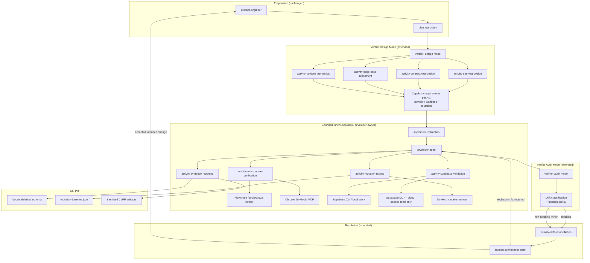
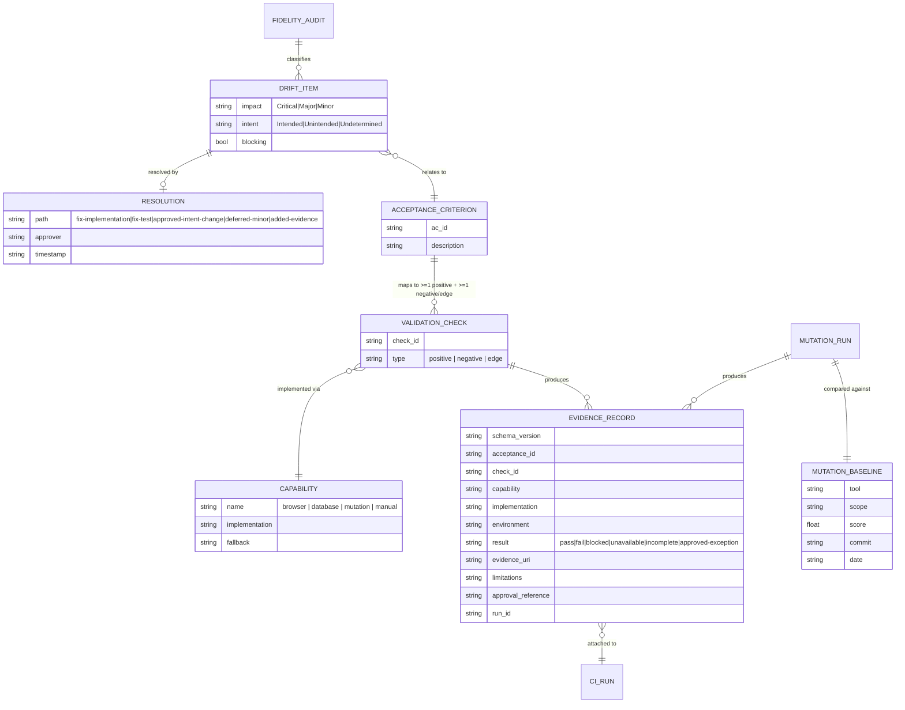
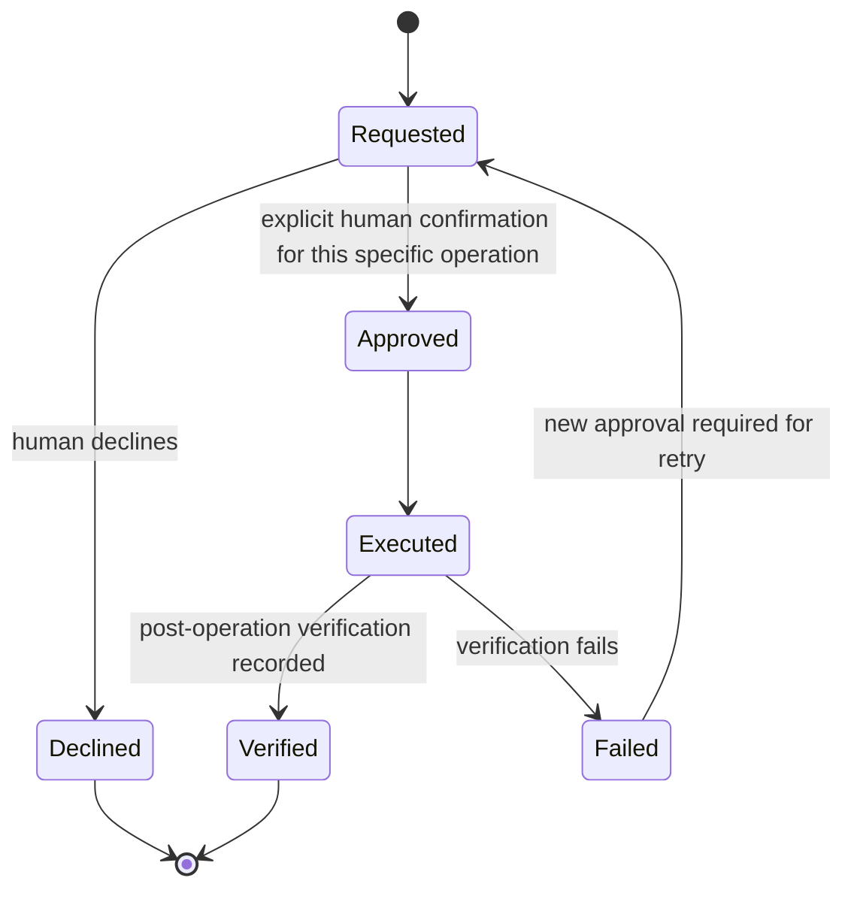
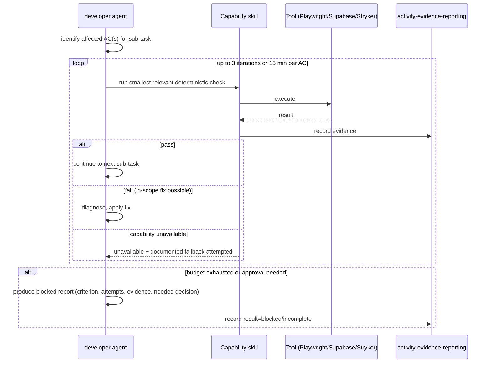

# Specification: Evidence-Driven Development Loop

## Changelog

| Version | Date       | Summary                                                                                                                                                                                                                                                                                                                                                                                                                                                            | Author           |
| ------- | ---------- | ------------------------------------------------------------------------------------------------------------------------------------------------------------------------------------------------------------------------------------------------------------------------------------------------------------------------------------------------------------------------------------------------------------------------------------------------------------------ | ---------------- |
| 1.0     | 2026-07-20 | Initial version                                                                                                                                                                                                                                                                                                                                                                                                                                                    | product-engineer |
| 1.1     | 2026-07-20 | Resolved 3 of 4 open questions: (1) mutation regression tolerance confirmed as "any net decrease" with no epsilon; (2) `check-platform-parity.sh` runs as a non-blocking warning for its first release, promotable to a hard gate later; (4) consumer-repo schema linting ships as an optional, non-blocking warning template, not a `dev-tasks`-owned hard CI gate. Monorepo mutation-baseline scoping (was Q3) remains open — deferred to story/task refinement. | product-engineer |

## 1. Executive Summary

This specification implements the PRD's evidence-driven development loop as four new capability skills (web-runtime verification, Supabase validation, mutation testing, evidence reporting), targeted edits to the `developer`, `verifier`, and `planner` agent contracts and the `plan`/`implement` instructions across all three platform trees (`.github/`, `.claude/`, `.kiro/`), a versioned evidence/mutation-baseline schema under `docs/validation/`, and a new maintainer-facing cross-platform parity script. The change converts the final fidelity audit from a terminal, fully non-blocking checkpoint into a bounded inner loop with an explicit blocking policy and a defined resolution path, while keeping every tool (Playwright, Chrome DevTools MCP, Supabase CLI/MCP, Stryker) behind a replaceable capability contract.

## 2. Reference Documents

- PRD: `docs/requirements/prd-evidence-driven-development-loop.md`
- `docs/product-context.md` — portable harness scope, primary/secondary users, safety posture
- `docs/technical-guidelines.md` — capability contracts (Architecture Patterns), testing strategy layers, blocking/drift policy, Supabase and mutation guidance, dependency and security rules
- Existing `verifier`, `developer`, `planner` agent files (all three platform trees)
- `.kiro/steering/plan.md` / `.github/instructions/plan.instructions.md` / `.claude/skills/plan/SKILL.md`
- `.kiro/steering/implement.md` / `.github/instructions/implement.instructions.md` / `.claude/skills/implement/SKILL.md`
- `.kiro/skills/activity-drift-reconciliation/SKILL.md` (and platform equivalents)

## 3. Affected Repositories

| Repository            | Role                                        | Scope of Changes                                                                                                                                                                                                                                               |
| --------------------- | ------------------------------------------- | -------------------------------------------------------------------------------------------------------------------------------------------------------------------------------------------------------------------------------------------------------------- |
| `llipe/dev-tasks`     | Source of truth for the distributed harness | Adds 4 new skills (×3 platform trees), edits `developer`/`verifier`/`planner` agent files and `plan`/`implement` instructions (×3 trees), adds `docs/validation/` schemas, adds a maintainer parity script and CI job, updates README/AGENTS.md/CHANGELOG.     |
| Consumer repositories | Adopt the capability contracts optionally   | No forced change. Repositories that configure Playwright, Supabase, or a mutation runner gain the new loop behavior on next `dev-tasks.sh update`. Repositories without those tools are unaffected beyond the (already-existing) blocking-drift policy change. |

No other repository is in scope. There is no backend service, so there is no runtime deployment target beyond the distributed Markdown/JSON/shell artifacts themselves.

## 4. System Architecture

### 4.1 Design approach: policy vs. mechanism

Per `docs/technical-guidelines.md` §"Design Patterns and Principles," this feature keeps mandatory cross-cutting policy in agent contracts and instructions, and keeps replaceable tool procedures in skills:

| Layer                              | Owns                                                                                                                                | Mechanism                                                                                                                          |
| ---------------------------------- | ----------------------------------------------------------------------------------------------------------------------------------- | ---------------------------------------------------------------------------------------------------------------------------------- |
| `implement` instruction/skill      | Bounded inner loop trigger, retry budget, blocking policy enforcement, evidence attachment step                                     | Instruction (`.github/instructions/implement.instructions.md`, `.kiro/steering/implement.md`, `.claude/skills/implement/SKILL.md`) |
| `plan` instruction/skill           | Capability tagging of tasks (browser / database / mutation-relevant) so `implement` knows which loop stages apply                   | Instruction (same 3-tree pattern)                                                                                                  |
| `developer` agent                  | Executes the loop, owns retry/escalation, invokes capability skills, attaches evidence                                              | Agent contract (×3 trees)                                                                                                          |
| `verifier` agent                   | Design Mode: specifies required checks/capabilities per AC. Audit Mode: reads evidence, classifies drift, applies new blocking rule | Agent contract (×3 trees)                                                                                                          |
| `planner` agent                    | Propagates blocking policy and evidence aggregation across a multi-story run                                                        | Agent contract (×3 trees)                                                                                                          |
| 4 new capability skills            | Tool-specific procedures (Playwright/Chrome DevTools MCP, Supabase CLI/MCP, Stryker, evidence schema I/O)                           | New skill directories (×3 trees)                                                                                                   |
| `activity-drift-reconciliation`    | Human-confirmation gate that can reclassify blocking drift as accepted, or route eligible minor drift to a deferred issue           | Existing skill, extended                                                                                                           |
| `docs/validation/`                 | Versioned evidence and mutation-baseline schemas (durable, project-owned)                                                           | New asset directory, consumer-owned once adopted                                                                                   |
| `scripts/check-platform-parity.sh` | Maintainer-only cross-platform conformance check                                                                                    | New script + CI job (maintainer repo only, not distributed to consumers)                                                           |

### 4.2 Component diagram



### 4.3 Component inventory (files touched or added)

Each row below is repeated once per platform tree (`.github/`, `.claude/`, `.kiro/`) unless noted. Platform-specific path/frontmatter differences are preserved per the existing three-tree pattern; content stays behaviorally equivalent per FR-50/51 of the PRD.

| #   | Component                                 | .github path                                                                                                        | .claude path                                                                                                | .kiro path                                                | Change                                                                                                    |
| --- | ----------------------------------------- | ------------------------------------------------------------------------------------------------------------------- | ----------------------------------------------------------------------------------------------------------- | --------------------------------------------------------- | --------------------------------------------------------------------------------------------------------- |
| 1   | `activity-web-runtime-verification` skill | `.github/skills/activity-web-runtime-verification/SKILL.md`                                                         | `.claude/skills/activity-web-runtime-verification/SKILL.md`                                                 | `.kiro/skills/activity-web-runtime-verification/SKILL.md` | New                                                                                                       |
| 2   | `activity-supabase-validation` skill      | same pattern                                                                                                        | same pattern                                                                                                | same pattern                                              | New                                                                                                       |
| 3   | `activity-mutation-testing` skill         | same pattern                                                                                                        | same pattern                                                                                                | same pattern                                              | New                                                                                                       |
| 4   | `activity-evidence-reporting` skill       | same pattern                                                                                                        | same pattern                                                                                                | same pattern                                              | New                                                                                                       |
| 5   | `activity-drift-reconciliation` skill     | existing path                                                                                                       | existing path                                                                                               | existing path                                             | Edit: blocking/unblock states                                                                             |
| 6   | `developer` agent                         | `developer.agent.md`                                                                                                | `agents/developer.md` + `commands/developer.md`                                                             | `developer.md`                                            | Edit: loop, retry budget, blocking, evidence                                                              |
| 7   | `verifier` agent                          | `verifier.agent.md`                                                                                                 | `agents/verifier.md` + `commands/verifier-design.md`/`verifier-audit.md`                                    | `verifier.md`                                             | Edit: capability requirements, blocking drift, mutation evidence in scope                                 |
| 8   | `planner` agent                           | `planner.agent.md`                                                                                                  | `commands/planner.md` (no dedicated subagent file today)                                                    | `planner.md`                                              | Edit: blocking propagation, evidence rollup                                                               |
| 9   | `implement` instruction                   | `instructions/implement.instructions.md`                                                                            | `skills/implement/SKILL.md`                                                                                 | `steering/implement.md`                                   | Edit: inner loop, blocking gate                                                                           |
| 10  | `plan` instruction                        | `instructions/plan.instructions.md`                                                                                 | `skills/plan/SKILL.md`                                                                                      | `steering/plan.md`                                        | Edit: capability tagging                                                                                  |
| 11  | Evidence schema                           | `docs/validation/evidence-schema.md` + `docs/validation/evidence.schema.json`                                       | same (single shared `/docs` tree, not platform-specific)                                                    | same                                                      | New                                                                                                       |
| 12  | Mutation baseline convention              | `docs/validation/mutation-baseline.schema.json`                                                                     | same                                                                                                        | same                                                      | New                                                                                                       |
| 13  | Parity script                             | `scripts/check-platform-parity.sh`                                                                                  | same                                                                                                        | same                                                      | New (maintainer-only, not a `managed_path`)                                                               |
| 14  | Parity CI job                             | `.github/workflows/parity-check.yml`                                                                                | n/a                                                                                                         | n/a                                                       | New (runs on PRs touching agent/skill/instruction files)                                                  |
| 15  | Prompts                                   | `prompts/developer-execute.prompt.md`, `verifier-design.prompt.md`, `verifier-audit.prompt.md`, `planner.prompt.md` | `commands/developer.md`, `commands/verifier-design.md`, `commands/verifier-audit.md`, `commands/planner.md` | folded into agent files                                   | Edit: reference new skills/blocking policy where invocation inputs change                                 |
| 16  | Registry docs                             | `README.md`, `AGENTS.md`, `AGENTS.md.template`, `CLAUDE.md`, `CLAUDE.md.template`, `bundle-manifest.json`           |                                                                                                             |                                                           | Edit: add 4 skills to tables/managed paths, document blocking-policy change as a breaking behavior change |
| 17  | GitHub issues                             | —                                                                                                                   | —                                                                                                           | —                                                         | Supersede #12, #15 with newly generated stories; cross-link                                               |

`bundle-manifest.json` requires a `managed_paths` entry only for the new skill directories — `docs/validation/` and `scripts/check-platform-parity.sh` are **not** added to `managed_paths` (see §15, Deployment & Rollout) because the former becomes consumer-owned once a project adopts it, and the latter is maintainer-only tooling for this repository, not something distributed to consumers.

## 5. Data Model & Artifact Design

There is no application database. The "data model" here is the set of durable workflow artifacts and their relationships.

### 5.1 Artifact relationship diagram



### 5.2 Evidence record schema (`docs/validation/evidence.schema.json`)

The evidence record matches the PRD's Data Requirements table exactly (§ Data Requirements, PRD v1.0), formalized as a JSON Schema with `schema_version: "1.0"`. `activity-evidence-reporting` is the only skill permitted to write and validate this schema; all other skills produce evidence by calling it.

Required fields: `schema_version`, `acceptance_id`, `check_id`, `capability`, `implementation`, `environment`, `result`, `run_id`. Optional fields: `evidence_uri`, `limitations`, `approval_reference`.

### 5.3 Mutation baseline schema (`docs/validation/mutation-baseline.schema.json`)

```json
{
  "schema_version": "1.0",
  "tool": "stryker",
  "scope": "changed-files | full",
  "mutation_score": 0.0,
  "killed": 0,
  "survived": 0,
  "timeout": 0,
  "no_coverage": 0,
  "commit": "<sha>",
  "date": "<ISO-8601>",
  "excluded_paths": []
}
```

This file is **consumer-owned** and created on first baseline run by `activity-mutation-testing`; `dev-tasks` ships the schema/skill only, never a pre-populated baseline.

## 6. Capability Contract Interface

Each capability exposes the same conceptual interface regardless of implementation, per `docs/technical-guidelines.md` §"Capability contracts." This is the harness's equivalent of an API design standard — there is no network API, so the "endpoints" below are the skill invocation contracts.

| Capability           | Skill                               | Required inputs                                                             | Required outputs                                                            | Default implementation                                                  | Fallback                                                                 | Unavailable behavior                                                                                 |
| -------------------- | ----------------------------------- | --------------------------------------------------------------------------- | --------------------------------------------------------------------------- | ----------------------------------------------------------------------- | ------------------------------------------------------------------------ | ---------------------------------------------------------------------------------------------------- |
| Browser runtime      | `activity-web-runtime-verification` | AC list, changed routes/components, project E2E command                     | Evidence record(s), diagnostic artifacts (screenshot/trace/console/network) | Project's Playwright suite + Chrome DevTools MCP for diagnosis          | Project-native E2E runner without MCP; screenshots via CI browser runner | `result: incomplete`, blocks only if the AC required deterministic browser evidence                  |
| Database/Supabase    | `activity-supabase-validation`      | Environment classification, target project ref, migration artifact (if any) | Evidence record(s), migration approval record, post-apply verification      | Supabase Cloud + Supabase MCP (read-only) + Supabase CLI for migrations | Local Supabase stack via CLI/Docker                                      | `result: incomplete`; writes/migrations always require approval regardless of fallback               |
| Mutation             | `activity-mutation-testing`         | Test command, scope (changed-files/full), existing baseline (if any)        | Mutation run result, updated/compared baseline, evidence record(s)          | Stryker (JS/TS)                                                         | Project-native mutation tool honoring the same schema                    | `result: unavailable`; never blocks unless project has explicitly enabled a mutation gate            |
| Evidence publication | `activity-evidence-reporting`       | Evidence records from other capabilities                                    | Sanitized CI/PR artifact bundle, links attached to PR/issue                 | GitHub Actions artifact upload                                          | Direct PR comment with inline summary when no CI artifact storage exists | Evidence still recorded locally; publication marked `limitations: no CI artifact storage configured` |

## 7. Authentication & Authorization Design

No new end-user authentication is introduced. Two authorization concerns matter for this feature:

1. **Tool/MCP scoping.** `activity-supabase-validation` and `activity-web-runtime-verification` MUST request the narrowest available scope (project-scoped, read-only where the tool supports it) and MUST record the scope used in the evidence record's `implementation` field.
2. **Approval workflow.** Every capability that can write, migrate, or perform a destructive action follows this state machine, extending the existing migration-safety gate in `implement.instructions.md`:



Approval evidence is recorded in the evidence record's `approval_reference` field (e.g., PR comment permalink or issue comment ID) and is mandatory before `Executed` for any write/migration/destructive/security-sensitive action, per PRD FR-26/FR-27.

## 8. Business Logic Implementation

### 8.1 Bounded inner loop (sequence)



The retry budget (PRD FR-7/FR-8, `docs/technical-guidelines.md` "Bounded autonomy") is enforced by `developer`, not by any single capability skill, because only `developer` has visibility across capabilities for a given AC.

### 8.2 Drift classification and blocking policy (state machine)

```mermaid
stateDiagram-v2
    [*] --> Detected
    Detected --> Classified: verifier assigns impact + intent
    Classified --> Blocking: impact in {Critical, Major} AND intent in {Unintended, Undetermined}
    Classified --> NonBlocking: impact = Minor (documented owner + follow-up)
    Classified --> HumanGate: intent = Intended (any impact)
    Blocking --> Resolved: fix implementation / fix test / add evidence
    Blocking --> HumanGate: developer or reviewer requests intent review
    HumanGate --> Resolved: human confirms accepted intended change (PRD/spec changelog updated)
    HumanGate --> Blocking: human rejects; treat as defect
    NonBlocking --> Resolved: deferred to linked follow-up issue
    Resolved --> [*]
```



This replaces the current unconditional "drift is always non-blocking" rule in `verifier.agent.md`/`developer.agent.md`/`AGENTS.md` with the policy from `docs/technical-guidelines.md` §"Blocking policy and drift resolution." `activity-drift-reconciliation` implements `HumanGate` and `NonBlocking` deferral; `developer` implements `Blocking → Resolved` via the existing implementation loop.

### 8.3 Mutation gate logic

1. If no baseline exists: run mutation analysis, write baseline, report only — never blocking on first run.
2. If a baseline exists: run incremental/changed-code mutation analysis, compare score and surviving mutants in changed scope against baseline.
3. **Regression tolerance (resolved):** any net decrease in mutation score within changed scope counts as a regression — there is no default epsilon/noise tolerance. This is reported as a `Minor` drift item by default; a project MAY opt in to `Major` classification via its own configuration. `dev-tasks` never invents a numeric pass/fail threshold the project has not approved (PRD FR-20); "any decrease" is a detection rule, not a score threshold.
4. Surviving mutants in explicitly project-tagged "critical business logic" paths (project-configured) require one of: stronger test, documented equivalent/unviable classification, or reviewed exception (PRD FR-21).

## 9. Integration Details

| Integration              | Method                                                                                                     | Retry/failure handling                                                                                                                                                                                          |
| ------------------------ | ---------------------------------------------------------------------------------------------------------- | --------------------------------------------------------------------------------------------------------------------------------------------------------------------------------------------------------------- |
| Chrome DevTools MCP      | MCP tool calls for live browser inspection (console, network, DOM/accessibility, performance, screenshots) | Non-fatal: if MCP unavailable, `activity-web-runtime-verification` falls back to project-native E2E execution only and marks runtime-diagnosis coverage `incomplete`. Never retried beyond the AC-level budget. |
| Supabase MCP             | Project-scoped, read-only by default                                                                       | If unreachable, fall back to Supabase CLI (local) or mark cloud inspection `unavailable`; never silently escalate scope to retry.                                                                               |
| Supabase CLI             | Local/ephemeral stack, migrations, pgTAP                                                                   | Migration apply failures roll back per the existing migration-safety gate; verification step is mandatory before marking `Executed → Verified`.                                                                 |
| Stryker (or equivalent)  | Local/CI mutation run                                                                                      | Timeout/error mutants are reported distinctly from survived mutants; a full run timeout degrades scope to changed-files only, documented in the evidence record.                                                |
| GitHub Actions artifacts | Evidence and mutation report upload                                                                        | If artifact upload fails, `activity-evidence-reporting` falls back to an inline PR/issue comment summary and marks the record `limitations: artifact upload failed`.                                            |

## 10. User Interface & Client Behavior

Not applicable — no end-user UI is introduced. `/DESIGN.md` has no impact. The only "interface" is the human-facing report format, which follows the existing verdict-first convention (`verifier.agent.md` §"Report Structure") extended with a capability/evidence summary line and, when applicable, a blocking-reason line immediately under the verdict header.

## 11. Performance & Scalability Approach

- The inner loop runs only the smallest relevant deterministic checks per sub-task, not the full suite, per `docs/technical-guidelines.md` §"Performance and Scalability."
- Mutation analysis defaults to changed-files scope on pull requests once a baseline exists; full-suite runs are scheduled or risk-triggered, never a default PR gate.
- Browser runtime diagnosis (Chrome DevTools MCP) is invoked only on failure or explicit risk-based request, not on every passing check, to avoid unnecessary latency.
- The parity script runs only in CI on PRs that touch agent/skill/instruction paths, not on every PR.

## 12. Security Implementation

- Evidence sanitization is a mandatory step inside `activity-evidence-reporting` before any artifact is attached to CI/PR: strip credential-shaped strings, known secret patterns, and flag (not auto-redact silently) suspected personal data for human review before publication.
- `activity-supabase-validation` MUST default to read-only, project-scoped access and MUST NOT accept or request elevated scope without the explicit approval state machine in §7.
- Mutation and destructive-failure-mode testing MUST target local/ephemeral or explicitly non-production environments only (PRD FR-22, FR-30); `activity-mutation-testing` and `activity-supabase-validation` MUST refuse to run destructive scenarios when the resolved environment classification is `production`.
- No skill in this feature installs dependencies, writes credentials, or edits MCP configuration; each skill's first documented step is capability _detection_, and installation is delegated to an explicit, human-approved task (PRD FR-37/FR-38).

## 13. Error Handling & Logging

Every capability skill reports one of exactly six result states, matching the evidence schema's `result` enum: `pass`, `fail`, `blocked`, `unavailable`, `incomplete`, `approved-exception`. Skills MUST NOT report `pass` when a fallback degraded coverage below what the AC required — that case is `incomplete`.

Retry loop logging (developer-owned) records, per iteration: AC id, check id, attempt number, elapsed time, result, and diagnosis note. This log is the source for the blocked-report content required by PRD FR-8 and is attached as evidence when escalation occurs.

### 8.4 Cross-platform parity gate (resolved)

`scripts/check-platform-parity.sh` and its CI job (`parity-check.yml`) **MUST** run as a **non-blocking warning** for the first release that ships this feature: findings are posted as a PR comment/annotation but do not fail the check run. This is a deliberate soft-launch — the check itself is new and unproven across all three trees, and a false-positive hard gate would block unrelated PRs. Once the check has run clean across at least one full release cycle with no false positives reported, `product-engineer` **SHOULD** propose promoting it to a blocking gate via a follow-up issue; that promotion is out of scope for this specification.

### 8.5 Consumer-repo schema linting boundary (resolved)

Linting of `docs/validation/*.schema.json` in **consumer** repositories is not a `dev-tasks`-owned CI responsibility. Neither `release-bundle.yml` nor `parity-check.yml` (both maintainer-repo-only) lint consumer schema files. Instead, `activity-evidence-reporting` and `activity-mutation-testing` **MUST** ship an optional, non-blocking schema-validation step template (a documented command, not an enforced hook) that a consumer MAY wire into their own CI. If a consumer runs it and it fails, the skill surfaces this as a **warning** in its output (evidence record `limitations: schema validation warning — see <detail>`), not as a blocking result — schema drift in a durable artifact is a data-quality signal, not an acceptance-criterion failure.

## 14. Testing Strategy

This feature changes agent/skill/instruction behavior and adds schemas/scripts — there is no application runtime to unit-test. Verification is structural and scenario-based, following the pattern already used in `workstream/archive/specification-token-optimization-devtasks.md` §6:

1. **Structural checks:** every new skill directory contains a `SKILL.md` with required frontmatter; `docs/validation/*.schema.json` are valid JSON Schema; `bundle-manifest.json` lists the 4 new skill paths across all three trees; no dangling references to removed/renamed content.
2. **Content parity:** `scripts/check-platform-parity.sh` (new) verifies skill/agent file-set parity across `.github/`, `.claude/`, `.kiro/` and flags any of the 17 edited/added components in §4.3 missing from one tree.
3. **Dry-run walkthroughs:** for each new skill, a scripted dry run (no real Playwright/Supabase/Stryker execution required) confirms the skill's documented inputs/outputs match the capability contract in §6, using a fixture AC list.
4. **Policy behavior review:** manual review confirming `verifier.agent.md` and `implement` instructions now state the blocking policy from §8.2 unambiguously, and that the prior unconditional "drift is non-blocking" language is fully replaced (not left as a contradicting duplicate) in all three trees.
5. **No application build** exists for this repository; `./scripts/format.sh --check` and the new parity script are the terminal checks for this change, run in CI via `.github/workflows/parity-check.yml`.

## 15. Deployment & Rollout

- **Opt-in by capability, not by version:** the 4 new skills are inert until a consumer project exposes the relevant native tooling/config (Playwright config, Supabase project ref, mutation runner config). No `dev-tasks.sh` flag is required beyond the existing `update`.
- **Breaking behavior change — must be called out explicitly:** the blocking-drift policy (§8.2) changes existing consumer behavior (previously: drift never blocks). This MUST be documented as a breaking change in `CHANGELOG.md` and the release notes for the version that ships this feature, with a one-line migration note: _"Critical/Major unintended drift now blocks PR readiness; resolve via fix, approved intent change, or eligible minor deferral."_
- **Rollback plan:** revert the agent-contract/instruction edits (§4.3 rows 6, 7, 8, 9, 10) to restore the fully non-blocking policy; the 4 new skills can remain installed inert with no rollback needed since they are opt-in by capability detection.
- **`docs/validation/` and mutation baselines are consumer-owned** artifacts created on first use, not shipped pre-populated, and not overwritten by `dev-tasks.sh update` (they are not in `managed_paths`).
- **Sequencing:** ship in the story order defined at planning time, but the blocking-policy edit (agent/instruction changes) and the evidence-schema/skills it depends on MUST land together in the same release — shipping blocking policy without the skills that produce evidence would leave `developer` unable to satisfy the new gate.

## 16. Dependencies & Risks

| Risk                                                                                        | Mitigation                                                                                                                                                  |
| ------------------------------------------------------------------------------------------- | ----------------------------------------------------------------------------------------------------------------------------------------------------------- |
| Blocking-policy change surprises existing consumers mid-upgrade                             | Explicit CHANGELOG breaking-change entry + migration note (§15); policy only takes effect where capabilities are configured                                 |
| Chrome DevTools MCP or Supabase MCP unavailable in a given agent runtime                    | Every capability contract defines a fallback and an `unavailable`/`incomplete` result; nothing silently passes                                              |
| Mutation testing runtime cost on large repos                                                | Changed-files scope by default after baseline; full runs scheduled/risk-triggered (§11)                                                                     |
| Cross-platform drift between `.github/`, `.claude/`, `.kiro/` edits                         | New `scripts/check-platform-parity.sh` + CI job gate PRs that touch these paths                                                                             |
| Supabase production-only projects accidentally exposed to destructive mutation/fuzz testing | `activity-supabase-validation`/`activity-mutation-testing` MUST refuse destructive scenarios when environment classification resolves to `production` (§12) |
| Existing `verifier`/`developer` content is large; edits risk merge conflicts across 3 trees | Component inventory in §4.3 gives exact target files; edits are additive/localized rule insertions, not rewrites                                            |

## 17. Open Questions

1. ~~Should the mutation-score regression tolerance in §8.3 default to "any decrease" or a small configurable epsilon?~~ **Resolved (v1.1):** "any net decrease," no epsilon — see §8.3.
2. ~~Should `scripts/check-platform-parity.sh` fail the PR (hard gate) or warn (soft gate) during initial rollout?~~ **Resolved (v1.1):** warn (soft gate) for the first release — see §8.4.
3. **Still open:** For monorepos, should `docs/validation/mutation-baseline.schema.json` be one file per package or one aggregated file with a `scope` key per package? No decision has been made either way. Given no consumer monorepo requirement is currently known, `activity-mutation-testing` **SHOULD** default to a single aggregated file with a per-run `scope` value (as drafted in §5.3) and treat true per-package baseline files as a documented extension point, not a v1 requirement — this keeps the schema from blocking initial implementation, but the multi-package case **MUST** be revisited before this specification is considered final for any monorepo consumer.
4. ~~Which GitHub Actions job should lint `docs/validation/*.schema.json` in consumer repos?~~ **Resolved (v1.1):** neither maintainer-repo CI job lints consumer schemas; an optional non-blocking warning template is shipped instead — see §8.5.
