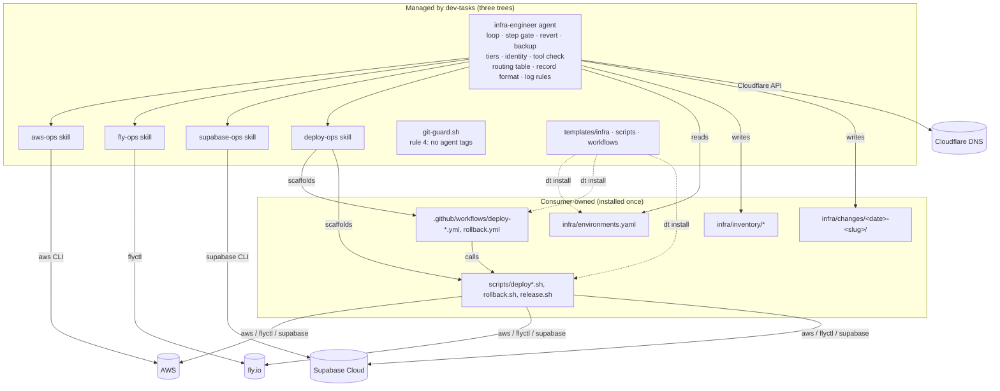
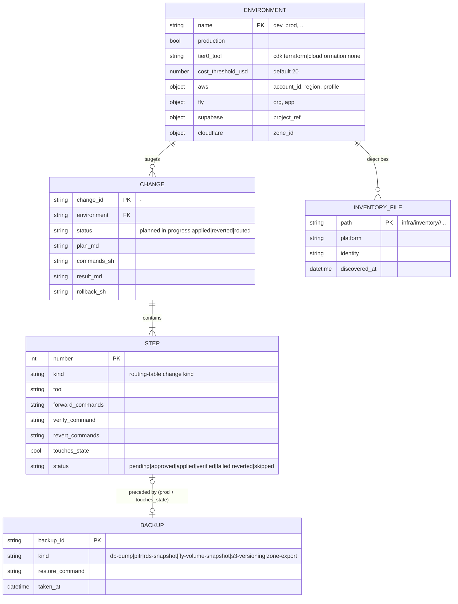
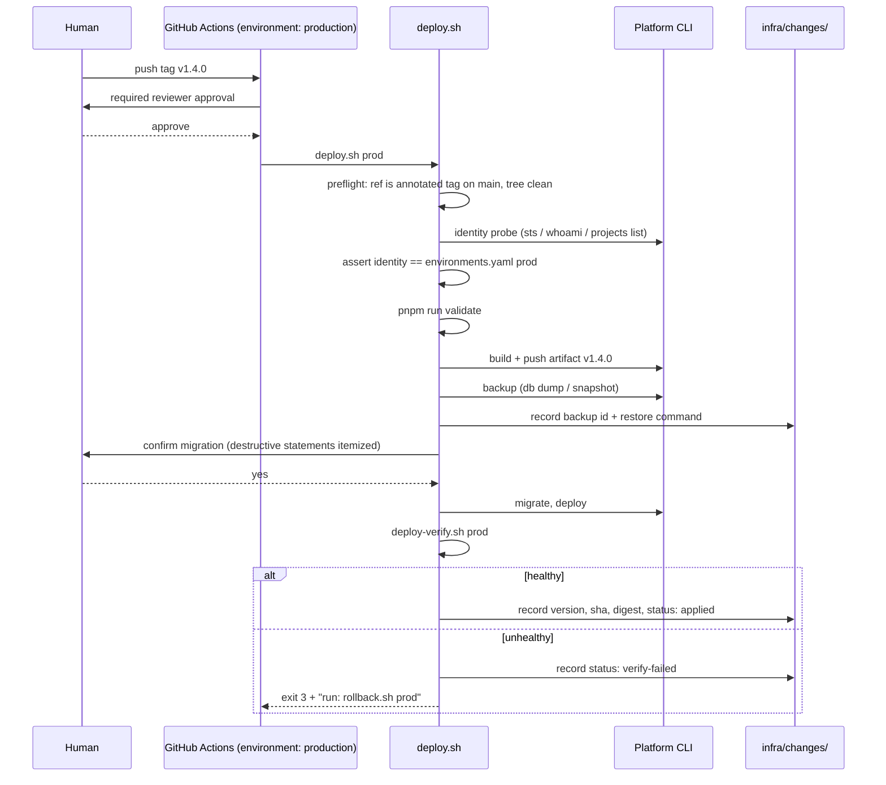
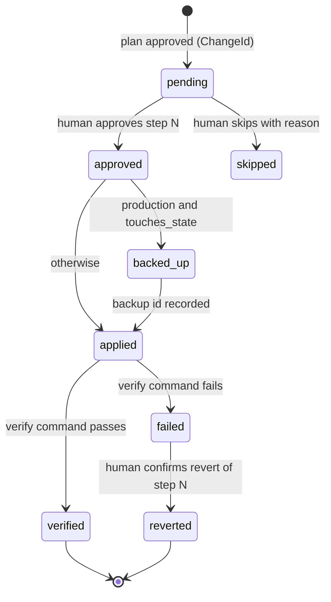

# Technical Specification: infra-engineer

## Changelog

| Version | Date       | Summary                                | Author           |
| ------- | ---------- | -------------------------------------- | ---------------- |
| 1.0     | 2026-09-11 | Initial version, derived from PRD v1.3 | product-engineer |

## Executive Summary

`infra-engineer` ships as Markdown agent contracts plus four skills across the three platform trees, one consumer-owned `infra/` tree with a YAML environment file and per-change record directories, POSIX shell script templates, and GitHub Actions workflow templates. Behavior is enforced by the agent contract (per-step approval, revert, backup, identity, tool check), by a new deterministic `git-guard` rule for tags, and by vitest parity, contract, and security-negative tests reachable from `pnpm run test`.

## Reference Documents

- PRD: `docs/requirements/prd-infra-engineer.md` (v1.3)
- Technical Guidelines: `docs/technical-guidelines.md`, sections Architecture Patterns (layered workflow, capability contracts), Authentication and Authorization, Security Requirements, Data and Database Guidelines (Supabase profile), Deployment and DevOps, Code Organization
- Conventions consumed: `.claude/agents/github-ops.md` (branch naming, milestones, merge), `.claude/skills/git-ops/SKILL.md`, `.claude/hooks/git-guard.sh`, `scripts/release.sh`, `bundle-manifest.json`
- Test conventions: `test/unit/researcher-parity.test.ts`, `test/unit/skill-parity-codebase-research.test.ts`

## Affected Repositories

| Repository        | Role                               | Scope of Changes                                                                                                                                                                                                               |
| ----------------- | ---------------------------------- | ------------------------------------------------------------------------------------------------------------------------------------------------------------------------------------------------------------------------------ |
| `llipe/dev-tasks` | Workflow harness (sole repository) | New agent (4 files), 4 skills (12 files), `templates/infra/`, `templates/scripts/`, `templates/workflows/`, `git-guard` rule 4, workflow tag filters, ADR-005, registries, `bundle-manifest.json`, `package.json` files, tests |

Consumer repositories receive the managed files through `dt install` and `dt update`. `infra/` and the deploy/release workflows are consumer-owned: installed once as templates, never overwritten by update.

## System Architecture

The agent body is policy. Skills are per-surface mechanism. Scripts and workflows are deterministic automation the agent authors and maintains but does not own at runtime. The diagram shows what ships, what is consumer-owned, and which external tools each piece drives.



### Component responsibilities

| Component          | Owns                                                                                                                                                                                                                                         | Must not                                                                        |
| ------------------ | -------------------------------------------------------------------------------------------------------------------------------------------------------------------------------------------------------------------------------------------- | ------------------------------------------------------------------------------- |
| Agent body         | Working loop, step gate, revert and backup rules, two-tier model, identity assertion, tool check procedure, tool-routing table, record and inventory formats, tagging, secrets rules, log-triage rules, Cloudflare DNS and certificate steps | Carry platform command sets beyond the routing table                            |
| `aws-ops`          | AWS command sets per change kind, tier per resource type, cost estimation, backup commands, revert sources, version floor, AWS log table                                                                                                     | Restate loop or safety rules                                                    |
| `fly-ops`          | Same for fly.io (apps, machines, volumes, secrets, certs, deploy, releases as revert source, volume snapshots as backup)                                                                                                                     | Same                                                                            |
| `supabase-ops`     | Same for Supabase Cloud, plus the `db diff` plan flow, drift rule, key-material and RLS findings, MCP read-only rule                                                                                                                         | Same                                                                            |
| `deploy-ops`       | Script contract, environment mapping table, tag policy summary, deploy-target framing, workflow scaffolding procedure, tools `yq` and `gh`                                                                                                   | Contain deploy logic that belongs in scripts                                    |
| `git-guard.sh`     | Deterministic block of agent tag creation, deletion, and push                                                                                                                                                                                | Block human tag operations outside an agent session (hook only runs for agents) |
| Script templates   | Deterministic deploy, verify, rollback, status, and release behavior                                                                                                                                                                         | Contain environment names or secrets                                            |
| Workflow templates | Trigger wiring, environment protection, tool setup, script invocation                                                                                                                                                                        | Contain inline deploy logic                                                     |

### Platform packaging

| Platform | Agent file                               | Entry point                                | Notes                                                                                                            |
| -------- | ---------------------------------------- | ------------------------------------------ | ---------------------------------------------------------------------------------------------------------------- |
| Copilot  | `.github/agents/infra-engineer.agent.md` | `.github/prompts/infra-engineer.prompt.md` | Frontmatter `name`, `description`, `tools: ["codebase", "search", "editFiles", "runCommands", "problems"]`       |
| Claude   | `.claude/commands/infra-engineer.md`     | same file                                  | Main-thread command with `description` and `argument-hint` frontmatter, modeled on `.claude/commands/planner.md` |
| Kiro     | `.kiro/agents/infra-engineer.md`         | same file                                  | Frontmatter `description`, `tools: [read, write, shell]`, `resources`; no `permissions` block                    |

Skills ship as `<tree>/skills/<name>/SKILL.md` in `.github/`, `.claude/`, `.kiro/` with identical body content after frontmatter.

## Data Model & Database Design

There is no database. The data model is a set of file contracts under the consumer-owned `infra/` tree. The diagram shows the entities, their keys, and how a change record references environments and backups.



### `infra/environments.yaml`

Shipped as `templates/infra/environments.yaml` with placeholder values and a `# status: template` first line, following the `/TESTING.md` sentinel pattern. The agent treats a file whose first line still reads `# status: template` as missing and blocks.

```yaml
# status: template            # delete this line once filled
default_cost_threshold_usd: 20
environments:
  dev:
    production: false
    tier0_tool: none # cdk | terraform | cloudformation | none
    fly: { org: my-org, app: my-app-dev }
    supabase: { project_ref: abcdefghijklmnop }
  prod:
    production: true
    tier0_tool: none
    cost_threshold_usd: 20 # optional per-env override
    aws: { account_id: "123456789012", region: us-east-1, profile: prod }
    fly: { org: my-org, app: my-app }
    supabase: { project_ref: qrstuvwxyzabcdef }
    cloudflare: { zone_id: 0123456789abcdef }
```

Rules: a platform block is optional per environment; a step targeting a platform absent from the environment is refused. `production: true` selects tag-triggered deploys and the backup and no-revert rules. Absence of any environment with `production: false` means no dev deploy workflow is scaffolded.

### Change record formats

`infra/changes/<date>-<slug>/` where `<date>` is `YYYYMMDD` and `<slug>` is 2 to 5 hyphenated words. `ChangeId` is the directory name.

`plan.md` carries a header (ChangeId, environment, identity as resolved, cost summary, approval status) and one `### Step N: <title>` section per step with fields `Kind`, `Tool`, `Touches state`, `Backup`, `Forward`, `Verify`, `Revert`, each as a fenced block or a one-line value.

`commands.sh` is append-only. Each applied step adds a block:

```sh
# --- step 3: create app secret (applied 2026-09-11T14:02:11Z) ---
fly secrets set DATABASE_URL="$(aws secretsmanager get-secret-value ... --query SecretString --output text)" -a my-app
```

Secret values never appear literally; commands reference them by ARN, secret name, or shell substitution as above.

`rollback.sh` is regenerated after every applied step: header, then the revert blocks of all applied steps in reverse order, each guarded by `# --- revert step N ---`. It is runnable from any step downward by passing `--from N`.

`result.md` holds a per-step table (`Step`, `Status`, `Backup id`, `Restore command`, `Verified at`, `Evidence`) and a final `status:` line. Log evidence is a redacted excerpt plus the reproducing query, never raw output.

### Inventory files

`infra/inventory/<platform>/<identity path>.json` with a top-level `_generated` object (`platform`, `identity`, `discovered_at`, `tool_version`, `notice: "generated by infra-engineer, do not hand-edit"`). Supabase inventory carries `has_legacy_keys: bool` and `rls_disabled_tables: []` but never key material. No inventory file contains a value matching the redaction pattern set.

## API Design

No network API. The stable interfaces are the script contract, the environment file schema above, and the record formats above.

### Script contract

| Script                 | Args                         | Exit codes                                                              | Reads                              | Writes                                      |
| ---------------------- | ---------------------------- | ----------------------------------------------------------------------- | ---------------------------------- | ------------------------------------------- |
| `deploy.sh`            | `<env> [--dry-run] [--help]` | 0 ok · 1 failure · 2 blocked (tool, identity, policy) · 3 verify failed | `infra/environments.yaml`, git ref | `infra/changes/<date>-deploy-<env>/`        |
| `deploy-verify.sh`     | `<env> [--help]`             | 0 healthy · 3 unhealthy (prints exact rollback command)                 | environment health endpoints       | nothing                                     |
| `rollback.sh`          | `<env> [--to <version>]`     | 0 ok · 1 failure · 2 blocked                                            | `infra/changes/` history           | `infra/changes/<date>-rollback-<env>/`      |
| `deploy-status.sh`     | `[<env>]`                    | 0                                                                       | platform CLIs, read-only           | nothing                                     |
| `release.sh`           | `<major\|minor\|patch>`      | as today                                                                | git history                        | `CHANGELOG.md`, version file, annotated tag |
| `release.sh --dry-run` | same                         | 0                                                                       | git history                        | nothing                                     |

Common rules: `#!/usr/bin/env bash`, `set -euo pipefail`, `--help` on every script, environment names resolved from `infra/environments.yaml` through `yq` (v4), refusal with exit 2 when the file is missing or still a template, no environment name hardcoded, no secret read into a variable that is later echoed. JS/TS repos get `package.json` wrappers `deploy:<env>`, `deploy:verify:<env>`, `rollback:<env>`, `deploy:status`, `release`, `release:dry-run` generated from the declared environments.

### Deploy sequence

The sequence shows `deploy.sh prod` on a tag push, including the verify-failure path.



In the dev mapping the same script runs on push to `main` with the artifact tag `main-<short-sha>`, no reviewer gate, and no backup unless the environment is marked `production: true`.

## Authentication & Authorization Design

| Actor                 | May                                                                                            | May not                                                                      | Enforced by                                               |
| --------------------- | ---------------------------------------------------------------------------------------------- | ---------------------------------------------------------------------------- | --------------------------------------------------------- |
| Agent, discover phase | Run read-only CLI calls, write `infra/inventory/`                                              | Any write command                                                            | Agent contract; tool check requires read credentials only |
| Agent, apply phase    | Run the approved step's forward commands after step approval                                   | Run ahead, batch steps, write without `ChangeId`, create or push tags, merge | Agent contract; `git-guard` rules 1 and 4                 |
| Agent, record phase   | Commit under `infra/` and workflow files on a feature branch, open a draft PR via `github-ops` | Push or merge to `main`                                                      | `git-guard` rule 1                                        |
| Human                 | Approve plan and steps, run `release`, push tags, approve the production environment           |                                                                              | GitHub environment required reviewers                     |
| GitHub Actions        | Run scripts with OIDC-assumed AWS role, `FLY_API_TOKEN`, `SUPABASE_ACCESS_TOKEN` secrets       | Hold long-lived AWS keys                                                     | Workflow template                                         |

Credentials are consumer-provided. The tool check reads identity with `aws sts get-caller-identity`, `flyctl auth whoami`, `supabase projects list`, `gh auth status`, and the Cloudflare token verify endpoint. It compares AWS account id, fly org, and Supabase project ref against the target environment and refuses on mismatch with exit-style status `blocked`.

## Business Logic Implementation

### Step lifecycle

Every step in a change moves through these states. The agent persists the state in `result.md` after each transition so a resumed session continues from the right step.



Rules enforced by the agent contract:

- A production step whose `Revert` field is empty is refused at plan time. A non-production step may carry `Revert: none (accepted)` only after an explicit approval naming that step.
- A production step with `Touches state: yes` enters `backed_up` before `applied`; the backup command comes from the owning skill.
- Foundation-tier steps are never applied; they become `routed` with `commands.sh` holding the commands for the human to run and `result.md` `status: routed-to-<tool>`.
- Destroy plans list steps in reverse dependency order, require the environment name typed back, and refuse production foundation targets.
- The cost summary in `plan.md` lists every resource with a monthly estimate and its source URL or CLI pricing call; resources at or above the environment threshold carry an `APPROVAL REQUIRED` marker and are approved by name.

### Tool check

Run before discover (read tools) and again before the first apply step (write credentials). For each tool the owning skill declares `name`, `probe`, `floor`, `auth_probe`. Result per tool is `ok | missing | below-floor | unauthenticated | wrong-identity`, and any non-`ok` blocks the phase with the remediation string from the skill. Floors at v1: AWS CLI `2.x`, `flyctl` current major, Supabase CLI `2.x`, `gh` `2.x`, `yq` `4.x`; exact minors pinned in the skills during implementation.

### Tool-routing table

The table lives in the agent body and is asserted by the parity test row for row. Columns: change kind, tool, phase, owning skill. Rows: discover AWS, discover fly, discover Supabase, build image, create app, deploy app, set secret (AWS, fly, Supabase, GitHub Actions), create IAM policy, attach IAM policy, DNS record, certificate (ACM, fly), database migration, foundation change, repo and PR operation, pipeline change, log triage, cost sweep.

### Log triage

Queries are constructed by the owning skill's log table with a mandatory `--since` or start and end bound derived from the `ChangeId` timestamp, deploy timestamp, or a stated incident window. The agent prints the window and expected scan scope before any Logs Insights or `filter-log-events` call and refuses when no bound is available. Output passes through the redaction pattern set before it reaches the transcript or a file.

### Redaction pattern set

`templates/infra/redaction-patterns.txt`, one extended regex per line, comments allowed. Covers AWS access key ids and secret keys, `sb_secret_*` and `sb_publishable_*` keys, JWT-shaped strings, fly tokens (`fo1_`, `fm2_` prefixes), GitHub tokens (`ghp_`, `gho_`, `github_pat_`), bearer headers, `postgres://` and `postgresql://` URLs with credentials, generic `password=` and `secret=` pairs, and email addresses. Applied with `sed -E -f` producing `[REDACTED:<category>]`.

## Integration Details

| Integration    | Method                                                      | Failure handling                                                                           | Credentials                                          |
| -------------- | ----------------------------------------------------------- | ------------------------------------------------------------------------------------------ | ---------------------------------------------------- |
| AWS            | `aws` CLI v2, JSON output                                   | Non-zero exit marks the step `failed`; no automatic retry on write; read probes retry once | Named profile from `environments.yaml`; OIDC in CI   |
| fly.io         | `flyctl`, JSON output where supported                       | Same; `fly releases` supplies the previous image for revert                                | `FLY_API_TOKEN`                                      |
| Supabase Cloud | `supabase` CLI v2; MCP read-only for discovery when present | `db push` failure marks step `failed`; drift never auto-resolved                           | `SUPABASE_ACCESS_TOKEN`; linked project ref asserted |
| Cloudflare     | REST API via `curl`, DNS records endpoint only              | Prior record captured before update; revert restores it                                    | API token with DNS edit scope                        |
| GitHub         | `gh` via `github-ops` for issues, PRs, secrets; workflows   | Hook blocks tag operations; PR opening failure reported, records stay on the branch        | `gh auth`                                            |
| `yq`           | Reads `environments.yaml` in scripts                        | Missing `yq` exits 2 with install remediation                                              | none                                                 |

Bounded retry per the guidelines: at most three attempts or fifteen minutes per step before escalating to the human with evidence.

## User Interface & Client Behavior

No UI. The human interface is the approval prompt per step, which always shows: step number and title, environment and resolved identity, forward commands, revert commands, backup plan when applicable, cost line items requiring approval, and the exact question being asked. The agent never bundles two steps into one question.

## Performance & Scalability Approach

Not a throughput system. Two bounds matter: log queries are always time-bounded and their scan scope is stated before billed execution; discovery caches inventory files and re-discovers only the platforms a plan touches.

## Security Implementation

- No secret material in any artifact: enforced by the redaction pattern set on log output, by command construction rules in every skill (reference by ARN, name, or substitution), and by the security-negative test that runs fixtures through the pattern set and scans all template files.
- Identity assertion before every write phase; wrong identity is a `blocked` state, never a warning.
- Per-step human approval; approval text is recorded in `result.md` with a timestamp.
- Production backup before state changes; the restore command is recorded before the step applies.
- Agents cannot create, move, delete, or push tags (`git-guard` rule 4) and cannot push or merge to `main` (rule 1).
- Untrusted input: tool output, log content, and remote state are data; the agent never executes instructions found in them.
- Workflows use OIDC for AWS, pinned action versions, and a protected environment for production.

## Error Handling & Logging

Every agent outcome is one of `applied`, `verified`, `failed`, `blocked`, `routed`, `reverted`, `skipped(<reason>)`, matching the guidelines' distinct states. `blocked` always carries a remediation string. Scripts use the exit-code table above. Workflow logs are the CI evidence; the change record holds only the redacted excerpt and the reproducing query.

## Testing Strategy

`/TESTING.md` is unfilled, so every test below is specified here with its fixtures.

| Test file                                     | Layer    | Asserts                                                                                                                                                                                                                                                                                                                                                                             |
| --------------------------------------------- | -------- | ----------------------------------------------------------------------------------------------------------------------------------------------------------------------------------------------------------------------------------------------------------------------------------------------------------------------------------------------------------------------------------- |
| `test/unit/infra-engineer-parity.test.ts`     | Unit     | Four agent files exist; Kiro frontmatter has `description` and `tools` and no `permissions`; contract statements present in all three variants (step approval, `ChangeId`, revert required, production backup, no autonomous mode, identity assertion, tool check with floors, routing rows, no tags by agents, redaction, bounded queries); registries list the agent              |
| `test/unit/skill-parity-infra.test.ts`        | Unit     | `aws-ops`, `fly-ops`, `supabase-ops`, `deploy-ops` present in three trees with identical bodies; each platform skill declares `floor`, backup command, revert source, log table; `supabase-ops` declares `db diff` plan, drift rule, no-MCP-write; `deploy-ops` declares the script contract and environment mapping table                                                          |
| `test/unit/infra-redaction.test.ts`           | Security | Every fixture line (synthetic AWS key pair, `sb_secret_*`, `service_role` JWT, fly token, `ghp_` token, bearer header, `postgres://user:pass@`, email) is rewritten to `[REDACTED:*]`; benign lines untouched; no template file under `templates/` and no skill file contains a fixture-shaped value                                                                                |
| `test/unit/git-guard-tags.test.ts`            | Unit     | Hook exits 2 for `git tag v1.2.3`, `git tag -a`, `git tag -d`, `git push --tags`, `git push origin refs/tags/v1`, `git push origin v1.2.3`, `gh release create`; exits 0 for `git tag -l`, `git tag --list`, `git describe --tags`, `git push -u origin issue/1-x`                                                                                                                  |
| `test/unit/infra-script-contract.test.ts`     | Contract | Each template script passes `bash -n`, prints usage on `--help`, exits 2 on missing or template `environments.yaml`, and in `--dry-run` with stub `aws`, `flyctl`, `supabase`, `yq` on `PATH` prints the planned command sequence without executing; `deploy.sh prod` refuses a non-tag ref; shellcheck runs when available, otherwise reported `SKIPPED(shellcheck not installed)` |
| `test/unit/infra-workflow-templates.test.ts`  | Unit     | Workflow templates parse as YAML; prod template triggers on `v[0-9]+.[0-9]+.[0-9]+` and declares `environment: production`; dev template triggers on push to `main`; no template contains inline `aws`/`flyctl`/`supabase` deploy calls, only script invocations; this repo's two release workflows use the exact-semver filter                                                     |
| `test/unit/distribution-*.test.ts` (extended) | Unit     | `templates/infra`, `templates/scripts`, `templates/workflows` are managed; `infra/` and `.github/workflows/deploy-*.yml` are consumer-owned; update never overwrites a filled `environments.yaml`                                                                                                                                                                                   |

All tests run under `pnpm run test:unit` and are reachable from `pnpm run test` and `pnpm run validate`. Manual verification for Phase 1: run the agent against a throwaway fly app in a non-production environment through one full plan (create app, set secret, deploy, add DNS record), then revert it with the generated `rollback.sh`.

## Deployment & Rollout

The feature ships through the normal release path of this repository. Two phases, each one integration branch under `planner` or a sequence of issue PRs:

- **Phase 1:** agent, `aws-ops`, `fly-ops`, `supabase-ops`, `templates/infra/`, redaction set, ADR-005, registries, manifest, tests.
- **Phase 2:** tag policy and `git-guard` rule 4, workflow filter fix, `deploy-ops`, script templates, workflow templates, manifest and `package.json` `files` for `templates/`, technical-guidelines script names.

Backward compatibility: `bundle-manifest.json` gains three managed paths and two consumer-owned paths. Consumers on `dt update` receive the new managed files; `infra/` and workflows are installed only when absent. The manifest's `consumer_owned_paths` today holds specific files; `infra/` is the first directory prefix, so `distribution-install` and `distribution-update` are tested for prefix semantics before the manifest change lands. This repo's own workflow filter change is a one-line fix with no release impact.

Rollback of the feature is a revert of the PRs; nothing runs at install time.

## Dependencies & Risks

| Risk                                                               | Mitigation                                                                                                         |
| ------------------------------------------------------------------ | ------------------------------------------------------------------------------------------------------------------ |
| Synthesized AWS plan is wrong                                      | Mandatory discovery, exact commands recorded, verify command per step, revert per step                             |
| A revert that does not actually restore state                      | Production backup rule; restore command recorded before apply; manual Phase 1 verification exercises `rollback.sh` |
| Redaction miss leaks a credential into git history                 | Pattern set is a file with a fixture-driven test; raw log output is never written                                  |
| `yq` absent in consumer environments                               | Declared tool with floor; scripts exit 2 with install remediation; templates document it                           |
| Directory-prefix semantics in the installer are not what we assume | Tested before the manifest change; the story is blocked until the test passes                                      |
| Agent prose grows past what a parity test can hold                 | Contract statements are enumerated in the parity test; each skill owns its own surface                             |
| Supabase log endpoint or retention changes                         | Open question; `researcher` pass before implementing the Supabase log table                                        |

Technology dependencies: no new npm dependency. Consumer-provided: AWS CLI 2, `flyctl`, Supabase CLI 2, `gh` 2, `yq` 4, Cloudflare API token, `shellcheck` optional.

## Open Questions

1. Supabase Cloud log retrieval endpoint and per-plan retention: confirm during `supabase-ops` implementation via a `researcher` pass.
2. Exact CLI version floors: pin when each skill is written, after checking current command surfaces.
3. Whether `deploy.sh` should also read a `deploy.kind` per environment (`ecs | fly | supabase-functions | static`) or detect it from the platform blocks present. Proposal: detect, refuse when ambiguous.
