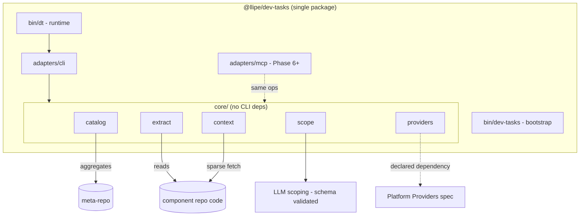
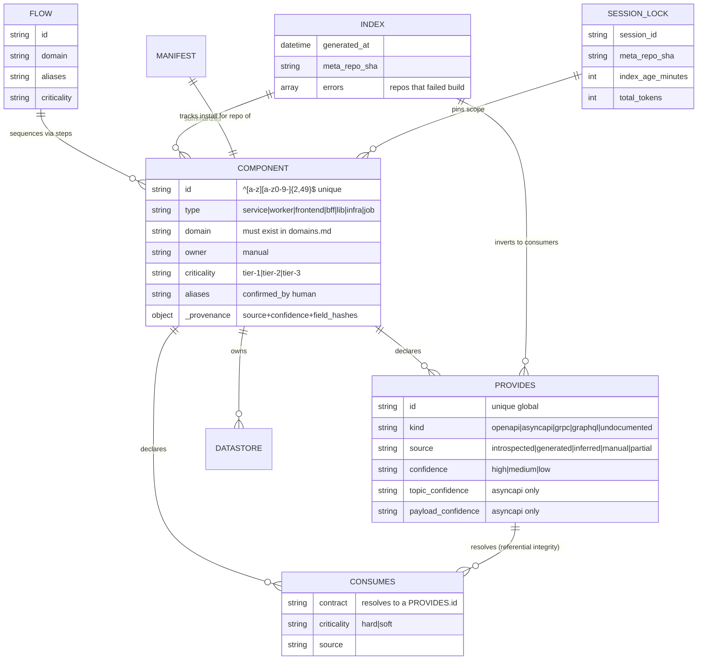
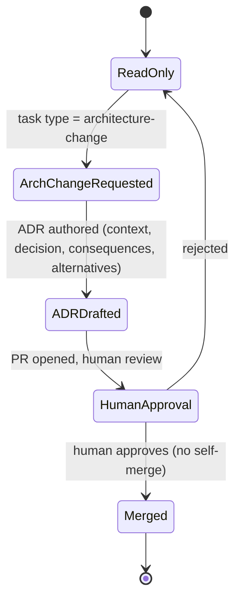

# Specification: dev-tasks Multi-Repo Context (MRC)

## Changelog

| Version | Date       | Summary                                                                                                                                                                                                                                                                                       | Author           |
| ------- | ---------- | --------------------------------------------------------------------------------------------------------------------------------------------------------------------------------------------------------------------------------------------------------------------------------------------- | ---------------- |
| 1.0     | 2026-07-28 | Initial version, reformatted from the `dev-tasks-multirepo-SPEC.md` draft (v0.2) into the standard specification format. Content preserved: core-as-library with CLI/MCP adapters, `component.json` with provenance, extraction pipeline, CLI surface, LLM scoping contract, and CI behavior. | product-engineer |

## 1. Executive Summary

This specification implements the MRC PRD as a single `@llipe/dev-tasks` npm package exposing two binaries (`dev-tasks` bootstrap, `dt` runtime) over a shared `core/` library, with CLI and (later) MCP adapters that hold no business logic. The runtime derives a `component.json` manifest and OpenAPI/AsyncAPI/`schema.md` contracts from a repository's code with explicit provenance and confidence, aggregates those manifests into a generated meta-repo catalog validated in CI, resolves a bounded per-task context bundle through a deterministic-first pipeline with a single schema-validated LLM scoping step, and verifies contract boundaries without an LLM. State lives only in Git and a SHA-keyed local cache; there is no server, database, or UI.

## 2. Reference Documents

- PRD: `docs/requirements/prd-multi-repo-context.md`
- `docs/product-context.md` — portable-harness scope, primary/secondary users, safety posture
- `docs/technical-guidelines.md` — technical standards, testing layers, dependency and security rules
- `platform-providers-SPEC.md` (pending) — SCM/tracker abstraction; MRC declares the dependency at three integration points (§9)
- Existing `product-engineer` agent and `activity-init` skill (all three platform trees) — the `init` flow this feature extends

## 3. Affected Repositories

| Repository            | Role                                        | Scope of Changes                                                                                                                                                                                                                |
| --------------------- | ------------------------------------------- | ------------------------------------------------------------------------------------------------------------------------------------------------------------------------------------------------------------------------------- | --------------------------------------------------------------------------------------------------------------------- | -------- |
| `llipe/dev-tasks`     | Source of truth for the distributed harness | Adds the `@llipe/dev-tasks` package (two binaries), `core/` library (catalog, extract, context, scope, providers), CLI/MCP adapters, JSON Schemas, the `dev-tasks.sh` migration shim, and rewritten `init` skill/agent content. |
| Meta-repo (new)       | Catalog aggregation                         | New repository: `architecture.md`, `domains.md`, `glossary.md`, `conventions.md`, `platform.yaml`, `registry.yaml`, `adr/`, generated `catalog/`, hand-authored `catalog/flows/`, and `schemas/`.                               |
| Component repos (~20) | Consume the harness; own their metadata     | Each gains a root `component.json`, `contracts/openapi                                                                                                                                                                          | asyncapi/`, generated `docs/schema.md`, `AGENTS.md`, and `.dev-tasks/` (`version`pin,`manifest.json`, `config.yaml`). |
| CI (Bitbucket/GitHub) | Enforcement                                 | Meta-repo: scheduled + on-push `dt catalog build                                                                                                                                                                                | validate`. Component repo: PR-time `dt validate-component`and`dt verify contract-diff                                 | impact`. |

No other repository is in scope. There is no runtime deployment target beyond the distributed package and the YAML/JSON artifacts it produces.

## 4. System Architecture

### 4.1 Code layers

```text
@llipe/dev-tasks  (one npm package, one release train)
│
├── bin/dev-tasks         bootstrap: install, update, status, pin, doctor
├── bin/dt                runtime:   extract, catalog, ctx, scope, init, verify
│
├── core/                 library — no CLI dependencies
│   ├── catalog/          parsing, graph, closure, index, validation
│   ├── extract/          stack detection + pluggable extractors
│   ├── context/          sparse fetch, cache, assemble, budget
│   ├── scope/            lexical candidates, gate, partition
│   └── providers/        SCM / tracker (separate spec)
│
├── adapters/
│   ├── cli/              wraps core, formats stdout/JSON
│   └── mcp/              MCP server (Phase 6+; same operations as tools)
│
└── skills/               data files — methodology, copied to the target repo
```

Structural rule: **no business logic lives in `adapters/`**. The MCP adapter is built later, but the core is written from day one as if it already existed — zero cost, avoids a rewrite.

### 4.2 Component diagram



### 4.3 Multi-repo `init` pipeline

`[D]` deterministic, `[L]` LLM.

```text
[D] 0  pin          resolve meta-repo → SHA; validate index freshness
[D] 1  candidates   lexical match task ↔ aliases/domains/flows/ids
[L] 2  scope        intent → components + boundaries (validated JSON)
[D] 3  closure      expand by graph; validate; gate; fetch; assemble
[L] 4  plan         product-engineer works on the bundle
```

### 4.4 Extraction pipeline (existing repo)

```text
[D]   1  detect      stack, HTTP framework, ORM, messaging client
[D]   2  schema      ORM AST or introspection → schema.md
[D/L] 3  openapi     route 1|2|3 by detected capability
[D/L] 4  asyncapi    topic inventory [D] + payloads [D if typed, L if not]
[D]   5  component   derive component.json from 1-4
[H]   6  human gate  owner, domain, criticality, confirm aliases
[L]   7  narrative   product-context.md, technical-guidelines.md (interview)
```

`[H]` human. The LLM never produces structure; it writes descriptions over already-extracted structure.

### 4.5 Repository layouts

**Meta-repo** (C4 L1-L2 only):

```text
checkout-platform/
├── README.md  product-context.md  architecture.md  domains.md
├── glossary.md  conventions.md  environments.md
├── platform.yaml            # provider config (SCM, tracker)
├── registry.yaml            # repos to aggregate
├── adr/
├── catalog/
│   ├── index.yaml           # generated
│   ├── components/          # generated (mirror)
│   └── flows/               # hand-authored
└── schemas/
    ├── component.schema.json  flow.schema.json  scope-output.schema.json
```

**Component repo** (C4 L3-L4):

```text
payment-service/
├── AGENTS.md  component.json
├── .dev-tasks/  (version pin, manifest.json, config.yaml)
├── contracts/openapi/payments-v2.yaml
├── contracts/asyncapi/events.yaml
└── docs/  (architecture.md, schema.md [generated], conventions.md [deltas], adr/, specs/)
```

### 4.6 Implementation decisions

| Decision      | Choice                      | Reason                                                       |
| ------------- | --------------------------- | ------------------------------------------------------------ |
| Language      | TypeScript / Node 20        | Guaranteed where the agent runs; `npx` install-free          |
| Schemas       | JSON Schema 2020-12 (`ajv`) | Same artifact in CLI and CI                                  |
| TS AST        | TypeScript Compiler API     | Regex over code is unacceptable for contract extraction      |
| Git           | binary via `execa`          | `--filter=blob:none --sparse` poorly covered by JS libraries |
| OpenAPI diff  | `oasdiff`                   | Proven breaking-change detection                             |
| AsyncAPI diff | purpose-built comparator    | No equivalent standard exists                                |
| Cache         | filesystem keyed by SHA     | Immutable, trivial invalidation                              |
| State         | none beyond Git and cache   | No service to operate                                        |

## 5. Data Model & Artifact Design

There is no application database. The "data model" is the set of durable artifacts and their relationships.

### 5.1 Artifact relationship diagram



### 5.2 `component.json` (per repo)

Key fields: identity (`id`, `name`, `description`, `repo`, `type`), classification (`domain`, `subdomain`, `owner`, `criticality`, `lifecycle`), `stack`/`runtime`, `aliases`, `provides[]`, `consumes[]`, `datastores[]`, `docs.*`, `paths.*`, and a `_provenance` block. Each `provides`/`consumes` entry and each provenance field records a `source` and a `confidence`; AsyncAPI contracts split `topic_confidence` from `payload_confidence`.

**`source` vocabulary:**

| Value          | Meaning                                                                    |
| -------------- | -------------------------------------------------------------------------- |
| `introspected` | Derived from an existing structured source (AST, on-disk spec, ORM schema) |
| `generated`    | Produced by a framework tool invoked by the extractor                      |
| `inferred`     | Produced by an LLM over extracted structure; requires review               |
| `manual`       | Entered by a human                                                         |
| `partial`      | Composite: part introspected, part inferred (used for AsyncAPI)            |

`_provenance` additionally stores `extracted_at`, `extractor` version, `repo_sha`, the `detector` result, per-field `source`/`confidence` (with `confirmed_by` for confirmed inferences), and `field_hashes` (SHA-256 per field, for later manual-edit detection).

Rules beyond the schema, enforced by `dt catalog validate`: `id` and `provides[].id` unique across the catalog; `consumes[].contract` resolves to an existing `provides[].id`; `domain` exists in `domains.md`; `docs.architecture` and `docs.schema` exist; `provides[].path` exists unless `kind: undocumented`; fields with `source: manual` are non-empty.

### 5.3 `catalog/flows/*.yaml` (hand-authored)

The only catalog artifact edited by hand. Declares `id`, `domain`, `aliases`, `criticality`, ordered `steps[]` (each with `component` and a `role`/`via`/`trigger`), and optional `sla`. Requires an explicit owner or it is abandoned.

### 5.4 `catalog/index.yaml` (generated)

Flat routing index: `generated_at`, `generator`, `meta_repo_sha`; a `components` map (summary per component including `aliases`, `provides`, `consumes`, `extraction_quality` counts); a `contracts` map with an **inverted consumer index** and confidence; `domains`; `flows`; and an `errors[]` list of repos that failed the build.

### 5.5 `.dev-tasks/manifest.json` (per repo)

Records `version`/`pinned`/`installed_at`, a `skills[]` array with `sha256` (current file) and `origin_sha256` (as shipped) plus a `modified` flag, and the last `extraction` run detector. `sha256 != origin_sha256` ⇒ locally edited ⇒ `update` does not overwrite.

### 5.6 `session.lock.json` (per `init`)

Reproducibility record: `session_id`, `created_at`, `dt_version`, `task` (text + hash), pinned `meta_repo` (url + sha), `index` (generated_at + age_minutes), `scope` (`primary`/`secondary`/`flow`/`contracts_crossed`/`source`/`confidence`/`review_flags`), `repos[]` (id + sha + cache_hit), and `bundle` (path, per-file `sha256`+`tokens`, `total_tokens`, `truncated[]`). Determinism guarantee: the same `session.lock.json` reproduces the same bundle byte-for-byte.

## 6. API Design (CLI + Core Interface)

There is no network API. The "API" is the CLI surface (and the equivalent core operations later exposed as MCP tools). All commands accept `--json`, `--meta-repo <url|path>`, and `-v`; human output goes to stdout, diagnostics to stderr.

### 6.1 `dt extract`

```text
dt extract detect                       report stack and available strategies
dt extract schema    [--db-url <url>]
dt extract openapi   [--strategy auto|1|3]
dt extract asyncapi
dt extract component [--interactive]
dt extract all       [--interactive] [--force]
```

`--interactive` enables the non-derivable-field prompt; without it, those fields stay empty and are listed in `requires_human`.

### 6.2 `dt catalog`

```text
dt catalog build     [--registry registry.yaml] [--concurrency 8]
dt catalog validate  [--strict]
dt catalog resolve   --text "..."
dt catalog get       --id <component>
dt catalog deps      --id <component> [--depth 2] [--direction up|down|both]
dt catalog consumers --contract <id>
dt catalog flow      --id <flow>
dt catalog closure   --ids a,b [--include-consumers] [--max 8]
dt catalog coverage
```

`build` is idempotent (writes nothing if unchanged); a single repo's failure does not abort the build — it is recorded in `index.errors[]` and the exit code is 3. Validation checks V01-V19 (identity uniqueness, referential integrity, domain existence, doc/path existence, manual-field non-emptiness as errors; undeclared cycles, missing consumers/aliases, low-confidence ratios, stale extraction as warnings). Exit 0 without errors, 4 with errors. The `resolve` scorer is deterministic and explainable (no embeddings in v1): weighted lexical signals (exact id 100, exact alias 80, flow name/alias 75, domain 60, alias token contained 40, glossary→domain 35, name/description 25), normalized (lowercase, de-accented, light es/en stemming, stopwords), top 12 with score and matched signal, default threshold 20.

### 6.3 `dt ctx`

```text
dt ctx fetch    --ids a,b [--refresh]
dt ctx assemble --scope scope.json --out <dir> [--budget 60000]
```

`fetch` uses blob-filtered sparse checkout into `~/.dev-tasks/cache/<host>/<org>/<repo>/<sha>/` (immutable; LRU GC over 5 GB or 30 days; concurrency 8; 60s timeout per repo; failure ⇒ exit 5). `assemble` writes layers in a fixed order with per-layer token caps (index, product-context, architecture, glossary filtered to in-scope domains, conventions, flow, per-primary-component architecture/schema/conventions, boundary contracts with visible confidence, ADR index). `secondary` components contribute only a summary. Truncation happens in reverse priority order and is recorded in `bundle.truncated[]`; non-truncable layers are never cut, and if the minimum does not fit, exit 6.

### 6.4 `dt scope`

```text
dt scope candidates --task "<text>" [--top 12]
dt scope gate       --scope scope.json [--max-components 4]
```

Gate rules: G1 too many components → abort + partition proposal; G2 `confidence: low` → abort + disambiguation; G3 non-empty `unresolved` → abort; G4 component without `component.json` → abort; G5 LLM component absent from candidates and closure → continue with `review_flags`; G6 scope crosses >2 domains → continue with flag; G7 boundary contract `payload_confidence: low` → continue with flag. Abort exit code is 7 (a system decision, distinct from an error).

### 6.5 `dt init`

```text
dt init --task "<text>" [--components a,b] [--flow <id>]
        [--max-components 4] [--budget 60000] [--no-llm]
        [--max-index-age 240] [--out .dev-tasks/session/]
```

Orchestrates pin → candidates → LLM scope (with one repair retry) → graph closure → gate → fetch → assemble → `session.lock.json`. `--components` (or `--no-llm` with `--components`) bypasses the LLM step. Unknown components, stale index, invalid scope after retry, no candidates, and gate abort each map to a distinct exit code (see §6.7).

### 6.6 `dt verify`

```text
dt verify contract-diff --contract <id> --base <ref> --head <ref>
dt verify impact        --contract <id> [--emit-tasks]
dt verify drift         [--id <comp>] [--threshold 20]
```

`contract-diff` uses `oasdiff` for OpenAPI and the purpose-built comparator for AsyncAPI (removed channel, new required field, changed type, narrowed enum); no LLM in any case; it does **not** evaluate `payload_confidence: low` payloads (constant false positives); exit 8 on a breaking change. `impact` reads the inverted consumer index with each consumer's `criticality` and, with `--emit-tasks`, produces per-consumer derived tasks via the tracker provider. `drift` is a `git log` heuristic over `paths.source` vs `docs.root`, a prioritization signal, not a proof.

### 6.7 Exit codes

| Code | Meaning                                           |
| ---- | ------------------------------------------------- |
| 0    | OK                                                |
| 1    | Unexpected error                                  |
| 2    | Incorrect usage                                   |
| 3    | Partial catalog build                             |
| 4    | Catalog validation errors                         |
| 5    | Fetch failure for one or more repos               |
| 6    | Insufficient context budget                       |
| 7    | Gate aborted (system decision, not an error)      |
| 8    | Breaking change detected                          |
| 9    | Stale index                                       |
| 10   | Invalid scoping after retry                       |
| 11   | No candidates                                     |
| 12   | Unknown component                                 |
| 13   | Incomplete extraction: required fields unresolved |
| 14   | Reconciliation conflict (edited skills or fields) |

## 7. Authentication & Authorization Design

No end-user authentication is introduced. Two authorization concerns matter:

1. **Repository access.** Cross-repo reads use blob-filtered, no-checkout, depth-1 sparse clones cached by SHA. No write access to component repos is required for extraction or context resolution. Database introspection is off by default and, when enabled via `--db-url`, targets a local/development database only — never production, never via committed credentials.
2. **Meta-repo write authority.** Only the `architecture-change` task type may write to the meta-repo. It may modify `architecture.md`, `domains.md`, `glossary.md`, `conventions.md`, and `catalog/flows/`, but never the generated `catalog/components/` or `catalog/index.yaml`. It **MUST** produce an ADR and **MUST** obtain human approval before the PR; no auto-merge into the default branch.



## 8. Business Logic Implementation

### 8.1 Extraction

**Detection** (`dt extract detect`) inspects `package.json`, directory structure, and config files, and reports stack, HTTP framework + `openapi_strategy` (with evidence), ORM (+ schema path), messaging client, and a `type_hint`.

**OpenAPI strategy matrix:**

| Signal                                                                          | Strategy                                        | `source`       | `confidence`                   |
| ------------------------------------------------------------------------------- | ----------------------------------------------- | -------------- | ------------------------------ |
| `openapi.yaml/json` committed or produced to disk by build                      | Route 1 — copy and normalize                    | `introspected` | high                           |
| `@nestjs/swagger`, `fastify-swagger`, `zod-to-openapi`, `tsoa`, no on-disk file | Route 2 — invoke framework builder in isolation | `generated`    | high                           |
| Express/Fastify/Hono routes without a generator                                 | Route 3 — AST + LLM for descriptions            | `inferred`     | medium (typed) / low (untyped) |

Route 2 is an open decision (build vs. degrade to route 3); detection reports the per-strategy count even if route 2 is unimplemented. Cross-cutting constraint: no strategy runs the full service. Route 2 builds only the documentation module on a minimal app context with no DB connections or secrets; if the framework cannot be isolated, the repo degrades to route 3 — credentials are never requested.

**Schema** (`dt extract schema` → `docs/schema.md`): Prisma/Drizzle/TypeORM via AST (`introspected`); no ORM + development `DATABASE_URL` via `information_schema` (`introspected`); no ORM via SQL migrations + LLM (`inferred`/low). Output is tables, columns (type + nullability), PK/FK, indexes, and a Mermaid relationship diagram; semantic table descriptions are LLM prose over extracted structure — columns are never invented.

**OpenAPI route 3** (highest risk): locate route registrations via AST, resolve the full path by composing router prefixes, derive path/query/body params from the handler type (including zod types) when typed, mark responses without a schema when the return type is `any`/`unknown`, use the LLM only for `summary`/`description`/`tags`, and validate against the OpenAPI 3.1 JSON Schema. Dynamically registered routes are not AST-resolvable and are reported in `extraction_report.unresolved[]` — that list is the explicit remaining manual work.

**AsyncAPI** (`dt extract asyncapi`) — the core of the schema-registry-free Kafka design — extracts two things tracked separately:

- **Topic inventory (`topic_confidence`):** AST over kafkajs `producer.send/sendBatch` (→ `provides`) and `consumer.subscribe` (→ `consumes`). Topic resolution: string literal or module constant/enum → high; template literal with env var → medium (record pattern + variable); unresolvable expression → low + `unresolved[]`. This alone feeds the event `provides`/`consumes` that the graph closure needs.
- **Payload (`payload_confidence`):** typed `send()` (generic/interface in the signature) → medium from the type; inline object literal → low, LLM infers shape; opaque serialization → low + `unresolved[]`. A `low` payload is never treated as a firm contract: `dt init` adds it to `review_flags` and `verify contract-diff` skips it.

**`component.json` derivation** by field category: derivable (`stack`, `type`, `provides[].path`, `datastores`, `paths`, `docs.*`, `consumes`) from detection/extraction; inferable-with-confirmation (`description`, `aliases`, `subdomain`, `consumes[].criticality`) via LLM requiring human confirmation; non-derivable (`owner`, `domain`, `criticality`, `lifecycle`) via mandatory human prompt. `aliases` requires confirmation because it feeds lexical routing — a wrong alias silently breaks future tasks. Non-derivable fields are never invented; unanswered ⇒ empty ⇒ invalid manifest ⇒ `catalog validate` rejects it.

**Idempotency / reconciliation** (shared with skill updates — one implementation, two uses): for each field, write if absent, write if `hash(existing) == provenance.field_hashes` (unedited), skip if the new value equals existing, otherwise report a conflict with a diff and do not write without `--force`.

**Extraction report** (`dt extract all` → `extraction_report.json`): strategies used, coverage (endpoints/topics/tables resolved vs. unresolved), confidence counts, `unresolved[]` with location and reason, and `requires_human[]`. Aggregated in the catalog, this is the Phase 1 deliverable of value.

**Pluggable extractors:** each provider declares `id`, `detect()`, `capabilities[]` (e.g., `openapi_native`, `openapi_ast`, `db_introspection`, `orm_ast`, `topic_ast`, `payload_typed`), and optional `extractSchema/extractOpenApi/extractAsyncApi`. A missing capability does not fail — it marks the artifact not-produced and records it in `requires_human`. Phase 1 ships the Node/TS provider.

### 8.2 Scoping (LLM step)

The model receives only the task, the lexical `candidates` (each with id/domain/type/description/score/matched_on/provides/consumes), the `flows`, and the in-scope `domains` — never the full catalog or documentation. It returns JSON conforming to `scope-output.schema.json`:

- Required: `primary` (1-6), `secondary` (≤8), `contracts_crossed`, `confidence` (`high|medium|low`), `unresolved`, `rationale` (≤600 chars); optional `flow`.
- Post-schema validation: every id must exist in `candidates` or the index; an invented id invalidates the output and triggers the single repair retry, after which `init` aborts (exit 10).

Prompt rules: choose only from candidates; `primary` = needs code change, `secondary` = to understand only; declare `contracts_crossed` when a boundary is changed or depended upon; prefer `low` when the domain is ambiguous (the gate will abort and ask); list unmapped capabilities in `unresolved`; JSON only.

### 8.3 Graph closure and gate

After the LLM step, closure is deterministic: for each `contracts_crossed`, add `index.contracts[contract].consumers` to `secondary`; if a `flow` is set, add flow neighbors of `primary`; dedupe (primary wins over secondary); record `scope.source = { llm, closure }`. Every id must exist in the index (else exit 12). The gate (§6.4) then decides abort vs. continue-with-flags. A G1 partition proposal groups by domain and contract boundary and orders producer before consumers.

### 8.4 `dt init` orchestration (pseudocode)

```text
meta = resolveMetaRepo(); meta.sha = opts.sha ?? defaultBranchSha(meta)
fetchSparse(meta, ["*.md","catalog/","schemas/","adr/"]); index = loadIndex(meta)
if age(index) > opts.maxIndexAge: fail(9)                      # stale index
if opts.components: scope = {primary: opts.components, ...}
elif opts.noLlm:    fail(2)                                    # --no-llm needs --components
else:
    candidates = scopeCandidates(index, task, top=12)
    if candidates.empty: fail(11)
    scope = callScopingModel(task, candidates, index.summary())
    if !valid(scope): scope = callScopingModel(..., repair=true)
    if !valid(scope): fail(10)
scope = closeGraph(scope, index)
for id in scope.all(): if id not in index.components: fail(12)
g = gate(scope, opts.maxComponents); if g.abort: emit(g); exit(7)
repos = ctxFetch(scope.all()); bundle = ctxAssemble(scope, repos, meta, opts.budget)
emit(writeSessionLock(meta, index, scope, repos, bundle))
```

## 9. Integration Details

| Integration               | Method                                                                                       | Failure handling                                                                                           |
| ------------------------- | -------------------------------------------------------------------------------------------- | ---------------------------------------------------------------------------------------------------------- |
| Git (sparse fetch)        | `git` binary via `execa` with `--filter=blob:none --no-checkout --depth 1` + sparse-checkout | Per-repo 60s timeout, concurrency 8; failure ⇒ exit 5; cache is immutable per SHA                          |
| `oasdiff`                 | OpenAPI breaking-change detection                                                            | Deterministic; no LLM; skips `payload_confidence: low`                                                     |
| AsyncAPI comparator (own) | Channel/field/type/enum diff                                                                 | Deterministic; no standard equivalent exists                                                               |
| LLM (scoping)             | Single call over candidates only, schema-validated output                                    | One repair retry, then exit 10; never receives the full catalog                                            |
| LLM (extraction prose)    | Descriptions over extracted structure only                                                   | Never produces structure; low-confidence output is flagged, not trusted                                    |
| kafkajs (AST)             | TypeScript Compiler API over producer/consumer calls                                         | Unresolvable topics/payloads → `unresolved[]` + low confidence                                             |
| SCM / tracker providers   | Declared dependency on the Platform Providers spec                                           | Referenced at three points: meta-repo rebuild CI, `verify` PR report, `--emit-tasks` derived-task emission |

**Bitbucket vs. GitHub CI trigger:** Bitbucket has no `repository_dispatch` equivalent. Two options — API call from each component repo (a credential distributed across 20 repos) or rely on a scheduled rebuild. **Recommendation: hourly scheduled rebuild**, with `--max-index-age` (default 240 min) as the safety net — fewer moving parts, and the freshness threshold already covers the stale-index case.

## 10. User Interface & Client Behavior

Not applicable — there is no end-user UI, and `/DESIGN.md` has no impact. The only "interface" is the CLI's human-readable output (stdout) and its `--json` machine output (for the agent and CI). Human output is verdict-first: gate decisions, partition proposals, `review_flags`, and unresolved/coverage summaries appear before any recommendation.

## 11. Performance & Scalability Approach

- `dt init` p50 ≤15s with a warm cache; ≤90s cold start over 20 repos (RNF-01).
- `dt extract all` ≤5 min per medium repo (RNF-02).
- Default bundle ≤60k tokens (RNF-03); truncation is recorded, and if it does not fit at minimum, exit 6 — a signal the feature is cut too wide.
- All output available as `--json` (RNF-04); stable, documented exit codes (RNF-05).
- Reproducibility: the same `session.lock.json` produces the same bundle byte-for-byte (RNF-06).
- No server state; everything in Git and the SHA-keyed local cache (RNF-07); cache GC by LRU over 5 GB or 30 days.
- The core is adapter-independent (RNF-09); Node 20+ and git ≥2.37 are the only runtime requirements (RNF-10).

## 12. Security Implementation

- Extraction requires no production credentials (RNF-08); database introspection is off by default and, when enabled, targets a local/development DB only via explicit `--db-url`.
- No secret, credential, or production payload is written into generated artifacts, reports, or bundles.
- Cross-repo access is read-only (sparse clone); no write access to component repos is needed for extraction or context.
- Meta-repo writes are restricted to `architecture-change` tasks, require an ADR, and require human approval before the PR (§7); no agent self-merges into the default branch.
- Extracted content and tool output are treated as untrusted input.

## 13. Error Handling & Logging

- **Exit codes** (§6.7) are stable and documented; the gate uses a dedicated code (7) so the agent distinguishes a system decision from an error.
- **`unresolved[]`** (extraction) and **`review_flags`** (init) make partial results explicit rather than silently omitted — the core of the "fail loudly" principle.
- **`index.errors[]`** records repos that failed the catalog build without aborting the whole build (exit 3).
- **`extraction_report.json`** and `dt catalog coverage` aggregate per-component/per-confidence quality so weak documentation is visible.
- Validation emits per-check severities (V01-V19); errors abort with exit 4, warnings do not.

## 14. Testing Strategy

| Level       | Scope                                                                                                    |
| ----------- | -------------------------------------------------------------------------------------------------------- |
| Unit        | `resolve` scoring, graph closure, gate rules, `assemble` budgeting, cycle detection, hash reconciliation |
| Extraction  | Fixture repos per stack/framework/ORM combination; compare output against expected artifacts             |
| Golden      | 20-component fixture catalog; expected `index.yaml` byte-for-byte                                        |
| Contract    | Validate the 20 real `component.json` files against the schema                                           |
| Integration | `dt init` end-to-end over local repos; verify bundle reproducibility                                     |
| Eval        | 30 real tasks labeled with correct scope; scoping precision and recall, with and without graph closure   |

The eval set is the project's most valuable asset; build it during Phases 1-2 from historical tasks with known scope. Scoping calibration records per session the proposed scope, the final human-corrected scope, and `confidence`; with 20 sessions, precision/recall per level is computed — if `high` precision is <80%, tune the prompt or lower the gate to 3.

## 15. Deployment & Rollout

**Package.** One `@llipe/dev-tasks` npm package, `bin: { dev-tasks, dt }`, `engines.node >=20`, single version for skills and runtime — eliminating the methodology/tool compatibility matrix.

**`dev-tasks` bootstrap:** `install [--pin]`, `update [--force]`, `status`, `pin <version>`, `doctor`. The `update` algorithm: for each shipped skill file — install if absent; overwrite if `sha256(local) == entry.origin` (unedited); skip if `sha256(local) == sha256(pkg)` (up to date); otherwise report a conflict. `--force` overwrites with a backup in `.dev-tasks/backup/<ts>/`. A local edit is never overwritten silently.

**Migration from `dev-tasks.sh`:** one grace version. The legacy script is replaced by a shim that detects legacy, installs `@llipe/dev-tasks`, writes `.dev-tasks/manifest.json` computing hashes of what is already installed (everything marked `modified: unknown` so the first update reports a conflict rather than clobbering), and prints that future updates go through npm. Then it is archived; the script's self-update logic is dropped (npm handles it).

**CI usage:** `npx --yes @llipe/dev-tasks@$(cat .dev-tasks/version) dt catalog validate`. Requires Node in the Bitbucket Pipelines image — verify before committing the CI design. Meta-repo CI: `dt catalog build --registry registry.yaml` → `dt catalog validate --strict` → commit `catalog/` if changed (bot, no review); a build failure alerts (silent catalog failure is the system's primary risk). Component-repo PR CI: `dt validate-component` (schema-only, no network), then `dt verify contract-diff` if `contracts/` changed, then `dt verify impact --comment-pr` if breaking. A breaking change comments the PR with affected consumers by default; blocking by `criticality: hard` is a Phase 6 decision pending false-positive data.

**Sequencing** follows the PRD phases; extraction (Phase 1) precedes catalog (Phase 2) because hand-populating 20 manifests is the bottleneck. The irreducible human work is consolidating the 20-repo architecture (meta-repo authoring), staged by starting with a single flow (checkout).

## 16. Dependencies & Risks

| Risk                                                              | Mitigation                                                                                                                        |
| ----------------------------------------------------------------- | --------------------------------------------------------------------------------------------------------------------------------- |
| OpenAPI route 3 produces poor specs in repos with dynamic routing | Explicit `unresolved[]`; the coverage report decides whether route 2 or manual work is worth it                                   |
| Kafka payloads mostly `low` confidence                            | The topic inventory already unblocks graph closure; payloads are raised repo-by-repo per real need                                |
| Consolidating the architecture takes more than one week           | Start with a single flow (checkout); the system works with a partial catalog if the registry reflects it                          |
| `git sparse-checkout` inconsistent across versions                | Require git ≥2.37, verified by `dt doctor`                                                                                        |
| Bitbucket Pipelines base image without Node                       | Verify before Phase 2/week 7; `npx --yes` if Node is present, custom image otherwise                                              |
| 60k-token budget insufficient                                     | Measure with real scopes; if two components do not fit, the problem is the size of local `docs/architecture.md`                   |
| Nobody maintains `catalog/flows/`                                 | The only hand-authored catalog artifact — assign an explicit owner or accept that routing loses its best signal                   |
| Catalog goes stale unnoticed                                      | `generated_at` + freshness threshold that aborts `init`; scheduled rebuild in addition to push triggers                           |
| Low-confidence Kafka payloads contaminate graph closure           | Explicit `topic_confidence`/`payload_confidence` split; `init` flags them and never treats an inferred payload as a firm contract |
| The context layer is commoditized in 12-18 months                 | Standard interfaces (JSON, MCP, `component.json` as a bridge format) keep each layer replaceable without touching the others      |

## 17. Open Questions

1. **OpenAPI route 2** (isolated framework boot to generate a spec without running the service): build it, or treat those repos as route 3? Measure the real distribution across the 20 repos in Phase 1 before investing. Detection must report the per-strategy count regardless.
2. **Jira as the backlog system of record:** Markdown as record vs. Jira as record with one-way sync. Recommendation: Jira as record, Markdown as working memory, one-directional sync. Conditions the Platform Providers spec.
3. **Atlassian MCP server as the Jira provider:** adopt vs. build a client. Verify operation coverage before writing a client.
4. **Spec-format compatibility with the ecosystem:** own format vs. aligning with Spec Kit / OpenSpec.
5. **Database introspection in extraction:** ORM-only vs. allowing a development-DB connection (adds credential handling to `init`). Off by default; enabled via `--db-url`.

## 18. Implementation Plan (indicative)

| Week | Deliverable                                                                                              |
| ---- | -------------------------------------------------------------------------------------------------------- | -------------------------------- | ------------------------ | ----------------------------- |
| 1    | npm package, two binaries, hashed manifest, migration shim                                               |
| 2-3  | `dt extract detect                                                                                       | schema                           | openapi(routes 1 & 3)    | asyncapi(topics)` for Node/TS |
| 4    | `dt extract component` + provenance + human gate; run on 3 pilot repos of the checkout flow              |
| 5    | Measure OpenAPI strategy distribution → close open question 1; run extract over the 20 repos             |
| 6    | Meta-repo: `architecture.md`, `domains.md`, `glossary.md` (human consolidation — the real schedule risk) |
| 7    | `dt catalog build                                                                                        | validate                         | coverage` + scheduled CI |
| 8    | `dt ctx fetch                                                                                            | assemble`+`dt init --components` |
| 9-10 | LLM scoping + gate; measure against the eval set before enabling by default                              |
| 11   | Rewritten `init` skill; multi-repo active                                                                |
| 12+  | `dt verify` and the outer loop                                                                           |
