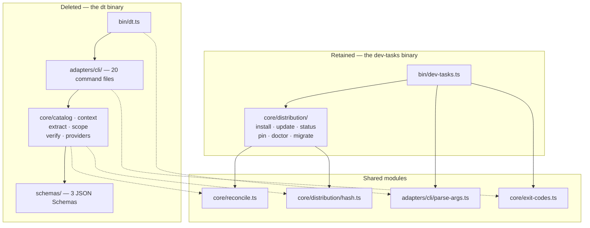
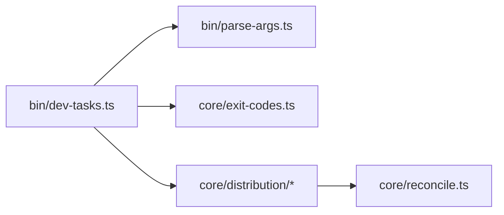
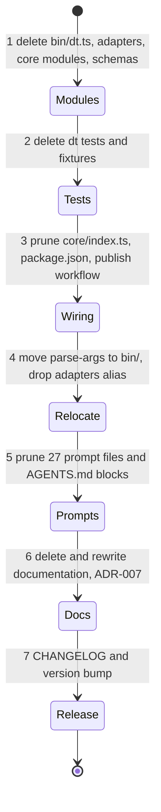

# Specification: Shared Understanding — Phase 0 (Retire `dt`)

## Changelog

| Version | Date       | Summary                                                                  | Author           |
| ------- | ---------- | ------------------------------------------------------------------------ | ---------------- |
| 1.0     | 2026-09-18 | Initial version. Covers PRD FR-53 to FR-58 (Phase 0, retire `dt`).                                                                                                    | product-engineer |
| 1.1     | 2026-09-18 | All three open questions resolved. Restore tag confirmed as `v0.13.0` (`0a6f35e`) via the GitHub API. `prd-multi-repo-context.md` is deleted. One pull request, seven commits. HOW decisions confirmed and renumbered `D-28` to `D-38` into the feature's single decision-log ID space. | @llipe / product-engineer |

## 1. Executive Summary

Phase 0 deletes the `dt` binary and the multi-repo context layer it serves: extraction, catalog, context resolution, and contract verification. The work is a removal, not a refactor. `core/distribution` — the code behind the `dev-tasks` binary that consumers actually run — imports nothing from the layer being deleted, so the two halves separate cleanly along an existing seam.

The change removes roughly 19,600 of 21,500 non-test TypeScript lines, 74 of 125 test files, three runtime dependencies, one optional peer dependency, 27 prompt files' worth of conditional branches, two `AGENTS.md` rule blocks, and three documents. It is recorded as ADR-007 with the last release tag as the restore path.

Eleven of the twelve source files that exceed the 400-line threshold in `SIMPLICITY.md` are files this phase deletes. Phase 4 inherits a one-file baseline instead of a twelve-file one.

## 2. Reference Documents

| Document                                                     | Relevance                                                         |
| ------------------------------------------------------------ | ----------------------------------------------------------------- |
| `docs/requirements/prd-shared-understanding-refinement.md`    | FR-53 to FR-58 (Phase 0), D-14 (the retirement decision)          |
| `docs/technical-guidelines.md`                                | Deterministic-first, layered workflow architecture, quality gates |
| `SIMPLICITY.md`                                               | A4 (deep modules), A10 (delete over deprecate), B1, B3            |
| `docs/adr/ADR-001`, `ADR-002`                                 | `component.json` manifest, exit-code contract — both superseded   |
| `docs/requirements/prd-multi-repo-context.md`                 | The PRD this phase retires                                        |
| `workstream/decisions-shared-understanding.md`                | D-14, and the HOW-phase rows this specification adds              |

## 3. Affected Repositories

| Repository        | Role   | Scope of Changes                                                                                                                                       |
| ----------------- | ------ | ------------------------------------------------------------------------------------------------------------------------------------------------------ |
| `llipe/dev-tasks` | Source | Delete the `dt` binary, its modules, adapters, schemas, tests, fixtures, dependencies, prompt branches, and documentation. Publish as a breaking minor. |
| Consumer repos    | Target | Lose the `dt` binary on their next `update`. No consumer is known to use it. Nothing in the installed bundle references it.                             |

## 4. System Architecture

The current package ships two binaries over one shared core. The seam between them is already clean: the only modules both sides use are `parse-args`, `exit-codes`, `reconcile`, and `hash`.

After the change, `parse-args.ts` has exactly one consumer. It moves to `bin/`, `adapters/` disappears, and the `#adapters/*` import alias is removed from `package.json`. Keeping a directory, a barrel file, and a path alias alive for a single 86-line module would violate `SIMPLICITY.md` A4.

### Verified separation

| Question                                                     | Answer                                                                    |
| ------------------------------------------------------------- | ------------------------------------------------------------------------- |
| Does `core/distribution` import any deleted module?           | No. Zero imports.                                                         |
| Does `bin/dev-tasks.ts` import any deleted module?            | Only `#adapters/cli/parse-args.js`, which is retained and relocated.      |
| Is `core/reconcile.ts` shared?                                | Yes — `core/extract/component.ts` (deleted) and `update.ts` (retained). It stays. |
| Is `core/distribution/hash.ts` shared?                        | Yes, same pattern. It stays, already in the retained tree.                |
| Do any "mixed" tests cover retained behavior?                 | No. The two tests touching both import `hashContent` only as a helper.    |

## 5. Data Model & Database Design

No data entities are created or modified. The phase deletes three JSON Schemas (`component.schema.json`, `flow.schema.json`, `scope-output.schema.json`) and the `component.json` manifest format they describe. The optional `pg` peer dependency, used only by `core/extract/orm/information-schema.ts` for live database introspection, is removed. No migration is required because no persistent state exists.

## 6. API Design

No HTTP API exists. The public interface is the CLI surface, and this phase removes one of two binaries.

| Command surface        | Before                                                                                                                  | After   |
| ---------------------- | ----------------------------------------------------------------------------------------------------------------------- | ------- |
| `dt init`              | Extraction, multi-repo scoping, context bundle assembly                                                                 | Removed |
| `dt extract …`         | `detect`, `all`, `component`, `openapi`, `asyncapi`, `schema`                                                           | Removed |
| `dt catalog …`         | `build`, `validate`, `query`, `scaffold`                                                                                | Removed |
| `dt scope`, `dt scope gate` | LLM-assisted scoping and the G1 abort gate                                                                         | Removed |
| `dt verify …`          | `contract-diff`, `impact`, `drift`                                                                                      | Removed |
| `dt ctx …`             | `fetch`, `assemble`                                                                                                     | Removed |
| `dev-tasks …`          | `install`, `update`, `status`, `pin`, `unpin`, `doctor`, `migrate`                                                      | Unchanged |

Exit codes reserved exclusively for `dt` semantics are removed from `core/exit-codes.ts`; codes the `dev-tasks` binary returns are untouched, preserving the contract ADR-002 established for the retained surface.

## 7. Authentication & Authorization Design

Not applicable. Neither binary authenticates. The phase removes the only code path that opened an outbound connection on the user's behalf (`core/context/fetch.ts` sparse clones, `core/extract/orm` database introspection), which narrows the package's runtime reach.

## 8. Business Logic Implementation

The only logic in scope is the order of removal. Deletion order matters because an intermediate state that fails to typecheck makes bisection useless and hides a real error behind a cascade of missing-module errors.

Each numbered step is one commit, and `pnpm run typecheck` must pass at every step boundary. Steps 1 to 3 are a single unit for typecheck purposes: the barrel file `core/index.ts` re-exports every deleted module, so it is pruned in the same commit that deletes them.

### Inventory: what is deleted

| Area                 | Items                                                                                                                              |
| -------------------- | ----------------------------------------------------------------------------------------------------------------------------------- |
| Binary               | `bin/dt.ts`, the `dt` entry in `package.json` `bin`                                                                                |
| Adapters             | `adapters/` entirely; `parse-args.ts` relocates to `bin/`                                                                          |
| Core modules         | `core/catalog`, `core/context`, `core/extract`, `core/scope`, `core/verify`, `core/providers`                                       |
| Schemas              | `schemas/` (3 files)                                                                                                               |
| Templates            | `templates/meta-repo/`                                                                                                             |
| Tests                | 74 of 125 test files; `test/fixtures/{catalog,context,extract,schemas,verify}`                                                     |
| Dependencies         | `ajv`; `pg` optional peer; the `fast-uri` pnpm override, which exists only for `ajv`                                                |
| Dependency move      | `yaml` from `dependencies` to `devDependencies` — after removal only `test/unit/infra-workflow-templates.test.ts` imports it       |
| Prompt trees         | 27 files across `.claude/` (9), `.github/` (10), `.kiro/` (8); the `activity-contract-validation` skill in full                    |
| Registry             | `AGENTS.md` Task Types / `architecture-change` (RF-62, RF-64) and Cross-Repo Partitioning (RF-63), plus the `CLAUDE.md` echo       |
| Documentation        | `docs/dt-user-manual.md`, `docs/data-model.md`, `docs/artifact-formats.md`, `docs/requirements/prd-multi-repo-context.md`          |

### Inventory: what is retained, and why

| Item                              | Reason                                                                             |
| --------------------------------- | ------------------------------------------------------------------------------------ |
| `execa`                           | `core/distribution/fetch-package.ts` uses it, reached from `update.ts`              |
| `core/reconcile.ts`               | `core/distribution/update.ts` uses it                                               |
| `core/distribution/hash.ts`       | Already in the retained tree                                                        |
| `adapters/cli/parse-args.ts`      | `bin/dev-tasks.ts` uses it; relocates to `bin/parse-args.ts`                        |
| `activity-contract-test-design`   | A `verifier` design skill with no `dt` reference; only `activity-contract-validation` is `dt`-bound |
| ADR-001, ADR-002                  | History. Marked Superseded by ADR-007, never rewritten, per the ADR README rule     |
| `bundle-manifest.json`            | No change needed. No `managed_path` or `consumer_owned_path` names `dt` or `schemas/` |

### Edits rather than deletions

Four files must be edited, and getting any of them wrong breaks a gate rather than a test:

1. **`core/index.ts`** — the barrel re-exports `catalog`, `extract`, `context`, `scope`, `providers`, and `verify`. Prune to `ExitCode`, `ExitCodeValue`, `reconcile`, `ReconcileAction`, and `distribution`.
2. **`package.json`** — remove the `dt` bin entry, the `#adapters/*` import alias, and `schemas/` and `dist/adapters/` from `files`; move `yaml`; drop `ajv`, the `pg` peer, and the `fast-uri` override.
3. **`.github/workflows/publish-npm.yml` line 69** — asserts `dist/bin/dt.js` exists and fails the publish if it does not. This is the one deletion that silently breaks release rather than CI, because the assertion only runs on publish.
4. **`test/integration/binaries.test.ts`** — paired `dev-tasks`/`dt` cases. Remove the four `dt` cases and add one asserting `dist/bin/dt.js` is absent, so a future accidental reintroduction fails a test.

## 9. Integration Details

No third-party service integrations exist in either binary. The phase removes the package's only outbound-network code path (git sparse clone in `core/context/fetch.ts`) and its only optional database driver.

## 10. User Interface & Client Behavior

No graphical interface. `/DESIGN.md` is unaffected. Terminal output for the retained `dev-tasks` binary is unchanged except that `--help` no longer mentions `dt`.

## 11. Performance & Scalability Approach

Not a performance change, though two effects are worth recording. The published package shrinks by roughly 90 % of its compiled source. The test suite loses 74 of 125 files, which shortens the `validate` gate that Phase 4 will wire into CI under a two-minute budget (D-17).

## 12. Security Implementation

Deleting code reduces attack surface. Three specific reductions:

- The `pg` peer dependency and the live database introspection path are removed.
- The git sparse-clone path that fetched remote repositories is removed.
- `ajv` and its transitive `fast-uri` leave the dependency tree, along with the version override pinned for a past advisory.

`pnpm audit --prod` must be run after the dependency prune and recorded, since removing dependencies can change the advisory set.

## 13. Error Handling & Logging

No change to the retained binary's error handling. `core/exit-codes.ts` loses `dt`-only codes; every code the `dev-tasks` binary can return keeps its numeric value, so no consumer script that checks an exit status changes behavior.

## 14. Testing Strategy

The risk in a deletion is not that removed code breaks. It is that something retained quietly depended on it, or that a gate silently stops checking.

| Layer                | Approach                                                                                                                             |
| -------------------- | -------------------------------------------------------------------------------------------------------------------------------------- |
| Static               | `typecheck` at every commit boundary is the primary signal. A dangling import is a compile error, not a runtime surprise.             |
| Unit                 | The 51 retained test files must pass unchanged. Any retained test needing an edit is a finding: it means the seam was not where the analysis said. |
| Integration          | `binaries.test.ts` gains a negative assertion that `dt` is absent.                                                                    |
| Absence (new)        | A parity-style test asserting no source file, prompt file, or `AGENTS.md` block references `dt`, `component.json`, or the meta-repo. This is PRD AC-27 and it is the test that keeps the retirement from leaking back. |
| Dependency           | `pnpm audit --prod` after the prune; `pnpm install` resolves with no missing peer warnings.                                           |
| Release              | `pnpm run build` followed by the publish workflow's file assertions, run locally before the release commit.                           |

### Pre-existing failures, and why they matter here

Eleven tests currently fail on `main` for environment reasons: permission tests that pass trivially as root, a missing `yq`, and `dt` sparse-clone integration. Seven of the eleven are in files this phase deletes. The four that remain (`update` unwritable backup, `doctor` cache dir, `deploy.sh` `yq`, and the two `doctor` integration cases) are retained and will still fail.

This must be stated in the PR rather than presented as a clean run, and the post-change expectation is recorded up front: **4 failures remain, all pre-existing and environment-dependent; any fifth failure is caused by this change.** That number is the acceptance signal.

## 15. Deployment & Rollout

No feature flag. A deletion cannot be rolled out gradually, and a flagged binary would contradict `SIMPLICITY.md` A10.

| Aspect                | Decision                                                                                                                         |
| --------------------- | ---------------------------------------------------------------------------------------------------------------------------------- |
| Version               | `0.14.0`. Removing a published binary is breaking, but the package is pre-1.0, where a minor bump is the convention.              |
| Commit type           | `chore!:` with a `BREAKING CHANGE:` footer naming the removed binary and every removed command.                                   |
| CHANGELOG             | A `Removed` section listing every command, matching the Keep a Changelog format already in use.                                   |
| Backward compatibility | None offered, deliberately. `dt` was documented "Unstable — testing only" in the README, and no consumer is known to use it.     |
| Restore path          | Release tag `v0.13.0`, commit `0a6f35e`, named in ADR-007. Git history is the restore mechanism; no branch is kept alive.         |
| Rollback              | Revert the merge commit. The phase touches no persistent state, so revert is complete and immediate.                             |

## 16. Dependencies & Risks

| Risk                                                                              | Likelihood | Mitigation                                                                                                     |
| --------------------------------------------------------------------------------- | ---------- | ---------------------------------------------------------------------------------------------------------------- |
| The publish workflow's `dist/bin/dt.js` assertion is missed and breaks release     | Medium     | Named explicitly as edit 3 of 4; the release dry run in section 14 catches it before the version commit          |
| A retained test silently depended on a deleted fixture                             | Low        | The two mixed tests were checked and import only `hashContent`; a retained test needing edits is a stop signal    |
| `dt` references creep back through a prompt file                                   | Medium     | The absence test (AC-27) fails CI, making regression impossible to merge quietly                                 |
| An undiscovered consumer uses `dt`                                                 | Low        | README marked it unstable; the restore tag and a CHANGELOG entry naming every command give a documented recovery |
| `yaml` moved to `devDependencies` breaks a runtime path                            | Low        | Verified: no retained source file imports `yaml`; only one infra test does                                       |
| The diff is too large to review meaningfully                                       | High       | Seven ordered commits, each independently reviewable; the inventory tables in section 8 are the review aid       |

The last risk is real and not fully solved. A 20,000-line deletion cannot be reviewed line by line. The commit ordering and the inventory tables are what make it reviewable: a reviewer checks that the retained list is complete and that the gates pass, rather than reading every deleted line.

## 17. Open Questions

None. All three were resolved on 2026-09-18 and recorded as decisions.

| Question                                          | Resolution                                                                                                    |
| ------------------------------------------------- | --------------------------------------------------------------------------------------------------------------- |
| Which release tag is the restore path?            | `v0.13.0`, at commit `0a6f35e`, confirmed through the GitHub API. Recorded as `D-37` and named in ADR-007.     |
| Delete or keep `prd-multi-repo-context.md`?       | Delete. ADR-007 records the decision and git history keeps the content. Recorded as `D-38`.                   |
| One pull request or two?                          | One, with seven ordered commits. Recorded as `D-29`.                                                          |

## Decisions (HOW phase)

Confirmed on 2026-09-18 and recorded in `workstream/decisions-shared-understanding.md`. Numbering continues the feature's single decision-log ID space (`D-01` to `D-27` are the WHAT phase), so there is one ID space per feature rather than two conventions.

| ID   | Decision                                                                                                                        |
| ---- | --------------------------------------------------------------------------------------------------------------------------------- |
| D-28 | Version `0.14.0`, commit type `chore!:` with a `BREAKING CHANGE:` footer naming the removed binary and commands.                 |
| D-29 | One pull request, seven ordered commits, `typecheck` green at every boundary.                                                    |
| D-30 | Drop `ajv`, the `pg` peer, and the `fast-uri` override; move `yaml` to `devDependencies`; keep `execa`, `reconcile`, and `hash`. |
| D-31 | Delete `activity-contract-validation`; keep `activity-contract-test-design`, which carries no `dt` reference.                    |
| D-32 | `docs/system-overview.md` is rewritten in its affected sections by `technical-writer`, not merely stripped.                      |
| D-33 | `core/checks` is not created in Phase 0. This phase only deletes.                                                                |
| D-34 | `parse-args.ts` moves to `bin/`; `adapters/` and the `#adapters/*` alias are removed.                                            |
| D-35 | ADR-001 and ADR-002 are marked Superseded by ADR-007 and otherwise left intact, per the ADR README's never-rewrite rule.         |
| D-36 | Success is exactly 4 remaining test failures, all pre-existing; a fifth is caused by this change.                                |
| D-37 | The restore path is release tag `v0.13.0` at commit `0a6f35e`, named in ADR-007.                                                 |
| D-38 | `docs/requirements/prd-multi-repo-context.md` is deleted rather than kept as history.                                            |
