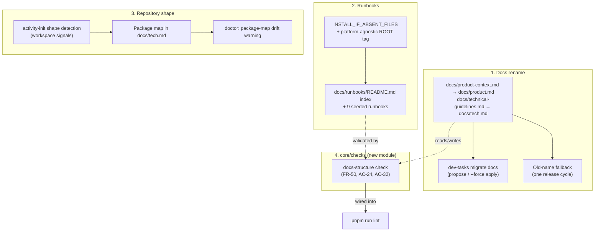
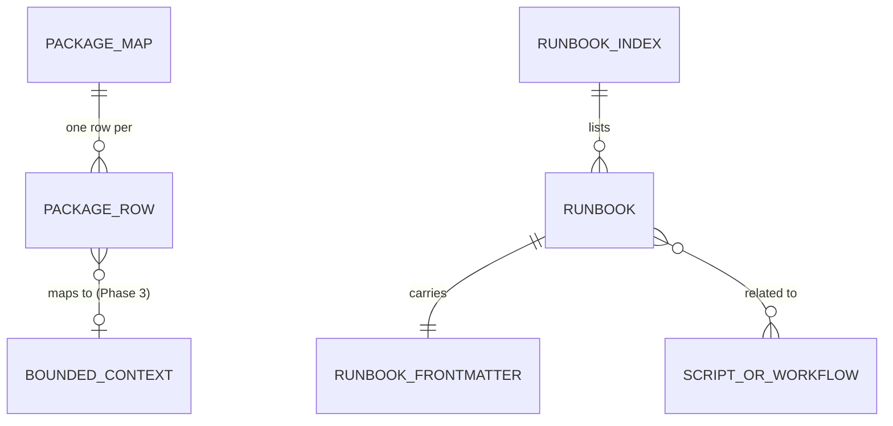
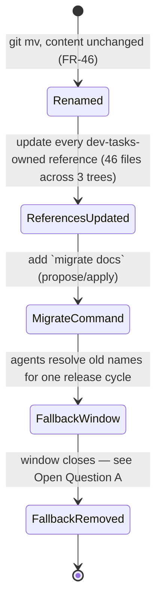
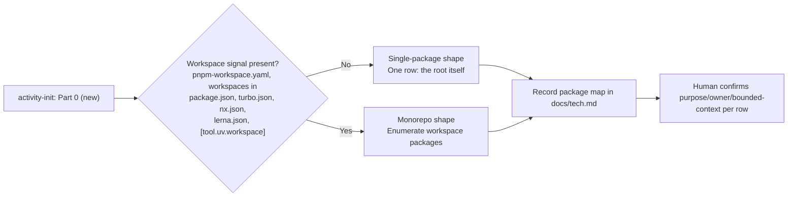

# Specification: Shared Understanding — Phase 1 (Docs Foundation and Repository Shape)

## Changelog

| Version | Date       | Summary                                                    | Author           |
| ------- | ---------- | ----------------------------------------------------------- | ---------------- |
| 1.0     | 2026-09-19 | Initial version. Docs foundation rename, runbooks, monorepo/single-package detection and package map. | product-engineer |

## 1. Executive Summary

Phase 1 renames the two foundation documents to `docs/product.md` and `docs/tech.md` behind a one-release fallback, establishes `docs/runbooks/` as an install-if-absent capability with nine seeded runbooks, teaches `activity-init` to detect single-package vs. monorepo shape and record a package map in `docs/tech.md`, and creates the `core/checks` module (first use: a docs-structure check wired into `lint`). It runs after Phase 0 (merged, PR #200) so the rename never touches a file Phase 0 was scheduled to delete, and it is a prerequisite for every later phase because Phases 2 to 5 name `docs/product.md`, `docs/tech.md`, and the package map directly.

## 2. Reference Documents

| Document                                                    | Relevance                                                                 |
| ------------------------------------------------------------ | -------------------------------------------------------------------------- |
| `docs/requirements/prd-shared-understanding-refinement.md`  | FR-44 to FR-51 (docs foundation and runbooks), FR-59 to FR-64 (repository shape), AC-22 to AC-26, AC-29 to AC-32, Non-Goals |
| `docs/technical-guidelines.md`                                | Canonical script names, quality gates, `SIMPLICITY.md` A4/A10/B1           |
| `SIMPLICITY.md`                                               | A4 (deep modules, no premature generality), A10 (delete over deprecate, burden of proof on adding), B1 (behavior-preserving refactor), B3 (smallest change) |
| `docs/adr/ADR-006-claude-settings-ownership.md`               | Precedent for a delivered-once, consumer-owned file category               |
| `core/distribution/profiles.ts`                               | `ROOT_FILES`, `ROOT_PROFILE_TAG`, `INSTALL_IF_ABSENT_FILES` — the registries this phase extends |
| `core/distribution/migrate.ts`                                | The existing legacy-install migration this phase extends with `migrate docs` |
| `.claude/skills/activity-init/SKILL.md` (+ `.github`/`.kiro`) | The skill this phase teaches shape detection and renames                   |
| `workstream/decisions-shared-understanding.md`                | D-16, D-21 (WHAT phase); D-42 onward reserved for this phase's HOW decisions |

## 3. Affected Repositories

| Repository  | Role                       | Scope of Changes                                                                                   |
| ----------- | -------------------------- | ------------------------------------------------------------------------------------------------- |
| `dev-tasks` | Workflow harness (this repo) | Renames its own two foundation docs; adds `core/checks`, `docs/runbooks/`, package-map detection, and the `migrate docs` command; updates all three prompt trees and every test that names the old filenames. |

No other repository is touched. Consumer repositories receive the new capability through the next `dev-tasks update`; this phase does not modify any consumer repository directly (Non-Goals: "the rename applies to new installs and to `dev-tasks` itself; consumers rename on their own schedule with `doctor` guidance").

## 4. System Architecture

Three independent capabilities land in this phase, sharing one dependency: all three are named by every later phase, so getting the names and the detection contract right here is the point of running Phase 1 before the feature phases.

`core/checks` is a new module, not an extension of an existing one — `core/verify` belongs to the retired `dt` binary and is not reused (FR-57, already recorded in the Phase 0 spec as an architectural constraint for this phase to satisfy). Phase 1 builds exactly one check inside it: the docs-structure check. Later phases add their own checks alongside it (glossary conformance in Phase 3, commit-order and refactor-invariance in Phase 5, the change map in Phase 6); this phase does **not** build a generic checks-registry or plugin interface for them; premature generality for three not-yet-written consumers fails `SIMPLICITY.md` A4's "what breaks without it" test. If a third or fourth check later needs shared scaffolding, that refactor happens when it is needed, against real duplication, not speculatively here.

## 5. Data Model & Database Design

No database. Three new structured-text schemas.

### Package map (`docs/tech.md`, one table)

| Column             | Source                                                                 |
| ------------------- | ------------------------------------------------------------------------ |
| Package             | Workspace package name (from the package's own `package.json` `name`, or the directory name when absent) |
| Path                | Relative path from repo root                                           |
| Purpose             | One line, human-confirmed at `activity-init` time                       |
| Owner               | Human-confirmed at `activity-init` time                                 |
| Canonical scripts   | Intersection of the root's canonical script names (`lint`, `test`, `typecheck`, …) actually present in the package's own `package.json` |
| Bounded context     | Freeform at `activity-init` time; becomes canonical once Phase 3's glossary exists — not blocked on it |

A single-package repository (this one, today) records one row for the root itself, so `docs/tech.md` has the same table shape regardless of shape, and `doctor`'s drift check has one code path.

### Runbook frontmatter (`docs/runbooks/runbook-<verb>-<object>.md`)

Exact shape from the PRD Data Requirements section: `name`, `trigger`, `owner`, `last_verified` (date), `related` (list of paths). Body: Preconditions, Steps, Verification, Rollback, Escalation — five fixed headings, enforced by the docs-structure check (not merely documented).

### Runbook index (`docs/runbooks/README.md`)

| Column        | Source                              |
| -------------- | -------------------------------------- |
| Runbook        | Filename, linked                     |
| Trigger        | Copied from frontmatter               |
| Owner          | Copied from frontmatter               |
| Last verified  | Copied from frontmatter               |

## 6. API Design

No HTTP API. The `dev-tasks` CLI surface gains one subcommand and `doctor` gains two new warning classes.

| Command                    | Behavior                                                                                                                            |
| ---------------------------- | --------------------------------------------------------------------------------------------------------------------------------- |
| `dev-tasks migrate`         | Unchanged — legacy shell-install detection (`core/distribution/migrate.ts`).                                                        |
| `dev-tasks migrate docs`    | New. Dry-run by default: prints the two pending renames and the consumer-owned files (`CLAUDE.md`, `AGENTS.md`, custom prompts) that still reference the old names, and exits `0` doing nothing. `dev-tasks migrate docs --force` performs the rename (content byte-identical `git`-free file move via `node:fs`), backing up the two originals first via the existing `createBackupDir`/`backupFile` (`core/distribution/backup.ts`) — the same reuse `update --force` already established, not a new backup mechanism. |
| `dev-tasks doctor`          | Gains two checks: (a) old foundation-doc names present → propose `migrate docs`, mirroring the existing legacy-install proposal shape; (b) package map present but disagrees with the detected workspace (a package on disk with no map row, or vice versa) → warn, do not fail (`doctor` warns; `lint`/`validate` is where structural failures block, per FR-50). |

`--force` is reused with its existing meaning ("perform the mutating action, back up first") rather than adding a second flag with overlapping semantics.

## 7. Authentication & Authorization Design

Not applicable. No new network or credential surface.

## 8. Business Logic Implementation

### 8.1 Docs rename and fallback resolution

The rename itself is one behavior-preserving `refactor:` commit (FR-46, `SIMPLICITY.md` B1): `git mv` for the two files, content untouched. Updating the 46 files that reference the old names by string (agents, skills, instructions, steering, tests) is mechanical and follows in the same or an immediately adjacent commit — it is still behavior-preserving, since it changes prose/config, not runtime behavior of the `dev-tasks` binary.

Fallback resolution (FR-45) is scoped to what `dev-tasks` itself ships to agents, not a new file-system watcher: any dev-tasks-authored instruction that names the foundation docs resolves `docs/product.md` first, falling back to `docs/product-context.md` (and the `docs/tech.md`/`docs/technical-guidelines.md` pair) only if the new name is absent. This is a resolution rule stated in the prompt content itself (a short paragraph in `activity-init` and any skill that reads these files), not new executable code — there is no runtime "foundation doc reader" module in `dev-tasks` today, and adding one solely to implement a fallback would be exactly the kind of abstraction `SIMPLICITY.md` A4 asks to justify against what breaks without it. Nothing breaks without it: an agent reading a file it's told to read either finds the new name or falls back per the documented rule.

### 8.2 Repository shape detection

Detection is a pure read of the signal files listed in FR-59 (`pnpm-workspace.yaml`, `workspaces` in `package.json`, `turbo.json`, `nx.json`, `lerna.json`; Python's `[tool.uv.workspace]`). No new dependency: parsing JSON/YAML/TOML already has a path in this codebase or its dependency set (`yaml` is already a devDependency after Phase 0; TOML parsing is new and small enough to hand-roll for the one key this needs, or deferred — see the Stack Profiles Non-Goal: "other stacks get the `make validate` entry point... until a profile exists").

`dev-tasks` itself has no workspace signal, so it detects single-package shape and records one row for its own root — this phase does not turn `dev-tasks` into a monorepo; it builds and tests the capability against a monorepo fixture in `test/fixtures/`.

### 8.3 Docs-structure check (`core/checks`)

Per FR-50, `validate` fails (via `lint`) on:

1. `docs/README.md` or `docs/runbooks/README.md` lists a file that does not exist (AC-32).
2. `docs/README.md` or `docs/runbooks/README.md` omits a file that does exist in its directory (AC-32).
3. A runbook has invalid or missing frontmatter (missing `name`, `trigger`, `owner`, `last_verified`, or `related`; `last_verified` not a valid date) (AC-24).
4. A `related` entry names a script or workflow path that does not exist (AC-24, AC-25).

It reports, without failing, a runbook whose `last_verified` exceeds the staleness window (90 days, D-21/OQ-14).

This is a plain Node function (`core/checks/docs-structure.ts`, `checkDocsStructure(repoRoot): { failures: Finding[]; stale: Finding[] }`), invoked two ways: `lint` runs a small script (`node dist/core/checks/run.js` or equivalent, chained after `eslint`) so `validate` reaches it, and the `verifier` (a human-readable summary, not the enforcement path — `lint` already enforces) reads the same result for its audit. One implementation, two callers; no duplicated logic.

### 8.4 Runbook coverage (FR-49, AC-25, AC-31)

Two triggers, both advisory/verifier-level except the structural conditions in 8.3 which are hard `lint` failures:

- **Coverage**: every file under `templates/scripts/`, `templates/workflows/`, and `.github/workflows/` must appear in some runbook's `related` field (AC-25) — checked by the same docs-structure check (condition 4 above, run in reverse: every script/workflow path must be *referenced by* some runbook, not just that referenced paths must exist).
- **Procedure**: a PR whose task list contains ≥3 setup/config/migration/credential/data steps and adds or updates no runbook gets a `verifier` finding (AC-31) — this is verifier-side pattern matching over the task list and the diff, not a `core/checks` structural rule, since "plausibly repeated" is a judgment call the deterministic checker cannot make.

## 9. Integration Details

No third-party integrations. `activity-init`'s shape detection reads local files only.

## 10. User Interface & Client Behavior

No graphical interface. `/DESIGN.md` is unaffected.

## 11. Performance & Scalability Approach

The docs-structure check adds one more step to `lint`; it is a bounded, single-pass filesystem scan (runbooks directory + two README indexes), not proportional to source size, so it does not threaten Phase 4's CI wall-time budget (OQ-12). `activity-init`'s shape detection runs once per init, not per validate.

## 12. Security Implementation

Not applicable. No new credential, network, or data-handling surface. The rename touches documentation and CLI wiring only.

## 13. Error Handling & Logging

`dev-tasks migrate docs` without `--force` never mutates the working tree — it is report-only, matching the existing `update` dry-run convention. `doctor`'s two new checks follow the existing `doctor` output shape (pass/warn, `--json` supported). The docs-structure check's failures are `lint` failures with file:line-equivalent (file:condition) messages, not a new exit code — `core/exit-codes.ts`'s 5-code contract from Phase 0 is unaffected, since `lint` failure is ESLint's own process exit, not a `dev-tasks` exit code.

## 14. Testing Strategy

| Layer        | Approach                                                                                                                                    |
| ------------- | ------------------------------------------------------------------------------------------------------------------------------------------ |
| Static        | `typecheck` covers the new `core/checks` and `core/distribution/migrate-docs.ts` modules.                                                    |
| Unit          | `core/checks/docs-structure.test.ts`: each of the four failure conditions plus the staleness-without-failure case, seeded fixtures under `test/fixtures/`. `migrate-docs.test.ts`: propose (no mutation) and `--force` apply (rename + backup) against a temp dir. |
| Integration   | `activity-init` shape detection against two fixture repos: one single-package, one monorepo (`pnpm-workspace.yaml` with 2 packages) — asserts the package-map table shape in each. |
| Parity        | Existing parity-test pattern extended: the 46 old-name references become a new parity assertion (no `.claude`/`.github`/`.kiro` file names the old filenames except the fallback-rule paragraph itself, which is explicitly allow-listed the same way `test/unit/dt-retirement-absence.test.ts` allow-lists its own pattern literals). |
| Docs-structure | Seed a broken index, a missing-frontmatter runbook, and a dangling `related` entry; assert `lint` fails on each and passes once fixed — mirrors the absence-guard self-test pattern from Phase 0. |
| Regression    | Re-run the D-40 five-name failure baseline; this phase is not expected to change it, since it touches no code the five failing tests exercise. |

## 15. Deployment & Rollout

| Aspect                 | Decision                                                                                                       |
| ----------------------- | ----------------------------------------------------------------------------------------------------------------- |
| Feature flag            | None. `SIMPLICITY.md` A10 — no flag for a single-consumer capability.                                          |
| Fallback window         | One release cycle (FR-45) — mechanism is Open Question A below.                                                |
| Backward compatibility  | Old names keep working for agents for the fallback window; `update` never renames a consumer's files unprompted. |
| Version/commit type     | Additive capability, no breaking change to the `dev-tasks` binary's CLI contract (new subcommand, new warnings) — `feat:` commits, no `!`. Actual version bump is `./scripts/release.sh`, run by the maintainer on `main` after merge (D-41 — this phase does not repeat the Phase 0 process error). |
| Rollback                | Revert the merge commit. The rename is the only stateful-feeling change, and it is a pure `git mv` with content unchanged, so revert is complete. |

## 16. Dependencies & Risks

| Risk                                                                                     | Likelihood | Mitigation                                                                                                    |
| ------------------------------------------------------------------------------------------- | ---------- | ------------------------------------------------------------------------------------------------------------- |
| A reference to the old names is missed among the 46 files, and an agent reads a stale name  | Medium     | The fallback rule (8.1) means a miss degrades to "still works via fallback," not silent failure; the parity test (14) closes the gap before merge. |
| `activity-init`'s existing "Mono-Repo" mode name collides in meaning with the new "monorepo" repository-shape term | Medium     | Open Question C below.                                                                                        |
| `INSTALL_IF_ABSENT_FILES` has no platform-agnostic tag today, and `docs/runbooks/README.md` needs one | Low        | Extend the registry with a `ROOT_PROFILE_TAG`-style dedicated tag (reusing the pattern `ROOT_FILES` already established), not a new third category — same fix the PRD's own Technical Considerations section anticipates for Phase 3's glossary file, built here first since Phase 1 needs it first. |
| The docs-structure check produces false positives on legitimate historical `related` references (e.g., a runbook documenting a since-removed script for troubleshooting history) | Low | Runbooks describe current procedures, not history; a removed script's runbook is retired with it, consistent with `SIMPLICITY.md` A10. |
| Monorepo detection is only exercised against one fixture shape (`pnpm-workspace.yaml`) before a real consumer monorepo validates it | Medium | Documented as a known limitation; `nx.json`/`turbo.json`/`lerna.json`/`[tool.uv.workspace]` detection is signal-file presence only (existence check), not full parsing, which keeps the untested-parser surface small. |

## 17. Open Questions

| # | Question | Recommendation |
| - | -------- | --------------- |
| A | FR-45's "one release cycle" fallback window has no machine-checkable trigger today (no release-cycle registry exists). Enforce it as a tracked follow-up (a GitHub issue opened alongside this phase's PR, to remove the fallback paragraph and the fallback resolution rule after the next `dev-tasks` release ships), or build a version-comparison check (`doctor` compares the installed version against a recorded "fallback expires at" version)? | Tracked follow-up issue. A version-comparison check is executable code guarding a one-time documentation cleanup — disproportionate machinery for a single future edit, and exactly the "what breaks without it" test `SIMPLICITY.md` A4 asks. |
| B | FR-45 says an agent "at session start" should detect old names and propose migration. No per-platform session-start hook exists for this today (Kiro's `git-guard-notice` is the only always-loaded steering precedent, and building equivalents for Claude Code and Copilot is a larger scope than this phase's other line items). Build real session-start detection on all three platforms, or treat `doctor`/`update` output as satisfying this requirement in the first release (the same "advisory in the first release" pattern the PRD uses elsewhere, e.g. FR-72)? | Treat `doctor`/`update` as satisfying it for the first release; note the gap explicitly rather than silently narrowing scope. |
| C | `activity-init`'s existing "Mode A — Mono-Repo" (meaning: `/docs` already exists) predates this PRD and now collides in name with FR-59's "monorepo" (meaning: multiple workspace packages). Rename the existing mode (e.g., to "Documented" or "Existing-docs mode") to free the term, or keep both and rely on context to disambiguate? | Rename the existing mode. A reader hitting both terms in the same skill file within one section has no way to tell them apart from the name alone; the existing mode's current name was never load-bearing outside this one skill. |
| D | Should the package map's "Bounded context" column be left blank until Phase 3's glossary exists, or filled with freeform, non-canonical text at `activity-init` time? | Freeform now, canonical later (as stated in §5) — an empty column with no guidance is more likely to be filled with something misleading than a human's best current guess, and the glossary supersedes it by ID (`shared-understanding#D-NN`) either way. |

## Decisions (HOW phase)

Pending resolution of the Open Questions above. Recorded in `workstream/decisions-shared-understanding.md` starting at `D-42` once answered.
