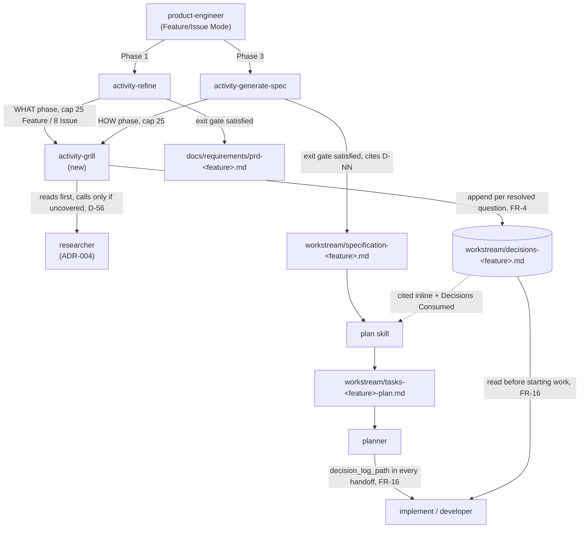
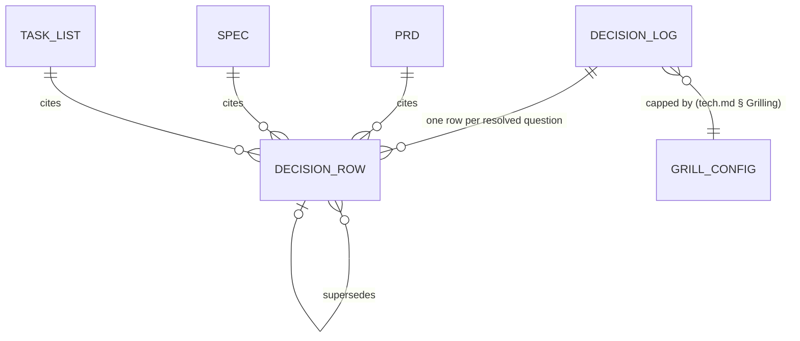

# Specification: Shared Understanding — Phase 2 (Grilling, Decision Log, Refine/Spec/Plan Integration)

## Changelog

| Version | Date       | Summary                                                                                                                        | Author           |
| ------- | ---------- | -------------------------------------------------------------------------------------------------------------------------------- | ---------------- |
| 1.0     | 2026-09-20 | Initial version. `activity-grill`, decision-log threading through `activity-refine`, `activity-generate-spec`, `plan`, `planner`, and `implement`; ADR-008. | product-engineer |

## 1. Executive Summary

Phase 2 adds `activity-grill`, a depth-first, one-question-at-a-time interview skill with a hard exit gate, invoked by `activity-refine` (WHAT phase, before drafting a PRD) and `activity-generate-spec` (HOW phase, before drafting a spec). Every resolved question is appended to `workstream/decisions-<feature>.md` — a format this feature's own PRD already established by dogfooding it since v1.0 — and every PRD, spec, and task list downstream cites the decision IDs that shaped it. `plan` gains a "Decisions Consumed" section, `planner` passes the decision-log path to every `developer` delegation, and `implement` reads it before starting work. No database, API, or UI surface is touched; this phase is pure prompt-engineering and workflow-orchestration across `.claude/`, `.github/`, and `.kiro/`.

## 2. Reference Documents

| Document                                                       | Relevance                                                                                                       |
| ----------------------------------------------------------------- | ------------------------------------------------------------------------------------------------------------------ |
| `docs/requirements/prd-shared-understanding-refinement.md` v1.13  | FR-1 to FR-16 (Grilling; Refinement/spec/planning integration), AC-01 to AC-05, AC-09, AC-16, Data Requirements § Decision log |
| `docs/tech.md`                                                    | Canonical script names, quality gates; gains a "Grilling" configuration subsection (§5)                          |
| `SIMPLICITY.md`                                                   | A4 (no premature generality — grilling state stays in conversation context, not a new persistence layer, D-54), A10 (burden of proof on adding), B3 (smallest change) |
| `docs/adr/ADR-004-researcher-pre-spec-research-step.md`          | Governs the "at most once per phase" researcher budget this phase's `activity-grill` must share with the existing pre-step call (D-56) |
| `workstream/decisions-shared-understanding.md`                   | The only existing decision log; D-01 to D-52 (WHAT/HOW phases 0-1) plus D-53 to D-56 (this phase's own HOW decisions, recorded ahead of drafting per this repo's established practice of dogfooding the format it is specifying) |
| `workstream/research-shared-understanding-phase-2.md`            | Pre-spec research artifact: current-state file map, integration points, and risks consumed throughout this spec  |
| `.claude/skills/activity-refine/SKILL.md` (+ `.github`, `.kiro`)  | The skill this phase teaches to invoke `activity-grill` WHAT and Issue-Mode grilling                            |
| `.claude/skills/activity-generate-spec/SKILL.md` (+ `.github`, `.kiro`) | The skill this phase teaches to invoke `activity-grill` HOW                                                |
| `.github/instructions/plan.instructions.md` (+ Claude/Kiro equivalents) | Gains inline decision citations and a "Decisions Consumed" section                                        |
| `.claude/commands/planner.md` (+ `.github/agents/planner.agent.md`, `.kiro/agents/planner.md`) | Phase 4 per-story handoff template gains `decision_log_path`                                     |
| `.claude/skills/implement/SKILL.md` (+ `.github`, `.kiro`)        | "Before Starting Work" gains a decision-log read step                                                            |

## 3. Affected Repositories

| Repository  | Role                          | Scope of Changes                                                                                                                                                     |
| ----------- | ----------------------------- | ---------------------------------------------------------------------------------------------------------------------------------------------------------------------- |
| `dev-tasks` | Workflow harness (this repo)  | Adds one new skill (`activity-grill`) and modifies five existing skills/commands/agents, in lockstep across `.claude/`, `.github/`, `.kiro/`; adds one ADR; adds one `docs/tech.md` subsection. No runtime code (`core/`, `bin/`, `adapters/`) changes — this phase is prompt content and workflow contract only. |

No other repository is touched. Consumers receive the new behavior through the next `dev-tasks update`.

## 4. System Architecture

Grilling is a sub-skill two existing skills invoke, not a new top-level entry point. It has no persistent process of its own: a session lives entirely in the conversation that invoked it, and its only durable output is rows appended to `workstream/decisions-<feature>.md` (D-54).



**WHAT/HOW grilling session, one question at a time (FR-1, FR-2, FR-6, FR-8):**

```mermaid
sequenceDiagram
    participant U as User
    participant Caller as activity-refine / activity-generate-spec
    participant G as activity-grill
    participant R as researcher (≤1/phase, shared budget)
    participant D as decisions-&lt;feature&gt;.md

    Caller->>G: invoke(phase, cap, glossary_mode)
    loop until open-questions list empty AND user confirms
        G->>G: pick next unresolved branch (depth-first)
        alt codebase/doc/prior-log answers it
            G->>D: check prior decisions-*.md (Issue Mode) / read file directly
            G->>G: resolve without asking (FR-3)
        else needs multi-slice evidence, not yet covered
            G->>R: bounded research call (only if pre-step artifact silent on this branch)
            R-->>G: research-<feature>.md
        else genuine human decision
            G->>U: one question + recommended answer
            U-->>G: answer
        end
        G->>D: append row (ID, phase, branch, Q, rec, answer, accepted?, supersedes, author, date)
        alt every 10 questions, or cap reached, or exit attempted
            G->>U: present decision-tree summary
        end
        alt cap reached
            G->>U: continue or stop?
        end
    end
    G->>U: "open list is empty — do you confirm shared understanding?"
    U-->>G: explicit statement (not silence, not tone)
    G-->>Caller: exit gate satisfied
```

## 5. Data Model & Database Design

No database. One schema, already established and unchanged by this phase (research S5): `workstream/decisions-<feature>.md`, columns `ID | Phase | Branch | Question | Recommended | Answer | Accepted rec. | Supersedes | Author | Date`. This phase's job is to make every other artifact in the chain a consumer of that schema, not to change it.

### New: "Decisions Consumed" section (PRD, spec, task list)

Per FR-14 and FR-16, every PRD, spec, and task list produced from this phase onward carries:

```markdown
## Decisions

| ID   | Decision (short form) |
| ---- | ---------------------- |
| D-07 | …                       |
```

This is additive to each document's existing structure — see this very PRD's own `## Decisions` section (added retroactively, v1.0) and Phase 0/Phase 1's `## Decisions (HOW phase)` sections in their specs, both already in this format. Phase 2 makes the convention mandatory going forward rather than introducing new markup.

### New: `docs/tech.md` § Grilling (question-cap configuration, D-55)

A subsection (placement: after "Glossary and Simplicity Baseline Ownership", before "Overview") holding a small table:

| Setting             | Default | Meaning                                                    |
| -------------------- | ------- | ------------------------------------------------------------ |
| `cap.what`           | 25      | WHAT-phase question cap, Feature Mode                      |
| `cap.how`            | 25      | HOW-phase question cap, Feature Mode                       |
| `cap.issue`          | 8       | Total question cap, Issue Mode                              |

`activity-grill` reads this table if present; a repository with no "Grilling" subsection uses the hardcoded defaults above (activity-init does not need to scaffold this table — it is optional configuration, not a required file).



## 6. API Design

Not applicable. No HTTP API, no new CLI subcommand. `activity-grill` is a prompt skill invoked by other skills within the same agent turn, not a process boundary.

## 7. Authentication & Authorization Design

Not applicable. No new credential or network surface.

## 8. Business Logic Implementation

### 8.1 `activity-grill` skill contract (new file, all three trees)

Structured like every other activity skill (Goal / Context / Process / Output), with these operative rules taken directly from the PRD:

1. **One question, one recommendation, per turn** (FR-1). The skill never batches questions in one turn.
2. **Depth-first traversal** (FR-2): a branch (e.g., `grilling/placement`, `simplicity/content` — the existing `Branch` column already models this) is fully resolved, including any decision it depends on, before a sibling branch opens.
3. **Resolve-before-ask** (FR-3): before asking, check in order — (a) the codebase directly via `Read`/`Grep`/`Glob` for single-file questions, (b) `docs/product.md` / `docs/tech.md` / the glossary (once Phase 3 exists) for standing decisions, (c) prior `decisions-*.md` files for a matching answer (mandatory in Issue Mode per FR-10, optional-but-recommended in Feature Mode), (d) a bounded `researcher` call only when the question needs multi-slice evidence AND the pre-step research artifact (if any) doesn't already cover it (D-56). Only if none of these resolve it does the skill ask the user.
4. **Append-per-resolution** (FR-4): every resolved question — asked or self-resolved — becomes one row in `decisions-<feature>.md` immediately, not batched at the end of the session. Self-resolved rows still get an ID; `Accepted rec.` is `n/a` and `Answer` states what was found and where.
5. **Qualified citation form** (FR-5): `<feature>#D-NN` outside the log's own file, unqualified `D-NN` inside it — already the convention `decisions-shared-understanding.md` uses.
6. **Decision-tree summary cadence** (FR-6): every 10th resolved question, at the cap, and at the exit-gate attempt, the skill prints: resolved branches (with `D-NN`), the current branch, and the remaining open list.
7. **Two-phase mode for Feature Mode** (FR-7): `activity-grill(phase="WHAT")` runs before `activity-refine` drafts; `activity-grill(phase="HOW")` runs before `activity-generate-spec` drafts. Each phase's ID sequence continues the file's single ID space (no phase-local restart) — the existing log already does this (D-01…D-27 WHAT, D-28… HOW).
8. **Hard exit gate** (FR-8): satisfied only when the open-questions list is empty **and** the user has made an explicit statement of shared understanding (e.g., "I understand, proceed" / "I confirm"). A "sounds good," an emoji, or silence after a summary does **not** satisfy it — the skill must ask directly: *"The open list is empty. Do you confirm shared understanding so I can draft?"*
9. **Configurable, enforced cap** (FR-9): default 25/25/8 (D-55, read from `docs/tech.md` § Grilling if present). On reaching the cap, the skill presents the open list and asks "continue (raise the cap) or stop (draft with what's settled, leaving the rest as recorded Open Questions)?" — it never auto-continues or auto-stops.
10. **Issue Mode constraints** (FR-10): glossary read-only (no proposals — moot until Phase 3 ships the glossary; the skill still avoids proposing terms in the meantime), scope limited to what the issue changes relative to current behavior, and prior decisions from *any* feature's log are searched for a reusable answer before asking (research risk #4: scan is keyword-gated — only logs whose `Branch` or `Question` text shares a term with the issue description are read, to keep the lookup bounded as the number of logs grows).
11. **Assumption-testing reminder** (FR-11, SHOULD): once per phase, the skill states plainly that accepting every recommendation reproduces its own assumptions rather than testing them.

### 8.2 Caller integration: `activity-refine`

- **PRD Creation mode:** invokes `activity-grill(phase="WHAT", cap=cap.what)` before any drafting; does not produce a PRD section until the exit gate returns satisfied (FR-12, AC-01).
- **Issue Refinement mode:** invokes `activity-grill(cap=cap.issue, mode="issue")` — read-only glossary, decision reuse from prior logs cited in qualified form (FR-15, AC-09).
- Every requirement or scope line the PRD states because of a decision cites that decision inline (`… (D-07)`), and the PRD's `## Decisions` section lists every ID consumed (FR-14, AC-05) — this PRD already demonstrates the target shape.

### 8.3 Caller integration: `activity-generate-spec`

- Invokes `activity-grill(phase="HOW", cap=cap.how)` before drafting (FR-13, AC-02). The conditional pre-step `researcher` call (ADR-004, run by `product-engineer` before this phase) runs first so its artifact is available for step 8.1.3(d) (D-56).
- Every design choice the spec states because of a decision cites it inline, and the spec's `## Decisions (HOW phase)` section lists every ID consumed — the exact shape Phase 0 and Phase 1's specs already use, including this one.

### 8.4 `plan` instruction

Adds, to the existing task-list format: each task line that derives from a specific decision cites it (`- [ ] 3.2 Add cap-reached prompt (D-55)`), and a `## Decisions Consumed` section at the end of the task list aggregates every ID cited anywhere in it. A task with no traceable decision cites none — this is additive, not a requirement that every task have one.

### 8.5 `planner` — Phase 4 handoff

The per-story delegation template (today: task-list path, test-plan path, execution mode, integration branch, test-first flag) gains one field: `decision_log_path` (`workstream/decisions-<feature>.md`), passed unconditionally — every feature has exactly one log, whether or not any HOW-phase question was asked for a given story (FR-16, AC-16). This field must be added in lockstep to `.claude/commands/planner.md`, `.github/agents/planner.agent.md`, and `.kiro/agents/planner.md` — a parity test (§14) closes the gap the research flagged (risk #6).

### 8.6 `implement` — Before Starting Work

Adds one step: **read `workstream/decisions-<feature>.md` in full**. Ordering (research risk #7): this step runs *before* the branch-creation gate, since it is non-mutating and lets the agent answer its own procedural questions (e.g., "was this file's location already decided?") from the log before touching git. It does not replace the existing "confirm GitHub issue" check; it runs alongside it, both before branch creation. Every implementation commit whose approach was shaped by a decision cites it in the commit body, and the PR body's Completion Report area references consumed decision IDs.

### 8.7 Deliverable: ADR-008

Per D-20, ADR-008 records two settled decisions in one document (they were decided together, pre-PRD): (a) `activity-grill`'s exit-gate semantics (FR-8 — hard gate, no inference from tone or silence) — this is genuinely new in Phase 2; (b) the platform-agnostic install-if-absent category — this was **already implemented in Phase 1** as `ROOT_PROFILE_TAG` reuse (`core/distribution/profiles.ts`, see the type's own doc comment), not new code Phase 2 introduces. ADR-008's task in this phase is documentation only for part (b): recording a decision that shipped a phase earlier, alongside the new decision it was originally paired with. Format follows ADR-004/ADR-007 (Status, Context, Decision, Alternatives, Consequences, Related).

## 9. Integration Details

- **`researcher` (ADR-004):** shared budget with the existing pre-step call, per D-56 — `activity-grill` is a second possible caller, not a second guaranteed invocation.
- **`github-ops`:** no template change in this phase (the `## Completion Report` section is Phase 4 scope, FR-33); decision citations in commit/PR bodies follow `github-ops`'s existing conventions for structured content, nothing new to standardize.
- No third-party services.

## 10. User Interface & Client Behavior

Not applicable — no GUI. The "client behavior" is the conversational contract in §8.1: one question per turn, a recommendation attached, a decision-tree summary at defined checkpoints, and an explicit confirmation prompt at the exit gate. This is the only user-facing surface of the phase.

## 11. Performance & Scalability Approach

- Grilling itself is bounded by the question cap (≤25 or ≤8 turns); no separate performance concern.
- Issue Mode's prior-decision lookup (§8.1.10) is keyword-gated to avoid O(n) full-text reads of every historical log as the number of features grows — the first `dev-tasks` feature to actually exercise this at scale is a future concern to monitor, not one this phase can benchmark against (only one log exists today).
- No CI wall-time impact (OQ-12, Phase 4 scope): grilling runs during planning, before any branch or CI run exists.

## 12. Security Implementation

Not applicable. No new credential, network, or PII-handling surface. Decision logs may record product/technical rationale but are workstream artifacts, subject to the same repository visibility as everything else in `/workstream/`.

## 13. Error Handling & Logging

- **Cap reached:** never silently continues or silently stops (§8.1.9) — always a direct question to the user.
- **Exit-gate ambiguity:** a non-explicit response (positive tone, silence, topic change) is treated as *not* satisfying the gate; the skill re-asks the direct confirmation question rather than proceeding.
- **Decision-ID collision:** IDs are unique within one file by construction (monotonic append, single writer per session); a collision would only occur from manual editing, which is out of scope for this phase's error handling (the existing file's `Supersedes` column is the tool for correcting a decision, never renumbering).
- **Stale prior-decision citation (Issue Mode):** if a cited `<feature>#D-NN` decision was itself later superseded, the skill surfaces the current (superseding) row instead, per the log's existing `Supersedes` invariant.

## 14. Testing Strategy

| Layer         | Approach                                                                                                                                                                                                                 |
| ------------- | ------------------------------------------------------------------------------------------------------------------------------------------------------------------------------------------------------------------------- |
| Skill content | No compiled code; `activity-grill` and the five modified skills/commands/agents are prompt files. "Testing" here means the content review the `verifier` Design Mode already performs on prior phases (Design-Mode fidelity check against FR-1 to FR-16). |
| Scenario      | Seeded transcript fixtures under `test/fixtures/grilling/`: (a) a question the codebase already answers — asserts no user prompt; (b) a cap-reached sequence — asserts the continue/stop question fires, not an auto-decision; (c) a premature "sounds good" — asserts the skill re-asks for explicit confirmation; (d) Issue Mode reuse — a fixture prior log with a matching term, asserting citation instead of re-asking. |
| Format        | A small unit check (extending `core/checks`, JS/TS layer) validating `decisions-<feature>.md` rows: unique `ID` within file, `Phase` in `{WHAT, HOW}`, `Supersedes` (if present) resolves to an existing ID in the same file. |
| Parity        | Extend the existing three-tree parity test to assert: `activity-grill` exists with equivalent content in `.claude/skills/`, `.github/skills/` (or prompts), `.kiro/skills/`; `planner`'s handoff template carries `decision_log_path` identically in all three agent/command files (closes research risk #6). |
| Regression    | Re-run the Phase 0/1 baseline (D-40's five-name failure set); this phase touches no runtime code, so no change is expected. |

## 15. Deployment & Rollout

| Aspect                 | Decision                                                                                                                    |
| ----------------------- | ------------------------------------------------------------------------------------------------------------------------------ |
| Feature flag            | None (`SIMPLICITY.md` A10) — grilling is the default flow for Feature/Issue Mode from this phase forward, not opt-in.       |
| Backward compatibility  | A feature or issue whose PRD/spec predates this phase (Phase 0, Phase 1, and this very PRD's own earlier phases) is not retroactively grilled; the requirement applies to work started after this phase ships. |
| Version/commit type     | Additive skill and prompt-content changes; `feat:` commits, no `!`. Version bump is the maintainer's post-merge `scripts/release.sh` step (D-41's precedent — this phase does not repeat Phase 0's process error). |
| Rollback                | Revert the merge commit. No stateful migration — the only new artifact shape (`decisions-<feature>.md`) is additive per feature and untouched by a revert of the prompt changes. |

## 16. Dependencies & Risks

| Risk                                                                                                            | Likelihood | Mitigation                                                                                                                                                       |
| ------------------------------------------------------------------------------------------------------------------ | ---------- | ---------------------------------------------------------------------------------------------------------------------------------------------------------------- |
| Exit-gate enforcement relies on the agent correctly distinguishing an explicit confirmation from a positive tone   | Medium     | §8.1.8 states the direct-question pattern explicitly; the scenario fixture (§14) seeds a "sounds good" case specifically to catch regressions.                    |
| Planner/developer handoff drifts out of parity across the three trees (research risk #6)                          | Medium     | Closed by the parity test in §14, blocking merge if any tree omits `decision_log_path`.                                                                            |
| Issue Mode's cross-log reuse becomes expensive as the number of feature logs grows                                | Low today, rising later | Keyword-gated lookup (§8.1.10, §11); revisit if `dev-tasks` itself accumulates dozens of features before Phase 2 is revisited.                                    |
| `<feature>#D-NN` citations break if a feature workstream is renamed or archived without updating citers (research risk #3) | Low        | Out of this phase's scope (governance issue, noted but not solved here); archiving keeps the file's own name, so citations into archived logs remain valid as long as `workstream/archive/` is never further renamed. |
| ADR-008 bundles a new decision with one already shipped in Phase 1, risking a confusing "why does this ADR mention Phase 1 code" read | Low | §8.7 states the split explicitly so the ADR's own text can do the same. |
| No existing PRD/spec used a "Decisions" section before this feature invented it retroactively — some readers may expect it always existed | Low | Non-issue for delivery; noted only so `technical-writer` doesn't "fix" older PRDs to match on a later docs pass without being asked. |

## 17. Open Questions

None. D-53 to D-56 (recorded 2026-09-20, before this draft, continuing this repository's practice of resolving HOW-phase questions ahead of the spec they inform) close every open branch this phase needed a human for.

## Decisions (HOW phase)

Confirmed on 2026-09-20 and recorded in `workstream/decisions-shared-understanding.md`. Numbering continues the feature's single decision-log ID space.

| ID   | Decision                                                                                                                                                                                                     |
| ---- | ------------------------------------------------------------------------------------------------------------------------------------------------------------------------------------------------------------- |
| D-53 | Supersedes D-13. No `grill-me` attribution in `activity-grill`'s header — no single canonical source exists to credit or license-check; the implementation is written from this PRD's own description.       |
| D-54 | Grilling session state (open-questions list, decision-tree position) lives only in conversation context; `decisions-<feature>.md` is the sole persistent artifact, written per resolved question.             |
| D-55 | Question caps are configured in a new `docs/tech.md` § Grilling subsection (defaults 25/25/8), read by `activity-grill` if present, else hardcoded defaults apply.                                             |
| D-56 | `activity-grill`'s own FR-3 `researcher` call checks the pre-step research artifact first and only fires for a branch that artifact doesn't cover — one shared "at most once per phase" budget, not two.       |
