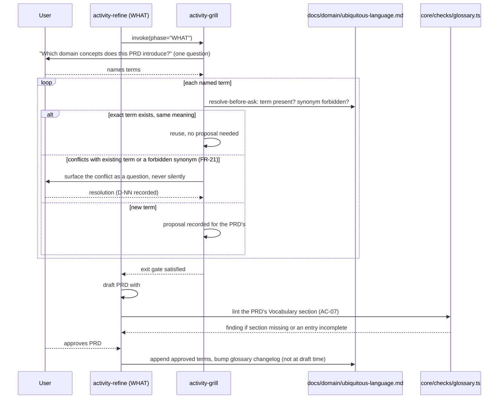
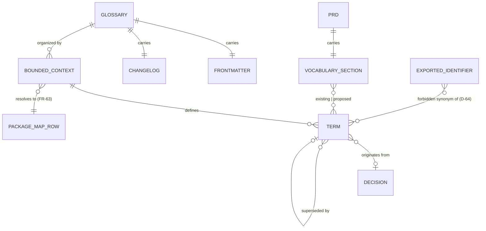
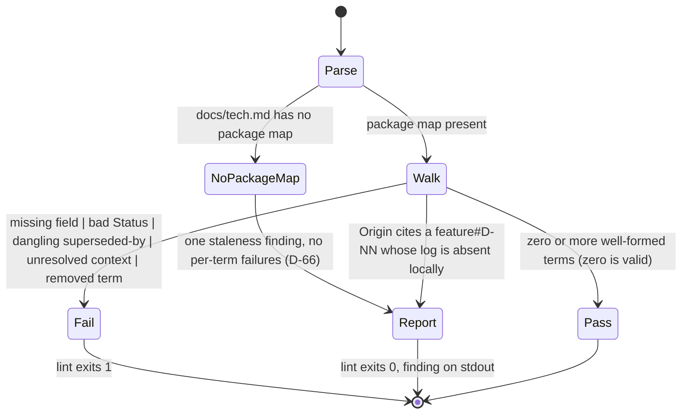

# Specification: Shared Understanding — Phase 3 (Ubiquitous Language)

## Changelog

| Version | Date       | Summary                                                                                                                                                                          | Author                    |
| ------- | ---------- | --------------------------------------------------------------------------------------------------------------------------------------------------------------------------------- | ------------------------- |
| 1.2     | 2026-09-22 | §8.7 and the consumed-decisions table corrected to what shipped (S-003 / issue #231 Audit Mode finding D-2): S-003 added this PRD's `## Vocabulary` section as `proposed`, not S-006 as `existing`; D-76 supersedes D-71 and D-77 records the document-ownership rule. | verifier / @llipe / product-engineer |
| 1.1     | 2026-09-21 | Design Mode corrections (D-70 to D-75): PRD v1.14 wording for AC-07/FR-23; `vocabulary-*` findings are failures and this PRD gains `## Vocabulary` (S-006); seed forbidden synonyms trimmed (`package`/`module` dropped); identifier normalization, `+term` grammar, rule-name union, case rules, fenced-block skipping pinned; `checkGlossary()` silent on absence; `PackageMapRow` in `workspace.ts`; D-68 wording corrected; `activity-generate-spec` runs the Vocabulary check on specs. | verifier / @llipe / product-engineer |
| 1.0     | 2026-09-21 | Initial version. Glossary file delivered install-if-absent, `## Vocabulary` in PRDs/specs, `core/checks/glossary.ts` shared by `lint` and the `verifier`, `doctor` absence warning, this repository's own glossary populated. First specification drafted behind a live `activity-grill(phase="HOW")` exit gate (D-57 to D-69). | @llipe / product-engineer |

## 1. Executive Summary

Phase 3 makes vocabulary a durable, checkable artifact. Every consumer gets `docs/domain/ubiquitous-language.md`, delivered once and never overwritten, organized by bounded context mapped to the Phase 1 package map. Terms enter only through grilling: a PRD's `## Vocabulary` section proposes them, the WHAT phase resolves conflicts, and `activity-refine` appends approved terms when the PRD is approved. One deterministic check, `core/checks/glossary.ts`, serves two callers — `lint` validates the file's structure and a PRD's Vocabulary section (AC-07); the `verifier` reads it to report forbidden synonyms in newly exported identifiers (AC-15), report-only in this release (D-63). No new runtime mechanism is needed: delivery reuses Phase 1's `ROOT_PROFILE_TAG` (D-57), and the check follows Phase 2's `decision-log-format.ts` precedent (D-59).

## 2. Reference Documents

| Document                                                                | Relevance                                                                                                                                                    |
| ----------------------------------------------------------------------- | ------------------------------------------------------------------------------------------------------------------------------------------------------------- |
| `docs/requirements/prd-shared-understanding-refinement.md` v1.14        | FR-17 to FR-23 (Ubiquitous language), FR-63 (bounded contexts map to the package map), AC-06, AC-07, AC-08, AC-15, Data Requirements § Ubiquitous language, Technical Considerations § Delivery of the two consumer-owned files, § Glossary conformance; OQ-03 (resolved here as D-63); Non-Goals (no term generation from code, no tactical DDD) |
| `docs/tech.md`                                                          | Package map (the target of FR-63's bounded-context resolution; D-45's freeform column is retired by D-69), § Grilling (cap used by this spec's own interview) |
| `SIMPLICITY.md`                                                         | A4 (no index for one file — D-58; no compiler dependency for one regex — D-60), A10 (burden of proof on adding)                                                |
| `docs/adr/ADR-008-grilling-exit-gate-and-install-if-absent-category.md` | Records the platform-agnostic install-if-absent category this phase reuses (D-57)                                                                            |
| `core/distribution/profiles.ts`, `install-if-absent.ts`                 | `INSTALL_IF_ABSENT_FILES`, `ROOT_PROFILE_TAG`, `deliverInstallIfAbsentFiles()` — the registry and delivery path this phase extends by one entry               |
| `core/distribution/doctor.ts`                                           | `checkPackageMap()` — the warn-never-fail shape `checkGlossaryPresence()` copies (D-67)                                                                       |
| `core/checks/docs-structure.ts`, `decision-log-format.ts`, `run.ts`     | The check-module precedent (`D-48` tsx invocation, `D-49` hand-parsing, S-007's separate-module judgment) this phase follows (D-59)                          |
| `.claude/skills/activity-grill/SKILL.md` (+ `.github`, `.kiro`)         | Resolve-before-ask step 3.2 and Issue Mode rule already name "the glossary (once Phase 3 ships it)" — this phase removes the parenthetical and adds FR-21     |
| `.claude/skills/activity-refine/SKILL.md`, `activity-generate-spec/SKILL.md` (+ mirrors) | Output structures gain `## Vocabulary` after `## Decisions` (D-61)                                                                          |
| `.claude/agents/verifier.md` (+ mirrors)                                | Audit Mode already calls `checkDocsStructure()`; gains the glossary conformance call (AC-15)                                                                 |
| `workstream/research-shared-understanding-phase-3.md`                   | Pre-step research artifact (ADR-004) consumed by the HOW-phase interview                                                                                     |
| `workstream/decisions-shared-understanding.md`                          | D-03, D-12, D-16, D-45 (WHAT/earlier phases); D-57 to D-75 (this phase's HOW decisions, D-70 to D-75 from Design Mode)                                                                      |

## 3. Affected Repositories

| Repository  | Role                         | Scope of Changes                                                                                                                                                                                                                                                                  |
| ----------- | ---------------------------- | --------------------------------------------------------------------------------------------------------------------------------------------------------------------------------------------------------------------------------------------------------------------------------- |
| `dev-tasks` | Workflow harness (this repo) | One new template, one registry entry, one manifest update, one new `core/checks` module, one new `doctor` check, prose edits to four skills/agents across three prompt trees, this repository's own populated glossary, and `docs/README.md`/`docs/tech.md` updates. No API, UI, or infrastructure surface. |

Consumers receive the glossary through the next `dev-tasks install` or `update` (install-if-absent — an existing consumer file is never touched, AC-06).

## 4. System Architecture

Three delivery paths meet at one file. Delivery reuses Phase 1's platform-agnostic category; validation reuses Phase 2's check-module pattern; vocabulary entry reuses Phase 2's grilling. Nothing here is a new mechanism (D-57, D-59).

```mermaid
graph TD
    TPL["templates/domain/<br/>ubiquitous-language.md"]
    REG["INSTALL_IF_ABSENT_FILES<br/>(ROOT_PROFILE_TAG entry, D-57)"]
    INST["dev-tasks install / update"]
    GLOSS[("docs/domain/<br/>ubiquitous-language.md")]
    PM["docs/tech.md<br/>package map"]
    DOC["dev-tasks doctor<br/>checkGlossaryPresence (D-67)"]
    CHK["core/checks/glossary.ts<br/>(D-59)"]
    LINT["pnpm run lint<br/>tsx core/checks/run.ts"]
    VER["verifier Audit Mode<br/>(report-only, D-63)"]
    GRILL["activity-grill WHAT<br/>(FR-21 conflict questions)"]
    REF["activity-refine<br/>(## Vocabulary, approval append, D-61)"]
    PRD["docs/requirements/prd-*.md"]
    DIFF["git diff of a PR<br/>(added export lines, D-60)"]

    TPL --> REG --> INST -->|write if absent, never overwrite| GLOSS
    GLOSS -.->|bounded contexts resolve to| PM
    DOC -->|warn on absence only| GLOSS
    CHK -->|structure rules (D-66)| GLOSS
    CHK -->|Vocabulary section rules (D-65)| PRD
    CHK -->|forbidden-synonym scan (D-64)| DIFF
    LINT --> CHK
    VER --> CHK
    GRILL -->|surfaces conflicts, never writes| GLOSS
    REF -->|proposes in PRD| PRD
    REF -->|appends on approval| GLOSS
```

**Vocabulary lifecycle — from proposal to canonical term (FR-20, FR-21, D-61, D-65):**



## 5. Data Model & Database Design

No database. One new file shape, one existing shape gains a section, one registry gains a row.

### `docs/domain/ubiquitous-language.md` (FR-18, FR-19, D-68)

Frontmatter — the same five keys as `TESTING.md`/`SIMPLICITY.md` (D-68). `docs-structure.ts`'s `parseFrontmatter()` is reused; its `REQUIRED_KEYS` are the runbook keys, so the glossary check asserts its own five keys by presence — `owner`'s value is not enforced (D-75):

```yaml
---
version: 1.0
name: Ubiquitous Language
description: Canonical domain vocabulary, organized by bounded context. Append-only; terms are superseded, never deleted.
status: unfilled | active
owner: product-engineer
---
```

Body — exactly the PRD's Data Requirements template, plus a `## Changelog` table (FR-19) placed first, after the title:

```markdown
# Ubiquitous Language

## Changelog

| Version | Date       | Summary | Author |
| ------- | ---------- | ------- | ------ |

## Bounded Context: <name>

### <Term>

- Definition: …
- Forbidden synonyms: …
- Invariants: …
- Origin: <prd-file or feature#D-NN>
- Status: active | superseded by <Term> (<feature#D-NN>)
```

| Field                | Rule                                                                                                                                  | Enforced by             |
| -------------------- | ------------------------------------------------------------------------------------------------------------------------------------- | ----------------------- |
| `## Bounded Context:` | Must equal a package name in `docs/tech.md`'s package map, or a value in its Bounded context column (FR-63)                          | `glossary.ts` (fail, D-66) |
| `### <Term>`         | Unique within the file; a term appears once, in one context (D-16: one meaning per repository)                                        | `glossary.ts` (fail)    |
| `Definition`, `Forbidden synonyms`, `Invariants`, `Origin`, `Status` | All five present per term (FR-18). `Forbidden synonyms` and `Invariants` may be `none` — present and explicit, not omitted | `glossary.ts` (fail, D-66) |
| `Status`             | `active`, or `superseded by <Term> (<feature#D-NN>)` where `<Term>` exists in the file                                                | `glossary.ts` (fail, D-66) |
| `Origin`             | A file path or a qualified `feature#D-NN`. An unresolvable decision reference (log archived) is reported, not failed (D-66)            | `glossary.ts` (report)  |
| Append-only          | The set of `### <Term>` headings in the file may only grow between changelog versions; a removed term fails (FR-19)                    | `glossary.ts` (fail, D-66) |
| Zero terms           | Valid — the state of every fresh install (D-66, D-67)                                                                                 | —                       |

`status: unfilled` means "no vocabulary established," never permission — the `TESTING.md` rule (D-68). It flips to `active` on the first approved append.

### `## Vocabulary` in PRDs and specifications (FR-20, D-61, D-65)

Slots after `## Decisions` in `activity-refine`'s PRD Output Structure and after `## Decisions (HOW phase)` in `activity-generate-spec`'s, additive like S-002/S-003's sections:

```markdown
## Vocabulary

| Term | Status in glossary            | Bounded context | Definition (proposals only) | Forbidden synonyms (proposals only) |
| ---- | ----------------------------- | --------------- | --------------------------- | ----------------------------------- |
| …    | existing \| proposed \| conflict → D-NN | …      | …                           | …                                   |
```

A row is complete when `existing` names a term present in the glossary (case-insensitive), or `proposed` carries a bounded context, a definition, and forbidden synonyms (`none` allowed); `->` and `→` are both accepted in `conflict → D-NN`. A header-only table, or a `proposed` row for a term the glossary already has, is `vocabulary-incomplete` (the latter with a "use `existing`" message) (D-74). A PRD with no `## Vocabulary` section, or with an incomplete row, receives the AC-07 named finding `vocabulary-missing` / `vocabulary-incomplete` (D-65). A PRD that genuinely introduces no domain concept carries the section with one line, `None — this PRD introduces no domain concepts.`, which is complete.

### `INSTALL_IF_ABSENT_FILES` entry (D-57)

```typescript
{
  source: "templates/domain/ubiquitous-language.md",
  target: "docs/domain/ubiquitous-language.md",
  platform: ROOT_PROFILE_TAG,
}
```

plus `bundle-manifest.json`: `templates/domain/ubiquitous-language.md` under `managed_paths`, `docs/domain/ubiquitous-language.md` under `consumer_owned_paths`.



## 6. API Design

No HTTP API. The `dev-tasks` CLI gains no subcommand; `doctor` gains one warning class.

| Command             | Behavior                                                                                                                                                                                                              |
| ------------------- | --------------------------------------------------------------------------------------------------------------------------------------------------------------------------------------------------------------------- |
| `dev-tasks install` | Unchanged flow; `deliverInstallIfAbsentFiles()` now writes `docs/domain/ubiquitous-language.md` when absent, on every profile (`ROOT_PROFILE_TAG` is delivered once per run whatever the profile resolves to) (AC-06). |
| `dev-tasks update`  | Same; an existing consumer glossary is byte-identical after `update` (AC-06).                                                                                                                                         |
| `dev-tasks doctor`  | Gains `checkGlossaryPresence()`: `warn` when the file is absent, proposing `dev-tasks update`; silent when present, even with zero terms (D-67). Never fails — structural failures are `lint`'s.                        |

The check module's exported surface, following `decision-log-format.ts`:

```typescript
// core/checks/glossary.ts
export type GlossaryRule = "glossary-frontmatter" | "glossary-field-missing" | "glossary-status-invalid" | "glossary-superseded-dangling" | "glossary-term-duplicate" | "glossary-context-unresolved" | "glossary-term-removed" | "glossary-package-map-absent" | "glossary-origin-unresolved" | "vocabulary-missing" | "vocabulary-incomplete" | "glossary-forbidden-synonym"; // D-74
export interface GlossaryFinding { rule: GlossaryRule; file: string; message: string; }
export interface GlossaryResult { failures: GlossaryFinding[]; staleness: GlossaryFinding[]; }

export function checkGlossaryContent(markdown: string, packageMap: PackageMapRow[] | null): GlossaryResult;   // D-66
export function checkGlossary(repoRoot: string): GlossaryResult;                                              // reads file + tech.md via `PackageMapRow` (workspace.ts, D-75); resolves archived origins; absent file → no findings (D-75)
export function checkVocabularySection(prdMarkdown: string, glossaryMarkdown: string): GlossaryResult;        // AC-07, D-65
export function checkExportedIdentifiers(addedLines: string[], glossaryMarkdown: string): GlossaryResult;     // FR-23, D-60, D-64 — always `staleness`, never `failures` (D-63)
```

## 7. Authentication & Authorization Design

Not applicable. No new credential or network surface.

## 8. Business Logic Implementation

### 8.1 Delivery (FR-17, AC-06, D-57)

One entry added to `INSTALL_IF_ABSENT_FILES`; `install.ts` and `update.ts` already iterate the registry, so no flow change. The template ships with `status: unfilled`, an empty changelog row set, and no bounded contexts. Consumer edits survive `update` because the target is in `consumer_owned_paths` and the category is write-if-absent by construction.

### 8.2 Structure check (FR-18, FR-19, FR-63, D-59, D-66)

`checkGlossaryContent()` hand-parses the file (no `yaml`, no markdown library — the module ships to consumers in `dist/core/`, D-49): frontmatter as the five fixed keys `docs-structure.ts` already parses; body as a two-level heading walk (`## Bounded Context:` → `### <Term>` → five `- Key:` bullets). The package map is read from `docs/tech.md`'s table with the same hand-parse `doctor.ts`'s `checkPackageMap()` uses.



Both parsers skip fenced code blocks — this specification and the PRD's Data Requirements both contain `## Vocabulary` / `## Bounded Context:` examples inside fences (D-74). Context names match the package map exactly (case-sensitive); term uniqueness is case-insensitive, matching the `existing` lookup (D-16, D-74). `PackageMapRow` and its table parser live in `core/distribution/workspace.ts`, shared with `doctor` (D-75).

Append-only is checked without git: the changelog's latest version row and the term set are both in the file, so the check keeps the previous term set in the file's own `## Changelog` summary convention (`+term-a, +term-b` per version row — `+` followed by the term text to the next `,` or end of cell, trimmed, matched case-insensitively to headings, D-74). A term present in a prior row's `+` list but absent from the body fails `glossary-term-removed`. This keeps the check deterministic and offline, at the cost of a small discipline on the changelog row (the approval append in §8.4 writes it).

### 8.3 Vocabulary section check (FR-20, AC-07, D-65)

`checkVocabularySection()` runs on a PRD (and spec) markdown: locate `## Vocabulary`; absent → `vocabulary-missing`; present → each table row must be `existing` (term found in the glossary, case-insensitive) or `proposed` with all three proposal columns non-empty, or `conflict → D-NN` (a recorded decision resolves it). Anything else → `vocabulary-incomplete` naming the row. Both are `failures` — AC-07 says "fails refinement" (D-71). No prose is scanned. `activity-refine` runs this before presenting a PRD for review, and `activity-generate-spec` runs the same call before presenting a spec (D-75), each reporting the finding by name; the same function runs under `lint` for every file in `docs/requirements/` so a PRD that predates this phase is not retroactively failed — files without a `## Vocabulary` section **and** without a `## Decisions` section (i.e., pre-Phase-2 PRDs) are skipped, since they were never grilled.

### 8.4 Approval append (FR-20, D-61)

When the user approves a PRD, `activity-refine` (not `activity-grill`, whose write authority is the decision log only): for each `proposed` Vocabulary row, appends a `### <Term>` entry under the named `## Bounded Context:` (creating the context heading if new and it resolves per FR-63), sets `Origin` to the PRD path, `Status: active`, adds a changelog row `+term-a, +term-b`, bumps `version`, and flips frontmatter `status` from `unfilled` to `active` on the first append. A `conflict → D-NN` row whose decision superseded an existing term rewrites that term's `Status` to `superseded by <New> (<feature#D-NN>)` — the old entry stays (FR-19).

### 8.5 Grilling integration (FR-21, D-61)

`activity-grill` step 3.2 already reads the glossary in resolve-before-ask; this phase removes the "(once Phase 3 ships it)" parenthetical in all three trees and adds one WHAT-phase rule: for every term the user names, check the glossary for (a) the same term with a different definition, (b) the term appearing in another term's forbidden synonyms; either is surfaced as a question with a recommendation, never resolved silently (FR-21, AC-08). Issue Mode's "glossary is read-only" rule loses its "moot until Phase 3" note and now means what it says.

### 8.6 Verifier conformance (FR-23, AC-15, D-60, D-63, D-64)

`checkExportedIdentifiers()` takes the added lines of a PR's diff (the `verifier` already has the diff in Audit Mode), matches `^\+\s*export\s+(?:const|let|var|function|class|type|interface|enum|async function)\s+([A-Za-z_$][\w$]*)` and `export \{ … \}` name lists, splits each identifier into words (PascalCase, camelCase, snake_case, SCREAMING_CASE), normalizes case and plural (strip `es` after `s`/`x`/`z`/`ch`/`sh`, else one trailing `s` not preceded by `s`; the same function on both sides, D-73), and reports `glossary-forbidden-synonym` when any word, the joined identifier, or any adjacent word-pair join equals a forbidden synonym normalized the same way (`-`/`_`/spaces stripped) (D-64, D-73). `export { b as c }` yields `c`; a leading diff `+` on a line is optional (D-73). The result is always `staleness`, never `failures` (D-63): the `verifier` narrates it as an advisory finding in its audit summary, and it never blocks PR readiness in this release. Unmatched identifiers produce nothing.

### 8.7 This repository's own glossary (D-69)

`docs/domain/ubiquitous-language.md` in `dev-tasks` ships populated under one context, `AI-assisted development workflow` (the package map's single row — D-45's freeform label becomes the canonical context name, closing that decision), with these terms, each citing its origin:

| Term                  | Origin                                                          |
| --------------------- | --------------------------------------------------------------- |
| decision log          | `prd-shared-understanding-refinement.md` FR-4                   |
| grilling              | `prd-shared-understanding-refinement.md` FR-1, `shared-understanding#D-01` |
| exit gate             | `shared-understanding#D-02`, ADR-008                            |
| bounded context       | `prd-shared-understanding-refinement.md` FR-18, `shared-understanding#D-03` |
| package map           | `prd-shared-understanding-refinement.md` FR-60                  |
| runbook               | `prd-shared-understanding-refinement.md` FR-47                  |
| install-if-absent     | ADR-006, ADR-008, `shared-understanding#D-12`                   |
| foundation document   | `prd-shared-understanding-refinement.md` FR-44                  |

Forbidden synonyms are recorded only where this PRD's own history supplies one: `foundation document` forbids `product-context`/`technical-guidelines` — the retired names. `bounded context` carries none (D-72: `package`/`module` were the spec author's addition, not PRD history, and would flag S-002's own `PackageMapRow` export). No invented vocabulary.

Because this PRD carries `## Decisions`, §8.3's skip rule does not skip it. S-003 added the `## Vocabulary` section to `docs/requirements/prd-shared-understanding-refinement.md` in the same PR as the `run.ts` walk — the walk failed this PRD the moment it landed — with the eight rows `proposed`, since `existing` is unavailable while the glossary is empty. S-006 flips those rows to `existing` when it populates the glossary, matched on the exact term string, so `lint` passes on this repository (D-76, superseding D-71).

## 9. Integration Details

- **`activity-grill`** — prose edits only (§8.5); no change to its write authority or cap mechanics.
- **`activity-refine` / `activity-generate-spec`** — Output Structure gains `## Vocabulary`; `activity-refine` gains the approval-append step and the AC-07 check call. Three-tree parity.
- **`verifier`** — Audit Mode gains one call, next to its existing `checkDocsStructure()` call, and one advisory finding class. Three-tree parity.
- **`activity-init`** — one pointer sentence on the bounded-context question (D-62); no new interview step.
- **`technical-writer`** — `docs/README.md` gains a `domain/` row (D-58); the docs-structure check is otherwise unchanged.
- No third-party services.

## 10. User Interface & Client Behavior

Not applicable — no GUI. The only user-facing surface is the WHAT-phase question "Which domain concepts does this PRD introduce?" and the FR-21 conflict questions, both delivered through `activity-grill`'s existing one-question-per-turn contract.

## 11. Performance & Scalability Approach

The structure check is a single-pass walk over one Markdown file plus one table in `docs/tech.md` — bounded by glossary size, not source size, so it does not threaten Phase 4's CI budget (OQ-12). The identifier scan is a regex over a PR's added lines only, never the whole tree. The Vocabulary check under `lint` walks `docs/requirements/*.md` once. No caching needed.

## 12. Security Implementation

Not applicable. No credential, network, or PII surface; the glossary is documentation under the repository's own visibility.

## 13. Error Handling & Logging

- `lint` failures from `glossary.ts` are `lint` failures with `file:rule` messages (the `docs-structure.ts` shape), not a new exit code.
- Report-class findings (D-66's second list, and every FR-23 finding per D-63) go to stdout and exit 0.
- `doctor`'s absence warning follows the existing pass/warn shape with `--json` support.
- A malformed frontmatter (missing one of the five keys) is a `failure` — the same rule runbooks already have.
- A `docs/tech.md` with no package map produces exactly one `staleness` finding for the glossary check, never one per term (D-66).

## 14. Testing Strategy

| Layer        | Approach                                                                                                                                                                                                                                                              |
| ------------ | --------------------------------------------------------------------------------------------------------------------------------------------------------------------------------------------------------------------------------------------------------------------- |
| Unit         | `test/unit/checks-glossary.test.ts`: each D-66 failure rule, each report rule, zero-terms pass, absent package map → one finding, append-only removal detection; `checkVocabularySection`: missing section, incomplete row, `existing` not in glossary, `conflict → D-NN`, the `None — …` sentinel; `checkExportedIdentifiers`: each `export` form, each casing split, plural normalization, a forbidden-synonym hit, an unmatched identifier producing nothing (D-64), result always in `staleness` (D-63). Real-file fixture: this repository's own populated glossary (D-69) must pass clean. |
| Unit         | `test/unit/doctor-glossary.test.ts` (or extend the existing doctor test): absent → warn with the `update` proposal; present-empty → no finding (D-67).                                                                                                                  |
| Integration  | Extend `test/integration/install-parity.test.ts`: fresh install on each profile creates the glossary byte-identical to the template; a second `install`/`update` over a modified glossary leaves it byte-identical (AC-06).                                            |
| Parity       | Extend `test/unit/skill-parity-grilling.test.ts` (or a sibling): `activity-grill` FR-21 rule, `activity-refine`/`activity-generate-spec` `## Vocabulary`, `verifier` conformance call — equivalent in all three trees; `root-doc-template-parity.test.ts` pattern for the new template. The existing `skill-parity-testing-layers.test.ts` "one glossary at the root" assertion must keep passing. |
| Lint         | `pnpm run lint` on this repository passes with the populated glossary and with every PRD under `docs/requirements/` (pre-Phase-2 PRDs skipped per §8.3).                                                                                                              |
| Scenario     | One hand-walked fixture in `test/fixtures/grilling/`, `vocabulary-conflict.md`: a WHAT-phase session where a proposed term collides with a forbidden synonym, asserting the FR-21 question fires and is recorded — same style as the Phase 2 fixtures.                 |

## 15. Deployment & Rollout

| Aspect                | Decision                                                                                                                                                                                   |
| --------------------- | ------------------------------------------------------------------------------------------------------------------------------------------------------------------------------------------ |
| Feature flag          | None (`SIMPLICITY.md` A10).                                                                                                                                                                |
| Backward compatibility | Existing consumers gain the file on their next `install`/`update`; nothing they own is modified. PRDs that predate Phase 2 are not retroactively failed by the Vocabulary check (§8.3). The FR-23 scan is advisory (D-63), so no consumer's PR turns red from this phase. |
| Version/commit type   | Additive: `feat:` commits, no `!`. Release is the maintainer's post-merge `scripts/release.sh` (D-41).                                                                                     |
| Rollback              | Revert the merge commit. The only consumer-visible artifact is a new file delivered once; a revert stops delivering it and leaves already-delivered copies in place (they are consumer-owned). |

## 16. Dependencies & Risks

| Risk                                                                                                                         | Likelihood | Mitigation                                                                                                                                                                             |
| ---------------------------------------------------------------------------------------------------------------------------- | ---------- | -------------------------------------------------------------------------------------------------------------------------------------------------------------------------------------- |
| Regex identifier extraction misses TypeScript forms (`export default class`, overloads, re-exports with `as`)                | Medium     | Advisory only (D-63); the regex list in §8.6 is a named enumeration in the test, and misses are additive follow-ups, not failures.                                                      |
| Forbidden-synonym word matching over-fires on common English words used as synonyms (`item`, `record`)                        | Medium     | Only forbidden synonyms declared in the glossary match (D-64), so noise is bounded by what the team writes; report-only in this release.                                                |
| Append-only check depends on the changelog's `+term` convention being written correctly                                       | Low        | §8.4's approval append is the only writer and produces the row mechanically; a hand-edited row that omits terms causes a false `term-removed` failure, which is loud and easy to fix.  |
| Three-tree prose drifts (four skills/agents touched)                                                                          | Medium     | Parity tests in §14 cover each touched file.                                                                                                                                           |
| Consumers with no `docs/tech.md` package map see a report on every `lint`                                                     | Low        | One finding, not one per term (D-66); it names `activity-init` as the fix.                                                                                                             |
| Populating this repository's glossary invites scope creep into "define everything"                                            | Low        | D-69 bounds the seed to terms this PRD already uses; anything else enters through a future PRD's Vocabulary section.                                                                   |

## 17. Open Questions

None. Design Mode (`workstream/test-plan-shared-understanding-phase-3.md`) flagged 18 ambiguities, A-1 to A-18; all are resolved as D-70 to D-75 (v1.1). The seven questions this phase needed a human for were asked one at a time under a live `activity-grill(phase="HOW")` session and recorded as D-63 to D-69; six more were resolved from the codebase and recorded as D-57 to D-62. The exit gate was confirmed explicitly on 2026-09-21.

## 18. Decisions (HOW phase)

Recorded in `workstream/decisions-shared-understanding.md`. Numbering continues the feature's single decision-log ID space.

| ID   | Decision (short form)                                                                                                                              |
| ---- | -------------------------------------------------------------------------------------------------------------------------------------------------- |
| D-57 | Delivery: one `INSTALL_IF_ABSENT_FILES` entry tagged `ROOT_PROFILE_TAG`; template at `templates/domain/`; manifest paths updated. No new mechanism. |
| D-58 | `docs/README.md` gains a `domain/` row; no `docs/domain/README.md`, no `INDEXES` change.                                                            |
| D-59 | Separate `core/checks/glossary.ts`, hand-parsed, `tsx`-invoked; one implementation for `lint` and the `verifier`.                                   |
| D-60 | FR-23 extraction is a regex over added `export` declarations, not the TypeScript compiler API.                                                      |
| D-61 | `## Vocabulary` follows `## Decisions`; `activity-refine` appends to the glossary at approval; `activity-grill` only surfaces conflicts.             |
| D-62 | No new `activity-init` step; one pointer sentence closes D-45.                                                                                      |
| D-63 | Resolves OQ-03: glossary conformance is report-only in the first release.                                                                          |
| D-64 | FR-23 reports forbidden-synonym hits only; unmatched identifiers are never findings.                                                                |
| D-65 | AC-07 is a structural check of the `## Vocabulary` section; no natural-language term scanning.                                                     |
| D-66 | Structural glossary findings fail `lint`; absent package map and archived-origin references only report; zero terms is valid.                       |
| D-67 | `doctor` warns on glossary absence only; empty-but-present is silent.                                                                              |
| D-68 | Five-key frontmatter; owner `product-engineer`; `status: unfilled` is never permission.                                                             |
| D-69 | Extends D-45: this repository's glossary ships populated with the terms this PRD introduced; the package-map placeholder becomes the canonical context. |
| D-70 | PRD v1.14: AC-07 and FR-23 reworded to their testable forms (Design Mode A-1/A-2), with explicit human confirmation.                                 |
| D-71 | `vocabulary-*` findings are failures; this PRD gains `## Vocabulary` in S-006 so `lint` passes on this repository. **Superseded by D-76.**            |
| D-76 | S-003 added this PRD's `## Vocabulary` as `proposed` (the `run.ts` walk failed this PRD on landing); S-006 flips the rows to `existing`.             |
| D-77 | A `developer` may make a minimal, disclosed edit to a `product-engineer`-owned document when the alternative is a red integration branch.            |
| D-72 | Seed glossary: `package`/`module` dropped from `bounded context`'s forbidden synonyms.                                                                 |
| D-73 | Identifier rules: plural normalization order, `as` right-hand name, optional `+` prefix, multi-word synonym joining.                                   |
| D-74 | Grammar rules: `+term` grammar, `GlossaryRule` union, Vocabulary edge grammar, exact-case contexts, case-insensitive terms, fenced blocks skipped.     |
| D-75 | Module shape: `checkGlossary()` silent on absence, resolution in the filesystem wrapper, `PackageMapRow` in `workspace.ts`, D-68 wording corrected, spec check in `activity-generate-spec`. |

Earlier decisions consumed: `shared-understanding#D-03` (strategic DDD only), `#D-12` (install-if-absent semantics), `#D-16` (one root glossary, contexts map to packages), `#D-45` (freeform bounded context until this phase), `#D-48`/`#D-49` (tsx invocation, hand-parsing), `#D-53` to `#D-56` (Phase 2 grilling mechanics this spec was produced under).
