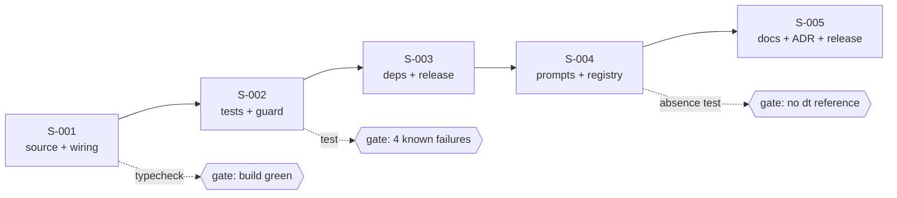

# User Stories: Shared Understanding — Phase 0 (Retire `dt`)

## Changelog

| Version | Date       | Summary                                                              | Author           |
| ------- | ---------- | ---------------------------------------------------------------------- | ---------------- |
| 1.0     | 2026-09-18 | Initial version. Five stories covering PRD FR-53 to FR-58.                                                                                                                                                          | product-engineer |
| 1.1     | 2026-09-19 | Verifier Design Mode corrections: pass signal is the five named failures as a set, not a count of four (D-40); `publish-npm.yml` asserts two deleted paths; the `#adapters` alias spans four files; `format` globs break the gate; the exit-code prune touches the retained binary; six retained tests must change, enumerated. | verifier / product-engineer |
| 1.2     | 2026-09-19 | Verifier Audit Mode drift reconciliation (fidelity-report-shared-understanding-phase-0.md): S-004 AC-7 corrected from five to the actual nine touched test files (`architecture-change-dryrun.test.ts`, `cross-repo-partitioning-dryrun.test.ts`, `skill-init-edge-cases.test.ts`, and `skill-init-walkthrough.test.ts` were undercounted); S-003 note added recording the `express`, `@types/express`, and `eslint-plugin-import-x` devDependency removals, disclosed in commit `6edee92` but never enumerated in this document. | product-engineer (drift-reconciliation) |

## Source Documents

- PRD: `docs/requirements/prd-shared-understanding-refinement.md` (FR-53 to FR-58, AC-27, AC-28)
- Specification: `workstream/specification-shared-understanding-phase-0.md` (v1.1)
- Decisions: `workstream/decisions-shared-understanding.md` (D-14, D-28 to D-38)

## Delivery Shape

Five stories, seven commits, **one consolidated pull request** (D-29). The stories are sequential, not independent: the absence test in S-002 only passes once S-004 has also landed, which is why they share a pull request. `planner` is the right orchestrator — it delegates per story and produces one integration PR.

Branch: `integration/prd-shared-understanding-phase-0`. Every story commits to it; no story opens its own pull request.

---

### Story S-001: Remove the `dt` source tree and rewire the package

**Priority:** Critical
**Estimated Size:** M
**Dependencies:** None. This story opens the phase.

#### User Story

As the maintainer of `dev-tasks`,
I want the `dt` binary and its modules gone from the source tree,
So that the code I maintain is the code I actually use.

#### Context

`dt` is roughly 19,600 of 21,500 non-test TypeScript lines and is unused. `core/distribution`, which backs the `dev-tasks` binary, imports nothing from it, so the two halves separate at an existing seam. This story is the bulk of the deletion and must leave the package compiling.

#### Acceptance Criteria

- [x] AC-1: `bin/dt.ts`, `core/catalog`, `core/context`, `core/extract`, `core/scope`, `core/verify`, `core/providers`, `schemas/`, and `templates/meta-repo/` no longer exist.
- [x] AC-2: `adapters/` no longer exists; `parse-args.ts` lives at `bin/parse-args.ts` and `bin/dev-tasks.ts` imports it by relative path.
- [x] AC-3: The `#adapters` alias and the deleted directories are gone from all four files that name them: `package.json` (`bin`, `imports`, `files`, and the `format`/`format:check` globs), `tsconfig.json` (`paths`, `include`), `vitest.config.ts` (alias, coverage `include`), and `eslint.config.js` (the `core/` → `adapters/` restricted-path zone).
- [x] AC-4: `core/index.ts` exports only `ExitCode`, `ExitCodeValue`, `reconcile`, `ReconcileAction`, and `distribution`.
- [x] AC-5: `core/exit-codes.ts` retains, at unchanged numeric values, exactly the codes the `dev-tasks` binary returns, enumerated in the commit message. `bin/dev-tasks.ts:237` currently returns `ExitCode.DependencyError`, a deprecated alias of the `dt`-only `NoCandidates: 11`; it is repointed at a retained code. `test/unit/exit-codes.test.ts`, which asserts the full fifteen-code table, is updated in the same commit.
- [x] AC-6: `pnpm run typecheck`, `pnpm run build`, `pnpm run lint`, and `pnpm run format:check` all pass. `format:check` is named explicitly because its globs reference two deleted directories and `prettier --check` exits 2 on a missing pattern.
- [x] AC-7: `dev-tasks --help`, `--version`, `status`, and `doctor` behave exactly as before.

#### Business Rules

- The `dev-tasks` binary's observable behavior does not change. A consumer script that checks an exit code keeps working (ADR-002 contract preserved for the retained surface).
- `core/reconcile.ts` and `core/distribution/hash.ts` are shared and stay.

#### Technical Notes

- `execa` is reached from `update.ts` through `fetch-package.ts`; do not remove it here (dependencies are S-003).
- `core/index.ts` re-exports every deleted module, so it must be pruned in the same commit as the deletion or typecheck fails mid-commit.
- Moving `parse-args.ts` to `bin/` follows `SIMPLICITY.md` A4: a directory, a barrel, and a path alias for one 86-line module is not worth keeping.
- `bundle-manifest.json` needs no change; no managed or consumer-owned path names `dt` or `schemas/`.

#### Testing Requirements

- **Unit Tests:** No new tests. The 51 retained test files must pass unchanged. A retained test that needs editing is a stop signal, not a fix.
- **Integration Tests:** `pnpm run build` then run `node dist/bin/dev-tasks.js --version` and `--help`.
- **Manual/UI Testing:** None. No interface.
- **Edge-Case Matrix:** Unknown command still exits 2; no args still prints usage; `doctor` still runs every check.
- **Acceptance-Criteria Mapping:** AC-1 to AC-5 by inspection and `typecheck`; AC-6 by the gate commands; AC-7 by `test/integration/binaries.test.ts` and `bootstrap` integration tests.
- **Execution Commands:** `pnpm run typecheck`, `pnpm run build`, `pnpm run test:unit`

#### Migration Requirements

Not applicable. No data model, no persistent state.

#### Implementation Steps

1. Delete `bin/dt.ts` and the `dt` entry from `package.json` `bin`.
2. Move `adapters/cli/parse-args.ts` to `bin/parse-args.ts`; update the import in `bin/dev-tasks.ts`; delete the rest of `adapters/`.
3. Delete `core/catalog`, `core/context`, `core/extract`, `core/scope`, `core/verify`, `core/providers`.
4. Delete `schemas/` and `templates/meta-repo/`.
5. Prune `core/index.ts` and `core/exit-codes.ts`.
6. Remove `#adapters/*` from `package.json` `imports`; remove `schemas/` and `dist/adapters/` from `files`.
7. Run `typecheck` and `build`; fix only dangling references.

#### Files to Create/Modify

- `bin/parse-args.ts` — moved from `adapters/cli/`
- `bin/dev-tasks.ts` — import path update
- `core/index.ts` — barrel pruned
- `core/exit-codes.ts` — `dt`-only codes removed
- `package.json` — `bin`, `imports`, `files`

#### Definition of Done Checklist

- [x] Code implemented per technical guidelines
- [x] Retained tests pass unchanged
- [x] `typecheck`, `lint`, `format:check` pass
- [x] Acceptance criteria verified and mapped to evidence
- [x] Committed to the integration branch

---

### Story S-002: Remove `dt` tests and fixtures, and guard the retirement

**Priority:** Critical
**Estimated Size:** M
**Dependencies:** S-001

#### User Story

As the maintainer of `dev-tasks`,
I want the `dt` tests gone and a test that fails if `dt` ever returns,
So that the retirement cannot quietly regress.

#### Context

74 of 125 test files exercise `dt`. Deleting them is mechanical. The valuable part is the new absence test, which is what PRD AC-27 asks for and what stops a future change from reintroducing a `dt` reference in code or a prompt file.

#### Acceptance Criteria

- [x] AC-1: The 74 `dt` test files are deleted, along with `test/fixtures/{catalog,context,extract,schemas,verify}`.
- [x] AC-2: `test/fixtures/{git-guard,infra,qa-standards}` are untouched.
- [x] AC-3: `test/integration/binaries.test.ts` no longer contains `dt` cases and asserts `dist/bin/dt.js` does not exist.
- [x] AC-4: A new absence test fails when any file under `bin/`, `core/`, `test/`, `.claude/`, `.github/`, `.kiro/`, `AGENTS.md`, or `CLAUDE.md` references `dt ` as a command, `component.json`, or the meta-repo.
- [x] AC-5: `pnpm run test` fails on exactly the five pre-existing cases captured at task 0.2 and no others, compared as a set of full test names rather than as a count.
- [x] AC-6: The absence test is currently failing for the prompt trees, which S-004 resolves; it is committed after the code deletion and expected red until S-004 lands.

#### Business Rules

- Six retained tests are expected to change, and no others. Any seventh is a stop signal, not a fix.

| Test | Change |
| --- | --- |
| `binaries.test.ts` | remove `dt` cases, assert `dist/bin/dt.js` absent |
| `architecture-change-parity.test.ts` | delete with the `AGENTS.md` block it asserts |
| `cross-repo-partitioning-parity.test.ts` | delete with the block it asserts |
| `skill-parity-init.test.ts` | drop eight `dt` and multi-repo assertions |
| `researcher-parity.test.ts` | drop the `component.json` assertion |
| `skill-parity-testing-layers.test.ts` | drop `dt verify impact` and `dt verify drift` |
| `exit-codes.test.ts` | update the fifteen-code table (S-001) |
- A test is never skipped or quarantined to reach green (`SIMPLICITY.md` and the repository testing rules).

#### Technical Notes

- `test/integration/extract-component.test.ts` and `test/unit/extract-component.test.ts` import `hashContent` from `core/distribution`, but only as a helper. They are `dt` tests and are deleted.
- The acceptance signal is set equality with the five failures captured at task 0.2 (D-40, superseding D-36 which said four and miscounted). A count is not enough: it survives a regression that removes one failure and adds another, which is the shape this phase is prone to.
- The absence test belongs beside the existing parity tests and should read files rather than shell out, so it works on every platform.

#### Testing Requirements

- **Unit Tests:** The absence test itself, plus the amended `binaries.test.ts`.
- **Integration Tests:** Full `pnpm run test` run, compared against the recorded 4-failure baseline.
- **Manual/UI Testing:** None.
- **Edge-Case Matrix:** The absence test must not match the word "dt" inside unrelated prose (for example "adt"); it matches command forms and path forms only. It must also scan `AGENTS.md` and `CLAUDE.md`, not only code.
- **Acceptance-Criteria Mapping:** AC-1 to AC-3 by inspection; AC-4 by seeding a `dt catalog build` string in a scratch file and confirming the test fails; AC-5 by the full run.
- **Execution Commands:** `pnpm run test`, `pnpm run test:unit`

#### Implementation Steps

1. Delete the 74 `dt` test files and the five fixture directories.
2. Amend `binaries.test.ts`: remove the four `dt` cases, add the absence assertion for `dist/bin/dt.js`.
3. Run `pnpm run test`; confirm the failure count is 4 and each is on the known list.
4. Write the absence test (AC-4) in a separate commit so it is reviewable on its own.
5. Verify the absence test fails against a seeded reference, then remove the seed.

#### Files to Create/Modify

- `test/unit/dt-retirement-absence.test.ts` — new
- `test/integration/binaries.test.ts` — amended
- 74 test files and 5 fixture directories — deleted

#### Definition of Done Checklist

- [x] Absence test written before the prompt-tree cleanup it guards
- [x] Test suite at the 4-failure baseline
- [x] Quality gates pass
- [x] Committed to the integration branch

---

### Story S-003: Prune `dt` dependencies and fix the release workflow

**Priority:** Critical
**Estimated Size:** S
**Dependencies:** S-001

#### User Story

As the maintainer of `dev-tasks`,
I want the dependencies and release checks that exist only for `dt` removed,
So that the published package stops carrying weight it does not use and the next release does not fail.

#### Context

`.github/workflows/publish-npm.yml` asserts `dist/bin/dt.js` exists and fails the publish if it does not. That assertion runs only on publish, so it is the one deletion that breaks release rather than CI. It is the highest-value item in this story despite being one line.

#### Acceptance Criteria

- [x] AC-1: `ajv` is removed from `dependencies`; the `pg` optional peer and its `peerDependenciesMeta` entry are removed.
- [x] AC-2: The `fast-uri` entry in `pnpm.overrides` is removed, since it exists only for `ajv`.
- [x] AC-3: `yaml` moves from `dependencies` to `devDependencies`; after removal only `test/unit/infra-workflow-templates.test.ts` imports it.
- [x] AC-4: `execa` stays in `dependencies`.
- [x] AC-5: `.github/workflows/publish-npm.yml` asserts no deleted path. **Two** of its assertions break, not one: line 69 checks `dist/bin/dt.js` and line 71 checks `dist/adapters`. It still asserts `dist/bin/dev-tasks.js` and `dist/core`. A test parses the `Verify dist output` step and asserts every path it names exists after a build, so the class is closed rather than these two instances.
- [x] AC-6: `pnpm install` resolves with no missing-peer warnings; `pnpm audit --prod` result recorded in the pull request.
- [x] AC-7: `pnpm run build` produces `dist/bin/dev-tasks.js` and no `dist/bin/dt.js`.
- [x] AC-8 (added at drift reconciliation, v1.2): `express`, `@types/express`, and `eslint-plugin-import-x` are also removed from `devDependencies` — the first two backed only the deleted Express-introspection extractor, the third's only rule (`core/` must not import `adapters/`) became meaningless once `adapters/` was deleted. Disclosed in commit `6edee92`.

#### Business Rules

- Removing a dependency can change the advisory set, so `audit` is re-run and its result recorded rather than assumed.
- Overrides pinned for a past advisory are removed with the dependency that pulled them in, not kept defensively (`SIMPLICITY.md` A10).

#### Technical Notes

- Verified importers: `ajv` only in the deleted `core/catalog/validate-component.ts`; `pg` only in the deleted `core/extract/orm/information-schema.ts`; `execa` in the retained `core/distribution/fetch-package.ts`.
- The publish workflow's file assertions are a release-time gate; run them locally against a fresh `build` before the release commit.

#### Testing Requirements

- **Unit Tests:** None added.
- **Integration Tests:** `pnpm install --frozen-lockfile` then `pnpm run build`, then replay the workflow's file assertions locally.
- **Manual/UI Testing:** None.
- **Edge-Case Matrix:** Lockfile must regenerate cleanly; a stale `pnpm-lock.yaml` referencing `ajv` is a failure.
- **Acceptance-Criteria Mapping:** AC-1 to AC-5 by inspection; AC-6 and AC-7 by the commands above.
- **Execution Commands:** `pnpm install`, `pnpm run build`, `pnpm audit --prod`, `pnpm run validate`

#### Implementation Steps

1. Edit `package.json`: remove `ajv`, the `pg` peer and its meta entry, and the `fast-uri` override; move `yaml` to `devDependencies`.
2. Run `pnpm install` and commit the regenerated lockfile.
3. Edit `.github/workflows/publish-npm.yml` to drop the `dist/bin/dt.js` assertion.
4. Run `pnpm run build` and replay the workflow assertions locally.
5. Run `pnpm audit --prod` and capture the output for the pull request.

#### Files to Create/Modify

- `package.json`, `pnpm-lock.yaml`
- `.github/workflows/publish-npm.yml`

#### Definition of Done Checklist

- [x] Lockfile regenerated and committed
- [x] `audit` output captured for the pull request
- [x] Release assertions replayed locally against a fresh build
- [x] Committed to the integration branch

---

### Story S-004: Remove `dt` branches from the prompt trees and the registry

**Priority:** Critical
**Estimated Size:** M
**Dependencies:** S-002 (the absence test guards this work and turns green here)

#### User Story

As an agent running in this repository,
I want no instruction that tells me to call a command that no longer exists,
So that I stop spending context on a mode that can never trigger.

#### Context

27 prompt files across three trees carry `dt` branches, and `AGENTS.md` carries two rule blocks that exist only for the meta-repo. Left in place they are worse than dead code: an agent reading them will try to run a missing binary. This story is what turns the S-002 absence test green.

#### Acceptance Criteria

- [x] AC-1: No file under `.claude/`, `.github/`, or `.kiro/` references a `dt` command, `component.json`, or the meta-repo.
- [x] AC-2: `activity-contract-validation` is deleted from all three trees; `activity-contract-test-design` is retained unchanged.
- [x] AC-3: `activity-init` has no multi-repo mode and no `component.json` detection; its Init Mode flow is single-repo throughout.
- [x] AC-4: `activity-codebase-research`, `researcher`, `product-engineer`, and `qa-engineer` carry no `dt` invocation in any tree.
- [x] AC-5: `AGENTS.md` has no Task Types / `architecture-change` section (RF-62, RF-64) and no Cross-Repo Partitioning section (RF-63); `CLAUDE.md` loses the matching rules.
- [x] AC-6: `AGENTS.md.template` receives the same removals, so new installs do not ship the rules.
- [x] AC-7: The three trees remain at parity. Nine test files assert content this story removes and are therefore changed, not merely kept passing: `architecture-change-parity.test.ts`, `architecture-change-dryrun.test.ts`, `cross-repo-partitioning-parity.test.ts`, and `cross-repo-partitioning-dryrun.test.ts` are deleted with the blocks they assert; `skill-init-edge-cases.test.ts` is deleted as multi-repo-only; `skill-init-walkthrough.test.ts` is rewritten for the single-repo-only flow; `skill-parity-init`, `researcher-parity`, and `skill-parity-testing-layers` lose their `dt` assertions. Every other parity test passes unmodified, and a new check asserts set equality of skill directory names across the three trees.
- [x] AC-8: The S-002 absence test now passes.

#### Business Rules

- Parity across the three trees is mandatory. A change to one tree without the others fails the parity test.
- Removing the `architecture-change` task type also removes the only rule that granted meta-repo write authority. Nothing replaces it, because there is no meta-repo.

#### Technical Notes

- File counts: `.claude/` 9, `.github/` 10, `.kiro/` 8.
- `activity-init` is the most substantive edit: it has a three-way repository-mode branch. Phase 1 replaces this with single-package and monorepo detection, so keep the edit minimal here and leave the seam obvious.
- Removing an `AGENTS.md` section changes its size budget; check it against `docs/agents-md-guidelines.md`.

#### Testing Requirements

- **Unit Tests:** Existing agent and skill parity suites must pass; the absence test must flip from red to green.
- **Integration Tests:** None beyond the suite.
- **Manual/UI Testing:** Read `activity-init` end to end and confirm the flow is coherent without the multi-repo branch, with no orphaned step numbers or dangling references.
- **Edge-Case Matrix:** A skill deleted in one tree but not another; an `AGENTS.md` cross-reference to a removed section; a table row referencing a deleted skill.
- **Acceptance-Criteria Mapping:** AC-1 and AC-8 by the absence test; AC-2 to AC-6 by inspection; AC-7 by the parity suites.
- **Execution Commands:** `pnpm run test:unit`, `pnpm run validate`

#### Implementation Steps

1. Delete `activity-contract-validation` from the three trees and remove its rows from `AGENTS.md` and `CLAUDE.md`.
2. Remove the multi-repo mode from `activity-init` in all three trees.
3. Remove `dt` invocations from `activity-codebase-research`, `researcher`, `product-engineer`, `qa-engineer`, and the Copilot prompt files.
4. Remove the Task Types and Cross-Repo Partitioning sections from `AGENTS.md`, `AGENTS.md.template`, and the `CLAUDE.md` echo.
5. Run the parity suites and the absence test.

#### Files to Create/Modify

- 27 prompt files across `.claude/`, `.github/`, `.kiro/`
- `AGENTS.md`, `AGENTS.md.template`, `CLAUDE.md`
- `activity-contract-validation` in three trees — deleted

#### Definition of Done Checklist

- [x] Absence test green
- [x] Parity suites pass
- [x] `activity-init` reads coherently end to end
- [x] Committed to the integration branch

---

### Story S-005: Retire the `dt` documentation and record ADR-007

**Priority:** Critical
**Estimated Size:** M
**Dependencies:** S-001 to S-004

#### User Story

As a reader of this repository,
I want the documentation to describe the product that exists,
So that I am not taught a capability that was removed.

#### Context

Three documents exist only for `dt`, three more carry substantial `dt` content, and the product context still names the `dt` MCP server as the next maturity step. This story also produces ADR-007, which is what makes the retirement a recorded decision rather than an unexplained deletion, and it names the restore path.

#### Acceptance Criteria

- [x] AC-1: `docs/dt-user-manual.md`, `docs/data-model.md`, `docs/artifact-formats.md`, and `docs/requirements/prd-multi-repo-context.md` are deleted (D-38).
- [x] AC-2: `docs/README.md` lists no deleted document.
- [x] AC-3: `README.md`, `docs/system-overview.md`, and `docs/workflow-chains.md` carry no `dt` section; `docs/system-overview.md` is rewritten in its affected sections rather than merely stripped (D-32).
- [x] AC-4: `docs/product-context.md` Current State and Roadmap describe the product in use, with no `dt` MCP or LLM-scoping roadmap item.
- [x] AC-5: `TESTING.md` no longer declares a Contract-validation layer.
- [x] AC-6: ADR-007 exists with Context, Decision, Alternatives considered (keep, freeze, split to its own repository, remove), Consequences, and the restore path named as tag `v0.13.0` at commit `0a6f35e`.
- [x] AC-7: ADR-001 and ADR-002 are marked `Superseded` by ADR-007 with no other edit; the ADR index reflects the new status and lists ADR-007.
- [x] AC-8: `CHANGELOG.md` gains a `Removed` section naming every removed command, and `package.json` version is `0.14.0`.
- [x] AC-9: The version commit uses `chore!:` with a `BREAKING CHANGE:` footer naming the removed binary (D-28).

#### Business Rules

- An ADR is never rewritten. A superseded decision keeps its file and gains a status line (ADR README rule).
- Deleting a document is only safe once nothing links to it; the docs index is updated in the same commit.

#### Technical Notes

- `docs/system-overview.md` has about 30 `dt` mentions across architecture prose; a strip would leave incoherent paragraphs, so `technical-writer` rewrites the affected sections.
- The restore path is confirmed: tag `v0.13.0`, commit `0a6f35e`.
- Keep the CHANGELOG entry in the Keep a Changelog format already used, under a `Removed` heading.

#### Testing Requirements

- **Unit Tests:** None. If a docs-structure check exists by the time this lands it must pass; Phase 1 introduces the real one.
- **Integration Tests:** None.
- **Manual/UI Testing:** Follow every link in `docs/README.md` and the repository `README.md` and confirm none is broken.
- **Edge-Case Matrix:** A link to a deleted document from an ADR or a workstream file; a table row left with an empty cell after removal.
- **Acceptance-Criteria Mapping:** AC-1 to AC-5 by inspection and a link check; AC-6 and AC-7 by reading ADR-007 and the index; AC-8 and AC-9 by the commit and `package.json`.
- **Execution Commands:** `pnpm run validate`

#### Implementation Steps

1. Delete the four documents and update `docs/README.md`.
2. Delegate the `docs/system-overview.md` rewrite to `technical-writer`; strip `README.md` and `docs/workflow-chains.md`.
3. Rewrite `docs/product-context.md` Current State and Roadmap.
4. Remove the Contract-validation layer from `TESTING.md`.
5. Write ADR-007; mark ADR-001 and ADR-002 Superseded; update the ADR index.
6. Add the CHANGELOG `Removed` section and bump the version, as the final commit.

#### Files to Create/Modify

- `docs/adr/ADR-007-retire-multi-repo-context-layer.md` — new
- `docs/adr/README.md`, `docs/adr/ADR-001…`, `ADR-002…` — status only
- `docs/README.md`, `README.md`, `docs/system-overview.md`, `docs/workflow-chains.md`, `docs/product-context.md`, `TESTING.md`
- `CHANGELOG.md`, `package.json`
- Four documents deleted

#### Definition of Done Checklist

- [x] ADR-007 complete with all four alternatives and the restore tag
- [x] No broken internal links
- [x] `validate` passes
- [x] Committed to the integration branch; pull request opened for review

---

## Coverage Validation

### Summary

- **Total PRD requirements in scope:** 8 (FR-53 to FR-58, AC-27, AC-28)
- **Total user stories:** 5
- **Coverage:** 100 %
- **Status:** Complete

### Requirement Mapping

| PRD requirement                                     | Story ID(s)          | Status     |
| --------------------------------------------------- | -------------------- | ---------- |
| FR-53 — delete binary, modules, schemas, deps       | S-001, S-002, S-003  | ✅ Covered |
| FR-54 — remove prompt branches and `AGENTS.md` rules | S-004                | ✅ Covered |
| FR-55 — delete and rewrite documentation            | S-005                | ✅ Covered |
| FR-56 — ADR-007 and CHANGELOG                       | S-005                | ✅ Covered |
| FR-57 — checks live in `core/checks`, not `core/verify` | S-001 (deletes `core/verify`; `core/checks` is Phase 5 per D-33) | ✅ Covered |
| FR-58 — Phase 0 lands before Phase 1                | All (this is the phase-ordering constraint, enforced by the milestone) | ✅ Covered |
| AC-27 — validate passes with no `dt` reference      | S-002 (test), S-004 (makes it pass) | ✅ Covered |
| AC-28 — ADR-007 and CHANGELOG name removed commands | S-005                | ✅ Covered |

### Gaps

None.

### Non-Goals Validation

- [x] `core/checks` is not created in this phase — confirmed absent from every story (D-33).
- [x] No foundation-doc rename — that is Phase 1; no story touches `product-context.md`'s filename.
- [x] No replacement for multi-repo context — confirmed; no story adds a cross-repository capability.
- [x] No consumer migration tooling for `dt` — confirmed; the restore tag is the documented path.

## Execution Plan

| Order | Story | Gate that proves it                                        |
| ----- | ----- | ------------------------------------------------------------ |
| 1     | S-001 | `typecheck` and `build` green                               |
| 2     | S-002 | test suite at the 4-failure baseline; absence test red      |
| 3     | S-003 | `install`, `build`, `audit` green; release assertions replay |
| 4     | S-004 | absence test green; parity suites pass                      |
| 5     | S-005 | `validate` green; no broken links; ADR-007 present          |

Recommended orchestrator: `planner`, on branch `integration/prd-shared-understanding-phase-0`, producing one consolidated pull request.
