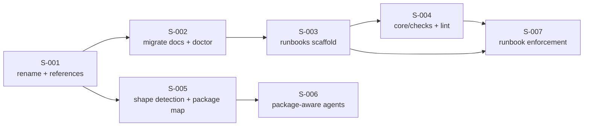

# User Stories: Shared Understanding — Phase 1 (Docs Foundation and Repository Shape)

## Changelog

| Version | Date       | Summary                                                              | Author           |
| ------- | ---------- | ---------------------------------------------------------------------- | ---------------- |
| 1.0     | 2026-09-19 | Initial version. Seven stories covering PRD FR-44 to FR-51 and FR-59 to FR-64. | product-engineer |

## Source Documents

- PRD: `docs/requirements/prd-shared-understanding-refinement.md` (FR-44 to FR-51, FR-59 to FR-64; AC-22 to AC-26, AC-29 to AC-32, AC-31)
- Specification: `workstream/specification-shared-understanding-phase-1.md` (v1.1)
- Decisions: `workstream/decisions-shared-understanding.md` (D-16, D-21, D-42 to D-45)
- Predecessor: Phase 0, merged as `a9f7eef` (PR #200)

## Delivery Shape

Seven stories on one integration branch, **one consolidated pull request**, mirroring Phase 0 (D-29). The stories are not independent: S-001 renames two files that every later story references, so running them in parallel branches guarantees conflicts in the same 50 files. Three natural families exist inside the sequence — docs rename (S-001, S-002), runbooks (S-003, S-004, S-007), repository shape (S-005, S-006) — and they are reviewable as commit groups within the one PR.

Branch: `integration/prd-shared-understanding-phase-1`. Recommended orchestrator: `planner`.

---

### Story S-001: Rename the foundation documents and update every reference

**Priority:** Critical
**Estimated Size:** M
**Dependencies:** None. Opens the phase.

#### User Story

As an agent running in any `dev-tasks`-managed repository,
I want the foundation documents to have one canonical name each,
So that every skill written in Phases 2 to 6 names the same file the repository actually has.

#### Context

`docs/product-context.md` and `docs/technical-guidelines.md` are named by 50 files across the three prompt trees, the docs tree, the tests, and five root files. Every phase after this one writes new skills that reference them. Renaming once, before those skills exist, is the whole reason Phase 1 runs before the feature phases (PRD delivery-phase table).

#### Acceptance Criteria

- [ ] AC-1: `docs/product-context.md` is `docs/product.md` and `docs/technical-guidelines.md` is `docs/tech.md`, moved with `git mv`, content byte-identical (FR-44, FR-46).
- [ ] AC-2: No file under `.claude/`, `.github/`, `.kiro/`, `core/`, `bin/`, `test/`, `docs/`, or the repository root references `product-context.md` or `technical-guidelines.md`, except the fallback-rule paragraph itself (PRD AC-22).
- [ ] AC-3: A parity test asserts AC-2, with the fallback-rule locations in an explicit, commented allowlist — the `EXEMPT_FILES` pattern `test/unit/dt-retirement-absence.test.ts` established in Phase 0.
- [ ] AC-4: Every skill and agent that reads a foundation document carries the fallback rule: resolve `docs/product.md` first, fall back to `docs/product-context.md` only when the new name is absent; same for the `tech.md`/`technical-guidelines.md` pair (FR-45).
- [ ] AC-5: The fallback rule is prose in the prompt content, not a new runtime module — no `core/` code is added for it (spec §8.1).
- [ ] AC-6: The three prompt trees stay at parity; the fallback rule and the renamed references are identical in `.claude/`, `.github/`, and `.kiro/`.
- [ ] AC-7: `pnpm run validate` passes with the D-40 five-name failure baseline unchanged.

#### Business Rules

- The rename is behavior-preserving (`SIMPLICITY.md` B1). Content changes to either document are a separate change and are **not** in this story (FR-46).
- Consumer repositories are not touched. They rename on their own schedule (PRD Non-Goals).

#### Technical Notes

- Reference counts by tree, measured on `a9f7eef`: `.claude/` 10, `.github/` 11, `.kiro/` 12, `docs/` 10, `test/` 2, root 5 (`AGENTS.md`, `AGENTS.md.template`, `CLAUDE.md`, `CLAUDE.md.template`, `README.md`). `core/`, `bin/`, and `templates/` carry none.
- `git mv` keeps rename detection in the diff, which is what makes a 50-file change reviewable.
- `docs/README.md`'s index rows change with the filenames.

#### Testing Requirements

- **Unit Tests:** New `test/unit/foundation-docs-naming.test.ts` — the AC-3 parity/absence assertion, with a seeded-match self-test proving the matcher fires (Phase 0 guard pattern).
- **Integration Tests:** None. No runtime behavior changes.
- **Manual/UI Testing:** Read `activity-init` end to end and confirm the fallback paragraph reads coherently where the old names used to be stated flatly.
- **Edge-Case Matrix:** A file naming the old document inside a code fence or a URL fragment; the allowlisted fallback paragraph itself; `AGENTS.md.template` and `CLAUDE.md.template`, which ship to consumers and are easy to miss.
- **Acceptance-Criteria Mapping:** AC-1 by `git log --follow`; AC-2/AC-3 by the new test; AC-4 to AC-6 by inspection and the existing parity suites; AC-7 by `pnpm run validate`.
- **Execution Commands:** `pnpm run validate`, `pnpm run test:unit`

#### Migration Requirements

Not applicable to this story. The consumer-facing migration is S-002.

#### Implementation Steps

1. Write `test/unit/foundation-docs-naming.test.ts` first; it fails against the current tree.
2. `git mv` both documents.
3. Update the 50 references, tree by tree, keeping the three prompt trees in lockstep.
4. Add the fallback-rule paragraph to `activity-init` and every skill/agent that reads a foundation document; allowlist those locations in the test.
5. Update `docs/README.md`'s index rows.
6. Run `pnpm run validate`.

#### Files to Create/Modify

- `docs/product.md`, `docs/tech.md` — renamed
- `test/unit/foundation-docs-naming.test.ts` — new
- 50 files carrying the old names, across three trees, `docs/`, `test/`, and the root

#### Definition of Done Checklist

- [ ] Test written before the rename
- [ ] Quality gates pass at the D-40 baseline
- [ ] Three-tree parity verified
- [ ] Committed to the integration branch

---

### Story S-002: Propose the rename to consumers via `dev-tasks migrate docs`

**Priority:** Critical
**Estimated Size:** S
**Dependencies:** S-001

#### User Story

As a maintainer of a repository that installed `dev-tasks` before the rename,
I want `dev-tasks` to tell me the names changed and offer to rename for me,
So that I adopt the new names deliberately rather than discovering broken references.

#### Context

`update` must never rename consumer-owned files on its own (FR-45). The existing `migrate` command already implements detect-and-propose for legacy shell installs; this story extends that command with a second, named migration step rather than inventing a new mechanism.

#### Acceptance Criteria

- [ ] AC-1: `dev-tasks migrate docs` with no further flags is report-only: it prints the two pending renames and the consumer-owned files (`CLAUDE.md`, `AGENTS.md`, custom prompts) that still reference the old names, mutates nothing, and exits `0`.
- [ ] AC-2: `dev-tasks migrate docs --force` performs both renames with content byte-identical, backing up the originals first via the existing `createBackupDir`/`backupFile` (`core/distribution/backup.ts`).
- [ ] AC-3: `dev-tasks migrate` with no sub-verb is unchanged — the legacy shell-install path still behaves exactly as before, asserted by a regression test.
- [ ] AC-4: `dev-tasks doctor` detects the old names and proposes `dev-tasks migrate docs`, naming both files and both new names (PRD AC-23).
- [ ] AC-5: `dev-tasks update` never renames a consumer-owned file (FR-45), asserted by a negative test.
- [ ] AC-6: Both new surfaces support `--json`, matching the existing command output shape.
- [ ] AC-7: A consumer repository that still carries the old names runs every agent unchanged (PRD AC-23) — satisfied by S-001's fallback rule, verified here by inspection, not re-implemented.

#### Business Rules

- `--force` keeps its existing meaning across the CLI: perform the mutating action, back up first. No second flag with overlapping semantics (spec §6).
- Per D-43, `doctor` and `update` output satisfy FR-45's "agent at session start" detection for the first release. No new per-platform session-start hook is built in this phase.

#### Technical Notes

- `bin/parse-args.ts` already yields `command: "migrate"`, `positional: ["docs"]`; the dispatch branches on `positional[0]` inside the existing `case "migrate"`.
- New module `core/distribution/migrate-docs.ts`, sibling of `migrate.ts`; export the detection separately from the apply so `doctor` can reuse detection without the mutation path.
- No `git` shell-out. `node:fs` rename, consistent with the rest of `core/distribution`.

#### Testing Requirements

- **Unit Tests:** `test/unit/migrate-docs.test.ts` — detection with both old names present, one present, neither present; propose mutates nothing; `--force` renames and writes backups; content hash identical before and after.
- **Integration Tests:** `test/integration/bootstrap-commands.test.ts` gains `migrate docs` cases against a temp fixture repo; the existing `migrate` cases must pass unmodified (AC-3).
- **Manual/UI Testing:** Run both forms against a scratch copy and read the output as a consumer would.
- **Edge-Case Matrix:** New name already present and old name also present (partial migration); target name exists with different content; read-only directory; `--json` on every path.
- **Acceptance-Criteria Mapping:** AC-1 to AC-3, AC-6 by `test/unit/migrate-docs.test.ts` and the integration cases; AC-4 by a `doctor` unit test; AC-5 by a negative test in `distribution-update.test.ts`.
- **Execution Commands:** `pnpm run test:unit`, `pnpm run test:integration`, `pnpm run validate`

#### Migration Requirements

- Migration artifact: this story *is* the migration path; no data-model migration exists.
- Rollback/impact notes: backups written before any rename; documented in the runbook delivered by S-003 (`runbook-migrate-foundation-docs`).
- Apply step: only under explicit `--force` by the consumer. No agent runs it unprompted.
- Verification after apply: the command reports both new paths and the backup location.

#### Implementation Steps

1. Write `test/unit/migrate-docs.test.ts` first.
2. Add `core/distribution/migrate-docs.ts` with `detectOldFoundationDocs()` and `runDocsMigration()`.
3. Branch the `migrate` case in `bin/dev-tasks.ts` on the sub-verb; update `--help`.
4. Add the `doctor` check reusing the detection function.
5. Add the `update` negative test.

#### Files to Create/Modify

- `core/distribution/migrate-docs.ts` — new
- `core/distribution/doctor.ts`, `core/distribution/index.ts`, `bin/dev-tasks.ts`
- `test/unit/migrate-docs.test.ts` — new; `test/integration/bootstrap-commands.test.ts`, `test/unit/distribution-doctor.test.ts`, `test/unit/distribution-update.test.ts`

#### Definition of Done Checklist

- [ ] Tests written before implementation
- [ ] `migrate` legacy path proven unchanged
- [ ] Quality gates pass at the D-40 baseline
- [ ] Committed to the integration branch

---

### Story S-003: Scaffold `docs/runbooks/` and seed the initial runbook set

**Priority:** Critical
**Estimated Size:** L
**Dependencies:** S-002 (one seeded runbook documents the `migrate docs` command)

#### User Story

As an engineer or agent about to run a multi-step procedure,
I want a runbook that states preconditions, steps, verification, rollback, and escalation,
So that the procedure is repeatable instead of reconstructed from memory each time.

#### Context

`docs/runbooks/` does not exist. FR-47 names an initial set and requires `install` to scaffold the directory, the index, and a template with install-if-absent semantics. The delivery mechanism has a gap: `INSTALL_IF_ABSENT_FILES` tags every entry with a single platform, and a runbook belongs to the repository, not to Copilot or Claude or Kiro. This story closes that gap — the same gap the PRD's Technical Considerations section anticipates for Phase 3's glossary file.

#### Acceptance Criteria

- [ ] AC-1: `INSTALL_IF_ABSENT_FILES` accepts a platform-agnostic entry, reusing the `ROOT_PROFILE_TAG` pattern rather than adding a third delivery category; a file so tagged is installed once per run regardless of how many platforms the profile resolves to.
- [ ] AC-2: `dev-tasks install` scaffolds `docs/runbooks/`, `docs/runbooks/README.md` (the index), and a runbook template, all install-if-absent — never overwritten once present.
- [ ] AC-3: This repository carries the initial runbook set: `runbook-install-dev-tasks`, `runbook-configure-branch-protection`, `runbook-setup-simplicity-tooling`, `runbook-migrate-foundation-docs`, `runbook-release-npm`, `runbook-deploy-service`, `runbook-rollback-deploy`, `runbook-troubleshoot-hooks`, `runbook-setup-supabase-local`, `runbook-retire-dt` (FR-47 plus `runbook-deploy-service` — see Business Rules).
- [ ] AC-4: Every runbook carries valid frontmatter (`name`, `trigger`, `owner`, `last_verified`, `related`) and the five fixed body headings: Preconditions, Steps, Verification, Rollback, Escalation (FR-48).
- [ ] AC-5: Every file under `templates/scripts/` (5), `templates/workflows/` (3), and `.github/workflows/` (2) appears in the `related` field of at least one runbook (PRD AC-25).
- [ ] AC-6: `docs/runbooks/README.md` lists every runbook on disk, with trigger, owner, and last-verified columns.
- [ ] AC-7: `docs/README.md` links `docs/runbooks/`.
- [ ] AC-8: `bundle-manifest.json` and `consumer_owned_paths` carry the runbooks directory, so `update` never overwrites a consumer's filled runbook.

#### Business Rules

- FR-47 names nine runbooks. Those nine leave five deploy-surface files uncovered (`templates/scripts/deploy.sh`, `deploy-verify.sh`, `deploy-status.sh`, `templates/workflows/deploy-dev.yml`, `deploy-prod.yml`), which fails PRD AC-25. A tenth runbook, `runbook-deploy-service`, closes it. This is an addition to the PRD's enumerated set and is recorded as a decision (see Open Items).
- A runbook describes a current procedure. A runbook for a removed script is retired with the script (`SIMPLICITY.md` A10), not kept as history.

#### Technical Notes

- Template sources live under `templates/` (new `templates/runbooks/`), following the `templates/claude/settings.json` precedent for install-if-absent sources whose package path differs from the consumer path.
- `runbook-setup-simplicity-tooling` documents a Phase 4 capability that does not exist yet; write it against the contract `SIMPLICITY.md` already states and mark `last_verified` accordingly. It is a forward-looking runbook by design (FR-47 names it).
- `runbook-retire-dt` is a historical procedure for consumers still carrying `dt`; it points at ADR-007 and the `v0.13.0` restore path.

#### Testing Requirements

- **Unit Tests:** `test/unit/runbook-set.test.ts` — every runbook has valid frontmatter and the five headings; the index lists exactly the files on disk; AC-5's reverse-coverage assertion (every script/workflow is named by some runbook).
- **Integration Tests:** `install` into a temp repo scaffolds the directory and index; a second `install` does not overwrite a modified runbook (install-if-absent semantics); the platform-agnostic entry installs exactly once under `--profile all`.
- **Manual/UI Testing:** Read `runbook-configure-branch-protection` and follow it against a scratch repository; it must be executable without consulting the README.
- **Edge-Case Matrix:** Profile `all` versus a single platform (no duplicate install, no dropped file); a consumer who deleted a runbook (re-scaffolded) versus one who edited it (untouched); a `related` path that exists at write time.
- **Acceptance-Criteria Mapping:** AC-1/AC-2/AC-8 by the integration tests; AC-3 to AC-6 by `test/unit/runbook-set.test.ts`; AC-7 by inspection and S-004's index check.
- **Execution Commands:** `pnpm run test:unit`, `pnpm run test:integration`, `pnpm run validate`

#### Migration Requirements

Not applicable. New directory, no existing state.

#### Implementation Steps

1. Write `test/unit/runbook-set.test.ts` first, against the intended set.
2. Extend `INSTALL_IF_ABSENT_FILES` with the platform-agnostic tag; update `install-if-absent.ts` to honor it.
3. Add `templates/runbooks/README.md` and `templates/runbooks/runbook-template.md`.
4. Author the ten runbooks in `docs/runbooks/`.
5. Update `docs/README.md`, `bundle-manifest.json`, and `consumer_owned_paths`.

#### Files to Create/Modify

- `docs/runbooks/` — 10 runbooks + `README.md`, new
- `templates/runbooks/README.md`, `templates/runbooks/runbook-template.md` — new
- `core/distribution/profiles.ts`, `core/distribution/install-if-absent.ts`
- `bundle-manifest.json`, `docs/README.md`
- `test/unit/runbook-set.test.ts` — new; existing install/install-if-absent tests

#### Definition of Done Checklist

- [ ] Tests written before the runbooks
- [ ] Every script and workflow covered by a runbook `related` entry
- [ ] Install-if-absent semantics proven by a second-install test
- [ ] Committed to the integration branch

---

### Story S-004: Create `core/checks` and enforce docs structure under `lint`

**Priority:** Critical
**Estimated Size:** M
**Dependencies:** S-003

#### User Story

As a reviewer,
I want a broken docs index or a malformed runbook to fail `validate`,
So that documentation structure is a gate rather than a periodic cleanup.

#### Context

This story creates `core/checks`, the module FR-57 reserved and D-33 kept out of Phase 0. Phases 3, 5, and 6 add their own checks to it. Phase 1 adds exactly one: the docs-structure check.

#### Acceptance Criteria

- [ ] AC-1: `core/checks/docs-structure.ts` exports a pure function that takes a repository root and returns failures and staleness findings separately.
- [ ] AC-2: `validate` fails when `docs/README.md` or `docs/runbooks/README.md` lists a file that does not exist (PRD AC-32).
- [ ] AC-3: `validate` fails when either index omits a file that does exist in its directory (PRD AC-32).
- [ ] AC-4: `validate` fails on a runbook with missing or invalid frontmatter, or a misnamed runbook file (PRD AC-24).
- [ ] AC-5: `validate` fails on a `related` entry naming a script or workflow that does not exist (PRD AC-24).
- [ ] AC-6: A runbook whose `last_verified` exceeds 90 days is reported and does **not** fail the gate (PRD AC-24, D-21).
- [ ] AC-7: The check runs under `lint`, so `validate` reaches it, and `lint` still exits non-zero on ESLint failures independently.
- [ ] AC-8: `core/checks` contains no registry, plugin interface, or abstraction for the checks Phases 3, 5, and 6 will add (spec §4, `SIMPLICITY.md` A4).
- [ ] AC-9: An absent `docs/runbooks/` is not a failure — the check reports nothing for a repository that has not adopted runbooks.

#### Business Rules

- A docs-structure failure routes to `technical-writer`, not `housekeeping` (FR-51).
- One implementation, two callers: `lint` enforces, the `verifier` reads the same function for its audit summary. The logic is not duplicated (spec §8.3).

#### Technical Notes

- `lint` becomes `eslint . --max-warnings 0 && node dist/core/checks/run.js`. The script name stays canonical; no `lint:docs` is added (PRD Non-Goals: no second validation command).
- The check is a bounded filesystem scan, not proportional to source size — it must not threaten Phase 4's CI budget (OQ-12).
- Frontmatter parsing reuses `yaml`, already a devDependency; the check runs from `dist/`, so `yaml` moves back to `dependencies` **only if** the shipped binary needs it. Verify before moving: if the check runs only in this repository's `lint`, devDependency is correct.

#### Testing Requirements

- **Unit Tests:** `test/unit/checks-docs-structure.test.ts` — one case per failure condition (AC-2 to AC-5), the staleness-without-failure case (AC-6), the absent-runbooks case (AC-9), and a clean tree producing no findings.
- **Integration Tests:** Seed each failure into a temp fixture tree and assert the `lint` step exits non-zero; assert it exits zero once fixed.
- **Manual/UI Testing:** Break `docs/README.md` locally, run `pnpm run validate`, confirm the message names the file and the condition.
- **Edge-Case Matrix:** An index entry pointing at a directory; a runbook with frontmatter but an invalid date; a `related` entry pointing outside the repository; a runbook file not matching `runbook-<verb>-<object>.md`; an empty `docs/runbooks/` directory.
- **Acceptance-Criteria Mapping:** AC-1 to AC-6, AC-9 by `test/unit/checks-docs-structure.test.ts`; AC-7 by the integration test and by `pnpm run validate`; AC-8 by inspection — a reviewer confirms no speculative interface exists.
- **Execution Commands:** `pnpm run lint`, `pnpm run validate`, `pnpm run test:unit`

#### Migration Requirements

Not applicable.

#### Implementation Steps

1. Write `test/unit/checks-docs-structure.test.ts` first, with fixtures for each condition.
2. Implement `core/checks/docs-structure.ts`.
3. Add `core/checks/run.js` entry and chain it into the `lint` script.
4. Point the `verifier` at the same function for its audit summary.
5. Run `pnpm run validate` against the real tree and fix anything it legitimately finds.

#### Files to Create/Modify

- `core/checks/docs-structure.ts`, `core/checks/run.ts`, `core/checks/index.ts` — new
- `package.json` (`lint` script), `core/index.ts`
- `test/unit/checks-docs-structure.test.ts` — new, plus fixtures under `test/fixtures/docs-structure/`
- `.claude/agents/verifier.md` (+ `.github`/`.kiro` variants)

#### Definition of Done Checklist

- [ ] Tests written before the check
- [ ] `validate` fails on each seeded break and passes when fixed
- [ ] No speculative checks-registry abstraction present
- [ ] Committed to the integration branch

---

### Story S-005: Detect repository shape and record the package map

**Priority:** Critical
**Estimated Size:** M
**Dependencies:** S-001 (writes into `docs/tech.md`)

#### User Story

As an agent planning work in an unfamiliar repository,
I want to know whether it is one package or many, and what each package is for,
So that research, tasks, and commits name the right package instead of guessing.

#### Context

"Multi-repo" retired with `dt` (D-16). The replacement is repository shape: single-package or monorepo, recorded once in `docs/tech.md` and read by every later phase. `activity-init` is where it gets recorded, and its existing "Mode A — Mono-Repo" name collides with the new term, which D-44 resolves by renaming the mode.

#### Acceptance Criteria

- [ ] AC-1: `activity-init` detects repository shape from the FR-59 signals: `pnpm-workspace.yaml`, `workspaces` in `package.json`, `turbo.json`, `nx.json`, `lerna.json`, and `[tool.uv.workspace]` in `pyproject.toml`.
- [ ] AC-2: `activity-init` records a package map in `docs/tech.md` with one row per workspace package: package, path, purpose, owner, canonical scripts present, bounded context (PRD AC-29).
- [ ] AC-3: A single-package repository records exactly one row, for the root, so the table shape is identical in both cases (spec §5).
- [ ] AC-4: The bounded-context column is filled freeform at interview time; it is not blocked on Phase 3's glossary (D-45).
- [ ] AC-5: `activity-init`'s existing "Mode A — Mono-Repo" is renamed so no reader can confuse it with the repository-shape term (D-44); every cross-reference to the old mode name is updated in all three trees.
- [ ] AC-6: `dev-tasks doctor` warns — and does not fail — when the package map and the workspace disagree: a package on disk with no row, or a row with no package (PRD AC-29).
- [ ] AC-7: `activity-init` on a fresh repository creates `docs/product.md`, `docs/tech.md`, and `docs/runbooks/README.md`, and confirms the `SIMPLICITY.md` owner and thresholds with the user (PRD AC-26).
- [ ] AC-8: The three prompt trees stay at parity.

#### Business Rules

- `dev-tasks` itself has no workspace signal. It detects single-package shape and records one row for its own root; this story does not turn `dev-tasks` into a monorepo.
- `doctor` warns; structural failures belong to `lint` (S-004). The two surfaces do not overlap.

#### Technical Notes

- Signal detection for `turbo.json`, `nx.json`, `lerna.json`, and `[tool.uv.workspace]` is presence-only; only `pnpm-workspace.yaml` and `package.json` `workspaces` are parsed for the package list. This keeps the untested-parser surface small (spec §16).
- The `doctor` drift check needs the package list and the map; put the workspace enumeration in `core/distribution/` next to the other repository-reading helpers so `doctor` and any later caller share it.
- `SIMPLICITY.md` exists at the root already; AC-7's confirmation step is an interview question, not new delivery machinery (that is Phase 4).

#### Testing Requirements

- **Unit Tests:** Workspace enumeration against each signal type; single-package fallback when no signal is present; drift detection with a package missing from the map and a row with no package.
- **Integration Tests:** Two fixture repositories under `test/fixtures/` — one single-package, one `pnpm-workspace.yaml` monorepo with two packages — asserting the recorded package-map table shape in each.
- **Manual/UI Testing:** Run `activity-init` against the monorepo fixture and read the produced `docs/tech.md` section.
- **Edge-Case Matrix:** A workspace glob matching zero packages; a package with no `name` in its `package.json`; nested workspaces; a map row for a package that was deleted; `pnpm-workspace.yaml` present but empty.
- **Acceptance-Criteria Mapping:** AC-1 to AC-4 by the unit and integration tests; AC-5/AC-8 by the parity suites and inspection; AC-6 by a `doctor` unit test; AC-7 by the fresh-repository integration case.
- **Execution Commands:** `pnpm run test:unit`, `pnpm run test:integration`, `pnpm run validate`

#### Migration Requirements

Not applicable. `docs/tech.md` gains a section; no existing content is rewritten.

#### Implementation Steps

1. Write the workspace-enumeration and drift-detection unit tests first.
2. Implement enumeration in `core/distribution/`.
3. Add the `doctor` drift check.
4. Add shape detection, the package-map output structure, and the `SIMPLICITY.md` confirmation step to `activity-init` in all three trees.
5. Rename Mode A per D-44 and update every cross-reference.

#### Files to Create/Modify

- `core/distribution/workspace.ts` — new; `core/distribution/doctor.ts`, `core/distribution/index.ts`
- `.claude/skills/activity-init/SKILL.md` (+ `.github`/`.kiro` variants)
- `docs/tech.md` — package map section for this repository
- `test/unit/workspace.test.ts` — new; `test/unit/distribution-doctor.test.ts`, `test/unit/skill-parity-init.test.ts`, `test/unit/skill-init-walkthrough.test.ts`
- `test/fixtures/workspace-single/`, `test/fixtures/workspace-mono/` — new

#### Definition of Done Checklist

- [ ] Tests written before detection logic
- [ ] Both fixture shapes produce a correct package map
- [ ] Mode-A rename carries no dangling cross-reference
- [ ] Committed to the integration branch

---

### Story S-006: Make agents package-aware

**Priority:** High
**Estimated Size:** S
**Dependencies:** S-005

#### User Story

As a reviewer of a monorepo pull request,
I want every finding, task, and commit to name the package it belongs to,
So that I can tell which package a change affects without reading the diff.

#### Context

The package map is only useful if the agents read it. FR-63 requires `researcher`, `plan`, and `implement` to name the package; FR-61 requires root scripts to fan out; FR-62 requires `TESTING.md` to declare per-package runners.

#### Acceptance Criteria

- [ ] AC-1: `researcher` names the package for each finding; `plan` names the package for each task; `implement` uses the package as the Conventional Commits scope (`feat(api): …`) (FR-63).
- [ ] AC-2: In a monorepo, the canonical root scripts fan out to every package, and root `validate` stays the single entry point (FR-61); documented in `docs/tech.md`, not implemented as a second command (PRD Non-Goals).
- [ ] AC-3: `TESTING.md` declares per-package runners where they differ, and `activity-test-standards` verifies every package is reachable from the root `test` command (FR-62).
- [ ] AC-4: The glossary remains one file at the root; its bounded contexts map to packages or to explicit domains in the package map. No per-package glossaries (FR-63).
- [ ] AC-5: The simplicity baseline stays one root file keyed by path; no per-package ratchet mechanism is added (FR-64).
- [ ] AC-6: The three prompt trees stay at parity.

#### Business Rules

- The CI template that scopes lint, typecheck, and tests to affected packages is **Phase 4** scope (FR-41, FR-42 via `infra-engineer`), not this story. This story delivers the agent behavior and the documented contract only (spec §8.2, Non-Goals boundary).
- No new dependency and no new command. This is prompt-tree and contract-document work.

#### Technical Notes

- `activity-test-standards` already verifies gate reachability for a single package; extend the existing procedure rather than adding a parallel monorepo path.
- `dev-tasks` is single-package, so AC-2's fan-out is documented and tested against the monorepo fixture from S-005, not exercised on this repository.

#### Testing Requirements

- **Unit Tests:** Parity assertions for the changed `researcher`, `plan`, `implement`, and `qa-engineer` content across the three trees.
- **Integration Tests:** `activity-test-standards` reachability check against the S-005 monorepo fixture.
- **Manual/UI Testing:** Read `plan` and `implement` end to end and confirm the package-scoping instruction is unambiguous for a single-package repository (where the scope is optional, not empty).
- **Edge-Case Matrix:** A single-package repository (no scope required); a package whose name is not a valid Conventional Commits scope; a package with no test script.
- **Acceptance-Criteria Mapping:** AC-1, AC-4 to AC-6 by the parity tests and inspection; AC-2 by `docs/tech.md`; AC-3 by `TESTING.md` and the reachability integration test.
- **Execution Commands:** `pnpm run test:unit`, `pnpm run validate`

#### Migration Requirements

Not applicable.

#### Implementation Steps

1. Update `researcher`, `plan`, `implement`, and `qa-engineer` in all three trees.
2. Extend `activity-test-standards`'s reachability procedure to per-package.
3. Document the fan-out contract in `docs/tech.md` and per-package runners in `TESTING.md`.
4. Extend the parity suites.

#### Files to Create/Modify

- `researcher`, `plan`, `implement`, `qa-engineer`, `activity-test-standards` across `.claude/`, `.github/`, `.kiro/`
- `docs/tech.md`, `TESTING.md`
- `test/unit/researcher-parity.test.ts`, `test/unit/skill-parity-testing-layers.test.ts`

#### Definition of Done Checklist

- [ ] Three-tree parity verified
- [ ] Phase 4 CI scoping explicitly not implemented here
- [ ] Quality gates pass at the D-40 baseline
- [ ] Committed to the integration branch

---

### Story S-007: Enforce runbook coverage and docs ownership

**Priority:** High
**Estimated Size:** S
**Dependencies:** S-003, S-004

#### User Story

As a reviewer,
I want a pull request that performs a repeatable procedure without leaving a runbook to be flagged,
So that procedural knowledge accumulates instead of evaporating with the PR.

#### Context

S-003 created the runbooks and S-004 made their structure a gate. What neither does is notice a *missing* runbook for work that just happened. That judgment — "was this procedure worth writing down?" — cannot be a deterministic check, so it belongs to the `verifier` as a finding (FR-49b).

#### Acceptance Criteria

- [ ] AC-1: The `verifier` reports a finding when a pull request whose task list contains setup, configuration, or migration steps adds or updates no runbook (PRD AC-31).
- [ ] AC-2: The finding is advisory — it does not block PR readiness, consistent with the drift policy.
- [ ] AC-3: The coverage trigger is wired to its owners: `infra-engineer` for platform changes, `developer` for setup and migration tasks, `qa-engineer` for test-harness setup, `housekeeping` for tooling setup (FR-49b).
- [ ] AC-4: Every script under `templates/scripts/`, every workflow under `templates/workflows/` and `.github/workflows/`, and every `infra-engineer` change kind must have a runbook delivered in the same draft PR as the script or workflow (FR-49a) — stated in the owning agents' instructions.
- [ ] AC-5: `technical-writer` keeps `/docs` and `docs/runbooks/` organized on every run: indexes in sync, frontmatter valid, naming respected, no dangling `related` entry, staleness reported (FR-50).
- [ ] AC-6: Ownership is explicit: `technical-writer` owns docs structure and content; `housekeeping` does not organize documentation; a docs-structure failure in `validate` routes to `technical-writer` (FR-51).
- [ ] AC-7: The three prompt trees stay at parity.

#### Business Rules

- The deterministic conditions stay in `core/checks` (S-004). This story adds only the judgment-based finding and the ownership statements. No logic is duplicated between the two.

#### Technical Notes

- The `verifier`'s existing drift-finding vocabulary (impact/intent) already covers this; the finding is a new trigger, not a new category.
- "Three or more steps touching configuration, environment, tooling, credentials, or data" is the FR-49b threshold; state it in the agent instruction so the judgment is bounded rather than open-ended.

#### Testing Requirements

- **Unit Tests:** Parity assertions for the changed `verifier`, `technical-writer`, `infra-engineer`, `developer`, `qa-engineer`, and `housekeeping` content across the three trees.
- **Integration Tests:** None — the finding is agent behavior, not a runnable code path.
- **Manual/UI Testing:** Run the `verifier` in audit mode against this phase's own PR; the runbook-coverage trigger must not fire, because S-003 delivered runbooks.
- **Edge-Case Matrix:** A PR with three configuration steps and an updated existing runbook (no finding); a PR with two steps (below threshold, no finding); a docs-only PR.
- **Acceptance-Criteria Mapping:** AC-1 to AC-4 by inspection and the parity tests; AC-5/AC-6 by the `technical-writer` and `housekeeping` content; AC-7 by the parity suites.
- **Execution Commands:** `pnpm run test:unit`, `pnpm run validate`

#### Migration Requirements

Not applicable.

#### Implementation Steps

1. Add the runbook-coverage finding trigger to the `verifier` in all three trees.
2. Add the FR-49a delivery rule to `infra-engineer`, `developer`, `qa-engineer`, `housekeeping`.
3. Extend `technical-writer` with the runbook hygiene rules and the ownership statement.
4. Extend the parity suites.

#### Files to Create/Modify

- `verifier`, `technical-writer`, `infra-engineer`, `developer`, `qa-engineer`, `housekeeping` across `.claude/`, `.github/`, `.kiro/`
- `AGENTS.md`, `CLAUDE.md` — ownership statement
- Parity test files

#### Definition of Done Checklist

- [ ] Three-tree parity verified
- [ ] No deterministic logic duplicated from `core/checks`
- [ ] Quality gates pass at the D-40 baseline
- [ ] Committed to the integration branch; consolidated PR opened for review

---

## Coverage Validation

### Summary

- **Total PRD requirements in scope:** 20 (FR-44 to FR-51, FR-59 to FR-64, AC-22 to AC-26, AC-29 to AC-32)
- **Total user stories:** 7
- **Coverage:** 100 %
- **Status:** Complete, with one addition to the PRD's enumerated runbook set (see Open Items)

### Requirement Mapping

| PRD requirement                                            | Story ID(s)   | Status     |
| ------------------------------------------------------------ | ------------- | ---------- |
| FR-44 — rename both foundation documents                    | S-001         | ✅ Covered |
| FR-45 — propose migration, one-release fallback             | S-001 (fallback), S-002 (proposal) | ✅ Covered |
| FR-46 — behavior-preserving `refactor:` commit              | S-001         | ✅ Covered |
| FR-47 — `docs/runbooks/`, index, template, initial set      | S-003         | ✅ Covered |
| FR-48 — runbook frontmatter and fixed body shape            | S-003         | ✅ Covered |
| FR-49 — coverage and procedure triggers                     | S-003 (a, coverage), S-007 (b, procedure) | ✅ Covered |
| FR-50 — `technical-writer` hygiene + deterministic check under `lint` | S-004 (check), S-007 (hygiene) | ✅ Covered |
| FR-51 — ownership: `technical-writer`, not `housekeeping`   | S-007         | ✅ Covered |
| FR-59 — shape terminology and detection signals             | S-005         | ✅ Covered |
| FR-60 — package map in `docs/tech.md`, `doctor` warning     | S-005         | ✅ Covered |
| FR-61 — root script fan-out, `validate` single entry point  | S-006 (agent/contract scope; CI template is Phase 4) | ✅ Covered |
| FR-62 — `TESTING.md` per-package runners, reachability      | S-006         | ✅ Covered |
| FR-63 — package-scoped findings, tasks, commits; one glossary | S-006       | ✅ Covered |
| FR-64 — one root simplicity baseline keyed by path          | S-006         | ✅ Covered |
| AC-22 — no old-name reference remains; parity test asserts  | S-001         | ✅ Covered |
| AC-23 — old names keep working; `doctor` warns              | S-001 (fallback), S-002 (`doctor`) | ✅ Covered |
| AC-24 — `validate` fails on runbook structure breaks        | S-004         | ✅ Covered |
| AC-25 — every script/workflow named by a runbook            | S-003         | ✅ Covered |
| AC-26 — `activity-init` creates the three files, confirms `SIMPLICITY.md` | S-005 | ✅ Covered |
| AC-29 — monorepo package map, `doctor` warns on drift       | S-005         | ✅ Covered |
| AC-30 — root `validate` runs every package; CI scopes to affected | S-006 (root fan-out); **Phase 4** (CI template) | ⚠️ Split |
| AC-31 — verifier finding for a procedure PR with no runbook | S-007         | ✅ Covered |
| AC-32 — `validate` fails on index/file mismatch             | S-004         | ✅ Covered |

### Gaps

- **AC-30 is deliberately split.** Its first half (root `validate` runs every package's checks) is S-006. Its second half (the delivered `validate.yml` runs only affected packages on a PR and all packages on the default branch) requires the CI template that `infra-engineer` delivers in Phase 4 (FR-41, FR-42). No `validate.yml` exists to modify in Phase 1. Recorded here so the split is deliberate rather than discovered during the Phase 4 audit.

### Non-Goals Validation

- [ ] Rewriting consumer copies of the foundation docs — confirmed: S-002 proposes, never applies unprompted.
- [ ] Migrating existing `/docs` prose into runbooks — confirmed: S-003 covers scripts, workflows, and `infra-engineer` change kinds only.
- [ ] A second validation command — confirmed: S-004 chains into `lint`; no `lint:docs` or `validate:fast`.
- [ ] Stack profiles beyond JS/TS and Python — confirmed: S-005 detects Python's signal only, parses neither.
- [ ] Per-package glossaries or per-package simplicity ratchets — confirmed: S-006 AC-4, AC-5.

## Open Items for Confirmation

1. **A tenth runbook.** FR-47 names nine. Those nine leave `templates/scripts/{deploy,deploy-verify,deploy-status}.sh` and `templates/workflows/{deploy-dev,deploy-prod}.yml` with no `related` entry, which fails PRD AC-25. S-003 adds `runbook-deploy-service` to close it. Confirm, and it is recorded as `D-46`.
2. **Delivery shape.** Seven stories, one consolidated PR on `integration/prd-shared-understanding-phase-1` (Phase 0's D-29 shape), versus three smaller PRs by family (rename / runbooks / repository shape). Recommendation: one PR — S-001 touches 50 files that every later story then references, so parallel branches conflict in exactly those files. Confirm, and it is recorded as `D-47`.

## Execution Plan

| Order | Story | Gate that proves it                                                |
| ----- | ----- | -------------------------------------------------------------------- |
| 1     | S-001 | Old-name absence test green; `validate` at the D-40 baseline        |
| 2     | S-002 | `migrate docs` propose/apply tests; legacy `migrate` unchanged      |
| 3     | S-003 | Runbook set test green; every script/workflow covered               |
| 4     | S-004 | Each seeded docs break fails `validate`; clean tree passes          |
| 5     | S-005 | Both workspace fixtures produce a correct package map               |
| 6     | S-006 | Parity suites green; reachability check passes on the mono fixture  |
| 7     | S-007 | Parity suites green; verifier audit runs clean on this phase's PR   |
