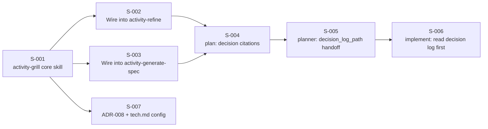

# User Stories: Shared Understanding — Phase 2 (Grilling, Decision Log, Refine/Spec/Plan Integration)

## Changelog

| Version | Date       | Summary          | Author           |
| ------- | ---------- | ----------------- | ---------------- |
| 1.0     | 2026-09-20 | Initial version. Seven stories: `activity-grill` core skill, its wiring into `activity-refine` and `activity-generate-spec`, decision-ID threading through `plan`, `planner`, and `implement`, and ADR-008 with the `docs/tech.md` § Grilling config. | product-engineer |

## Source Documents

- PRD: `docs/requirements/prd-shared-understanding-refinement.md` v1.13, FR-1 to FR-16, AC-01 to AC-05, AC-09, AC-16
- Specification: `workstream/specification-shared-understanding-phase-2.md` v1.0
- Decision log: `workstream/decisions-shared-understanding.md` (D-01…D-56; this phase's own HOW decisions are D-53 to D-56, recorded ahead of the spec)

## Delivery Shape

One consolidated PR on one integration branch, following the Phase 1 precedent (D-47's reasoning applies again: S-001 here is a shared foundation every later story in this set builds on, and splitting into parallel branches would conflict in exactly the files S-001 touches across three prompt trees). Suggested order:

S-002 and S-003 can run in parallel once S-001 lands. S-007 has no code dependency on S-001 but is sequenced after it so the ADR can describe the shipped exit-gate behavior accurately rather than the spec's intent.

---

### Story S-001: Build the `activity-grill` core skill

**Priority:** Critical
**Estimated Size:** L
**Dependencies:** None (foundation story; every other story in this set depends on it)

#### User Story

As a developer starting a PRD or spec, I want the agent to interview me one question at a time with a recommended answer, walking the design tree depth-first, so that I resolve one branch before the next opens and never face a wall of unrelated questions at once.

#### Context

This is the new skill FR-1 to FR-11 describe. It has no caller-specific behavior yet (that's S-002/S-003) — this story delivers the standalone engine: the question loop, the resolve-before-ask precedence, the append-per-resolution write to the decision log, the cap/summary/exit-gate mechanics, and the Issue Mode variant. It ships identically in `.claude/skills/activity-grill/`, `.github/skills/activity-grill/`, and `.kiro/skills/activity-grill/`.

#### Acceptance Criteria

- [ ] AC-1: Invoking the skill with an open question the codebase or `docs/product.md`/`docs/tech.md` already answers resolves it via direct read, with no question surfaced to the user (FR-3, AC-04).
- [ ] AC-2: A question the skill cannot resolve directly is asked exactly one at a time, each carrying a recommended answer (FR-1).
- [ ] AC-3: Every resolved question — asked or self-resolved — is appended to `workstream/decisions-<feature>.md` as one row with a unique `D-NN`, phase, branch, question, recommended answer, actual answer, accepted-rec. flag, supersedes (if any), author, date (FR-4, AC-03).
- [ ] AC-4: A decision-tree summary (resolved branches with IDs, current branch, remaining open list) is presented every 10th resolved question, at the cap, and when the user attempts to exit (FR-6).
- [ ] AC-5: On reaching the configured cap (default 25 Feature Mode per phase, 8 Issue Mode; read from `docs/tech.md` § Grilling if present, else the hardcoded default), the skill presents the open list and asks the user to continue or stop — it never auto-continues or auto-stops (FR-9).
- [ ] AC-6: The exit gate returns satisfied only when the open-questions list is empty **and** the user has made an explicit statement of shared understanding; a positive-toned reply, an emoji, or silence does not satisfy it — the skill asks the direct confirmation question instead (FR-8, AC-01, AC-02).
- [ ] AC-7: In Issue Mode (cap 8), the glossary is treated read-only, scope is limited to what the issue changes, and a matching answer from any prior `decisions-<other-feature>.md` is reused and cited in qualified form (`<feature>#D-NN`) instead of re-asked (FR-10, AC-09).
- [ ] AC-8: Once per phase, the skill states that accepting every recommendation reproduces its own assumptions rather than testing them (FR-11).
- [ ] AC-9: The skill file is present with equivalent content and behavior in `.claude/skills/activity-grill/SKILL.md`, `.github/skills/activity-grill/SKILL.md`, and `.kiro/skills/activity-grill/SKILL.md`.

#### Business Rules

- Depth-first traversal: a branch, including anything it depends on, is fully resolved before a sibling branch opens (FR-2).
- IDs are never reused or renumbered; a corrected decision gets a new row citing the old one in `Supersedes` (existing decision-log invariant, unchanged by this story).
- No `grill-me` attribution is added anywhere in the skill (D-53).

#### Technical Notes

- Reference: Specification §8.1 (full rule list), §4 (sequence diagram), §5 (schema — unchanged, reused as-is).
- Session state (open-questions list, tree position) lives only in the invoking conversation's context; nothing is written to disk until a question resolves (D-54). Do not introduce a `grill-state-<feature>.md` file.
- Cap configuration: read `docs/tech.md` § Grilling if the subsection exists (added by S-007); otherwise use the hardcoded defaults 25/25/8 (D-55). This story does not depend on S-007 landing first — the fallback makes the read optional.
- Researcher delegation (FR-3, D-56): the skill checks for a fresh, non-stale pre-step `/workstream/research-*.md` artifact before making its own bounded `researcher` call, and only calls `researcher` itself for a branch that artifact doesn't cover. At most one `researcher` call total per phase, shared with the caller's own pre-step budget (ADR-004) — this story does not change `researcher` or `activity-codebase-research`, only how `activity-grill` decides whether to invoke it.
- Follow the existing activity-skill file shape (Goal / Context / Process / Output), matching `activity-refine`'s and `activity-generate-spec`'s structure for consistency.

#### Testing Requirements

- **Unit Tests:** N/A at the code level (this is a prompt file, not executable code) — see Scenario Tests below, which substitute for unit coverage on this story per the specification's Testing Strategy (§14).
- **Integration Tests:** N/A.
- **Scenario Tests (fixture transcripts under `test/fixtures/grilling/`):** (a) codebase-answerable question → no user prompt; (b) cap-reached sequence → continue/stop question fires, no auto-decision; (c) a "sounds good" reply after the open list is empty → skill re-asks for explicit confirmation rather than treating it as the exit gate; (d) Issue Mode with a matching prior decision in a fixture log → cited in qualified form, not re-asked.
- **Manual/UI Testing:** Run a live grilling session against a trivial invented feature and confirm the one-question-per-turn behavior, the decision-tree summary at question 10, and the exit-gate prompt.
- **Edge-Case Matrix:** empty open-questions list at invocation (nothing to grill — exit gate is trivially satisfied); a question whose codebase answer is ambiguous (must still ask, not guess); cap set to 0 or a non-positive value in `docs/tech.md` (treat as misconfiguration, fall back to the hardcoded default and note it in the decision-tree summary).
- **Acceptance-Criteria Mapping:** AC-1→scenario (a); AC-2/AC-4→manual session; AC-3→scenario (a)-(d), each asserting the appended row; AC-5→scenario (b); AC-6→scenario (c); AC-7→scenario (d); AC-8→manual session; AC-9→`pnpm test` parity check (see below).
- **Execution Commands:** `pnpm test -- skill-parity-grilling` (new parity test, see Files below); scenario fixtures are read manually during review since grilling sessions are conversational, not scripted — no new test runner is introduced for this.

#### Migration Requirements (When Data Model Changes)

Not applicable — no schema or data-model change; the decision-log format is reused unchanged (specification §5).

#### Implementation Steps

1. Write `.claude/skills/activity-grill/SKILL.md` per specification §8.1, covering all eleven operative rules.
2. Mirror the content into `.github/skills/activity-grill/SKILL.md` and `.kiro/skills/activity-grill/SKILL.md`, adapting only platform-specific invocation syntax.
3. Add `test/fixtures/grilling/` with the four scenario transcripts.
4. Add `test/unit/skill-parity-grilling.test.ts` asserting the three skill files exist with equivalent required-rule content (extend the existing `skill-parity-*.test.ts` pattern).
5. Register the skill in `AGENTS.md` § Skills (Activity Skills table) and `CLAUDE.md`'s skill listing convention, matching how `activity-edge-case-refinement` etc. are already listed.

#### Files to Create/Modify

- `.claude/skills/activity-grill/SKILL.md` - new skill file
- `.github/skills/activity-grill/SKILL.md` - Copilot equivalent
- `.kiro/skills/activity-grill/SKILL.md` - Kiro equivalent
- `test/fixtures/grilling/codebase-answerable.md` - scenario (a) fixture
- `test/fixtures/grilling/cap-reached.md` - scenario (b) fixture
- `test/fixtures/grilling/premature-confirmation.md` - scenario (c) fixture
- `test/fixtures/grilling/issue-mode-reuse.md` - scenario (d) fixture, plus a small prior-decisions fixture log it cites
- `test/unit/skill-parity-grilling.test.ts` - new parity test
- `AGENTS.md` - register `activity-grill` in the Skills table
- `CLAUDE.md` - Activity Skills listing

#### Definition of Done Checklist

- [ ] Code implemented per technical guidelines
- [ ] Scenario fixtures and parity test written and passing
- [ ] Quality gates passing (`lint`, `format:check`, `typecheck`, `test`, `audit`)
- [ ] Code reviewed and approved
- [ ] Acceptance criteria verified
- [ ] Acceptance criteria explicitly mapped to test evidence
- [ ] Migration lifecycle: not applicable (documented above)
- [ ] Pull Request created and merged

---

### Story S-002: Invoke `activity-grill` from `activity-refine` (WHAT phase and Issue Mode)

**Priority:** Critical
**Estimated Size:** M
**Dependencies:** S-001

#### User Story

As a developer refining scope, I want `activity-refine` to interview me through `activity-grill` before it drafts anything, so that the PRD (or issue refinement) reflects decisions I actually confirmed, not assumptions the agent inferred.

#### Context

Wires FR-12 and FR-15 into the existing skill. PRD Creation mode gets the WHAT phase (cap from `tech.md` or default 25); Issue Refinement mode gets the Issue Mode cap (8) with glossary read-only and prior-decision reuse.

#### Acceptance Criteria

- [ ] AC-1: In PRD Creation mode, `activity-refine` invokes `activity-grill(phase="WHAT")` before drafting and does not produce a PRD section until the exit gate returns satisfied (FR-12, AC-01).
- [ ] AC-2: In Issue Refinement mode, `activity-refine` invokes `activity-grill` with the Issue Mode cap, reusing existing decisions from prior `decisions-*.md` files when the issue touches the same area, citing them in qualified form (FR-15, AC-09).
- [ ] AC-3: Every requirement or scope statement in the produced PRD/refinement doc that a decision shaped cites that decision inline (`… (D-07)`), and the document's `## Decisions` section lists every ID consumed (FR-14, AC-05).
- [ ] AC-4: The change is present with equivalent behavior in `.claude/skills/activity-refine/SKILL.md`, `.github/skills/activity-refine/SKILL.md`, `.kiro/skills/activity-refine/SKILL.md`.

#### Business Rules

- Drafting is blocked until the exit gate is satisfied — no partial PRD is produced with an open question list still outstanding.
- Issue Mode never proposes glossary terms (moot until Phase 3, but the skill must not assume glossary write access).

#### Technical Notes

- Reference: Specification §8.2.
- This is a content edit to an existing skill file, not a new skill — locate the "Process" step that currently begins clarifying questions and insert the `activity-grill` invocation immediately before it, for both modes.
- The "Decisions" section format matches this PRD's own `## Decisions` section and Phase 0/1's precedent — reuse that shape verbatim, don't invent a new one.

#### Testing Requirements

- **Unit Tests:** N/A (prompt content).
- **Integration Tests:** A scenario fixture combining a short mock feature request through `activity-refine` PRD Creation mode, asserting the produced draft is not generated until a simulated exit-gate confirmation, and that at least one inline `D-NN` citation appears.
- **Manual/UI Testing:** Run Issue Refinement mode against a real or fixture GitHub issue and confirm glossary read-only behavior and citation of a seeded prior decision.
- **Edge-Case Matrix:** a PRD with zero decisions needed (trivial feature) — the WHAT phase still runs, exit gate still requires explicit confirmation, but the `## Decisions` section may legitimately be empty; an Issue Mode session where no prior log has a relevant term — falls through to a normal question, not an error.
- **Acceptance-Criteria Mapping:** AC-1→integration fixture; AC-2→manual Issue Mode run; AC-3→both; AC-4→parity test (extend `test/unit/skill-parity-grilling.test.ts` or add a dedicated assertion).
- **Execution Commands:** `pnpm test -- skill-parity-grilling`

#### Migration Requirements (When Data Model Changes)

Not applicable.

#### Implementation Steps

1. Edit `.claude/skills/activity-refine/SKILL.md`: insert the `activity-grill` WHAT-phase invocation before PRD Creation mode's drafting step; insert the Issue Mode invocation (cap 8) before Issue Refinement mode's drafting step.
2. Add the "cite decisions inline, list consumed IDs in `## Decisions`" instruction to both modes' output contract.
3. Mirror both edits into `.github/skills/activity-refine/SKILL.md` and `.kiro/skills/activity-refine/SKILL.md`.
4. Extend the parity test to assert both modes reference `activity-grill` in all three trees.

#### Files to Create/Modify

- `.claude/skills/activity-refine/SKILL.md` - add grilling invocations and decision-citation contract
- `.github/skills/activity-refine/SKILL.md` - mirror
- `.kiro/skills/activity-refine/SKILL.md` - mirror
- `test/unit/skill-parity-grilling.test.ts` - extend to cover `activity-refine`'s invocation

#### Definition of Done Checklist

- [ ] Code implemented per technical guidelines
- [ ] Scenario fixture and parity assertions written and passing
- [ ] Quality gates passing (`lint`, `format:check`, `typecheck`, `test`, `audit`)
- [ ] Code reviewed and approved
- [ ] Acceptance criteria verified
- [ ] Acceptance criteria explicitly mapped to test evidence
- [ ] Migration lifecycle: not applicable
- [ ] Pull Request created and merged

---

### Story S-003: Invoke `activity-grill` from `activity-generate-spec` (HOW phase)

**Priority:** Critical
**Estimated Size:** S
**Dependencies:** S-001

#### User Story

As a developer approving a PRD, I want `activity-generate-spec` to interview me through `activity-grill`'s HOW phase before it drafts the technical design, so that the spec's design choices are confirmed decisions, not the agent's silent defaults.

#### Context

Wires FR-13 into the existing skill, and reuses the shared researcher budget (D-56) with the spec activity's own existing conditional pre-step research call.

#### Acceptance Criteria

- [ ] AC-1: `activity-generate-spec` invokes `activity-grill(phase="HOW")` before drafting and does not produce a spec section until the exit gate returns satisfied (FR-13, AC-02).
- [ ] AC-2: The conditional pre-step `researcher` call (already existing, ADR-004) runs before the HOW phase starts, so its artifact is available to `activity-grill`'s resolve-before-ask step (FR-13).
- [ ] AC-3: Every design choice in the produced spec that a decision shaped cites that decision inline, and the spec's `## Decisions (HOW phase)` section lists every ID consumed (FR-14).
- [ ] AC-4: The change is present with equivalent behavior in all three trees.

#### Business Rules

- Drafting is blocked until the HOW-phase exit gate is satisfied.
- The HOW phase's ID sequence continues the same file's single ID space from the WHAT phase (no restart) — unchanged existing behavior, just now enforced by an actual invocation instead of manual practice.

#### Technical Notes

- Reference: Specification §8.3.
- Same content-edit pattern as S-002: insert the invocation immediately before the existing "ask targeted technical design questions" step.

#### Testing Requirements

- **Unit Tests:** N/A (prompt content).
- **Integration Tests:** A scenario fixture combining a short mock spec generation through `activity-generate-spec`, asserting drafting is gated on a simulated HOW-phase confirmation and at least one inline `D-NN` citation appears in the output.
- **Manual/UI Testing:** Run against this very PRD's own Phase 2 spec retroactively as a sanity check — confirm the produced structure matches what `workstream/specification-shared-understanding-phase-2.md` already demonstrates by hand.
- **Edge-Case Matrix:** a spec with no pre-step research artifact available (skipped by trigger heuristics) — HOW phase still runs, `activity-grill`'s own researcher call (if needed) is unblocked by the missing pre-step artifact, not silently skipped.
- **Acceptance-Criteria Mapping:** AC-1/AC-2→integration fixture; AC-3→manual sanity check; AC-4→parity test.
- **Execution Commands:** `pnpm test -- skill-parity-grilling`

#### Migration Requirements (When Data Model Changes)

Not applicable.

#### Implementation Steps

1. Edit `.claude/skills/activity-generate-spec/SKILL.md`: insert the `activity-grill` HOW-phase invocation before the technical design questions step; confirm the existing pre-step researcher call is sequenced before it.
2. Add the "cite decisions inline, list consumed IDs" instruction to the output contract.
3. Mirror into `.github/skills/activity-generate-spec/SKILL.md` and `.kiro/skills/activity-generate-spec/SKILL.md`.
4. Extend the parity test.

#### Files to Create/Modify

- `.claude/skills/activity-generate-spec/SKILL.md` - add HOW-phase grilling invocation and decision-citation contract
- `.github/skills/activity-generate-spec/SKILL.md` - mirror
- `.kiro/skills/activity-generate-spec/SKILL.md` - mirror
- `test/unit/skill-parity-grilling.test.ts` - extend to cover `activity-generate-spec`'s invocation

#### Definition of Done Checklist

- [ ] Code implemented per technical guidelines
- [ ] Scenario fixture and parity assertions written and passing
- [ ] Quality gates passing (`lint`, `format:check`, `typecheck`, `test`, `audit`)
- [ ] Code reviewed and approved
- [ ] Acceptance criteria verified
- [ ] Acceptance criteria explicitly mapped to test evidence
- [ ] Migration lifecycle: not applicable
- [ ] Pull Request created and merged

---

### Story S-004: Cite decisions in `plan`'s task lists

**Priority:** High
**Estimated Size:** S
**Dependencies:** S-002, S-003 (a task list is derived from a spec/PRD that now carries decision citations)

#### User Story

As a developer executing a task list, I want each task that derives from a specific decision to cite it, so that I can trace an implementation choice back to the question and answer that produced it without re-deriving the rationale.

#### Context

Wires FR-16's first clause into the `plan` instruction (three platform forms: `.claude/skills/plan/SKILL.md`, `.github/instructions/plan.instructions.md`, `.kiro/steering/plan.md`).

#### Acceptance Criteria

- [ ] AC-1: A generated task list cites the decision ID a task derives from inline where traceable (`- [ ] 3.2 … (D-55)`), and adds a `## Decisions Consumed` section aggregating every ID cited anywhere in the list (FR-16).
- [ ] AC-2: A task with no traceable decision cites none — the change is additive and does not require fabricating a citation.
- [ ] AC-3: The change is present with equivalent behavior in `.claude/skills/plan/SKILL.md`, `.github/instructions/plan.instructions.md`, `.kiro/steering/plan.md`.

#### Business Rules

- Citations reference the feature's own decision log by unqualified `D-NN` (same file) — `plan` never needs the qualified cross-file form, since a task list belongs to exactly one feature.

#### Technical Notes

- Reference: Specification §8.4.
- This is the smallest content edit in the set: one new instruction clause plus one new closing section in the task-list output template.

#### Testing Requirements

- **Unit Tests:** N/A (prompt content).
- **Integration Tests:** Generate a task list from `workstream/specification-shared-understanding-phase-2.md` itself (this spec) as a fixture input and confirm the produced list cites D-53–D-56 where traceable and includes the `## Decisions Consumed` section.
- **Manual/UI Testing:** Visual review of a generated task list for citation placement readability.
- **Edge-Case Matrix:** a task list generated from a spec with zero decisions (trivial feature) — `## Decisions Consumed` section is present but empty, not omitted.
- **Acceptance-Criteria Mapping:** AC-1/AC-2→integration fixture; AC-3→parity test.
- **Execution Commands:** `pnpm test -- skill-parity-grilling`

#### Migration Requirements (When Data Model Changes)

Not applicable.

#### Implementation Steps

1. Edit `.claude/skills/plan/SKILL.md`'s task-list output template: add inline citation guidance and the `## Decisions Consumed` closing section.
2. Mirror into `.github/instructions/plan.instructions.md` and `.kiro/steering/plan.md`.
3. Extend the parity test to cover the three plan-equivalent files.

#### Files to Create/Modify

- `.claude/skills/plan/SKILL.md` - add decision-citation contract
- `.github/instructions/plan.instructions.md` - mirror
- `.kiro/steering/plan.md` - mirror
- `test/unit/skill-parity-grilling.test.ts` - extend to cover `plan`'s citation contract

#### Definition of Done Checklist

- [ ] Code implemented per technical guidelines
- [ ] Integration fixture and parity assertions written and passing
- [ ] Quality gates passing (`lint`, `format:check`, `typecheck`, `test`, `audit`)
- [ ] Code reviewed and approved
- [ ] Acceptance criteria verified
- [ ] Acceptance criteria explicitly mapped to test evidence
- [ ] Migration lifecycle: not applicable
- [ ] Pull Request created and merged

---

### Story S-005: Pass the decision-log path in every `planner` → `developer` handoff

**Priority:** High
**Estimated Size:** S
**Dependencies:** S-004

#### User Story

As a planner orchestrating several stories, I want the decision log passed to each `developer` delegation, so that no story re-derives a decision another story already settled.

#### Context

Wires FR-16's second clause. The research pass flagged this as a cross-tree parity risk (research risk #6): the Phase 4 handoff template must change in lockstep across `.claude/commands/planner.md`, `.github/agents/planner.agent.md`, and `.kiro/agents/planner.md`, or `developer` in the out-of-sync tree silently never receives the path.

#### Acceptance Criteria

- [ ] AC-1: `planner`'s per-story delegation to `developer` passes a `decision_log_path` field (`workstream/decisions-<feature>.md`) unconditionally, alongside the existing task-list path, test-plan path, integration branch, and test-first flag (FR-16, AC-16).
- [ ] AC-2: The field is present, named identically, and populated identically in the Phase 4 handoff templates of `.claude/commands/planner.md`, `.github/agents/planner.agent.md`, `.kiro/agents/planner.md`.
- [ ] AC-3: A parity test fails if any one of the three trees' handoff template omits the field (closing research risk #6), extending the existing `test/unit/planner-merge-gate-parity.test.ts` pattern.

#### Business Rules

- The field is passed for every story, whether or not that specific story's spec section cited a decision — every feature has exactly one decision log.

#### Technical Notes

- Reference: Specification §8.5.
- Locate the existing Phase 4 handoff template block in each of the three files (the research pass already found it at `.claude/commands/planner.md` "Phase 4" section) and add the field next to the existing `test_plan_path`.

#### Testing Requirements

- **Unit Tests:** New `test/unit/planner-decision-log-parity.test.ts` (or an added `describe` block in `planner-merge-gate-parity.test.ts` — implementer's choice, prefer extending the existing file since it already parses all three trees' handoff templates) asserting `decision_log_path` appears in all three.
- **Integration Tests:** N/A beyond the parity test — this is a template-content change, not a runtime code path.
- **Manual/UI Testing:** Run a `planner` orchestration against a small multi-story fixture and confirm the field appears in the delegation context handed to the `developer` subagent.
- **Edge-Case Matrix:** a feature with no `decisions-<feature>.md` file yet (grilling never ran, e.g., a pre-Phase-2 feature resumed under `planner`) — the field is passed as the expected path even if the file doesn't exist yet; `developer`/`implement` (S-006) is responsible for handling a missing file gracefully.
- **Acceptance-Criteria Mapping:** AC-1/AC-2→unit parity test; AC-3→the test itself is the acceptance evidence.
- **Execution Commands:** `pnpm test -- planner-merge-gate-parity` (or the new dedicated file name)

#### Migration Requirements (When Data Model Changes)

Not applicable.

#### Implementation Steps

1. Add `decision_log_path` to the Phase 4 handoff template in `.claude/commands/planner.md`.
2. Mirror into `.github/agents/planner.agent.md` and `.kiro/agents/planner.md`.
3. Extend `test/unit/planner-merge-gate-parity.test.ts` (or add a new sibling file) to assert the field's presence and consistent naming across all three.

#### Files to Create/Modify

- `.claude/commands/planner.md` - add `decision_log_path` to Phase 4 handoff
- `.github/agents/planner.agent.md` - mirror
- `.kiro/agents/planner.md` - mirror
- `test/unit/planner-merge-gate-parity.test.ts` - extend with the new field assertion

#### Definition of Done Checklist

- [ ] Code implemented per technical guidelines
- [ ] Parity test written and passing
- [ ] Quality gates passing (`lint`, `format:check`, `typecheck`, `test`, `audit`)
- [ ] Code reviewed and approved
- [ ] Acceptance criteria verified
- [ ] Acceptance criteria explicitly mapped to test evidence
- [ ] Migration lifecycle: not applicable
- [ ] Pull Request created and merged

---

### Story S-006: `implement` reads the decision log before starting work

**Priority:** High
**Estimated Size:** S
**Dependencies:** S-005

#### User Story

As a developer starting an implementation task, I want to read the feature's decision log before I touch git, so that I don't reopen a question the feature's own PRD, spec, or planner already settled.

#### Context

Wires FR-16's third clause into `implement` (`.claude/skills/implement/SKILL.md`, `.github/instructions/implement.instructions.md`, `.kiro/steering/implement.md`). Per the specification's ordering decision (§8.6, research risk #7), the read happens before branch creation since it's non-mutating.

#### Acceptance Criteria

- [ ] AC-1: `implement`'s "Before Starting Work" step reads `workstream/decisions-<feature>.md` in full before any branch is created, alongside (not replacing) the existing "confirm GitHub issue open" check.
- [ ] AC-2: An implementation commit whose approach was shaped by a decision cites it in the commit body, and the PR body references consumed decision IDs.
- [ ] AC-3: A missing `decisions-<feature>.md` (e.g., a pre-Phase-2 feature) is handled gracefully — `implement` proceeds without the read, noting its absence, rather than failing.
- [ ] AC-4: The change is present with equivalent behavior in all three trees.

#### Business Rules

- Reading the decision log never blocks starting work when the file doesn't exist (AC-3) — this is an enrichment, not a new hard gate.

#### Technical Notes

- Reference: Specification §8.6.
- Locate the existing "Before Starting Work" checklist (research pass found it in `.claude/skills/implement/SKILL.md`) and add the read step immediately, ordered before the branch-gate check per the risk-#7 resolution.

#### Testing Requirements

- **Unit Tests:** N/A (prompt content).
- **Integration Tests:** A fixture task run against a feature with an existing `decisions-<feature>.md` (this Phase 2 feature itself makes a good fixture) confirming the read happens before any git operation is described, and that a sample commit-message template cites a decision ID.
- **Manual/UI Testing:** Walk through `implement`'s instructions manually for a feature with no decision log and confirm the graceful-absence path reads correctly (no dead-end instruction telling the agent to stop).
- **Edge-Case Matrix:** decision log exists but is empty (grilling ran, resolved nothing needing a human) — treated the same as present-and-populated, just nothing to cite; decision log path from planner (S-005) points to a file that was renamed/archived mid-feature — out of scope for this story (governance issue noted in the spec's risk table, not solved here).
- **Acceptance-Criteria Mapping:** AC-1/AC-3→integration fixture; AC-2→manual review of the commit/PR template; AC-4→parity test.
- **Execution Commands:** `pnpm test -- skill-parity-grilling` (extend to cover `implement`) or a dedicated parity assertion alongside S-001's file.

#### Migration Requirements (When Data Model Changes)

Not applicable.

#### Implementation Steps

1. Edit `.claude/skills/implement/SKILL.md`: add the decision-log read step to "Before Starting Work", ordered before the branch-gate check; add the commit/PR citation instruction.
2. Add the graceful-absence handling instruction (AC-3).
3. Mirror into `.github/instructions/implement.instructions.md` and `.kiro/steering/implement.md`.
4. Extend the parity test suite to cover the three `implement` forms.

#### Files to Create/Modify

- `.claude/skills/implement/SKILL.md` - add decision-log read step and citation instruction
- `.github/instructions/implement.instructions.md` - mirror
- `.kiro/steering/implement.md` - mirror
- `test/unit/skill-parity-grilling.test.ts` - extend to cover `implement`'s read step

#### Definition of Done Checklist

- [ ] Code implemented per technical guidelines
- [ ] Integration fixture and parity assertions written and passing
- [ ] Quality gates passing (`lint`, `format:check`, `typecheck`, `test`, `audit`)
- [ ] Code reviewed and approved
- [ ] Acceptance criteria verified
- [ ] Acceptance criteria explicitly mapped to test evidence
- [ ] Migration lifecycle: not applicable
- [ ] Pull Request created and merged

---

### Story S-007: ADR-008, the `docs/tech.md` § Grilling config, and the decision-log format check

**Priority:** Medium
**Estimated Size:** S
**Dependencies:** S-001 (sequenced after so the ADR describes shipped behavior, not intent; no hard code dependency)

#### User Story

As a maintainer, I want the grilling exit-gate semantics recorded in an ADR and the question caps configurable in one place, so that the design rationale survives past this PR and a consumer can tune the caps without editing a skill file.

#### Context

Closes D-20's remaining deliverable (ADR-008) and D-55 (cap configuration location). Also adds the decision-log row-format validation check the specification's Testing Strategy (§14) calls for, extending `core/checks` (the module Phase 1 created for docs-structure).

#### Acceptance Criteria

- [ ] AC-1: `docs/adr/ADR-008-<slug>.md` exists, following the ADR-004/ADR-007 format (Status, Context, Decision, Alternatives, Consequences, Related), recording (a) the `activity-grill` hard exit-gate semantics and (b) the platform-agnostic install-if-absent category (`ROOT_PROFILE_TAG` reuse), noting that (b) shipped in Phase 1 and this ADR documents it retroactively alongside the new decision it was paired with in D-20.
- [ ] AC-2: `docs/tech.md` gains a "Grilling" subsection (placed after "Glossary and Simplicity Baseline Ownership", before "Overview") with the `cap.what` / `cap.how` / `cap.issue` table and documented defaults (25/25/8).
- [ ] AC-3: A new `core/checks` validator confirms, for any `workstream/decisions-*.md` file: `ID` values are unique within the file, `Phase` is one of `WHAT`/`HOW`, and any `Supersedes` value resolves to an existing `ID` in the same file — wired into the same `lint` step Phase 1's docs-structure check already runs under, so `validate` picks it up unchanged.
- [ ] AC-4: `docs/adr/README.md` is updated to list ADR-008.

#### Business Rules

- ADR-008 never rewrites ADR-004 or ADR-007 — it is a new, independent record (existing `SIMPLICITY.md` B1/A10 invariant: never rewrite a shipped ADR).
- The decision-log format check is advisory the same way the docs-structure check's staleness warning is (report, don't fail) for the `Supersedes`-resolves-to-existing-ID rule only if it would otherwise block legitimate work-in-progress logs; uniqueness and `Phase` enum are hard failures, consistent with how docs-structure treats structural violations as failures and staleness as a report.

#### Technical Notes

- Reference: Specification §8.7, §5 (tech.md subsection), §14 (format check).
- The check is new code (`core/checks/`), unlike every other story in this set, which is prompt content only. Keep it small and focused: parse the one Markdown table shape, no general Markdown parser dependency (`SIMPLICITY.md` A4 — reuse the existing hand-parsed frontmatter/table approach from the docs-structure check, D-49's precedent, rather than adding a dependency for a single table shape).
- Confirm the ADR number: `ADR-008` is the next free number after `ADR-007` (retire multi-repo context layer) — verify no other in-flight work has already claimed it before merging.

#### Testing Requirements

- **Unit Tests:** `core/checks/decision-log-format.test.ts` — duplicate ID, invalid `Phase` value, dangling `Supersedes` reference, and a clean fixture that passes; reuse `workstream/decisions-shared-understanding.md` itself as the "known good, large, real" fixture.
- **Integration Tests:** Confirm the new check runs under `pnpm lint` (or `tsx core/checks/run.ts` directly, per D-48's precedent — never a `dist/`-compiled path).
- **Manual/UI Testing:** Read the rendered `docs/tech.md` § Grilling subsection and `docs/adr/ADR-008-*.md` for clarity.
- **Edge-Case Matrix:** a `decisions-*.md` file with zero rows (a brand-new feature that hasn't grilled anything yet) — check passes trivially; a file with a `Supersedes` value pointing at an ID in a *different* feature's log (invalid — the column is intra-file only) — reported as a failure, not silently accepted.
- **Acceptance-Criteria Mapping:** AC-1→manual ADR review; AC-2→manual tech.md review; AC-3→unit test; AC-4→manual review of `docs/adr/README.md`.
- **Execution Commands:** `pnpm lint`, `pnpm test -- decision-log-format`

#### Migration Requirements (When Data Model Changes)

Not applicable — no schema change; this validates an existing, unchanged Markdown table shape.

#### Implementation Steps

1. Write `docs/adr/ADR-008-grilling-exit-gate-and-install-if-absent-category.md` (or equivalent slug) per the ADR format.
2. Update `docs/adr/README.md` to list it.
3. Add the "Grilling" subsection to `docs/tech.md` with the cap table.
4. Add `core/checks/decision-log-format.ts` (or extend `core/checks/docs-structure.ts` if the implementer judges the two checks share enough machinery — SIMPLICITY.md A4 favors reuse over a new module for a small addition) and wire it into `core/checks/run.ts`.
5. Add `core/checks/decision-log-format.test.ts`.

#### Files to Create/Modify

- `docs/adr/ADR-008-<slug>.md` - new ADR
- `docs/adr/README.md` - list the new ADR
- `docs/tech.md` - add § Grilling subsection
- `core/checks/decision-log-format.ts` (or a section within `docs-structure.ts`) - new validator
- `core/checks/run.ts` - wire in the new check
- `core/checks/decision-log-format.test.ts` - unit tests

#### Definition of Done Checklist

- [ ] Code implemented per technical guidelines
- [ ] Unit tests written and passing
- [ ] Quality gates passing (`lint`, `format:check`, `typecheck`, `test`, `audit`)
- [ ] Code reviewed and approved
- [ ] Acceptance criteria verified
- [ ] Acceptance criteria explicitly mapped to test evidence
- [ ] Migration lifecycle: not applicable
- [ ] Pull Request created and merged

---

## Coverage Validation

### Summary

- **Total PRD Requirements (Phase 2 scope):** 16 functional requirements (FR-1 to FR-16) + 8 acceptance criteria (AC-01 to AC-05, AC-09, AC-16)
- **Total User Stories:** 7 (S-001 to S-007)
- **Coverage:** 100%
- **Status:** Complete

### Requirement Mapping

| PRD Requirement                                                                 | Story ID(s)  | Status     |
| -------------------------------------------------------------------------------- | ------------ | ---------- |
| FR-1 One question per turn, recommended answer attached                          | S-001        | ✅ Covered |
| FR-2 Depth-first branch resolution                                               | S-001        | ✅ Covered |
| FR-3 Resolve-before-ask (codebase/docs/prior logs/researcher)                    | S-001        | ✅ Covered |
| FR-4 Append every resolved question to `decisions-<feature>.md`                  | S-001        | ✅ Covered |
| FR-5 Qualified cross-file citation form `<feature>#D-NN`                         | S-001, S-002 | ✅ Covered |
| FR-6 Decision-tree summary every 10 questions, at cap, at exit                   | S-001        | ✅ Covered |
| FR-7 Two-phase (WHAT/HOW) invocation in Feature Mode                             | S-001, S-002, S-003 | ✅ Covered |
| FR-8 Hard exit gate, no inference from tone/silence                              | S-001        | ✅ Covered |
| FR-9 Configurable question cap, present-a-choice-at-cap behavior                 | S-001, S-007 | ✅ Covered |
| FR-10 Issue Mode: read-only glossary, scoped questions, prior-decision reuse     | S-001        | ✅ Covered |
| FR-11 Assumption-testing reminder, once per phase                                | S-001        | ✅ Covered |
| FR-12 `activity-refine` invokes WHAT phase before drafting a PRD                 | S-002        | ✅ Covered |
| FR-13 `activity-generate-spec` invokes HOW phase before drafting a spec          | S-003        | ✅ Covered |
| FR-14 Inline decision citations + "Decisions" section in PRDs/specs             | S-002, S-003 | ✅ Covered |
| FR-15 `activity-refine` Issue Mode reuses prior decisions with qualified citation | S-002        | ✅ Covered |
| FR-16 `plan` cites decisions; `implement` reads the log; `planner` passes its path | S-004, S-005, S-006 | ✅ Covered |
| AC-01 No PRD draft before WHAT exit gate                                        | S-002        | ✅ Covered |
| AC-02 No spec draft before HOW exit gate                                        | S-003        | ✅ Covered |
| AC-03 Decision log produced/appended per session, ID format enforced            | S-001, S-007 | ✅ Covered |
| AC-04 Codebase-answerable question resolved without asking                      | S-001        | ✅ Covered |
| AC-05 PRD/spec/task list cite decision IDs and list them                        | S-002, S-003, S-004 | ✅ Covered |
| AC-09 Issue Mode caps at 8, glossary read-only, reuses decisions                 | S-001, S-002 | ✅ Covered |
| AC-16 `planner` passes decision log path; task list cites IDs                   | S-004, S-005 | ✅ Covered |

### Non-Goals Validation

- [x] Glossary/ubiquitous-language creation (Phase 3 scope) — confirmed NOT in any Phase 2 story; S-001's Issue Mode rule only treats an eventual glossary as read-only, it does not build one.
- [x] `SIMPLICITY.md` tooling wiring (Phase 4 scope) — confirmed NOT in any Phase 2 story.
- [x] TDD commit-order evidence enforcement (Phase 5 scope) — confirmed NOT in any Phase 2 story; S-006's commit-citation instruction is about citing decisions, not verifying test-before-code order.
- [x] Teaching moments / explainers (Phase 6 scope) — confirmed NOT in any Phase 2 story.
- [x] `grill-me` attribution — confirmed NOT added anywhere (D-53 supersedes the PRD's own D-13); S-001 states this explicitly as a business rule.

## Open Items for Confirmation

- **ADR-008 slug (S-007 AC-1):** the exact filename slug is left to the implementer; `docs/adr/README.md`'s existing naming pattern (`ADR-00N-<kebab-title>`) should be followed once the final title wording is settled.
- **Decision-log format check placement (S-007):** whether it lives in a new `core/checks/decision-log-format.ts` file or as an added section inside the existing `docs-structure.ts` is left to the implementer's judgment per `SIMPLICITY.md` A4 (reuse vs. a focused new module) — not a product decision.

## Execution Plan

1. **S-001** — `activity-grill` core skill (L, Critical). Everything below depends on this.
2. **S-002** and **S-003** in parallel — wire grilling into `activity-refine` and `activity-generate-spec` (M/S, Critical).
3. **S-004** — `plan` decision citations (S, High).
4. **S-005** — `planner` handoff `decision_log_path` (S, High).
5. **S-006** — `implement` reads the decision log first (S, High).
6. **S-007** — ADR-008, `tech.md` config, format check (S, Medium) — can run any time after S-001, sequenced last here only so the ADR text describes final, shipped exit-gate behavior.

One consolidated PR, ordered commits per story, matching the Phase 1 delivery shape (D-47's precedent).
