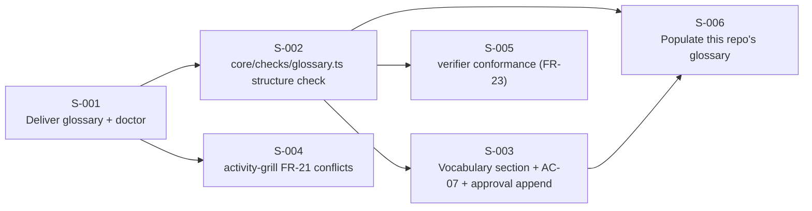

# User Stories: Shared Understanding — Phase 3 (Ubiquitous Language)

## Changelog

| Version | Date       | Summary                                                                                                                                                                                              | Author           |
| ------- | ---------- | ---------------------------------------------------------------------------------------------------------------------------------------------------------------------------------------------------- | ---------------- |
| 1.0     | 2026-09-21 | Initial version. Six stories: glossary delivery + `doctor`, `core/checks/glossary.ts` structure check, `## Vocabulary` + AC-07 + approval append, `activity-grill` FR-21 conflicts, `verifier` conformance, this repository's populated glossary. | product-engineer |

## Source Documents

- PRD: `docs/requirements/prd-shared-understanding-refinement.md` v1.13 — FR-17 to FR-23, FR-63, AC-06, AC-07, AC-08, AC-15
- Specification: `workstream/specification-shared-understanding-phase-3.md` v1.0
- Decision log: `workstream/decisions-shared-understanding.md` — D-57 to D-69 (this phase), D-03, D-12, D-16, D-45, D-48, D-49

## Delivery Shape

One consolidated PR on one integration branch (`integration/shared-understanding-phase-3`), matching Phase 1 and Phase 2 (D-47's reasoning: S-001 and S-002 create the file and the module every later story touches).

S-003 and S-004 can run in parallel after S-002/S-001 respectively; S-006 runs last so the populated glossary is validated by the finished check and its terms cite the finished Vocabulary mechanism.

---

### Story S-001: Deliver the glossary install-if-absent and warn on absence

**Priority:** Critical
**Estimated Size:** M
**Dependencies:** None (foundation story)

#### User Story

As a developer in any repository where `dev-tasks` is installed, I want `docs/domain/ubiquitous-language.md` to exist after `install`, and to be left alone once I've edited it, so that my vocabulary has a permanent home the tooling never overwrites.

#### Context

FR-17 and AC-06. Delivery reuses Phase 1's `ROOT_PROFILE_TAG` (D-57, ADR-008) — one registry entry, one template, two manifest paths. `doctor` gains the warn-only absence check (D-67). `docs/README.md` gains a `domain/` row (D-58).

#### Acceptance Criteria

- [ ] AC-1: `templates/domain/ubiquitous-language.md` exists with the five-key frontmatter (`version: 1.0`, `name`, `description`, `status: unfilled`, `owner: product-engineer`), an empty `## Changelog` table, and no bounded contexts (spec §5, D-68).
- [ ] AC-2: `INSTALL_IF_ABSENT_FILES` in `core/distribution/profiles.ts` gains one entry: source `templates/domain/ubiquitous-language.md`, target `docs/domain/ubiquitous-language.md`, platform `ROOT_PROFILE_TAG` (D-57).
- [ ] AC-3: `bundle-manifest.json` lists the template under `managed_paths` and the target under `consumer_owned_paths`.
- [ ] AC-4: A fresh `dev-tasks install` on each profile (`copilot`, `claude`, `kiro`, `both`, `all`) creates `docs/domain/ubiquitous-language.md` byte-identical to the template; a second `install` or `update` over a modified copy leaves it byte-identical (PRD AC-06).
- [ ] AC-5: `dev-tasks doctor` warns when the file is absent, proposing `dev-tasks update`; it reports nothing when the file is present, including when it has zero terms (D-67). It never fails.
- [ ] AC-6: `docs/README.md` lists `domain/`; `pnpm run lint` (docs-structure check) passes with the new directory and no `docs/domain/README.md` (D-58).

#### Business Rules

- Install-if-absent: written when missing, never overwritten once present, on every profile (D-12, FR-17).
- No `docs/domain/README.md` and no `INDEXES` change — an index for one file fails `SIMPLICITY.md` A4 (D-58).

#### Technical Notes

- Specification §5 (file shape), §6 (`doctor` row), §8.1, D-57, D-58, D-67, D-68.
- `install.ts` and `update.ts` already call `deliverInstallIfAbsentFiles()`; no flow change.
- `checkGlossaryPresence()` in `core/distribution/doctor.ts` copies `checkPackageMap()`'s `DoctorCheck` shape (`warn: true`, `pass: true`).

#### Testing Requirements

- **Unit Tests:** `doctor` — absent → warn with the `update` proposal; present-empty → no finding; present-populated → no finding.
- **Integration Tests:** extend `test/integration/install-parity.test.ts`: per-profile fresh install creates the file identical to the template; `install` and `update` over an edited copy are no-ops for that file (AC-4).
- **Manual/UI Testing:** run `pnpm run lint` after adding `docs/domain/` and confirm the docs-structure check accepts the directory link in `docs/README.md`.
- **Edge-Case Matrix:** profile `all` delivers the file exactly once (agnostic tag); a consumer whose `docs/` directory does not exist yet (fresh repo) — `deliverInstallIfAbsentFiles()` must create `docs/domain/` recursively; `bundle-manifest.json` parity test (`root-doc-template-parity.test.ts` pattern) sees the new template.
- **Acceptance-Criteria Mapping:** AC-1/AC-3 → template-parity test; AC-2 → unit read of the registry; AC-4 → install-parity integration; AC-5 → doctor unit tests; AC-6 → `pnpm run lint`.
- **Execution Commands:** `pnpm run test -- install-parity`, `pnpm run test -- doctor`, `pnpm run lint`.

#### Migration Requirements (When Data Model Changes)

Not applicable — a new consumer-owned file, no schema.

#### Implementation Steps

1. Write the failing install-parity and doctor tests first; confirm they fail.
2. Add `templates/domain/ubiquitous-language.md` per spec §5.
3. Add the `INSTALL_IF_ABSENT_FILES` entry and the two `bundle-manifest.json` paths.
4. Add `checkGlossaryPresence()` to `doctor.ts` and register it in `runDoctor()`.
5. Add the `domain/` row to `docs/README.md`.
6. Confirm tests and `pnpm run lint` pass.

#### Files to Create/Modify

- `templates/domain/ubiquitous-language.md` - new template
- `core/distribution/profiles.ts` - registry entry
- `bundle-manifest.json` - managed + consumer-owned paths
- `core/distribution/doctor.ts` - `checkGlossaryPresence()`
- `docs/README.md` - `domain/` row
- `test/integration/install-parity.test.ts` - extend
- `test/unit/doctor-glossary.test.ts` (or extend the existing doctor test) - new assertions
- `test/unit/root-doc-template-parity.test.ts` - extend if it enumerates templates

#### Definition of Done Checklist

- [ ] Code implemented per technical guidelines
- [ ] Unit/integration tests written first and passing
- [ ] Quality gates passing (`lint`, `format:check`, `typecheck`, `test`, `audit`)
- [ ] Code reviewed and approved
- [ ] Acceptance criteria verified and mapped to test evidence
- [ ] Migration lifecycle: not applicable
- [ ] Pull Request created and merged

---

### Story S-002: Validate glossary structure under `lint`

**Priority:** Critical
**Estimated Size:** M
**Dependencies:** S-001

#### User Story

As a maintainer, I want `pnpm run lint` to fail on a malformed glossary entry, a deleted term, or a bounded context that maps to nothing, so that the vocabulary file cannot rot silently.

#### Context

FR-18, FR-19, FR-63. The new `core/checks/glossary.ts` module (D-59) with `checkGlossaryContent()` and `checkGlossary()`, hand-parsed (D-49), wired into `run.ts` and invoked via `tsx` (D-48). Fail-vs-report split per D-66.

#### Acceptance Criteria

- [ ] AC-1: `lint` fails on: a term missing any of `Definition`, `Forbidden synonyms`, `Invariants`, `Origin`, `Status`; a `Status` outside `active | superseded by <Term> (<feature#D-NN>)`; a `superseded by` target absent from the file; a duplicate `### <Term>`; a `## Bounded Context:` that matches neither a package-map package name nor a value in its Bounded context column (FR-63); a term listed in a prior changelog `+term` list but absent from the body (FR-19 append-only) (D-66).
- [ ] AC-2: `lint` reports without failing: `docs/tech.md` has no package map (exactly one finding, not one per term); an `Origin` citing a `feature#D-NN` whose `workstream/decisions-<feature>.md` is not present locally (D-66).
- [ ] AC-3: A glossary with zero terms passes; malformed frontmatter (missing one of the five keys) fails, the same rule runbooks have.
- [ ] AC-4: The check runs under `pnpm run lint` via `tsx core/checks/run.ts` and is exported from `core/checks/index.ts` for the `verifier` (one implementation, two callers, D-59).
- [ ] AC-5: The module imports no `yaml` or Markdown parser (D-49).

#### Business Rules

- Structural findings fail; absent-map and archived-origin findings report (D-66).
- One term, one meaning, one context per repository (D-16).

#### Technical Notes

- Specification §6 (exported surface), §8.2 (state diagram), §13.
- Package-map read reuses `doctor.ts`'s `checkPackageMap()` table parse — extract to a shared helper if that avoids a second copy (A1 allows two, A4 prefers one).
- Append-only detection reads the file's own `## Changelog` `+term` convention (spec §8.2), no git.

#### Testing Requirements

- **Unit Tests:** `test/unit/checks-glossary.test.ts` — one fixture per AC-1 rule, both AC-2 report cases, zero-terms pass, five-key frontmatter failure, and the "no package map → exactly one finding" case.
- **Integration Tests:** `pnpm run lint` on this repository with S-001's empty template passes; with an injected broken fixture under `docs/domain/` exits 1 (remove after).
- **Manual/UI Testing:** none — deterministic check.
- **Edge-Case Matrix:** a bounded context whose name differs from the package map only by case; a `Forbidden synonyms: none` / `Invariants: none` entry (valid); a `Status: superseded by X (feature#D-NN)` where X exists (valid); a changelog with no `+term` rows yet (append-only check has nothing to compare, passes); Windows line endings.
- **Acceptance-Criteria Mapping:** AC-1/AC-2/AC-3 → unit fixtures; AC-4 → `pnpm run lint` + an import from `core/checks/index.ts` in the test; AC-5 → grep assertion in the test, mirroring `decision-log-format`.
- **Execution Commands:** `pnpm run test -- checks-glossary`, `pnpm run lint`.

#### Migration Requirements (When Data Model Changes)

Not applicable.

#### Implementation Steps

1. Write `test/unit/checks-glossary.test.ts` first; confirm it fails (module absent).
2. Implement `core/checks/glossary.ts`: frontmatter parse, heading walk, package-map resolution, D-66 rule set.
3. Export from `core/checks/index.ts`; call from `core/checks/run.ts` (failures → stderr + exit 1; staleness → stdout).
4. Confirm tests, `pnpm run lint`, and the injected-break run behave as specified.

#### Files to Create/Modify

- `core/checks/glossary.ts` - new module (`checkGlossaryContent`, `checkGlossary`)
- `core/checks/index.ts` - export
- `core/checks/run.ts` - wire in
- `test/unit/checks-glossary.test.ts` - unit tests
- `test/fixtures/glossary/*.md` - rule fixtures

#### Definition of Done Checklist

- [ ] Code implemented per technical guidelines
- [ ] Unit tests written first and passing
- [ ] Quality gates passing (`lint`, `format:check`, `typecheck`, `test`, `audit`)
- [ ] Code reviewed and approved
- [ ] Acceptance criteria verified and mapped to test evidence
- [ ] Migration lifecycle: not applicable
- [ ] Pull Request created and merged

---

### Story S-003: Propose vocabulary in PRDs and specs, enforce AC-07, append on approval

**Priority:** High
**Estimated Size:** M
**Dependencies:** S-002

#### User Story

As a developer writing a PRD, I want to propose new domain terms in a `## Vocabulary` section, have refinement tell me by name when a term is unaccounted for, and see approved terms land in the glossary when the PRD is approved, so that vocabulary grows deliberately and never at draft time.

#### Context

FR-20, AC-07. `checkVocabularySection()` joins `core/checks/glossary.ts` (D-65 — structural, no prose scanning); `activity-refine` and `activity-generate-spec` gain the section (D-61); `activity-refine` performs the approval append (D-61).

#### Acceptance Criteria

- [ ] AC-1: `activity-refine`'s PRD Output Structure and `activity-generate-spec`'s Output Structure each gain `## Vocabulary` after their `## Decisions` section, using the table shape in spec §5 (D-61).
- [ ] AC-2: `checkVocabularySection()` emits `vocabulary-missing` when a PRD/spec has no `## Vocabulary` section, and `vocabulary-incomplete` (naming the row) when a row is neither a glossary-present `existing` term, a `proposed` row with bounded context + definition + forbidden synonyms, a `conflict → D-NN` row, nor the `None — this PRD introduces no domain concepts.` sentinel (PRD AC-07, D-65).
- [ ] AC-3: `activity-refine` runs the check before presenting a PRD for review and reports the finding by name; under `lint`, the check runs over `docs/requirements/*.md` and skips files that have neither `## Vocabulary` nor `## Decisions` (pre-Phase-2 PRDs are not retroactively failed) (spec §8.3).
- [ ] AC-4: On PRD approval, `activity-refine` appends each `proposed` row to the glossary under its bounded context (creating the heading if it resolves per FR-63), sets `Origin` to the PRD path and `Status: active`, adds a `+term` changelog row, bumps `version`, and flips `status: unfilled` → `active` on first append; a `conflict → D-NN` that superseded a term marks the old entry `superseded by …` and keeps it (FR-19, spec §8.4).
- [ ] AC-5: The append is `activity-refine`'s write — `activity-grill`'s Write Authority section is unchanged (D-61).
- [ ] AC-6: Three-tree parity for both skills.

#### Business Rules

- Terms are appended when the PRD is approved, never when drafted (FR-20).
- No natural-language term detection anywhere (D-65; PRD non-goal).

#### Technical Notes

- Specification §5 (Vocabulary table), §8.3, §8.4.
- Same additive-section pattern S-002/S-003 of Phase 2 used for `## Decisions`.

#### Testing Requirements

- **Unit Tests:** `checkVocabularySection()` — missing section, incomplete row, `existing` term absent from glossary, `proposed` with all columns, `conflict → D-NN`, the `None —` sentinel, pre-Phase-2 skip rule.
- **Integration Tests:** `pnpm run lint` over the current `docs/requirements/` passes (the four existing PRDs are pre-Phase-2 → skipped, or carry a complete section).
- **Manual/UI Testing:** hand-walk a scenario fixture `test/fixtures/grilling/vocabulary-approval.md`: proposed rows → approval → the exact glossary diff (new entry, changelog row, version bump, status flip).
- **Edge-Case Matrix:** a proposal whose bounded context resolves to nothing (append refuses and reports — never creates an unresolvable heading); two PRDs proposing the same term (second is `existing` after the first's approval); a term proposed with `Forbidden synonyms: none`.
- **Acceptance-Criteria Mapping:** AC-1/AC-6 → parity test; AC-2/AC-3 → unit + `lint`; AC-4/AC-5 → scenario fixture + parity assertion on `activity-grill` unchanged.
- **Execution Commands:** `pnpm run test -- checks-glossary`, `pnpm run test -- skill-parity-grilling`, `pnpm run lint`.

#### Migration Requirements (When Data Model Changes)

Not applicable.

#### Implementation Steps

1. Write the `checkVocabularySection()` unit tests first; confirm they fail.
2. Implement the function in `core/checks/glossary.ts`; add the `docs/requirements/` walk to `run.ts` with the pre-Phase-2 skip.
3. Edit `activity-refine` (three trees): `## Vocabulary` in the Output Structure, the pre-review check call, the approval-append step (spec §8.4).
4. Edit `activity-generate-spec` (three trees): `## Vocabulary` in the Output Structure.
5. Add the scenario fixture; extend the parity test.

#### Files to Create/Modify

- `core/checks/glossary.ts` - `checkVocabularySection()`
- `core/checks/run.ts` - `docs/requirements/` walk
- `.claude/skills/activity-refine/SKILL.md` (+ `.github`, `.kiro`) - Vocabulary section, check call, approval append
- `.claude/skills/activity-generate-spec/SKILL.md` (+ `.github`, `.kiro`) - Vocabulary section
- `test/unit/checks-glossary.test.ts` - extend
- `test/unit/skill-parity-grilling.test.ts` - extend
- `test/fixtures/grilling/vocabulary-approval.md` - scenario fixture

#### Definition of Done Checklist

- [ ] Code implemented per technical guidelines
- [ ] Unit tests and fixture written first and passing
- [ ] Quality gates passing (`lint`, `format:check`, `typecheck`, `test`, `audit`)
- [ ] Code reviewed and approved
- [ ] Acceptance criteria verified and mapped to test evidence
- [ ] Migration lifecycle: not applicable
- [ ] Pull Request created and merged

---

### Story S-004: Surface vocabulary conflicts during grilling

**Priority:** High
**Estimated Size:** S
**Dependencies:** S-001

#### User Story

As a developer being grilled, I want a proposed term that collides with an existing term or a forbidden synonym to come back as a question, so that vocabulary conflicts are decided by me and never resolved silently.

#### Context

FR-21, AC-08. `activity-grill`'s resolve-before-ask step already reads the glossary; this story removes the "(once Phase 3 ships it)" placeholders and adds the WHAT-phase conflict rule (spec §8.5). Issue Mode's "glossary is read-only" now binds for real.

#### Acceptance Criteria

- [ ] AC-1: In the WHAT phase, `activity-grill` asks the user which domain concepts the PRD introduces, and for each named term checks the glossary for (a) the same term with a different definition and (b) the term listed among another term's forbidden synonyms; either is presented as a question with a recommendation, never resolved silently (FR-21, PRD AC-08).
- [ ] AC-2: Every "(once Phase 3 ships it)" / "moot until Phase 3" note in `activity-grill` is removed in all three trees; Issue Mode's read-only rule stands as written.
- [ ] AC-3: `activity-grill`'s Write Authority is unchanged — it never edits the glossary (D-61).
- [ ] AC-4: A hand-walked fixture `test/fixtures/grilling/vocabulary-conflict.md` demonstrates a forbidden-synonym collision producing the FR-21 question and a recorded `D-NN`.

#### Business Rules

- Conflicts are questions, not auto-resolutions (FR-21).

#### Technical Notes

- Specification §8.5. Prose-only change; parity via `skill-parity-grilling.test.ts` markers.

#### Testing Requirements

- **Unit Tests:** N/A (prompt content).
- **Integration Tests:** N/A.
- **Manual/UI Testing:** walk the new fixture against the skill text.
- **Edge-Case Matrix:** a named term that exists with the same definition (no question, reused); a term that is itself a forbidden synonym of two different terms (one question naming both).
- **Acceptance-Criteria Mapping:** AC-1/AC-2/AC-3 → parity-test markers; AC-4 → fixture.
- **Execution Commands:** `pnpm run test -- skill-parity-grilling`.

#### Migration Requirements (When Data Model Changes)

Not applicable.

#### Implementation Steps

1. Extend the parity test with FR-21 markers and a negative assertion on the removed placeholders; confirm it fails.
2. Edit `activity-grill` in the three trees.
3. Add the fixture and its README row.

#### Files to Create/Modify

- `.claude/skills/activity-grill/SKILL.md` (+ `.github`, `.kiro`) - FR-21 rule, placeholder removal
- `test/unit/skill-parity-grilling.test.ts` - extend
- `test/fixtures/grilling/vocabulary-conflict.md`, `test/fixtures/grilling/README.md` - fixture

#### Definition of Done Checklist

- [ ] Code implemented per technical guidelines
- [ ] Parity assertions and fixture written first and passing
- [ ] Quality gates passing (`lint`, `format:check`, `typecheck`, `test`, `audit`)
- [ ] Code reviewed and approved
- [ ] Acceptance criteria verified and mapped to test evidence
- [ ] Migration lifecycle: not applicable
- [ ] Pull Request created and merged

---

### Story S-005: Report forbidden synonyms in new exported identifiers

**Priority:** High
**Estimated Size:** M
**Dependencies:** S-002

#### User Story

As a verifier agent, I want new exported identifiers in a PR checked against the glossary's forbidden synonyms, so that I can report vocabulary drift in code on stated grounds — without blocking anyone in this first release.

#### Context

FR-23, AC-15. `checkExportedIdentifiers()` in `core/checks/glossary.ts`: regex over added `export` lines (D-60), forbidden-synonym hits only (D-64), always advisory (D-63). The `verifier` calls it beside its existing `checkDocsStructure()` call.

#### Acceptance Criteria

- [ ] AC-1: `checkExportedIdentifiers(addedLines, glossary)` matches `export (const|let|var|function|async function|class|type|interface|enum) <Name>` and `export { a, b as c }` lists, splits each identifier by PascalCase/camelCase/snake_case/SCREAMING_CASE, normalizes case and trailing `s`/`es`, and returns a finding when any word or the joined identifier equals a forbidden synonym of any glossary term (D-60, D-64).
- [ ] AC-2: Identifiers matching no glossary term produce no finding (D-64).
- [ ] AC-3: Every finding is in `staleness`, never `failures`; `lint` exit code is unaffected (D-63).
- [ ] AC-4: The `verifier`'s Audit Mode calls the function on the PR's added lines and narrates hits as an advisory finding class, in all three trees (PRD AC-15).
- [ ] AC-5: With this repository's populated glossary (S-006), the check over Phase 3's own diff reports nothing, or only hits that are then fixed in the same PR.

#### Business Rules

- Report-only in the first release; promotion to blocking is a future decision after two release cycles (D-63).

#### Technical Notes

- Specification §8.6. No TypeScript compiler API (D-60).
- The `verifier` already has the diff in Audit Mode; pass `git diff <base>...HEAD` added lines.

#### Testing Requirements

- **Unit Tests:** each `export` form; each casing split; plural normalization; a forbidden-synonym hit on a word and on a whole identifier; an unmatched identifier → nothing; result always in `staleness`.
- **Integration Tests:** N/A beyond the `verifier` parity test.
- **Manual/UI Testing:** run the function over this phase's own diff with the populated glossary.
- **Edge-Case Matrix:** `export default class Foo`; `export * from`; a re-export alias `as`; an identifier equal to a canonical term (no finding); a glossary with zero forbidden synonyms (nothing can match).
- **Acceptance-Criteria Mapping:** AC-1/AC-2/AC-3 → unit; AC-4 → parity markers in the three `verifier` files; AC-5 → manual run.
- **Execution Commands:** `pnpm run test -- checks-glossary`, `pnpm run test -- skill-parity-grilling`.

#### Migration Requirements (When Data Model Changes)

Not applicable.

#### Implementation Steps

1. Write the unit tests first; confirm they fail.
2. Implement `checkExportedIdentifiers()`; export it.
3. Edit `verifier.md` in the three trees: the call and the advisory finding class.
4. Extend the parity test.

#### Files to Create/Modify

- `core/checks/glossary.ts` - `checkExportedIdentifiers()`
- `.claude/agents/verifier.md`, `.github/agents/verifier.agent.md`, `.kiro/agents/verifier.md` - conformance call
- `test/unit/checks-glossary.test.ts` - extend
- `test/unit/skill-parity-grilling.test.ts` (or `verifier`-specific parity file) - extend

#### Definition of Done Checklist

- [ ] Code implemented per technical guidelines
- [ ] Unit tests written first and passing
- [ ] Quality gates passing (`lint`, `format:check`, `typecheck`, `test`, `audit`)
- [ ] Code reviewed and approved
- [ ] Acceptance criteria verified and mapped to test evidence
- [ ] Migration lifecycle: not applicable
- [ ] Pull Request created and merged

---

### Story S-006: Populate this repository's glossary and retire the package-map placeholder

**Priority:** Medium
**Estimated Size:** S
**Dependencies:** S-002, S-003

#### User Story

As a maintainer of `dev-tasks`, I want our own glossary filled with the terms this PRD already uses, so that the check has a real fixture, consumers have a worked example, and the package map's "freeform" bounded context finally points at a defined term.

#### Context

D-69 (extends D-45), D-62. Eight terms under one context, `AI-assisted development workflow`, each citing its origin (spec §8.7). `docs/tech.md` drops the "freeform working label" sentence; `activity-init` gains one pointer.

#### Acceptance Criteria

- [ ] AC-1: `docs/domain/ubiquitous-language.md` in this repository contains exactly the eight terms in spec §8.7 under `## Bounded Context: AI-assisted development workflow`, each with all five fields, `Origin` citing the PRD FR or `shared-understanding#D-NN` given there, `Status: active`; frontmatter `status: active`, `version` bumped, one changelog row listing the eight `+term`s (D-69).
- [ ] AC-2: `pnpm run lint` passes on the populated file (S-002's check), and `checkExportedIdentifiers()` over this phase's diff reports nothing (S-005).
- [ ] AC-3: `docs/tech.md`'s package map sentence "The bounded-context value is a freeform working label (`shared-understanding#D-45`). Phase 3's glossary supersedes it with a canonical term." is replaced by a pointer to the glossary; the column value is unchanged (it is now the canonical context name) (D-45 closed by D-69).
- [ ] AC-4: `activity-init`'s bounded-context question gains one sentence naming the glossary as canonical, in all three trees (D-62); no new interview step.
- [ ] AC-5: No invented vocabulary — every term traces to a PRD FR or a decision ID.

#### Business Rules

- Seed is bounded to terms this PRD already uses (D-69); further terms enter through a future PRD's `## Vocabulary`.

#### Technical Notes

- Specification §8.7 (term table and forbidden synonyms), D-62, D-69.
- `foundation document` forbids the retired names `product-context` / `technical-guidelines`; `bounded context` forbids `module` / `package` as vocabulary labels.

#### Testing Requirements

- **Unit Tests:** the real-file fixture case in `test/unit/checks-glossary.test.ts` reads this file and asserts zero failures.
- **Integration Tests:** `pnpm run lint`.
- **Manual/UI Testing:** read the rendered glossary; confirm each `Origin` resolves.
- **Edge-Case Matrix:** `docs/tech.md`'s context column and the glossary heading must match exactly (case, spacing) or S-002's FR-63 rule fails — assert in the real-file test.
- **Acceptance-Criteria Mapping:** AC-1/AC-2/AC-5 → real-file unit test + `lint`; AC-3/AC-4 → parity/marker assertions.
- **Execution Commands:** `pnpm run test -- checks-glossary`, `pnpm run test -- skill-parity-init`, `pnpm run lint`.

#### Migration Requirements (When Data Model Changes)

Not applicable.

#### Implementation Steps

1. Add the real-file assertion to the glossary test first; confirm it fails on the empty template.
2. Populate `docs/domain/ubiquitous-language.md` per spec §8.7.
3. Edit `docs/tech.md` (package-map note) and `activity-init` (three trees).
4. Confirm `lint`, the real-file test, and the `activity-init` parity test pass.

#### Files to Create/Modify

- `docs/domain/ubiquitous-language.md` - populated glossary (this repository's copy)
- `docs/tech.md` - package-map note
- `.claude/skills/activity-init/SKILL.md` (+ `.github`, `.kiro`) - pointer sentence
- `test/unit/checks-glossary.test.ts` - real-file assertion
- `test/unit/skill-parity-init.test.ts` - extend

#### Definition of Done Checklist

- [ ] Code implemented per technical guidelines
- [ ] Tests written first and passing
- [ ] Quality gates passing (`lint`, `format:check`, `typecheck`, `test`, `audit`)
- [ ] Code reviewed and approved
- [ ] Acceptance criteria verified and mapped to test evidence
- [ ] Migration lifecycle: not applicable
- [ ] Pull Request created and merged

---

## Coverage Validation

### Summary

- **Total PRD Requirements (Phase 3 scope):** 7 functional requirements (FR-17 to FR-23; FR-22 is a retirement note, verified rather than built) + FR-63 + 4 acceptance criteria (AC-06, AC-07, AC-08, AC-15) + 1 open question (OQ-03)
- **Total User Stories:** 6 (S-001 to S-006)
- **Coverage:** 100%
- **Status:** Complete

### Requirement Mapping

| PRD Requirement                                                                     | Story ID(s)         | Status     |
| ----------------------------------------------------------------------------------- | ------------------- | ---------- |
| FR-17 Glossary exists in every install; install-if-absent on every profile         | S-001               | ✅ Covered |
| FR-18 Organized by bounded context; seven fields per term                           | S-002, S-006        | ✅ Covered |
| FR-19 Changelog; append-only; superseded terms marked                              | S-002, S-003        | ✅ Covered |
| FR-20 PRDs/specs use glossary terms or propose in Vocabulary; append on approval   | S-003               | ✅ Covered |
| FR-21 Conflicts surfaced as grilling questions                                     | S-004               | ✅ Covered |
| FR-22 Meta-repo glossary retired; one root glossary                                 | S-001 (verified: no live references, research S8) | ✅ Covered |
| FR-23 Verifier checks new exported identifiers; reports forbidden synonyms          | S-005               | ✅ Covered |
| FR-63 Bounded contexts map to the package map; no per-package glossaries           | S-002, S-006        | ✅ Covered |
| AC-06 `install`/`update` scaffold when absent, byte-identical when present          | S-001               | ✅ Covered |
| AC-07 PRD with an unaccounted term fails refinement with a named finding            | S-003               | ✅ Covered |
| AC-08 Conflicting proposed term surfaces as a grilling question                     | S-004               | ✅ Covered |
| AC-15 Forbidden synonyms in new exports reported by the verifier                    | S-005               | ✅ Covered |
| OQ-03 Block or report in the first release                                          | S-005 (D-63)        | ✅ Covered |
| Technical Considerations: `doctor` reports absence                                  | S-001               | ✅ Covered |

### Non-Goals Validation

- [x] Tactical DDD patterns — not in any story (D-03).
- [x] Automatic term generation from code — S-005 reads exports only to *report forbidden synonyms*, never to create terms; S-003 scans no prose (D-65).
- [x] Per-package glossaries — one root file (S-001, S-002 FR-63 rule, existing `skill-parity-testing-layers` assertion kept).
- [x] Simplicity tooling / TDD evidence / teaching moments (Phases 4–6) — not in any story.
- [x] Blocking on glossary conformance — S-005 is advisory only (D-63).

## Open Items for Confirmation

- **Shared package-map parse (S-002):** whether the `docs/tech.md` table parse is extracted from `doctor.ts` into a helper or duplicated is the implementer's `SIMPLICITY.md` A1/A4 call, not a product decision.
- **Verifier parity test location (S-005):** a `verifier`-specific parity file vs. extending `skill-parity-grilling.test.ts` — implementer's choice.

## Execution Plan

1. **S-001** — deliver the glossary + `doctor` (M, Critical). Everything depends on the file existing.
2. **S-002** — structure check under `lint` (M, Critical).
3. **S-003** and **S-004** in parallel — Vocabulary/AC-07/approval append (M, High) and `activity-grill` FR-21 (S, High).
4. **S-005** — verifier conformance (M, High).
5. **S-006** — populate this repository's glossary (S, Medium), last, so the finished check validates it and its terms cite the finished mechanism.

One consolidated PR, ordered commits per story, matching Phases 1 and 2.
